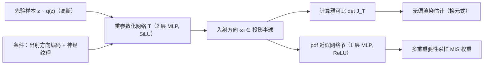

## 一句话总结

把神经 BRDF 的重要性采样重新表述为"学习一个把 BRDF 分布重参数化到易采样先验分布"的问题，用一个普通的小 MLP 一步生成采样方向，既不需要网络可逆、也不需要多步推理，在同等模型规模下取得了最好的方差-速度折中。

## 研究背景

- 领域现状：神经网络（尤其坐标式 MLP）已经成为表达复杂真实材质 BRDF 的流行手段，能刻画解析微表面模型难以覆盖的外观细节。但要在蒙特卡洛渲染中降低方差，必须对神经 BRDF 做重要性采样，这一步仍是难点。
- 核心痛点：已有方法用基于流的生成模型（归一化流、扩散模型）来采样 BRDF，它们通过构造先验分布与目标分布之间的可逆变换来匹配概率密度。可逆性虽然便于推导 pdf，却强制了多步变换（耦合层或 ODE 求解），推理时需要多次网络评估，成为渲染瓶颈；解析混合模型虽快但表达力不足，拟合不出分布的尖锐细节。
- 本文 idea：注意到概率变换本质上就是 pdf 积分里的换元规则，于是把"分布匹配"重新解释为"学习一个使 BRDF 积分对齐先验分布的重参数化"。这个积分匹配目标不再需要变换可逆，因此可以用几乎任意的神经网络一步完成采样，同时借助换元定理保持蒙特卡洛渲染无偏。

## 方法

整体框架：把渲染方程里对入射方向 $$\bm{\omega}_i$$ 的积分做换元 $$\bm{\omega}_i = T(z)$$，其中 $$z$$ 来自一个易采样的先验分布 $$q(z)$$（实现里用高斯）。训练目标是让重参数化后的被积函数 $$f(T(z))\,\vert \det J_T(z)\vert /F$$ 逼近 $$q(z)$$，此时 $$T$$ 就把先验样本映射成服从 $$f/F$$ 的 BRDF 采样。整个渲染估计式也可以只用 $$T$$ 及其雅可比、不需要逆变换 $$T^{-1}$$ 来写出，因而无偏。

关键设计：

- 积分匹配损失，摆脱可逆约束：由于归一化常数 $$F$$ 难以获得，作者用负对数似然来匹配 $$f/F$$ 与 $$q$$，注意到 $$F$$ 对网络梯度无贡献可直接丢弃，得到损失 $$\mathcal{L}_{nll}=\mathbb{E}_{z\sim q}[-\log(f(T(z))\,\vert \det J_T(z)\vert )]$$。收敛时它等价于 $$p$$ 与 $$f/F$$ 的反向 KL 散度，因而学到的正是正确的概率变换。核心好处：优化过程完全不涉及 $$T^{-1}$$，因此 $$T$$ 可以是任意 $$C^1$$ 连续的网络。

- 防止奇异、保证合法重参数化：当 $$f$$ 或雅可比为零时对数似然会发散。作者用两点解决——一是对 BRDF 输出加指数激活避免零值；二是把积分按 $$1-\alpha$$ 与 $$\alpha$$（$$\alpha=10^{-3}$$）拆成两项，其中一项用一个覆盖整个投影半球、雅可比恒不为零的辅助映射 $$I$$，类似防御性采样，保证每个方向都可能被访问。为让 $$T$$ 单射，用 SiLU 激活使 $$\det J_T$$ 连续；对镜面材质这类 BRDF 常近似为零的情况，进一步用一个上界损失 $$\mathcal{L}'_{rep}$$ 强制雅可比为正，这对高光材质采样正确性至关重要。

- 无显式 pdf 也能接入 MIS：$$T$$ 难以求逆，导致 pdf 不易得到，无法直接算多重重要性采样权重。作者观察到只要 $$w+w_e=1$$，用一个近似 pdf 算权重并不会引入偏差。于是再训一个轻量 MLP $$\hat{p}$$ 去拟合 $$q(T^{-1})\,\vert \det J_{T^{-1}}\vert $$，仅用于计算 MIS 权重。因为只拟合 pdf 信号、无需特殊网络结构，$$\hat{p}$$ 可以比 $$T$$ 更小，反而让处理发射体采样时的 pdf 评估比基线更快。

- 网络与参数化：$$T$$ 是 2 隐层 SiLU 的 MLP，$$\hat{p}$$ 是 1 隐层 ReLU 的 MLP，隐层特征取 16 以恰好塞进 CUDA tensor core 加速。出射方向用频率 4 的位置编码，空间位置复用神经 BRDF 已有的神经纹理。不同于流模型难以把输出约束到投影半球，本文让 $$T$$ 直接输出上半空间的三维向量再归一化，天然避免非法采样，表示空间也比球面坐标更连续。

## 实验结果

在 RGL 测量材质与 NeuSample 空间变化材质上，用 Mitsuba 3 + 自写全融合 CUDA 核做路径追踪评测。为公平对比，所有基线都调到与本文相近的参数量（约 1.0k 用于 $$T$$、0.7k 用于 $$\hat{p}$$）。主实验以"等方差渲染时间相对解析混合模型（Mixture）的加速比"作为综合效率度量（数值越大越好），下表取若干代表性材质：

| 材质（按高光程度） | Cosine | Mixture | Normflow | Diffusion | 本文 |
|------|------|------|------|------|------|
| CopperSheet（更高光） | 0.01 | 1.00 | 1.89 | 0.64 | 7.14 |
| MetallicPaperCopper（更高光） | 0.12 | 1.00 | 4.23 | 2.82 | 5.96 |
| ChmMint（更高光） | 0.01 | 1.00 | 1.03 | 0.48 | 3.80 |
| BrushedSteelSatin（较低光） | 0.13 | 1.00 | 1.03 | 0.83 | 1.36 |
| MorphoMelenaus（较低光） | 0.75 | 1.00 | 0.91 | 0.72 | 1.11 |
| MeltedMetal（NeuSample） | 0.10 | 1.00 | 0.82 | 0.65 | 1.23 |

结论：在前 8 个高光材质上，本文比解析混合模型快 2.32-7.14 倍，比第二名方法快 1.39-3.78 倍；在其余较低高光材质上仍略优（约 1-1.47 倍）。补充实验也印证：分布重建的 KL 散度上，本文一致低于归一化流与扩散模型（后者在小网络下退化到与归一化流相近）；推理计时（Table 1，4 spp 平均）显示本文的采样耗时与解析混合相当、pdf 评估更快，总时间最低（RGL 上 0.0847 秒 vs 混合 0.0868、归一化流 0.1002、扩散 0.1250）；与 Mitsuba 表格化重要性采样相比（Miro7），方差与速度接近，但存储从 4.4MB 降到 1.7KB；MSE-spp 曲线在对数-对数空间近似直线，经验上验证了估计无偏。

## 亮点与局限

- 亮点：
  - 把"分布匹配"重述为"积分重参数化"，一步解除了流模型的可逆性枷锁，采样从多步变单步，同时保持无偏。
  - 用一个不显式给出 pdf 的采样器仍能无偏接入 MIS，且用更小的 pdf 网络实现更快的权重计算。
  - 网络小到 16 特征恰好适配 tensor core，配合全融合 CUDA 核，实现方差与速度双优，存储成本远低于表格化方法。

- 局限：
  - 优化依赖目标分布的梯度，遇到强烈不连通的多峰分布会陷入"寻峰"问题，只采到单个模式。
  - 雅可比计算在高维分布上不实际（作者指出可用自回归建模缓解）。作者同时论证 BRDF 是低维且多峰 BRDF 通常平滑，故这两个问题对 BRDF 采样场景基本不构成影响。

## 延伸思考

- 该方法本质是"用换元把难采样分布拉平到易采样先验"，作者也指出它有潜力推广到其它低维、需要重要性采样的场景，例如与路径引导、发射体乘积采样等方差削减技术叠加使用。
- 与流模型/扩散模型的对比揭示了一个实用观点：在渲染这种对推理延迟敏感的应用里，"网络能否塞进 tensor core、能否单步推理"往往比"表达力上限"更决定端到端效率；之前一些工作认为流模型总是更优，可能是因为它们用了更大的网络并在 PyTorch 下计时。
- 对于寻峰这一局限，是否可以引入类似退火、随机重启或混合先验的策略，让方法在更一般的（非 BRDF）多峰分布上也稳健，是值得追问的方向。
