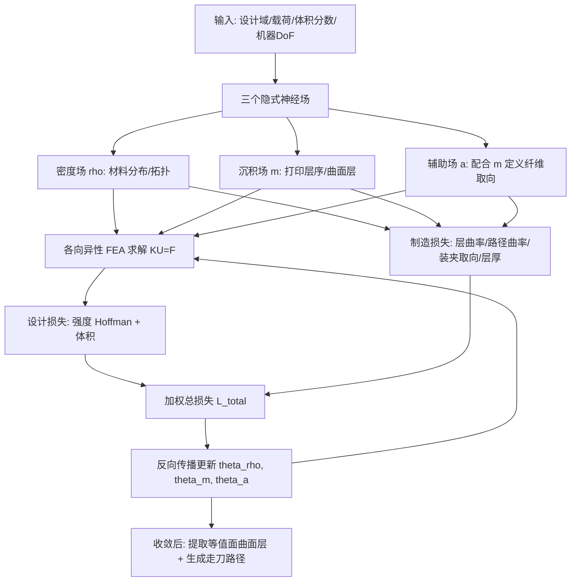

# Neural Co-Optimization of Structural Topology, Manufacturable Layers, and Path Orientations for Fiber-Reinforced Composites

## 一句话总结

用三个隐式神经场分别表示材料密度、打印层序与纤维取向，把"结构拓扑—可制造层—路径取向"三件本来分步做的事塞进一个可微优化里同时求解，并直接把多轴 3D 打印的制造约束写成损失函数，最终让纤维增强复合件在保证可打印的前提下，失效载荷比"先设计后制造"的分步方案最高提升 33.1%。

## 研究背景

纤维增强热塑性复合材料因高刚度、高强度、低密度而在轻量化结构中越来越受重视，而能动态控制材料沉积方向的多轴 3D 打印正是制造这类各向异性构件的理想手段。但既有研究几乎都是两阶段流程：先做结构拓扑优化，再单独计算曲面分层与纤维走刀路径去贴合主应力方向。

这种分步做法的根本毛病是制造约束被"间接"处理甚至被忽略。机器运动自由度（DoF）、层曲率、路径曲率、层厚这些真实的可制造性限制，要么在拓扑优化阶段完全没考虑，要么只能在后续切片阶段补救。结果是：只按设计目标优化出来的结构，其对应曲面层往往曲率过大（打印头会和已打印部分碰撞）、层厚变化剧烈（纤维丝沉积困难）；等到在拓扑锁死的情况下再去满足制造性，就会逼出大片屈服区域，强度被牺牲。论文用 GE-Bracket 例子给出直观对比：分步方案的失效载荷 $$F_f = 1.141\,\text{kN}$$，而协同优化能到 $$F_f = 1.519\,\text{kN}$$。

另一个关键区分是"强度 vs 刚度"。传统拓扑优化大多以柔度（compliance）为目标追求刚度最大、变形最小，但它并不显式考虑材料失效。对纤维增强复合材料这种在拉、压、剪相互作用下发生脆性失效的材料，基于刚度的优化会得到应变小、但更容易屈服的结构。所以作者主张改用 Hoffman 屈服准则来做强度导向优化。

## 方法

核心是构造一个可微映射 $$\Phi:\forall \mathbf{x}\in\mathbb{R}^3 \mapsto (\rho, m, a)$$，用三个 MLP 隐式神经场表示设计域内任一点的信息，再把设计目标和制造约束全部写成可微损失，用 FEA 集成的反向传播直接优化网络系数。

关键设计如下。

**三个神经场的分工。** 密度场 $$\rho(\mathbf{x},\theta_\rho)$$ 借鉴 SIMP，用 sigmoid 近似 Heaviside 把输出压到 0/1 表示空/实。沉积场 $$m(\mathbf{x},\theta_m)$$ 的等值面 $$m(\mathbf{x})=c_i$$ 定义多轴打印的曲面层，局部打印方向和层厚由梯度 $$\nabla m$$ 的方向与模长给出。纤维取向不能独立定义（它必须落在工作面内），于是引入辅助场 $$a(\mathbf{x},\theta_a)$$，通过梯度叉积得到 $$\mathbf{f}(\mathbf{x})=\nabla a(\mathbf{x})\times\nabla m(\mathbf{x})$$，天然与层序兼容。材料坐标系即 $$(\mathbf{f}, \nabla a, \nabla m)$$，据此做各向异性 FEA。

**强度损失基于 Hoffman 准则。** Hoffman 失效指标写成二次型 $$\Gamma(\boldsymbol{\sigma})=\boldsymbol{\sigma}^T Q\boldsymbol{\sigma}+q^T\boldsymbol{\sigma}$$，当 $$\Gamma>1.0$$ 判定失效。作者定义安全系数 $$\gamma$$ 为"最大可承受载荷/输入载荷"，对每个单元由 $$\Gamma(\gamma_e\boldsymbol{\sigma}_e)=1$$ 解二次方程得到 $$\gamma_e = \frac{-B+\sqrt{B^2+4A}}{2A}$$。整体安全系数取所有单元最小值，用负 p-范数光滑近似（取 $$\bar p=6$$），于是强度损失为

$$L_{obj} := -\left(\sum_e \gamma_e^{-\bar p}\right)^{-1/\bar p}.$$

相比"纤维对齐主应力方向"的启发式，用 Hoffman 准则控制取向更灵活：低应力区可以更自由地调整纤维走向以满足可制造性。

**体积损失** 用 ReLU 只惩罚超出目标体积 $$V^*$$ 的部分。

**制造约束直接损失化（本文最核心的贡献）。**
- 局部碰撞：在隐式面上解析求出平均/高斯曲率，进而得最大曲率 $$K_{max}=K_M+\sqrt{K_M^2-K_G}$$，用 ReLU 把它压到阈值 $$K_{lc}$$（由打印头包围球决定）以下，避免打印头与已成型部分碰撞。
- 路径曲率（仅 5 轴）：沿纤维方向的方向曲率 $$K_f=\hat{\mathbf{f}}^T H_f \hat{\mathbf{f}}$$，限制刀轴姿态的突变。
- 装夹取向（3 轴 / 2.5 轴）：3 轴时把装夹方向 $$\mathbf{n}$$ 作为可优化变量一起反传，约束层法向 $$\nabla m$$ 与 $$\mathbf{n}$$ 的最大夹角以防碰撞；2.5 轴进一步令 $$\nabla m=\mathbf{n}/\|\mathbf{n}\|$$ 退化为平面层。
- 层厚：用 $$\|\nabla m\|$$ 把层厚约束在 $$[t_{min},t_{max}]$$，副产品是避免 $$m$$ 的梯度消失、提升数值稳定。

**总损失按硬件区分。** 5 轴用 $$L^{5x}_{total}=\omega_{obj}L_{obj}+\omega_{vol}L_{vol}+\omega_{lc}L_{lc}+\omega_{mo}L_{mo}+\omega_{lt}L_{lt}$$；3 轴把路径运动项换成装夹取向项 $$L_{ort}$$；平面打印（2.5 轴）最简单，只剩设计目标与体积项。

**实现细节。** 每个场是 5 隐层 × 256 神经元的 MLP，用 SiLU 激活保证三阶连续性；PyTorch + Adam，初始学习率 $$1.0e{-3}$$，ReduceLROnPlateau 调度。权重采用混合惩罚方案（借鉴 TOuNN 与 DC3）：先预算无约束问题设 $$\omega_{obj}=10/L_{obj}$$ 并动态归一化到 $$[0,10]$$，其余约束权重从 0 起每步增 0.05 平滑加压，当 $$L_{obj}<1e{-5}$$ 时做梯度修正把解拉回可行域。后处理用 Marching Cube 在 $$256^3$$ 体素网格上提取 $$m$$ 的等值面，被 $$H(\rho)\le0.5$$ 裁剪成曲面层，再用 2-RoSy 表示 + 周期参数化生成近似等距的纤维走刀路径（避开向量场奇点导致的畸变）。

## 实验结果

计算平台为 Intel i5-12600K + NVIDIA RTX4080（16GB VRAM）+ 96GB RAM，Ubuntu 20.04。优化耗时从 38 分钟到 8 小时不等，唯独 GE-Bracket 的分步优化因两阶段迭代约需 20 小时。FEA 是最耗时的一步（占每次迭代 90% 以上）。

**协同 vs 分步（GE-Bracket）。** 设计域 $$200\times110\times70\,\text{mm}$$，体素 2mm。协同优化得到的最大无屈服载荷 $$F_{yd}$$ 比分步方案 Phase I 结果低 3.6%（但 Phase I 不可制造）；而在 Phase II 把制造性补上、拓扑锁死之后，协同优化反超 23.3%。在 $$F=1.855\,\text{kN}$$ 下，协同优化所有单元的 Hoffman 指标均低于 1.0，而分步方案层厚要求在 Phase II 仍无法满足。

**L-Bracket。** 设计域 $$150\times150\times150\,\text{mm}^3$$，协同优化最大无屈服载荷比分步方案高 15.6%，且协同结果无屈服，分步结果有大片屈服区。

**与 Neural Slicer 对比（A-Bracket）。** 把分步方案 Phase I 的纤维取向喂给 Neural Slicer 生成曲面层，因为 Neural Slicer 并不显式优化 Hoffman 准则，结果屈服区最多；本文方法最优。

**网络结构消融（Cantilever）。** 最大无屈服载荷 $$F_{yd}$$：1 层 MLP 0.43kN、1 层 MLP+傅里叶编码 1.22kN、1 层 RBF 1.12kN、5 层 MLP 1.60kN、10 层 MLP 1.62kN。5 层 MLP 在性能与效率间取得最佳折中。

**FEA 分辨率（Cantilever，$$F=1.62\,\text{kN}$$ 下屈服体积 $$V_{yd}$$）。** $$45\times30\times30$$ 为 1.45%、$$30\times20\times20$$ 为 1.72%、$$15\times10\times10$$ 为 3.52%。分辨率越高屈服体积略降但效率下降。

**取向-路径一致性（MC 分辨率，平均角误差/标准差）。** $$512^3$$ 为 $$3.32^\circ/1.21^\circ$$、$$256^3$$ 为 $$4.41^\circ/1.47^\circ$$、$$128^3$$ 为 $$7.57^\circ/3.35^\circ$$。

**制造性验证与消融。** 所有例子的层最大曲率都低于允许值 $$K_{lc}=0.1\,\text{mm}^{-1}$$，层厚完全控制在 $$[0.4,0.8]\,\text{mm}$$。去掉曲率控制会产生高曲率层，去掉层厚控制会产生厚度剧变，去掉路径曲率损失 $$L_{mo}$$ 则路径曲率会超出 $$K_f^{max}=0.2$$。不同运动 DoF 会显著改变最优结构：GE-Bracket 的 3 轴结果甚至完全去掉了一个螺栓孔周围的材料，最大无屈服载荷从 5 轴降到 3 轴的 1.531kN、2.5 轴的 1.035kN；施加更多运动约束最多可使强度下降 41.9%。

**物理实验。** 用 ABB IRB 2600（6 DoF）机械臂 + ABBA 250 变位机（2 DoF）的机器人打印系统，PLA-CF 打印件、PVA 水溶支撑，INSTRON 5960 拉伸测试。GE-Bracket 各方案失效载荷：5 轴协同 $$F_f=1.519\,\text{kN}$$、5 轴分步 $$F_f=1.141\,\text{kN}$$、3 轴 $$F_f=1.046\,\text{kN}$$、2.5 轴 $$F_f=0.622\,\text{kN}$$。协同优化比分步优化的失效载荷高 33.1%。

## 亮点与局限

亮点：
- 首个把纤维增强复合材料的各向异性强度优化与可制造性"直接"同时求解的框架，据作者所知属首创。
- 用三个隐式神经场统一表达几何、层序、纤维取向，避免了向量场转连续路径时的不可积（非旋度自由）近似误差，使联合优化成为可能。
- 制造约束（运动 DoF、层曲率、路径曲率、层厚、碰撞）被显式写成可微损失，且框架能适配 5 轴 / 3 轴 / 2.5 轴不同硬件。
- 强度导向（Hoffman 准则）替代传统刚度导向，更贴合脆性各向异性复合材料的失效本质；框架还能推广到刚度优化和轻量化（最小体积满足屈服约束）设计，并支持对称性等形状控制。
- 有真实的多轴机器人打印物理验证，不只是仿真。

局限：
- FEA 极其耗时，占每次迭代 90% 以上，分辨率一高代价陡增；作者计划用 PINN 和 GPU 加速改善。
- 约束定义不当会影响收敛与鲁棒性，比如体积分数设得过小可能根本无法收敛出无屈服结构。
- 优化基于屈服（Hoffman）指标，而碳纤维复合材料偏脆性、屈服载荷难以物理测量，导致优化用屈服、物理验证却只能用失效载荷，两者存在口径差；未来考虑用 CT 等成像更准地测屈服行为。
- 当前假设线性材料属性，无法处理非线性弹性材料。
- 采用保守的无碰撞条件（$$K_{lc}$$ 取得比打印头包围球更小）以容纳硬件误差，偏保守。

## 延伸思考

这篇工作最值得琢磨的一点，是它把"可制造性"从事后切片阶段一路前移到了拓扑优化的目标函数里。传统流水线的割裂本质上是一种局部最优的拼接——每一步都最优，串起来却不最优，因为下游的制造约束会反噬上游的设计自由度。用可微隐式场把三个环节耦合，让梯度能在"要强度"和"能打印"之间自由权衡，这个思路对其他"设计-制造"割裂的领域（比如钣金、CNC、机器人装配）也有借鉴意义。

用梯度叉积 $$\mathbf{f}=\nabla a\times\nabla m$$ 构造纤维场是个巧妙的技巧：它天生保证纤维方向躺在打印层内，且规避了向量场不可积的老问题。这种"用标量场的梯度关系隐式表达向量场约束"的做法，可能比直接优化向量场更适合需要保证几何相容性的场景。

真正的瓶颈仍是 FEA。当优化循环里嵌了一个昂贵的物理求解器，整个框架就被拖成小时级。是否可以用神经代理模型（neural surrogate）或可微 FEM 加速、甚至 PINN 直接替代求解，是决定这类方法能否走向实用大规模设计的关键。屈服口径与脆性失效的物理测量差异也提醒我们：优化指标和验证指标不一致时，仿真上的"最优"未必等于现实里的"最强"。
