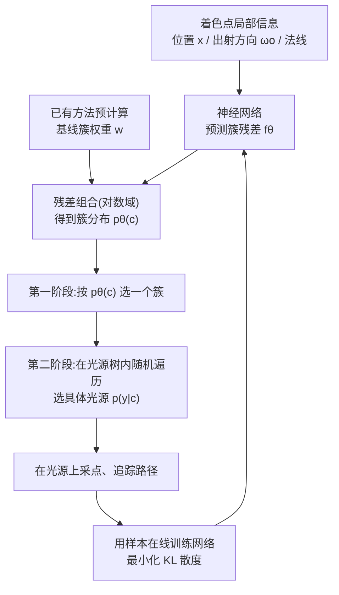

## 一句话总结

用一个神经网络在每个着色点上预测"选哪盏灯"的离散概率分布，并与光源层次结构（light hierarchy）结合，在线学习出空间变化的光源选择重要性采样分布，从而在包含成百上千盏灯的复杂场景中显著降低蒙特卡洛渲染的方差。

## 研究背景

蒙特卡洛渲染是离线渲染的黄金标准，而计算复杂场景的直接光照面临一个核心难题：在每个着色点上，需要判断哪些光源贡献最大。这个判断要同时考虑光强、几何、可见性和材质属性。

现有方法大致分两类，各有短板：

- 光源层次结构类方法（如 ATS、SLC）把光源按空间位置、强度等准则组织成二叉树，自适应地在树上选一个"切面"（cut），按簇的重要性采样。它们的关键缺陷是计算重要性时不考虑可见性，因此会频繁采样到被遮挡的光源。
- 在线学习类方法（如 VARL）在渲染过程中逐步把可见性纳入采样分布，但它们依赖复杂的空间数据结构，并且为一整组着色点（一个子区域）优化同一个分布，忽略了子区域内部的显著变化。论文用一个例子说明：相邻的两个着色点 $$x_1$$ 和 $$x_2$$ 可能由完全不同的光源主导，单一分布无法刻画这种局部差异。

本文的出发点，就是用神经网络直接输出"随着色点空间变化"的光源选择分布，绕开复杂数据结构，同时捕捉细粒度的局部变化。

## 方法

### 整体框架

方法的目标是估计直接光照下的反射辐射 $$L_o(x, \omega_o)$$，它是所有光源贡献之和。为便于计算，把这个求和写成对光源索引 $$Y \sim p(y)$$ 的期望：

$$L_o(x, \omega_o) = \mathbb{E}\left[\frac{L_Y(x, \omega_o)}{p(Y)}\right]$$

其中 $$p(y)$$ 是光源选择的概率质量函数（PMF）。估计器的方差高度依赖 $$p(y)$$ 的选择：$$p(y)$$ 越接近各光源真实贡献的分布，方差越低。核心思想就是用一个神经网络 $$p_\theta(y)$$ 来建模这个 PMF，并在线训练。

当光源数量很大（成百上千）时，让网络直接输出每盏灯的概率不现实。于是方法引入两阶段分解：网络预测"簇"（cluster）级别的分布 $$p_\theta(c)$$，簇内选具体哪盏灯 $$p(y\vert c)$$ 则交给已有的层次结构方法处理。

### 关键设计

一、在线最小化 KL 散度。训练目标是让学到的 PMF $$p_\theta(y)$$ 逼近目标分布 $$q(y)$$，通过最小化两者的 KL 散度实现：

$$D_{KL}(q, p_\theta) = \sum_{y=1}^{M} q(y) \log \frac{q(y)}{p_\theta(y)}$$

目标分布定义为单个光源贡献占总贡献的比例 $$q(y\vert x, \omega_o) = L_y(x, \omega_o) L_o(x, \omega_o)^{-1}$$。其中分母 $$L_o$$ 是待估的未知量，但由于优化用的是 Adam（更新依赖当前梯度与历史平均之比），这一项可以安全省略。最终梯度的蒙特卡洛估计写成：

$$\langle \nabla_\theta D_{KL}(q, p_\theta) \rangle = -\frac{1}{N} \sum_{j=1}^{N} \left[ \frac{F(x, Z_j, \omega_o)}{p(Z_j\vert Y_j) p_\theta(Y_j)} \nabla_\theta \log p_\theta(Y_j) \right]$$

这等价于用被积函数 $$F$$ 的蒙特卡洛估计对负对数似然做加权，因此可在路径追踪过程中在线高效优化。

二、光源层次与簇构造。方法先用已有技术（ATS 或 SLC）建光源树，取树上某一层级 $$k$$ 的节点作为全局固定的簇。由于实际的树往往不平衡，第 $$k$$ 层的内部节点数不一定等于 $$2^k$$，此时把更高层的叶节点也纳入簇集合，让网络能直接估计对应单个光源的叶节点概率。采样时先按 $$p_\theta(c)$$ 选簇，再从该簇沿树随机遍历到叶节点，簇内条件概率 $$p(y\vert c)$$ 由遍历路径上各子节点概率相乘得到。

三、残差学习策略。随机初始化的网络需要很多次迭代才能收敛，且初期样本方差大，既污染最终图像又拖慢训练。方法观察到已有方法用精心设计的规则算出的簇概率远好于网络的初始输出，于是把这些概率作为基线 $$w$$，让网络只学习残差。组合在对数域进行以保证概率为正，再归一化保证求和为一：

$$p_\theta(c) = \frac{e^{[\log(w_c) + f_\theta(x, \omega_o)[c]]}}{\sum_{s=1}^{S} e^{[\log(w_s) + f_\theta(x, \omega_o)[c]]}}$$

初始时网络输出接近零，簇概率几乎等于基线方法的结果，因此从渲染一开始就能提供不劣于基线的采样质量；随着训练推进，网络逐步修正、稳定超越基线。

四、网络架构。网络基于 tiny-cuda-nn 实现，3 个隐藏层、每层 64 个神经元、ReLU 激活。输入编码上：交点位置用可学习的稠密网格编码（dense grid encoding），归一化出射方向用 4 阶球谐编码（以建模辐射与 BSDF 的乘积），法线用 32 个 bin 的 one-blob 编码。

## 实验结果

实验在 Intel i9-14900K CPU 与 NVIDIA RTX4090 GPU 上进行，覆盖八个复杂光照场景，光源数量从 Living Room 的 64 盏到 Bistro 的约 21.1k 盏不等（San Miguel 追踪 139k 个虚拟点光源 VPL）。评价指标为 FLIP（越低越好）。对比方法包括 ATS、SLCRT、ReSTIR、VARL。层次结构统一用 ATS 构建，簇取 $$k=6$$ 层，Adam 学习率固定 $$3 \times 10^{-2}$$，训练预算占 15%。

等时间对比（FLIP，附每像素采样数 spp）：

| 场景 | ATS | SLCRT | ReSTIR | VARL | Ours |
|---|---|---|---|---|---|
| Bathroom | 0.1659 (212) | 0.1413 (220) | 0.1744 (135) | 0.1346 (139) | **0.0977 (175)** |
| Bedroom | 0.3129 (192) | 0.2442 (196) | 0.2796 (123) | 0.1960 (123) | **0.0910 (157)** |
| Bistro | 0.1548 (163) | 0.2656 (165) | 0.2837 (74) | 0.2281 (60) | **0.1126 (168)** |
| Living Room | 0.1247 (194) | 0.0977 (194) | 0.1314 (131) | 0.1009 (131) | **0.0671 (146)** |
| San Miguel | 0.2253 (159) | 0.3015 (158) | 0.2817 (110) | 0.2472 (107) | **0.1713 (164)** |
| Staircase | 0.0763 (198) | 0.0817 (203) | 0.1059 (129) | 0.0946 (138) | **0.0529 (160)** |
| Staircase2 | 0.1020 (233) | 0.0925 (233) | 0.1132 (159) | 0.0854 (149) | **0.0646 (191)** |
| Zero Day | 0.1647 (222) | 0.1455 (223) | 0.1682 (159) | 0.1338 (161) | **0.1117 (201)** |

等采样对比（统一 128 spp，FLIP，附运行时间秒）：

| 场景 | ATS | SLCRT | ReSTIR | VARL | Ours |
|---|---|---|---|---|---|
| Bathroom | 0.2059 (2.8) | 0.1791 (2.9) | 0.1780 (4.7) | 0.1399 (4.3) | **0.1090 (3.9)** |
| Bedroom | 0.3780 (3.2) | 0.2962 (3.2) | 0.2757 (5.2) | 0.1913 (4.8) | **0.0994 (4.4)** |
| Bistro | 0.1704 (15.9) | 0.2944 (15.3) | 0.2316 (36.8) | 0.1658 (44.3) | **0.1180 (19.6)** |
| Living Room | 0.1488 (3.2) | 0.1162 (3.3) | 0.1387 (5.2) | 0.1023 (4.6) | **0.0689 (4.8)** |
| San Miguel | 0.2454 (7.9) | 0.3233 (8.1) | 0.2675 (12.4) | 0.2308 (11.7) | **0.1842 (8.6)** |
| Staircase | 0.0923 (3.3) | 0.1002 (3.2) | 0.1060 (4.9) | 0.0969 (4.7) | **0.0553 (4.5)** |
| Staircase2 | 0.1246 (2.7) | 0.1128 (2.8) | 0.1206 (4.0) | 0.0913 (4.1) | **0.0721 (3.8)** |
| Zero Day | 0.1929 (5.1) | 0.1699 (5.0) | 0.1771 (8.1) | 0.1465 (7.0) | **0.1224 (7.0)** |

两种设置下本方法在全部八个场景均排名第一，且仅用 15% 采样预算做训练。运行时间与快速的树类方法相当，说明神经训练与采样的额外开销很小。方法在处理镜面反射（Bathroom、Zero Day 的红框区）和局部光照变化如阴影（Bathroom、San Miguel 的绿框区）上表现尤为出色。

消融实验的主要结论：残差学习相比让网络直接预测（Direct）能大幅加速收敛且开销极小，其中 ATS 基线排名第一故被选用；位置输入编码上可学习稠密网格噪声最低；训练预算 15% 为最优比例；连续表示在全部场景优于离散版本（离散版把位置量化到 $$32 \times 32 \times 32$$ 网格、方向每维 8 桶）；簇层级 $$k=6$$ 在多数场景表现最好（对比 $$k=4, 8$$）。

## 亮点与局限

亮点：

- 首次把神经重要性采样从连续方向域迁移到离散光源选择这一新问题上，专门为"大量且稀疏分布的光源"设计，而这正是连续路径引导方法难以处理的场景。
- 空间变化的分布由网络直接输出，无需维护和查询复杂空间数据结构，天然捕捉相邻着色点间的局部差异。
- 残差学习让方法"从第一帧起就不劣于基线"，很好地解决了在线学习冷启动噪声大的痛点。
- 与光源层次结构解耦、互补，也可用来改进 RIS / ReSTIR 等重采样框架的候选分布。

局限：

- 激进的优化策略会产生离群火点（fireflies）：训练初期网络可能给尚未观测到的重要光簇分配过低概率，一旦采到该簇中高功率光源就造成异常亮点；更保守的策略火点更少但收敛更慢。
- 使用全场景固定的全局切面，且簇内采样依赖已有方法，若基线光源采样概率本身很差，本方法无法完全纠正。
- 只学习了"选哪盏灯"，未学习光源内部的采点分布，而后者对大面积光源的方差影响显著。

## 延伸思考

这项工作把"学习采样分布"的粒度进一步细化到逐着色点的离散选择，本质是把原本靠手工数据结构维护的空间自适应能力交给了神经网络的隐式表示。它给出的一个通用范式很有启发：当传统方法已有一个不错的启发式基线时，让网络学残差而非从零预测，几乎总能获得"下限有保障、上限可提升"的稳健收益，这一思路可迁移到其他在线学习式渲染任务。

论文自己指出的两个未来方向也颇具想象空间：一是把固定全局切面改为局部自适应切面，让网络与切面选择协同；二是同时优化光源选择网络与光源内部采点分布，甚至与复杂发光体（complex luminaire）建模网络联合训练。这些都指向一个更宏大的目标——用统一的神经框架端到端地学习整条光传输链路上的所有采样决策。此外，方法目前聚焦第一非镜面弹射的直接光照，如何扩展到完整的多次弹射全局光照，也是一个自然但不平凡的问题。
