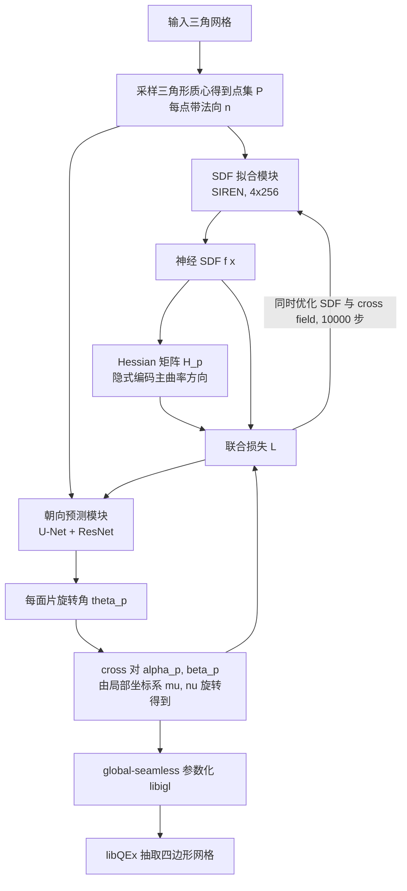

## 一句话总结

NeurCross 把神经 SDF 与 cross field 放进同一个自监督优化框架里联合训练，用 SDF 的 Hessian 隐式编码主曲率方向来引导 cross field，从而在奇异点分布、抗噪性和主曲率/尖锐特征对齐上同时超越现有四边形网格生成方法。

## 研究背景

四边形网格（quadrangulation）是 CAD/CAE 数值仿真里的基础环节，广泛用于有限元分析、等几何分析、角色动画与物理仿真。高质量四边形化通常要同时满足四个要求：与主曲率方向对齐、奇异点少且位置合理、精确贴合尖锐特征边、以及对噪声和微小几何起伏鲁棒。

现有主流做法是"两阶段"流水线：先算一个规则的 cross field 表示表面各处四边形单元的朝向，再据此抽取贴合该场的四边形网格。这里的核心矛盾在于：cross field 既要平滑，又要对齐预先计算好的主曲率方向，而主曲率方向对微小扰动极其敏感，在近似球面或平面区域往往定义不清。结果就是像 QuadWild 这类方法会因为过度追求 cross field 平滑而牺牲主曲率对齐，而想精确控制主曲率对推断场的影响又非常困难。

NeurCross 的切入点是：引入一个可优化的神经 SDF 作为输入形状的"代理曲面"。这个代理曲面比原始三角网格拥有更规则的主曲率方向，可以用来引导 cross field；同时它是可调的，能自然吸收微小的表面起伏和噪声。

## 方法

NeurCross 由两个围绕 SDF 的核心模块组成：表面拟合模块（SIREN 结构的 MLP，拟合神经 SDF）和朝向预测模块（U-Net + ResNet 结构，预测每个三角面片的旋转角）。两者通过一个总损失联合优化。

关键设计一：SDF 的 Hessian 隐式编码主曲率。微分几何里 shape operator 的特征向量对应主方向。作者利用一个事实——对基曲面上一点 $$p$$，SDF 的 Hessian 矩阵 $$H_p$$ 有一个特征值为 0，对应特征向量正是法向 $$n_p$$，而另外两个特征向量对应两个主曲率方向。于是先约束 SDF 与预定义法向对齐：

$$H_p \cdot n_p = 0$$

$$L_{AN} = \frac{1}{\vert P\vert } \int_P \left\vert  H_p \cdot n_p \right\vert  \, dp$$

关键设计二：隐式主方向对齐，绕开显式曲率提取。每个面片有局部坐标系 $$(\mu_p, \nu_p)$$，cross 由旋转角参数化：

$$\alpha_p = \mu_p \cos\theta_p + \nu_p \sin\theta_p, \quad \beta_p = \nu_p \cos\theta_p - \mu_p \sin\theta_p$$

要让 $$\alpha_p, \beta_p$$ 成为 $$H_p$$ 的特征向量，只需强制 $$H_p\alpha_p$$ 与 $$\alpha_p$$ 共线（$$\beta_p$$ 同理）：

$$H_p \alpha_p \times \alpha_p = 0, \quad H_p \beta_p \times \beta_p = 0$$

$$L_{AP}^{(1)} = \frac{1}{\vert P\vert } \int_P \left( \left\| H_p \alpha_p \times \alpha_p \right\| + \left\| H_p \beta_p \times \beta_p \right\| \right) dp$$

这样就不必显式提取主曲率方向——那一步在近平面/近球面区域正是不稳定的根源。

关键设计三：cross field 平滑项。作者证明两组正交单位向量 $$(\alpha_1,\beta_1)$$ 与 $$(\alpha_2,\beta_2)$$ 对齐（即差 $$k\pi/2$$）当且仅当下式取最小值：

$$\left\vert  \alpha_1 \cdot \alpha_2 \right\vert  + \left\vert  \alpha_1 \cdot \beta_2 \right\vert  + \left\vert  \beta_1 \cdot \alpha_2 \right\vert  + \left\vert  \beta_1 \cdot \beta_2 \right\vert $$

对每点 $$p$$ 的三个邻居（先用预计算的二面角旋转矩阵 $$R_i$$ 对齐到同一切空间）求和构成平滑损失：

$$L_S = \frac{1}{3\vert P\vert } \int_P \sum_{i=1}^{3} \left( \left\vert  \alpha_p \cdot R_i \alpha_{q_i} \right\vert  + \left\vert  \alpha_p \cdot R_i \beta_{q_i} \right\vert  + \left\vert  \beta_p \cdot R_i \alpha_{q_i} \right\vert  + \left\vert  \beta_p \cdot R_i \beta_{q_i} \right\vert  - 2 \right) dp$$

关键设计四：尖锐特征对齐。用测地距离 $$d_g(p, FL)$$（实现中近似为直线距离）构造随距离衰减的权重，特征线附近强制对齐、远处逐渐让位于主曲率：

$$D_p = 1 - \exp\left(-\rho_{feature}\, d_g(p, FL)\right)$$

$$L_{AP} = \frac{1}{\vert P\vert } \int_P D_p \left( \left\| H_p \alpha_p \times \alpha_p \right\| + \left\| H_p \beta_p \times \beta_p \right\| \right) dp$$

总损失把 SDF 项（Eikonal、Dirichlet、singular Hessian/法向对齐，带退火因子 $$\tau$$）与 cross field 项（主方向对齐 $$L_{AP}$$、平滑 $$L_S$$）统一起来：

$$L = \lambda_E L_E + \lambda_{DM} L_{DM} + \lambda_{DNM} L_{DNM} + \tau \lambda_{AN} L_{AN} + \lambda_{AP} L_{AP} + \lambda_S L_S$$

关键设计五：联合优化而非两阶段。作者强调 SDF 是"代理曲面"而非固定输入。如果先把 SDF 完全拟合好再固定，其曲率线可能过于复杂，导致 cross field 被迫对齐不规则曲率线、产生大量奇异点。联合优化让 cross field 的平滑项反过来影响 SDF 的最优形状，在近似精度与场平滑间取得平衡。

实现上：SIREN 为 4 个隐层各 256 单元；U-Net 用 7 个 ResNet 块（bottleneck 数 3/4/6/3/3/4/6）；输入归一化到 $$[-0.5,0.5]^3$$；Adam 学习率 $$5\times10^{-5}$$，训练 10000 步。权重设为 $$\lambda_E=50, \lambda_{DM}=7000, \lambda_{DNM}=600, \lambda_{AN}=3, \lambda_{AP}=10, \lambda_S=30$$。最后用 libigl 的 global-seamless 参数化对齐 cross field，再用 libQEx 抽取四边形网格。

## 实验结果

评测指标：面积畸变 Area（×10000）、角度畸变 Angle、奇异点数 # of Sings、Chamfer 距离 CD（×10000，L1 范数）、Jacobian Ratio JR（0 退化到 1 完美平行四边形，越大越好）。硬件为 RTX 3090 + AMD EPYC 7642。数据集为 ShapeNet 与 Thingi10K，输入统一缩放到 $$[-0.5,0.5]^3$$。对比方法：Instant Meshes(IM)、QuadriFlow、QuadWild、MIQ。

ShapeNet 数据集（平均 6000 顶点 / 12000 面）：

| 方法 | Area ↓ | Angle ↓ | # of Sings ↓ | CD ↓ | JR ↑ |
|------|--------|---------|--------------|------|------|
| IM | 1.57 | 11.78 | 200.52 | 8.97 | 0.70 |
| QuadriFlow | 2.28 | 13.24 | 91.58 | 50.18 | 0.65 |
| QuadWild | 1.52 | 11.05 | 93.04 | 10.34 | 0.73 |
| MIQ | 5.23 | 12.89 | 82.12 | 8.25 | 0.58 |
| NeurCross (Ours) | 1.48 | 9.85 | 85.32 | 8.03 | 0.78 |

Thingi10K 数据集（平均 10000 顶点 / 20000 面，测 1000 个随机三角网格）：

| 方法 | Area ↓ | Angle ↓ | # of Sings ↓ | CD ↓ | JR ↑ |
|------|--------|---------|--------------|------|------|
| IM | 1.45 | 10.57 | 397.18 | 9.83 | 0.75 |
| QuadriFlow | 1.58 | 12.39 | 78.32 | 26.89 | 0.72 |
| QuadWild | 1.40 | 10.16 | 85.11 | 28.12 | 0.77 |
| MIQ | 1.38 | 9.85 | 66.54 | 8.57 | 0.67 |
| NeurCross (Ours) | 1.33 | 9.68 | 68.96 | 8.22 | 0.81 |

NeurCross 在 Area、Angle、CD、JR 上几乎全面领先；奇异点数略多于 MIQ，但作者解释 MIQ 之所以奇异点少是因为它产出了畸变四边形、并过度平滑掉了 cross field 方向剧变的区域，缺乏整体一致性。

消融实验（去掉主方向对齐 $$L_{AP}$$、去掉平滑 $$L_S$$、或两者都去）：

| 数据集 | 配置 | Area ↓ | Angle ↓ | # of Sings ↓ | CD ↓ | JR ↑ |
|--------|------|--------|---------|--------------|------|------|
| ShapeNet | w/o $$L_{AP}$$ | 1.59 | 11.96 | 89.96 | 8.05 | 0.75 |
| ShapeNet | w/o $$L_S$$ | 1.96 | 15.12 | 113.28 | 8.09 | 0.71 |
| ShapeNet | w/o 两者 | 2.25 | 20.73 | 238.71 | 8.15 | 0.55 |
| ShapeNet | Ours | 1.48 | 9.85 | 85.32 | 8.03 | 0.78 |
| Thingi10K | w/o $$L_{AP}$$ | 1.48 | 11.89 | 73.79 | 8.25 | 0.79 |
| Thingi10K | w/o $$L_S$$ | 1.87 | 15.03 | 105.37 | 8.29 | 0.73 |
| Thingi10K | w/o 两者 | 2.21 | 20.67 | 225.18 | 8.31 | 0.58 |
| Thingi10K | Ours | 1.33 | 9.68 | 68.96 | 8.22 | 0.81 |

结论清晰：缺 $$L_{AP}$$ 只保留局部相关性、缺乏整体一致性；缺 $$L_S$$ 会产生大量奇异点；两者都缺则两种缺陷叠加。

此外还与 IGM、Dielen 等（监督学习）、Power Fields、PolyVectors、Quad Remesher 等做了定性对比，并展示了抗噪性（2% 高斯噪声下 MIQ 甚至无法产出有效结果，而 NeurCross 借 SDF 平滑掉噪声）、保真度（25000 顶点/50000 面下逼近误差最低）、以及高亏格、薄壳、非可定向环等复杂模型上的稳定表现。

## 亮点与局限

亮点：
- 首个用于学习 cross field 的自监督神经网络，无需标注数据，摆脱了 Dielen 等监督方法只能在 FAUST 这类特定数据集上表现好的局限。
- 用 SDF 的 shape operator 隐式对齐主曲率方向，彻底绕开了显式提取主曲率这一在近平面/近球面区域天然不稳定的步骤，天然解决了方向歧义。
- 联合优化把 SDF 当作可调代理曲面，而不是固定输入，使 cross field 的平滑需求能反哺 SDF 形状，在逼近精度与场平滑间取得更优平衡；同时 Hessian 的内在平滑性带来了对噪声和微小起伏的鲁棒性。
- 支持尖锐特征线约束，且在特征与主曲率冲突时优先保特征，对 CAD 模型友好。

局限：
- 自监督逐模型优化耗时大。50000 面的输入每次迭代 68.34 ms，默认 10000 步，单个模型优化成本高（简单规则形状可少迭代收敛，复杂形状需更多迭代）。
- 依赖 libigl global-seamless 参数化，无法处理非流形网格（ShapeNet 需先用 DualOctreeGNN 修复为流形）；特征对齐抽取用 LPM 时在自由曲面 patch 交界处会引入奇异点甚至畸形四边形。
- 奇异点数略高于 MIQ（尽管作者论证其位置更合理）。

## 延伸思考

这项工作最值得玩味的地方是把"表示"本身变成了优化变量——传统流水线里输入形状是不可动的硬约束，主曲率完全由它决定；NeurCross 却允许一个神经 SDF 在忠于输入的前提下微调自己，用可调代理曲面来吸收几何的"病态"部分。这种"让中间表示自适应下游目标"的思路，在其它对输入噪声敏感的几何处理任务（如各向异性重网格、法向场估计、特征线提取）里可能同样有效。

作者在展望里提到一个很实际的方向：用 NeurCross 大量生成高质量四边形网格作为训练数据，去喂 MeshGPT 这类生成模型，从而把"逐模型优化十分钟"变成"前向推理秒级出网格"。这实际上点出了当前方法的商业化痛点——self-supervised per-shape optimization 精度高但慢，要落地交互式工具，要么加速优化，要么用它当离线数据引擎去蒸馏一个快速前馈模型。后者可能是更现实的路径。
