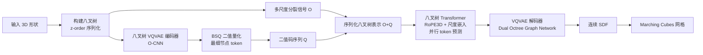

## 一句话总结

OctGPT 用序列化八叉树把 3D 形状转成多尺度二值 token 序列，配合高效八叉树 Transformer 与并行 token 生成，把自回归模型的 3D 生成质量与效率拉到能够媲美甚至超越顶尖扩散模型的水平。

## 研究背景

自回归模型在大语言模型、图像生成、多模态模型上都取得了显著成功，但在 3D 形状生成上的表现长期落后于扩散模型。把自回归范式搬到 3D 上主要有两个障碍：

- **顺序问题**：3D 形状本身没有天然的 token 顺序。以往方法多用基于 3D 坐标的光栅化顺序把 token 展平成一维序列，忽略了 3D 形状固有的层次结构与空间局部性，导致收敛慢、质量差。
- **序列过长问题**：3D 形状要表达复杂几何与拓扑需要大量 token，训练和推理计算开销巨大。已有工作用紧凑网格表示或低维 tokenization 把 token 数压到约 $$1k$$，但表达力受限，难以生成带精细细节的高质量形状。

作者的核心观察是：八叉树天然刻画了 3D 形状的层次结构，同时因为节点按 z-order（莫顿序）排列，保留了空间局部性，非常适合自回归预测。

## 方法

### 整体框架

OctGPT 包含两个关键部分：一个把 3D 形状序列化为多尺度二值 token 的表示，以及一个自回归预测该序列的 Transformer。

粗几何用八叉树结构编码：把节点的"是否细分"状态当作 $$0/1$$ 二值信号，从粗到细逐层拼接成一维序列。精细细节则由一个基于八叉树的 VQVAE 在最细节点上生成的二值 token 表示。两部分拼接成最终的多尺度二值序列，交给自回归模型预测。推理时从粗到细重建八叉树结构与最细层二值 token，再由 VQVAE 解码器解码为连续有向距离场（SDF），最后用 Marching Cubes 转成网格。

### 关键设计

**序列化八叉树表示。** 形状归一化到单位立方体后递归细分非空体素，并强制前三层全填充以覆盖整个体积（含离散部件）。深度 $$d$$ 的节点分裂状态 $$o^d_i \in \{0,1\}$$ 按 z-order 拼接为 $$O_d$$，从深度 3 到 $$D-1$$ 拼成多尺度序列 $$O = (O_3, O_4, \ldots, O_{D-1})$$。深度 3 全填充时恰好有 512 个节点。

**八叉树 VQVAE。** 采用非对称编码器-解码器，重点强化解码器的高保真表面重建。编码器基于 O-CNN，把输入八叉树压缩、深度减 2，特征用 Binary Spherical Quantization（BSQ）量化：$$q_i = \mathrm{sign}\left(\frac{z_i}{\lVert z_i \rVert}\right)$$。BSQ 无需码本，简化实现的同时保持重建质量。解码器用 dual octree graph network 把二值 token 解码为局部 SDF，再用多层单位分解方法融合成全局 SDF。总损失为 $$\mathcal{L} = \mathcal{L}_{vq} + \mathcal{L}_{sdf} + \mathcal{L}_{octree}$$，其中 SDF 重建损失同时约束数值与梯度。

**高效 Transformer。** 序列长度可超 $$50k$$，全局自注意力不可行。作者采用八叉树注意力（OctFormer）将 token 分成固定大小窗口计算注意力，并在膨胀八叉树注意力与移位窗口注意力之间交替以实现跨窗口交互。与 OctFormer 只处理单一深度不同，OctGPT 允许不同深度节点的 token 一起交互，兼顾局部与全局依赖。

**位置编码。** 提出 RoPE3D，把旋转位置编码扩展到 3D 空间；同时引入可学习的尺度嵌入区分不同八叉树深度的 token。

**并行多 token 生成。** 借鉴 MAR 的多 token 并行预测策略减少前向次数。因序列跨多个八叉树深度、深层依赖浅层，作者引入按深度的 teacher-forcing 掩码：只在每个深度层内部做置换，保证高深度 token 可访问低深度信息、又阻止高深度信息泄漏，从而保持层次依赖。推理时从深度 3 逐层预测到最大深度 $$D$$，所有 token 均由附在 Transformer 上的二值分类器预测。

这些设计把训练时间缩短 13 倍、生成时间缩短 69 倍，使得在 4 张 NVIDIA 4090 上数天内即可训练 $$1024^3$$ 分辨率的高分辨率 3D 形状。

## 实验结果

主实验为 ShapeNet 上基于着色图像的 FID 比较（数值越低越好），上半部分为逐类别单独训练，下半部分为所有类别一起训练（做类别条件生成）。带阴影行为自回归模型。

| Method | Chair | Airplane | Car | Table | Rifle |
| --- | --- | --- | --- | --- | --- |
| IM-GAN | 63.42 | 74.57 | 141.2 | 51.70 | 103.3 |
| SDF-StyleGAN | 36.48 | 65.77 | 97.99 | 39.03 | 64.86 |
| Wavelet-Diffusion | 28.64 | 35.05 | N/A | 30.27 | N/A |
| MeshDiffusion | 49.01 | 97.81 | 156.21 | 49.71 | 87.96 |
| SPAGHETTI | 65.26 | 59.21 | N/A | N/A | N/A |
| LAS-Diffusion | 20.45 | 32.71 | 80.55 | 17.25 | 44.93 |
| XCube | 18.07 | 19.08 | 80.00 | N/A | N/A |
| OctFusion | 16.15 | 24.29 | 78.00 | 17.19 | 30.56 |
| MeshGPT | 37.05 | N/A | N/A | 25.25 | N/A |
| OctGPT（单类别） | 31.05 | 27.47 | 64.45 | 19.64 | 21.91 |
| 3DShape2VecSet | 21.21 | 46.27 | 110.12 | 25.15 | 54.20 |
| LAS-Diffusion | 21.55 | 43.08 | 86.34 | 17.41 | 70.39 |
| OctFusion | 19.63 | 30.92 | 80.97 | 17.49 | 28.59 |
| 3DILG | 31.64 | 54.38 | 164.15 | 54.13 | 77.74 |
| OctGPT（全类别） | 28.28 | 29.27 | 62.40 | 20.64 | 27.21 |

在自回归方法中，OctGPT 相较此前最好的自回归模型 3DILG 平均 FID 提升约 42.84；在 Car、Rifle 类别上甚至超过 OctFusion、XCube 等顶尖扩散模型。效率方面，序列长度 $$80k$$ 时 OctGPT 相对 3DILG 提速 34 倍，而 AutoSDF、MeshGPT 在该长度直接爆显存。

消融实验（airplane 类别，FID）验证了各设计的作用：

| 设置 | FID |
| --- | --- |
| w/o RoPE3D | 38.03 |
| w/o 尺度嵌入 | 34.41 |
| w/o z-order | 43.71 |
| 完整模型 | 27.47 |

多尺度二值 token 相比单尺度 3D 坐标基线把 FID 从 142.92 降到 27.47，且仅训练 10 epoch 就超过基线训练 100 epoch 的结果。并行生成迭代数 $$N_{iter}$$ 从 64 增到 512 时，FID 从 35.95 降到 27.47，耗时从 6.43s 增到 34.51s，体现质量与速度的可调权衡。

## 亮点与局限

亮点：

- 把 3D 生成分解为一系列二值分类任务，受思维链启发，收敛显著加快、质量更高。
- 序列化八叉树同时保留多尺度层次结构与空间局部性，比常用光栅化顺序更适合自回归预测。
- 效率优化（八叉树窗口注意力、并行 token、RoPE3D）让高分辨率 $$1024^3$$ 生成在 4 张消费级 4090 上可行，$$1024^3$$ 形状可在单卡 30 秒内生成，降低了研究门槛。
- 通用性强：支持无条件、类别、文本、草图、图像条件生成以及场景级多物体合成。

局限：

- 依赖 VQVAE 重建质量与 Marching Cubes，几何精度受表示上限约束。
- 序列长度虽经优化仍可超 $$50k$$，属于计算密集型任务。
- 文中主要用基于图像的 FID 评估，指标维度相对单一。

## 延伸思考

OctGPT 展示了自回归范式在 3D 生成上追平扩散模型的可行性，其"二值化 + 多尺度 + 局部性排序"的思路对多模态统一建模有启发意义：因为语言、图像、3D 都能被统一成 token 序列，未来有望通过与大语言/图像模型的对齐或微调，走向能同时生成 3D、图像与文本的通用多模态模型。八叉树带来的层次归纳偏置，也提示"表示的顺序结构"对自回归任务的重要性，可能迁移到其他稀疏结构化数据的生成上。
