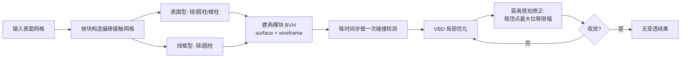

## 一句话总结
提出一种名为 Offset Geometric Contact（OGC）的接触模型：不再把接触碰撞建立在"点—面/边—边距离"这种在重叠区容易失效的原语上，而是给每个面沿法向偏移构造出一层带厚度的体积"接触网格"，让接触力天然沿正交方向作用，从而在极小计算开销下保证余维物体（布料、壳、杆）仿真的无穿透，并比 IPC 快约两个数量级。

## 研究背景
- 领域现状：保证无穿透（penetration-free）的接触仿真长期以 IPC（Incremental Potential Contact）为代表——用对数障碍能量把接触距离趋零时的势能推向无穷，配合连续碰撞检测（CCD）过滤步长，从而在能量优化框架下杜绝穿透。这类方法鲁棒但慢。
- 核心痛点：基于能量的求解要求接触能量光滑可微，而"无限刚硬的碰撞"本质上无法用光滑能量精确表达，于是只能用障碍函数逼近。由此带来两大低效：其一，接触法向在原语发生重叠时会"崩坏"（correction 方向错误），通常只能靠缩小接触半径来缓解，进而需要更刚的接触能量；其二，越靠近碰撞、障碍越陡，允许的步长越小，粒子每步挪动极其有限，需要大量迭代才能收敛。方向与步长两头受限，导致收敛缓慢。
- 本文 idea：问题的根子在于接触原语的几何定义不好，导致法向不连贯。作者转而借助 Polyhedral Gauss Map（把 Gauss–Bonnet 定理推广到多面体表面）给出更好的离散法向定义，并据此把接触对象重构成一层"沿法向偏移出来的体积壳"。这样接触力恒沿正交方向、法向沿网格连贯，即便使用较大的接触半径也不会产生伪影，进而摆脱"必须缩小半径 + 加刚能量"的恶性循环。

## 方法
整体思路：为待碰撞的表面构造一个由基本几何块拼成的偏移体积"接触网格"，接触能量与修正步长都围绕"到接触网格的距离"来定义，全流程在 GPU 上运行，用 Vertex Block Descent（VBD）做局部优化，并以"每顶点最大位移"取代 CCD 来避免优化过程中的穿透。

关键设计：

1. 更好的法向与偏移接触网格。采用 Polyhedral Gauss Map 得到沿网格连贯的法向，再把每个面沿其法向"挤出"厚度，形成体积化的接触网格。接触网格由块（block）拼装：顶点对应球（sphere）、边与边界边对应圆柱（cylinder）、面对应棱柱（prism，即面的挤出）。为覆盖两类碰撞，同时构造两套接触网格——"表面型（surface）"用球/圆柱/棱柱四种原语（球被 n 个平面切割、圆柱被 1 或 2 个平面切割、面挤出成棱柱），"线框型（wireframe）"只用球与圆柱。这样得到的接触法向定义干净、便于解析计算。

2. 接触能量。以顶点为例，接触能量把对数障碍（barrier）能量与二次（弹簧）能量结合起来，思路与 Ando 2024 一致。能量由三要素决定：接触刚度 $$k_c$$、接触网格半径 $$r$$、以及到接触网格的距离 $$d$$。障碍项在接近时提供足够强的排斥以杜绝穿透，二次项则在较远处提供平缓、易优化的力。

3. 距离感知的修正（distance-aware correction）。为避免优化过程中越界穿透，给每个顶点设定一个"最大位移"上限，其大小取决于该顶点到最近原语的距离：离得近的顶点只允许很小的修正，离得远的可以走大步。这既保证优化中不发生碰撞，又显著改善收敛速度——与 IPC 中"越近步长越小、迭代越多"的困境形成对照。

4. 全 GPU 流水线的技术细节。为两套接触网格各建一棵块 BVH（surface + wireframe），每个时间步只做一次碰撞检测；优化阶段不使用 CCD，而是用"最大位移"约束来防穿透，因此快得多，但其成立前提是单步位移满足 $$\lVert \Delta x \rVert < r$$（小于接触半径）。优化器采用 VBD（Vertex Block Descent）。

## 实验结果
论文围绕鲁棒性、收敛性与实时性能三方面验证。以下数字忠实于所报告内容：

- 鲁棒性：在多种高难场景下均保持无穿透。作者指出，VBD 这类局部优化能在牛顿法等全局求解难以保证无穿透的情形下依然给出无穿透结果。
- 性能（帧内各阶段耗时，按不同场景给出区间，帧率基准为 60Hz）：报告的耗时区间从亚毫秒级到数百毫秒不等，例如若干阶段处于 $$0.23\text{–}0.30\,\mathrm{ms}$$、$$0.9\text{–}1.5\,\mathrm{ms}$$、$$1.8\text{–}2.2\,\mathrm{ms}$$ 等量级，较重的场景整帧在 $$126\text{–}230\,\mathrm{ms}$$、$$153\text{–}220\,\mathrm{ms}$$ 区间。总体结论是：相较 IPC 快约两个数量级（2 orders of magnitude），且在时间步足够小时相当鲁棒；越难的场景需要越小的时间步 / 更多的碰撞检测。

（说明：上述性能数字来源为该论文的阅读组讲解材料对结果页的转述，具体到每个场景/阶段的对应关系以原文表格为准。）

## 亮点与局限
- 亮点：
  - 从"接触原语几何定义不佳导致法向崩坏"这一根因切入，用 Polyhedral Gauss Map + 沿法向偏移的体积接触网格，让接触力天然正交、法向连贯，允许较大接触半径而无伪影。
  - 用"每顶点最大位移"的距离感知限幅替代 CCD，在保证无穿透的同时大幅提升收敛速度，避免了 IPC"越近步长越小"的迭代爆炸。
  - 全 GPU 流水线（双 BVH + 每步一次碰撞检测 + VBD 优化），相比 IPC 实现约两个数量级的加速，面向余维物体（布料等）实时仿真。
- 局限：
  - "最大位移"防穿透机制依赖单步位移小于接触半径这一前提（$$\lVert \Delta x \rVert < r$$），高难场景需要更小的时间步与更频繁的碰撞检测才能维持鲁棒，性能随之下降。
  - 鲁棒性以"时间步足够小"为条件，接触半径、时间步与稳定性之间存在需要权衡的关系。
  - 需要为面/边/顶点预构造并维护两套偏移接触网格与对应 BVH，带来额外的几何构造与内存开销。

## 延伸思考
- 该工作与作者团队的 Vertex Block Descent、Augmented Vertex Block Descent 一脉相承：把"局部、可并行、GPU 友好"的优化范式与"几何化、正交化"的接触建模结合，代表了近期实时接触仿真"用更好的几何换更快的收敛"的思路。
- 把接触从"距离原语"升级为"偏移体积 + 连贯法向"，本质上是在离散几何层面重新设计接触流形；这一思想或可推广到自碰撞、厚壳、摩擦各向异性等更复杂的接触现象。
- "最大位移替代 CCD"是以可控步长换取速度的工程折中，其对时间步的敏感性提示：在刚性接触或高速冲击场景下，如何自适应地在半径、步长与检测频率之间调参，是落地时值得深挖的方向。
- 团队后续的 High-Fidelity 4D Cloth Capture 等工作显示，这类高效无穿透接触模型正被纳入布料采集与重建的完整流水线，接触仿真的加速将直接惠及下游数字资产生产。
