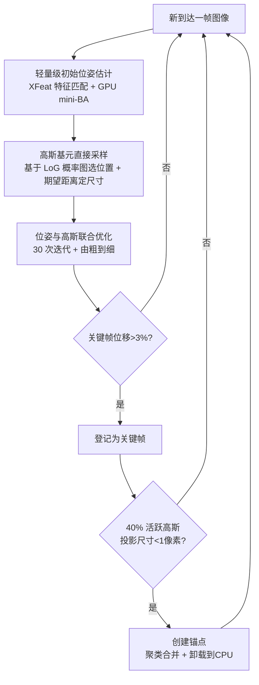

## 一句话总结

本文提出一套"边拍边建"的辐射场重建方法：输入一串无位姿、有序的照片序列，在拍摄结束的同时就得到相机位姿和训练好的 3D Gaussian Splatting（3DGS）表示。它通过 GPU 友好的轻量级初始位姿估计、基于概率的高斯基元直接采样，以及滑动窗口式的锚点聚类合并，做到既能处理稠密视频、宽基线多视图，又能覆盖上千米、数千张图的大规模场景，速度比"SfM + 3DGS"的传统流水线快一到两个数量级。

## 研究背景

- 领域现状：以 3DGS 为代表的辐射场方法已成为新视角合成主流，但典型流程是先用 Structure-from-Motion（SfM）离线估计全部相机位姿，再做 3DGS 优化。两步各自都要数分钟到数小时，大场景甚至要跑很多小时，拍完还得等很久才能看到结果。
- 核心痛点：
  - SfM（如 COLMAP）位姿估计昂贵，且在大规模数据集上常常失败、给不出一致轨迹。
  - SLAM 类方法虽快，但通常要求稠密的视频式输入、偏重定位而非画质，遇到宽基线多视图容易崩。
  - 已有的大场景 3DGS 方案（分块、层级结构）都需要预先知道全部相机位姿来做场景切分和层级构建，天然不兼容增量式重建。
- 本文思路：如果放宽第一步对精度的要求，就能把位姿估计重构成 GPU 友好、可并行的形式，从而大幅提速；随后借助 3DGS 可微渲染的梯度联合优化去精修位姿。再配合"直接采样放置高斯"而非依赖反复的梯度密集化，联合优化就能足够快、足够稳，天然适合增量式、大规模场景的在线构建。要求输入为有序序列。

## 方法

### 整体框架

方法由四个核心组件构成：快速但近似的初始位姿估计、高斯基元直接采样、位姿与 3DGS 联合优化、面向大场景的可扩展增量构建。

### 关键设计 1：轻量级初始位姿估计

- 特征提取：对每帧用快速关键点检测/描述子 XFeat，生成 6144 个关键点。
- 引导启动（Bootstrapping）：先等前 $$N_{init}$$ 帧到齐（实验中 $$N_{init}=8$$），对其两两穷举匹配，用 Levenberg-Marquardt 做 mini bundle adjustment，联合优化焦距、位姿与 3D 关键点位置，最小化重投影误差。
- GPU 友好的关键：刻意让每个 3D 点被固定数量的图像观测，从而得到固定尺寸的稀疏雅可比 $$J$$（由 $$J_{cam}$$ 与 $$J_{xyz}$$ 组成），非零块大小固定即可预分配显存、按块批处理并行，避免使用 Ceres 这类灵活但慢的通用求解器。启用 CUDA graphs 后，引导启动优化从 625ms 降到 145ms，增量 mini-BA 从 95ms 降到 4ms。
- 后续帧位姿：将新帧关键点匹配到最近 $$N$$ 个已登记帧（$$N=6$$），用已知位姿与三角化建立 3D-2D 对应（失败则用渲染深度），再用 GPU 并行 RANSAC + mini-BA 估计位姿并筛内点，最后跑 20 次 mini-BA 精修。遇到纯旋转、尺度漂移等退化情形时会重新引导启动。

### 关键设计 2：高斯基元直接采样

不做梯度驱动的密集化，而是直接决定每个像素是否生成高斯及其尺寸，目标是在需要处（高频、未覆盖区域）多放、在已充分表示处少放。

- 概率来源：用高斯拉普拉斯（LoG）算子的范数作为概率代理，既在高频细节处给高值，又能在边缘两侧各产生一个峰，保证边缘两侧都放高斯：

$$P_L(x,y) = \min\left(\left\|\nabla^2(n_\sigma) * I(x,y)\right\|, 1\right)$$

- 抑制冗余：对当前视角渲染图 $$\tilde{I}$$ 同样计算 LoG 范数得到惩罚项 $$\tilde{P}$$，最终采样概率为

$$P_s(x,y) = \max\left(P_L(x,y) - \tilde{P}(x,y), 0\right)$$

即在已被现有表示重建好的区域降低生成概率。
- 深度定位置：用 Depth-Anything-2 估单目深度，对齐到三角化匹配，再用以单目深度为中心的相关体（correlation volume）做引导匹配，得到更可靠的深度。
- 尺寸参数：不做 kNN 搜索，而是把 $$P_L$$ 当作局部 2D 泊松过程强度，用最近邻期望距离公式在图像空间估尺度，再投影到 3D：

$$s' = \frac{1}{2\sqrt{P_L(x,y)}}, \qquad s = \frac{z\, s'}{f}$$

这样既高效又避免了 3DGS 原始 kNN 初始化在边缘处产生过大高斯的问题。

### 关键设计 3：联合优化与调度

- 关键帧选择：仅当关键点中位移动超过屏幕宽度 3% 时才登记为关键帧，保证有意义视差、去冗余。
- 每个关键帧跑 30 次 3DGS 优化迭代，采用 Taming 3DGS 的快速反传与 sparse-Adam；位姿用 6D 旋转表示联合优化，接收来自高斯位置与旋转的梯度，但不接收球谐（SH）梯度（避免视角相关颜色污染位姿）。
- 由粗到细：新加图像先以 $$2^l$$ 降采样（$$l=3$$）训练，每 5 次迭代把 $$l$$ 减 1 直到全分辨率，并配合多尺度滤波。不做密集化，但保留低不透明度剔除。

### 关键设计 4：可扩展增量构建（锚点）

- 维护"活跃高斯集"参与当前优化与渲染。当从相机 $$i-1$$ 视角看，超过 40% 活跃高斯的投影尺寸 $$S/D$$ 小于 $$\tau_{min}=1$$ 像素时，触发创建锚点。
- 锚点存储位置、高斯基元、优化状态及关联关键帧，并从 GPU 卸载到 CPU 内存，需要时再载回。
- 合并：对被判为过细的基元随机选取 $$\frac{1}{k+1}$$，找 $$k$$ 近邻（$$k=3$$）合并，其余保持不变，得到远处更粗的表示，形成新的活跃集，滑动窗口继续前进。
- 渲染时选最近锚点，若两个锚点距离相近则按重叠参数 $$o$$ 线性混合：

$$w(r) = \begin{cases} 1, & \text{if } r < 1-o, \\ 1 - \dfrac{r-(1-o)}{0.5\,o}, & \text{otherwise.} \end{cases}$$

其中 $$r = d_1/d_2$$（$$d_1 \le d_2$$）。

## 实验结果

评测覆盖多种拍摄风格的数据集：SLAM 式稠密 TUM、中等宽基线的 Static Hikes、宽基线的 MipNeRF360，以及大规模的 SmallCity*、Wayve* 与自采的 CityWalk（4055 张图、1.1km）。硬件为 i9-14900K + RTX 4090。

无位姿方法对比（全分辨率，时间含位姿优化）：

| 方法 | TUM PSNR | TUM 时间 | MipNeRF360 PSNR | MipNeRF360 时间 | StaticHikes PSNR | StaticHikes 时间 |
|---|---|---|---|---|---|---|
| Photo-SLAM | 19.30 | 0:02:12 | 16.54 | 0:02:11 | 14.13 | 0:02:01 |
| MonoGS | 16.60 | 0:16:18 | 14.46 | 0:04:05 | 15.46 | 0:09:19 |
| Ours | 23.02 | 0:00:50 | 24.31 | 0:01:02 | 20.40 | 0:01:30 |

在无位姿方法中，本文在三个数据集上 PSNR 均最优，且用时最短。与需要 SfM 的基线相比，GLOMAP + Taming 3DGS (7k) 在 StaticHikes 上要 1:02:34，COLMAP + 3DGS (30k) 要 2:47:11，而本文仅 1:30 便达到与 7k 版相近的画质（配合额外精修）。

低分辨率方法对比（Table 2）：本文在 TUM（22.45 dB）、StaticHikes（21.93 dB）领先，MipNeRF360（25.80 dB）与 DROID-Splat（25.87 dB）持平，但用时仅约 1 分钟，而 CF-3DGS 在 StaticHikes 上需 7:52:54。

大规模场景对比 H3DGS（Table 4）：

| 场景 | H3DGS PSNR / 时间 | Ours PSNR / 时间 |
|---|---|---|
| SmallCity* | 21.17 / 2:55:28 | 23.59 / 0:01:45 |
| Wayve* | 20.80 / 7:29:45 | 20.29 / 0:04:29 |
| CityWalk | 11.78 / 22:09:20 | 21.71 / 0:25:03 |

在 CityWalk 上，H3DGS 因位姿估计质量太差导致多段新视角合成失败（仅 11.78 dB / 22 小时），而本文 25 分钟就完成、PSNR 21.71 dB——处理时间甚至短于 30 分钟的拍摄时间，真正做到"拍完即得"。

- 位姿精度（Table 5）：在 MipNeRF360 上本文 APE/RPE 各项最优；在 TUM 上因视频模糊、卷帘快门未显式处理而表现一般，但仍优于 Spann3r。
- 逐关键帧耗时（Table 6，Garden）：位姿初始化 15.4ms、高斯采样 50.2ms、联合优化 223.8ms，合计约 289.4ms/关键帧。
- 消融（Table 8）：完整版 PSNR 23.01；去掉形状采样（NoShape）掉到 19.12（最关键），去掉概率采样（NoSampling）21.75 且高斯数从 1.0M 涨到 2.0M，去掉引导匹配 21.91，去掉联合优化 21.61。
- 锚点作用（Table 7，Forest2）：启用锚点后 PSNR 从 21.56 升到 22.22，峰值高斯数从 1.43M 降到 0.98M；在 CityWalk 上使显存稳定在 22GB，理论上对图像数量没有上限。

## 亮点与局限

亮点：
- 真正意义上的"边拍边建"：位姿估计与 3DGS 训练在拍摄结束时同步完成，提供即时反馈。
- 一套方法同时覆盖稠密视频、宽基线多视图和大规模场景，是少数三者通吃的方案。
- GPU 友好的固定尺寸 mini-BA + CUDA graphs 把位姿估计做到毫秒级；基于 LoG 概率的直接采样绕开昂贵的密集化，既减少迭代又控制高斯数量。
- 锚点滑动窗口让显存占用可控、与场景规模解耦。

局限（作者讨论）：
- 依赖有序图像序列，无序采集（如 360 数据集部分场景）无法处理，缺少回环闭合。
- 要达到 SOTA 画质仍需额外优化；现有优化调度并非为增量直接采样得到的稠密表示设计，需要新的能跳出局部最小的方案。
- 要求至少约 1000 像素宽的分辨率（XFeat 最佳工作在 1-2 megapixel）。
- 不显式处理模糊、饱和、镜头眩光、动态物体等随拍伪影，TUM 场景结果偏模糊。

## 延伸思考

- 该工作把"在线 SLAM 的速度"与"离线辐射场的宽基线画质"较好地统一起来，关键在于"先粗后精 + 联合优化"的位姿哲学：不追求初始位姿准，而是让可微渲染的梯度在训练中把位姿拉回来。这一思路对其他需要位姿的增量式神经重建同样有借鉴意义。
- "用 LoG 概率图直接采样高斯"本质上是把密集化这个反复试探的过程，替换成一次性的、图像先验驱动的显式放置，值得关注其能否推广到需要动态增删基元的其他 3DGS 变体。
- 作者展望的手机/相机拍照 + 工作站即时重建反馈的应用形态，若结合回环闭合和抗伪影模块，有望把三维采集从"拍完回去慢慢跑"变成交互式、可现场补拍的流程。
- 局限中"针对增量稠密表示设计新优化调度以突破画质上限"是明确的后续研究点，也是当前与离线全量 3DGS 仍存质量差距的根源。
