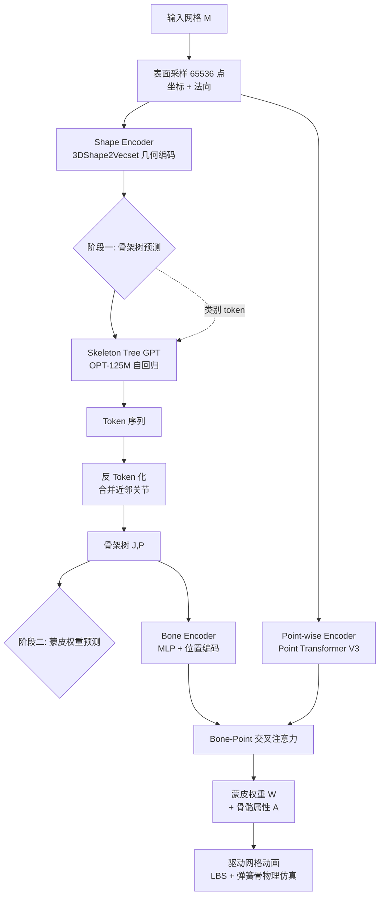

## 一句话总结

本文提出 UniRig，一个统一的学习式自动绑定框架：用自回归大模型配合一套「骨架树 Token 化」方案预测拓扑合法的骨骼，再用「骨骼-点云交叉注意力」预测蒙皮权重，能对从动漫人物到有机/无机结构的各类 3D 模型自动生成高质量骨骼与蒙皮，在挑战性数据集上绑定精度和运动精度分别较此前方法提升约 215% 与 194%。

## 研究背景

- 领域现状：AI 驱动的 3D 内容生成正以空前速度批量产出复杂模型，但把静态模型变成可动画版本仍要经过绑定（骨骼）和蒙皮（权重）两步，手工制作单个模型往往需要专家花数小时，成为动画流水线的瓶颈。
- 核心痛点：
  - 基于模板的方法（如依赖 SMPL 的 NBS）精度高，但只能处理特定骨骼拓扑，偏离模板的模型就失效。
  - 免模板方法（如 RigNet）更灵活，但结果不稳定，常生成拓扑不合理的骨架，且难以对生成骨架做运动重定向。
  - 免骨骼的网格形变方法绕过了骨骼，但重度依赖已有运动数据、泛化差，且与工业界普遍采用的骨骼动画流水线不兼容。
- 本文 idea：把骨架看作一棵有严格父子层级的树，用擅长建模序列依赖、生成结构化输出的自回归模型按拓扑排序逐关节生成骨架，从根本上保证拓扑合法；再辅以一个规模达 1.4 万+ 模型的多类别绑定数据集 Rig-XL，训练出真正通用的绑定模型。

## 方法

### 整体框架

UniRig 分两个阶段串联，共享同一份从网格采样的点云输入。

### 关键设计一：骨架树 Token 化（Skeleton Tree Tokenization）

要让自回归模型处理骨架树，必须先把「关节坐标 + 层级关系」编码成序列。作者先把归一化到 $[-1,1]$ 的坐标离散化为 $D=256$ 个整数 token：

$$M: x \in [-1,1] \mapsto d = \left\lfloor \frac{x+1}{2} \times D \right\rfloor \in \mathbb{Z}_D$$

反映射为 $M^{-1}: d \mapsto x = \frac{2d}{D} - 1$，离散化平均相对误差为 $O(1/D)$，可忽略。

朴素做法是按深度优先把每根骨骼的坐标直接拼接，但会重复存储父关节坐标、无法区分骨骼类型，且推理时容易产生重复 token。作者的核心洞见是：可以把骨架树拆成若干「骨骼链」，对属于已知模板（如 Mixamo）或弹簧骨链的部分用专门的「类型标识符」token 紧凑表示——模板骨骼的父坐标可由模板定义推断而省略，弹簧骨链只需记首尾坐标。对无法归类的通用情形，用 DFS 提取线性骨骼链、每条新分支前加 `<branch_token>`，并按尾坐标 $(z,y,x)$ 顺序排序子节点以保持一致性（详见论文算法 1）。

序列长度对比：朴素方案需 $6T-3+K$ 个 token，优化方案只需 $3T + M + 4S + 1$ 个（$T$ 为骨骼数，$M$ 为模板数通常 <2，$S$ 为去模板后森林的分支数）。实测 token 数在 VRoid 上减少 27.47%、Rig-XL 上减少 29.72%。

模型采用 decoder-only 的 OPT-125M 架构，几何嵌入 $F_G$ 前置到序列中作为条件，用 Next Token Prediction 损失训练：

$$\mathcal{L}_{NTP} = -\sum_{t=1}^{T} \log P(s_t \mid s_1, s_2, \dots, s_{t-1}, F_G)$$

### 关键设计二：骨骼-点云交叉注意力蒙皮预测

蒙皮阶段要预测权重矩阵 $W \in \mathbb{R}^{N \times J}$（$N$ 顶点数可达数万，$J$ 骨骼数可达数百），维度极高。作者用两个编码器：Bone Encoder（带位置编码的 MLP，处理每根骨骼头尾坐标）产出骨骼特征 $F_B$；点云编码器采用预训练的 Point Transformer V3（取自 SAMPart3D 权重，去掉下采样层以保留细节）产出点特征 $F_P$。

以点特征为 query、骨骼特征为 key/value 做交叉注意力，再拼接预计算的体素测地距离 $D$（编码骨骼-顶点空间邻近性），经 MLP 和 softmax 得到权重：

$$W = \mathrm{softmax}\left( E_W\left( \mathrm{concat}\left( \mathrm{softmax}\left( \frac{Q_W K_W^{T}}{\sqrt{F}} \right), D \right) \right) \right)$$

预测骨骼属性 $A$（如刚度、重力系数）时把骨骼与顶点的角色对调（骨骼作 query）。损失为蒙皮权重的 KL 散度加骨骼属性的 L2 损失。

### 关键设计三：骨骼等价训练策略 + 物理仿真间接监督

- 骨骼等价（skeletal equivalence）：均匀采样会让髋部等稠密区域骨骼学得快、头发手指等稀疏区域学得慢。作者以概率 $p$ 随机冻结部分骨骼（用真值权重、不回传梯度），并按每根骨骼影响的顶点数做「按骨骼归一化」的损失，使每根骨骼对训练目标贡献均等。
- 物理仿真间接监督：直接监督权重不保证运动视觉真实（不同权重可能产生相似形变）。作者引入基于 Verlet 积分的可微弹簧骨物理仿真，从 Mixamo 采一段长度 $T=3$ 的短运动施加到预测与真值参数上，用两者模拟顶点位置的 L2 距离作为重建损失。最终损失为：

$$\lambda_W \mathcal{L}_{KL}(W, W_{pred}) + \lambda_A \mathcal{L}_2(A, A_{pred}) + \lambda_X \sum_{i=1}^{T} \mathcal{L}_2(X^{M_i}, X^{M_i}_{pred})$$

### 数据集

- VRoid：从 VRoidHub 精选 2061 个动漫风格人物模型，VRM 格式、兼容 Mixamo 骨骼、含弹簧骨（模拟头发/衣物/尾巴摆动），用于精细细节学习。
- Rig-XL：从 Objaverse-XL 出发，先取 Diffusion4D 提供的 5.4 万可动子集，经「骨骼过滤（骨数 $[10,256]$ 且单一连通树）→ VLM(ChatGPT-4o) 自动分八类去重 → 人工核验修正」三步清洗，最终得 14611 个模型。八类分布中 Mixamo 占 52.7%、Biped 20.0%，训练时对各类别重采样以平衡长尾。

## 实验结果

训练：骨架阶段用 8×A100 训 3 天、500 epoch；蒙皮阶段冻结 Point Transformer、只训小部分参数，8×A100 训 1 天。推理速度 1~5 秒/模型（对比 RigNet 最长约 20 分钟、Tripo 约 2 分钟）。

- 骨骼预测（J2J Chamfer 距离，越低越好）：在 Mixamo / VRoid / Mixamo\* / VRoid\* / Rig-XL\* 上 UniRig 分别为 0.0101 / 0.0092 / 0.0103 / 0.0101 / 0.0549，全面优于 RigNet（如 Mixamo 0.1022、Rig-XL\* 0.2388）、NBS（Mixamo 0.0338、VRoid 0.0205）和 TA-Rig（Mixamo 0.1007、Rig-XL\* 0.2175）。带 \* 的数据集加了随机旋转、缩放和运动增强。
- 蒙皮权重（逐顶点 L1，越低越好）：UniRig 在五个设定上为 0.0055 / 0.0028 / 0.0059 / 0.0038 / 0.0329，显著优于 RigNet（0.0454 起）和 NBS（0.079 / 0.027 等）。
- 形变鲁棒性（施加 2446 段 Mixamo 动画后的 L2 重建损失，越低越好）：UniRig 在 Mixamo / VRoid / Mixamo\* / VRoid\* / VRoid-with-Spring\* / Rig-XL 上为 $4.0\times10^{-4}$ / $4.0\times10^{-4}$ / $6.0\times10^{-4}$ / $1.1\times10^{-3}$ / $1.7\times10^{-3}$ / $3.5\times10^{-3}$，全面低于 NBS。
- 消融：
  - Token 化——优化方案相比朴素方案，Rig-XL\* 平均 token 从 495.46 降到 237.94、推理时间从 4.29s 降到 1.99s，且 J2J/J2B/B2B 精度全面提升（如 Mixamo\* J2J 0.1761→0.0838）。
  - 物理仿真间接监督——形变误差 $8.59\times10^{-4} \to 7.74\times10^{-4}$，蒙皮误差 $5.78\times10^{-3} \to 5.42\times10^{-3}$。
  - 骨骼等价策略——去掉「骨骼冻结」或「按骨骼归一化」任一组件，重建损失均变差。

对商用工具（Tripo、Meshy、Anything World、Accurig）的定性对比显示 UniRig 在精度、细节和骨架完整性上均更优。综合来看，绑定精度和运动精度分别取得约 215% 和 194% 的相对提升。

## 亮点与局限

亮点：
- 用自回归 + 拓扑排序生成骨架，从机制上保证拓扑合法，跳出了「先测关节再连边容易出拓扑错误」的旧范式。
- Token 化方案把模板、弹簧骨、通用分支统一编码，既压缩 30% 序列、加速推理，又能借模板对齐天然支持运动重定向。
- 真正跨类别通用（动漫人、动物、飞鸟、水生、昆虫、静物等），且推理只需数秒，对接工业界骨骼动画流水线（可导出 VRM，用于 VTuber 直播等）。
- 支持人机协作：用户可编辑预测骨架（增删分支/移除弹簧骨、加提示），再让 UniRig 局部重生成。

局限：
- 与所有学习式方法一样，性能受训练数据质量与多样性约束，面对训练分布外的高度异常/抽象/风格化骨架可能表现不佳。
- 假设重力方向统一向下、忽略碰撞，弹簧骨物理仿真做了简化。

## 延伸思考

- 「把结构化输出问题转成序列生成 + 精心设计的 Token 化」是这套方法的方法论内核，与网格生成、B-rep 生成等 3D 自回归工作一脉相承；骨架树的分支/模板 token 设计尤其值得其他层级结构（如场景图、CAD 装配树）借鉴。
- 论文提到用户编辑可作为进一步微调模型的数据来源，形成「自动预测—人工修正—回流训练」的闭环，这在数据稀缺的绑定任务上是很实际的增长飞轮。
- 蒙皮阶段冻结大型预训练点云 backbone、只训少量交叉注意力参数的做法，说明「几何理解」与「绑定专用映射」可解耦，为低成本适配新类别提供了思路。
- 与同届 Anymate 等工作对照可见，绑定领域正集体从「小数据 + 模板」转向「大规模多类别数据 + 生成式/注意力架构」，Rig-XL 与其数据清洗流水线本身也是重要贡献。
