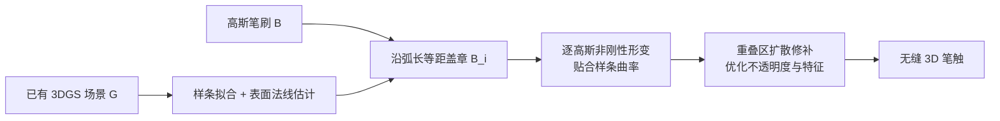

## 一句话总结

这是首个允许艺术家用"3D 高斯泼溅笔刷"在 3DGS 场景或其它 3D 表面上实时直接绘制的系统：笔刷本身是一小块真实捕获的纹理-几何内容，通过盖章式绘制把真实世界的素材快速重混到新场景里。

## 研究背景

- 领域现状：以 NeRF 和 3D Gaussian Splatting（3DGS，一种用大量各向异性高斯基元显式表达场景外观与几何的辐射场表示）为代表的多视图捕获方法在速度和质量上已经成熟，但主要还停留在新视角合成，缺乏灵活的交互编辑工具。新兴的编辑工作大多依赖文本驱动的生成式 AI 接口。
- 核心痛点：现有 3DGS 编辑几乎都是 AI 驱动的高层编辑，缺少艺术家可直接控制的创作方式。作者调研到唯一带有"绘制式"交互的工作 GSTex 也只能基于色彩笔画粗略改变高斯颜色，没有真正把"几何+纹理"一起搬运的直接笔刷。
- 本文 idea：既然 3DGS 是拉格朗日式的粒子表示，显式编码了外观与几何、且不依赖拓扑/网格，天然适合局部空间操作，那就把一小簇高斯当作"笔刷图章"，沿笔画反复盖章，从而把真实捕获内容当作画材直接绘制。

## 方法

整体框架：系统假设已有一个 3DGS 场景 $$G$$ 作为画布，以及一小块高斯片段 $$B$$ 作为笔刷。绘制时沿用户笔画拟合一条三维样条，按弧长等间距地把笔刷图章 $$B_i$$ 复制、定向并放置到场景表面上；再对每个图章做非刚性形变以贴合笔画曲率；最后用扩散模型对相邻图章的重叠接缝做修补，得到无缝、真实的笔触。笔刷本身则通过交互式框选高斯并设定朝向、间距、高度等参数来构造。

关键设计：

1. **图章放置（Stamp Placement）**：光标处取一个小的屏幕空间矩形 $$R_t$$，用带深度的快速着色器计算 `first_hits` 得到表面高斯集合 $$G_t$$，以其均值作为图章位置 $$p_t$$，用对高斯均值做 SVD 估计法线 $$n_t$$ 作为竖直朝向。随笔画累积点与法线维护一条三维三次样条 $$S$$；再依据弧长参数化与间距阈值 $$\tau_B$$，当 $$s(b_{i-1}, p_t) > \tau_B$$ 时放置下一个图章，并用样条切线把图章的切向/法向对齐到当前表面。这套策略也能推广到点云、网格等代理表面，从而支持在自由 3D 空间中绘制。

2. **图章形变（Stamp Deformation）**：只做刚性放置会在曲率处产生切向"突刺"。作者借鉴曲线形变的 wires 思路，把每个高斯在图章局部坐标系里表示为 $$p_{stamp} = x\,t_B + y\,b_B + z\,n_B$$，然后沿样条把它重新放置为 $$p_{deformed} = S(a+x) + y\,b_S(a+x) + z\,n_S(a+x)$$，同时旋转每个高斯的局部坐标轴对齐样条在该处的朝向。由于是逐高斯局部刚性变换，图章弯曲时仍保持形状不失真。作者发现：形变这一步对笔触质量的提升最大，这与以往主要靠扩散模型兜底无缝性的 2D 纹理绘制结论相反。

3. **扩散修补（Diffusion Inpainting）**：对每一对重叠图章，在样条中点沿法线和副法线各架一台虚拟相机（俯视与侧视），分别渲染两图章得到可见性掩码并求交，反投影出重叠区高斯集合 $$\Omega$$。用 SD-XL 的 inpainting 检查点在两个视角的重叠区做 2D 修补，再以修补结果引导一个优化，仅调整 $$\Omega$$ 内高斯的不透明度与特征。损失为视觉一致性项加不透明度正则：视觉项 $$L_{visual} = 0.25\,\ell_1(I_{render}, I_{inpaint}) + 0.75\,(1 - \mathrm{SSIM}(I_{render}, I_{inpaint}))$$，不透明度项 $$L_{opacity} = \max\big(0,\ 0.5\sum_{i\in\Omega}\alpha_i^o - \sum_{i\in\Omega}\alpha_i\big)$$ 防止重叠区总不透明度掉到原值一半以下，总损失 $$L = L_{visual} + \lambda L_{opacity}$$。同样的机制还能扩展到多笔画交叉处的无缝融合。

4. **笔刷构造与参数（Brush Creation）**：用户可用已有 3D 分割器或自研的屏幕空间包围盒工具（支持并/交/删、可选连通分量约束）框选一簇高斯作为图章，再用 gizmo 设定朝向、缩放、高度偏移 $$h$$ 与间距。还提供对缩放和绕法线旋转的随机抖动，避免重复盖章、产生更自然多样的效果。

## 实验结果

论文以定性画廊、消融和用户研究为主，没有传统的定量指标对比表。核心的方法消融是逐步验证三个组件的贡献：

| 配置 | 说明 | 效果 |
|------|------|------|
| 仅图章放置（§3.2） | 沿样条等距刚性盖章 | 曲率处出现切向突刺，接缝明显 |
| + 非刚性形变（§3.3） | 逐高斯贴合样条曲率 | 对笔触质量提升最大，几何自然连贯 |
| + 扩散修补（§3.4） | 重叠区无缝化 | 进一步消除残余接缝与纹理不一致 |

系统在配备 NVIDIA RTX 4090 的工作站上，对含数十万高斯的笔刷可实时完成样条计算、放置、定向、形变与参数调整；唯一非实时的扩散修补放到后台并行，绘制过程中周期性更新，不打断交互。所有 3DGS 场景由 Polycam 捕获处理，放置检测用 15 像素的屏幕矩形、首次命中半径 $$\tau_\alpha$$ 取笔刷基边长的十分之一。画廊展示了藤蔓/灌木/森林等有机植被、墙体/道路/铁轨等结构延展、用平面或球面代理网格在空中绘制（修补姜饼屋、给灯塔周围画鸟）、给猫加虎纹、服饰细节乃至搭建整座虚拟世界等多样用例。

用户研究：邀请某知名动画工作室 3 位资深从业者（经验 8～20 年）在城堡和农场两个扫描场景上完成引导任务与自由创作。参与者认为该工具能实现快速、真实的原型与环境设计，且相比纯文本 AI 提供了更直接的艺术控制；随机抖动、直接盖章控制、大结构的平滑形变尤其受好评。平均约 10 分钟即可上手、每个引导任务约 5 分钟完成，采用意愿一致积极（以少量 UI、交互和文件格式对齐主流 3D 软件为前提）。参与者还提出希望增加"雕刻/擦除"、语义混合、时间轴关键帧（用于定格动画）等扩展。

## 亮点与局限

- 亮点：
  - 首个真正意义上的 3DGS 直接笔刷绘制系统，笔刷同时承载几何与纹理，把真实捕获内容当作可复用画材。
  - 逐高斯非刚性形变是质量提升的关键，且大部分流程可实时运行，扩散修补放后台不阻塞交互。
  - 放置策略可推广到网格/点云代理表面，支持在自由 3D 空间绘制；随机抖动带来自然变化；机制可扩展到多笔画融合。
  - 有真实专业动画从业者参与的试点用户研究支撑可用性与创作价值。

- 局限：
  - 绘制后的高斯缺乏动态重光照能力，烘焙光照限制了其在影视级制作中的更广泛采用。
  - 目前只能"添加"内容，缺少擦除/雕刻、与底层场景的语义混合等编辑能力。
  - 用户研究规模很小（仅 3 人），且以定性反馈为主，缺乏量化评估与更大样本验证。
  - 依赖扩散修补处理接缝，复杂或高度不对称的图章重叠仍可能是难点。

## 延伸思考

这项工作把"画材"从像素/纹理升级为"真实的纹理-几何块"，本质上是在探索捕获数据的可复用性与可编辑性，和 3DGS 编辑、可重光照 3DGS、以及基于扩散的几何处理是天然互补的方向。作者自己也指向了几个值得追问的点：去光照/重光照笔刷与图层化能否让此类场景进入电影级管线？语义感知的混合与抖动（例如抖动树干粗细、树叶颜色）能否让"绘制"带上更强的内容理解？以及用户提到的时间轴关键帧，是否能把这套盖章范式自然延伸到定格/动画创作。把交互式高斯绘制与生成式几何处理进一步融合，可能会打开"直接从真实世界取材作画"的新创作空间。
