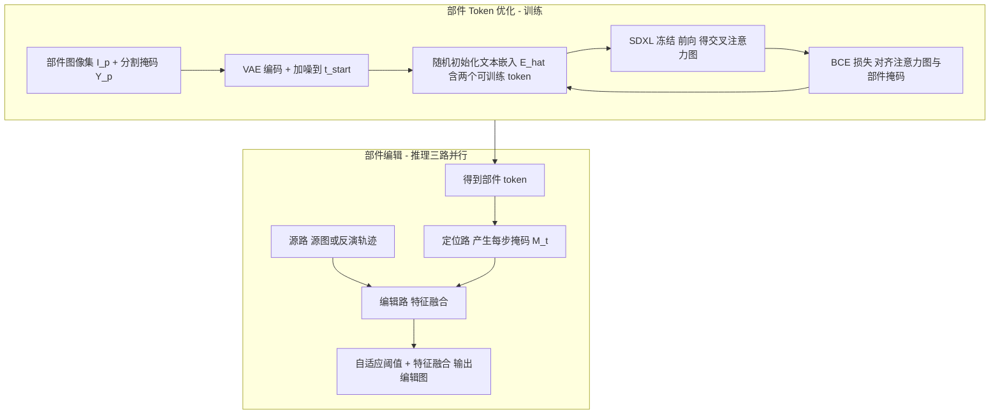

## 一句话总结

PartEdit 提出首个面向"物体局部部件"的文本图像编辑方法：在冻结预训练扩散模型的前提下，通过优化少量部件专用文本 token，让模型在每一步去噪时都能定位目标部件，并配合特征融合与自适应阈值策略，实现精准、无泄漏且自然融合的细粒度编辑。

## 研究背景

- 领域现状：扩散模型在大规模图文数据上训练，具备很强的图像语义理解力，现有编辑方法据此实现了对象替换、风格调整等多种编辑。
- 核心痛点：训练数据（如 LAION-5B）的文本描述较粗糙，很少显式标注物体部件，导致模型对"部件"层级理解不足。作者通过可视化 SDXL 的交叉注意力图证实这一点：提示"robotic head"时，"head"这个 token 的注意力错误地激活在手臂上；提示"black hood"时，模型无法定位"hood"（引擎盖）。因此现有编辑方法在细粒度部件编辑上普遍失败，表现为定位错误、编辑泄漏到无关区域、部件相互纠缠（例如把头发改成金色时连人脸也变年轻，暴露数据偏见）。
- 本文思路：与其耗费大量标注去微调整个模型，不如冻结模型、只学习部件专用 token。用已有部件分割数据集（PASCAL-Part、PartImageNet）或少量用户标注图像，通过 token 优化让 token 在去噪过程中产出可靠的定位掩码，再据此完成编辑。

## 方法

### 整体框架

方法分为两个阶段：离线的"部件 token 优化"训练，以及推理时的"三路并行"编辑。核心是让优化后的 token 在每个时间步、每个 UNet 层都能生成部件定位掩码，用非二值掩码在源图与编辑图两条轨迹间做特征融合。

### 关键设计

- 部件 token 优化：给定部件 $$p$$，收集图像集 $$I_p$$ 与对应部件分割掩码 $$Y_p$$。把图像编码进潜空间并加噪，随后不再用真实文本提示，而是初始化一个随机文本嵌入 $$\hat{E}\in\mathbb{R}^{2\times 2048}$$，其中包含两个可训练 token：第一个对应目标部件，第二个对应"其余一切"（背景）。用二元交叉熵损失监督其交叉注意力图 $$\hat{A}^{p}_{i,t}$$ 逼近部件掩码：

$$L^{p}_{j}=\sum_{t}\sum_{i\in L} Y^{p}_{j}\log(\hat{A}^{p}_{i,t})+(1-Y^{p}_{j})\log(1-\hat{A}^{p}_{i,t})$$

  优化完成后 token 被作为文本嵌入与模型一起存储，记作 <part-name>。整个过程模型权重保持冻结，因此在扩展语义理解的同时不损害原有生成能力。

- 时间步与层的选择：在所有时间步与层上优化代价过高。作者通过观察去噪过程中无噪预测 $$\hat{x}_0$$ 的演化发现，中间时间步（约 $$t\in[30,20]$$）图像结构已基本成型、对大部件（如头部）定位最稳定；小部件（如眼睛）则在接近 $$t=0$$ 时定位更准。层的选择上，用 mIoU 评估各 UNet 块后发现，解码器前八个块已足以取得稳健结果，适合算力受限场景。

- 三路并行编辑：推理时并行运行源路（原图或真实图像反演得到的轨迹）、定位路（优化 token 产出部件注意力）与编辑路（受前两路影响生成最终结果）。每步把上一时刻各层注意力聚合归一化得到融合掩码：

$$M_t=\sum_{i\in L}\mathrm{RESIZE}(\hat{A}^{i}_{t-1})$$

- 自适应阈值：为兼顾"只编辑目标部件、保留其余区域、自然过渡"，提出三段式阈值函数，其中 $$k$$ 由 OTSU 阈值确定，$$\omega=3k/2$$：

$$\mathcal{T}(X)=\begin{cases}1 & X\ge\omega\\ x & k/2\le X<\omega\\ 0 & X<k/2\end{cases}$$

  再用该阈值化掩码在源路与编辑路特征间融合：

$$\hat{F}^{e}_{i,t}=\mathcal{T}(M_t)\,\hat{F}^{e}_{i,t}+(1-\mathcal{T}(M_t))\,\hat{F}^{s}_{i,t}$$

  融合仅在时间步区间 $$[1,t_e]$$ 内进行，$$t_e$$ 控制编辑的局部性：$$t_e$$ 越大越保留未编辑区域，越小则给模型更多自由度在周边补充相关内容。

- 真实图像编辑：接入现成反演方法（Ledits++ 或 EF-DDPM）估计真实图像的扩散轨迹作为源路，并用 BLIP2 生成源提示，其余流程与合成图一致。

- 训练无关的多部件扩展：可把分别训练好的多个部件 token 在推理时组合，同时编辑多个部件（如同时改躯干和头部）。

## 实验结果

作者构建了包含 7 个部件的基准（humanoid-head、humanoid-torso、human-hair、animal-head、car-body、car-hood、chair-seat），分合成集（PartEdit-Synth，60 张）与真实集（PartEdit-Real，13 张）。评测指标分前景编辑区域与背景未编辑区域：$$\alpha\text{Clip}_{FG}$$、$$\alpha\text{Clip}_{BG}$$、PSNR、SSIM，以及用户偏好率。主实验结果如下（数值取自原文表格，"Ours Pref."为用户研究中偏好本方法的比例）。

| 方法 | GT 掩码 | αClip_FG↑ | αClip_BG↑ | PSNR↑ | SSIM↑ | αClip_avg↑ | Ours Pref.(%)↑ |
| --- | --- | --- | --- | --- | --- | --- | --- |
| P2P（合成） | ✗ | 63.60 | 20.46 | 23.7 | 0.87 | 42.03 | 88.6 |
| iP2P（合成） | ✗ | 89.31 | 5.55 | 18.0 | 0.74 | 47.43 | 77.0 |
| MasaCtrl（合成） | ✗ | 66.14 | 5.01 | 16.4 | 0.74 | 35.58 | 73.5 |
| PartEdit（本文，合成） | ✗ | 91.74 | 38.38 | 31.5 | 0.98 | 65.06 | - |
| SDXL Inpainting（掩码） | ✓ | 79.72 | 46.76 | 34.2 | 0.96 | 63.24 | 75.0 |
| Latent Blending（掩码） | ✓ | 90.09 | 46.45 | 37.5 | 0.98 | 68.27 | 66.1 |
| Ledits++（真实） | ✗ | 66.57 | 12.95 | 20.9 | 0.69 | 39.76 | 80.77 |
| EF-DDPM（真实） | ✗ | 73.57 | 15.09 | 22.9 | 0.72 | 44.33 | 90.38 |
| InfEdit（真实） | ✗ | 67.67 | 21.71 | 22.5 | 0.70 | 44.69 | 77.88 |
| PnPInversion（真实） | ✗ | 71.71 | 23.59 | 22.6 | 0.73 | 47.65 | 79.81 |
| TurboEdit（真实） | ✗ | 75.55 | 12.49 | 20.2 | 0.69 | 44.02 | 66.92 |
| ReNoise（真实） | ✗ | 69.80 | 9.93 | 20.7 | 0.68 | 39.86 | 77.69 |
| Ours w/ Ledits++（真实） | ✗ | 85.59 | 28.29 | 26.3 | 0.76 | 56.94 | - |

- 合成设定下，PartEdit 在 $$\alpha\text{Clip}_{avg}$$ 及所有未编辑区域指标上均最优；iP2P 的 $$\alpha\text{Clip}_{FG}$$ 偏高是因为它倾向把整幅图都改成匹配编辑提示，忽略原图结构与风格。
- 即便对手使用了真值掩码，PartEdit 仍在用户研究中以 75% 与 66% 的偏好率胜过 SDXL Inpainting 和 Latent Blending，说明其编辑在视觉观感上更自然真实。
- 用户研究中，PartEdit 分别以 88.6%、77.0%、73.5% 的偏好率优于 P2P、iP2P、MasaCtrl（每项研究 360 份回答）。
- 消融显示：$$t_e$$ 可让用户控制编辑局部性；相比 0.5 硬阈值和纯 OTSU，本文的三段式阈值让编辑与原物体的过渡最自然；即使仅用单张标注图像也能得到可用的定位。

## 亮点与局限

- 亮点：首个面向物体部件的文本图像编辑方法；冻结基座模型、只优化 token，代价低且不损原有能力；非二值掩码带来无缝融合，效果甚至超过提供真值掩码的方法；可扩展到真实图像与多部件编辑；还能缓解数据偏见（把发型与肤色解耦，消除"Afro 发型必对应特定人种"的关联）。
- 局限：冻结状态限制了完全不真实的编辑（如把人头改成车轮）；无法把被编辑部件的风格改成与原图不同的风格，这源于 SDXL 用自注意力编码风格、难以混合两种风格的内部机制。作者还指出本方法的无缝编辑可能被滥用于制造虚假图像与误导信息。

## 延伸思考

- 核心贡献其实是一种"轻量语义扩展"范式：不动模型权重，只用少量标注和 token 优化就补齐模型缺失的细粒度概念定位能力。这种思路可能迁移到其他"模型理解有缺口"的编辑或生成任务。
- 论文在附录中分析了 DiT 架构的 Flux 模型，指出其基座定位能力更强，暗示随着基座模型演进，部件理解的先天短板可能减小，但"精准局部编辑 + 无泄漏融合"的需求仍然存在。
- 风格无法跨域混合的局限本质来自自注意力的风格编码方式，若未来在解耦风格与内容表示上有突破，这类方法的适用范围会进一步扩大。
