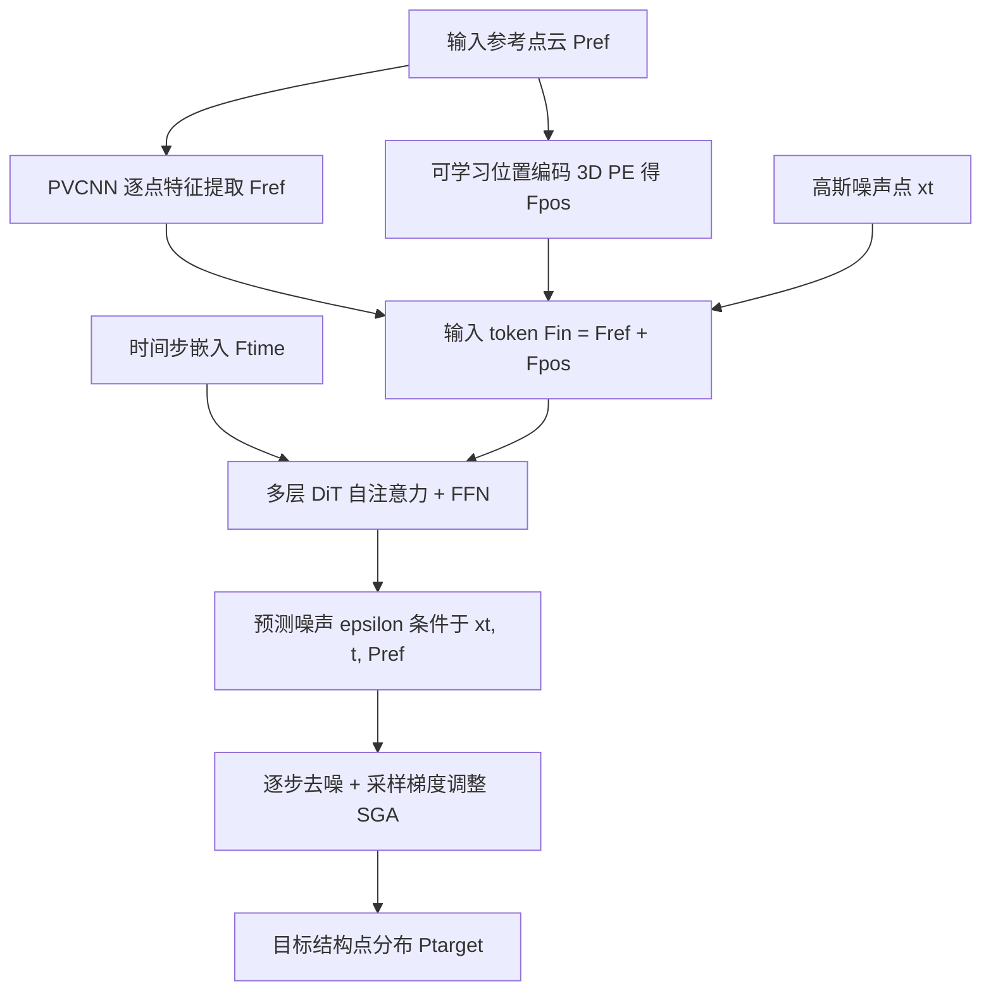

## 一句话总结

PDT 用扩散模型把一团无结构的表面采样点，"变形"成语义上有意义的结构化点分布（网格关键点、骨骼关节、服装特征线），核心是为每个噪声点与参考点建立显式逐点对应，通过引导式去噪完成分布到分布的映射。

## 研究背景

点云是三维几何数据最基础的表示之一，灵活、简单、可扩展。但点云天生无序、不规则，如何从这种散乱分布中感知高层语义信息，并生成结构化的表示（如关键点、骨架、特征线），一直是难题。

已有做法通常把稠密点云编码成隐式的全局特征，再用回归或分类直接"前馈"预测出结构化输出。这类确定性映射有两个短板：一是难以刻画语义结构的多模态特性（同一形状可能对应多种合理结构），二是难以维持局部几何保真度。

作者把问题重新表述为一个生成式的"分布变换"：把输入几何与目标结构都看作三维空间中的点分布，学习从一个分布向另一个分布的变换。这样能建立显式的逐点对应，更好地处理结构歧义，并产出紧凑、语义明确的输出。扩散模型在三维生成上已展现出强大能力，但用它来把点分布转化成结构化表示这一方向此前几乎无人探索，本文正是要填补这一空白。

## 方法

### 整体框架

给定从源表面分布 $$p_S(x)$$ 采样得到的参考点云 $$P_{ref} = \{p^i_{ref} \in R^3 \mid i = 1, \dots, N\}$$，目标是生成一组刻画结构特征的目标点 $$P_{target}$$。训练时通过一个匹配函数 $$F: R^3 \to R^3$$ 把每个参考点映射到其最近的目标点，建立逐点对应。扩散模型学习从初始高斯噪声分布出发，在参考点的引导下逐步去噪，收敛到目标位置，从而把源几何分布 $$p_S(x)$$ 与目标结构分布 $$p_T(x)$$ 关联起来。

与以往"把整个参考点云作为整体条件"的做法不同，PDT 让扩散轨迹中的每个点都与一个采样参考点保持显式对应，这使得任意采样密度下的源表面都能得到有效变换，同时保持几何保真度。

### 关键设计

方法整体简单但有效，几个关键设计使其适合不同点分布之间的变换：

一是显式逐点对应。给每个噪声输入点与一个目标结构点建立对应，让去噪过程能够聚焦特定区域的局部几何，从而生成与局部结构对齐的目标点。

二是模型架构。采用扩散 Transformer（DiT）框架结合 Point Voxel CNN（PVCNN）特征提取器。PVCNN 从参考点云提取逐点特征 $$F_{ref} \in R^{N \times C}$$，捕捉局部几何上下文；可学习位置编码 $$E_{pos}: R^3 \to R^C$$ 把每个点的坐标编码为 $$F_{pos} = E_{pos}(P_{ref})$$，两者相加得到 DiT 输入 token $$F_{in} = F_{ref} + F_{pos}$$。DiT 每个 block 含自注意力分支（全局信息交换）与前馈网络分支（逐点独立处理），并用时间步嵌入做自适应层归一化与 scale-shift 调制，从而建模条件概率 $$p_{\theta}(x_{t-1} \mid x_t, P_{ref})$$。

三是噪声调度。语义结构点通常紧凑稀疏（顶点少），而采样点稠密，理想情况是采样点密集聚拢在少数结构顶点周围，这对扩散模型收敛精度要求很高。作者观察到常规噪声调度会产生"模糊"的输出，点无法精确收敛到目标顶点，根因是去噪末端（$$t$$ 接近 0）噪声水平仍偏高，引入了过大方差。为此他们设计了指数型噪声调度，把 $$t$$ 接近 0 时的 $$\beta_t$$ 设得显著更小，减少关键阶段的方差，让点位收敛更精确；同时把 $$t$$ 接近 1000 时的 $$\beta_t$$ 设得更大（终值 $$\beta_t = 0.1$$，使 $$\sqrt{1 - \bar{\alpha}_t} \approx 0.9998$$），确保前向过程仍能逼近标准高斯，训练稳定。

四是采样梯度调整（SGA）。推理时在每个去噪步引入一个几何感知的修正梯度：基于当前对干净点的估计 $$\hat{x}_0$$ 和目标几何约束计算梯度，再以步长 $$\rho$$ 引导点朝几何最优位置移动。对于表面对齐的目标（如网格关键点），梯度计算为每个预测点到最近表面点的平方距离，把点拉向输入表面 $$M$$；对于形状内部的目标（如骨骼关节），可选用反法向等方向调整，把关节引向中轴。

### 三大应用任务

方法在三个代表性任务上落地，它们体现了目标与源几何之间不同的结构依赖关系：

表面网格关键点。把稠密表面采样变换为具有艺术家网格结构特性的顶点位置，预测顶点投影到最近的表面三角形顶点后，作为约束输入到改进的 QEM 简化流程，引导生成艺术家风格的简化网格。

内部骨骼关节。把角色网格的表面采样点变换为位于形状体积内部的骨骼关节位置，学习将外部点映射到关节点、中轴区域等语义位置，用于自动绑定。

连续特征线。把服装表面稠密点云变换为落在连续特征线上的点，勾勒出缝线、边界等结构元素，产出稠密的线条近似，兼顾局部细节与整体结构。

## 实验结果

三个任务分别在 Objaverse（约 8 万训练网格、约 500 测试）、ModelsResource RigNetv1（2163 训练、270 测试）、GarmentCode（9000 训练、1000 测试）上训练，均用 1000 步的标准 DDPM 去噪。

重网格化任务，与 QEM、Blender、Spectral、CWF 对比，指标含 Chamfer Distance（CD）、Maximum Mean Discrepancy（MMD）、Coverage（COV）、1-Nearest Neighbor Accuracy（1-NNA），以及顶点数与面数。

| 方法 | CD（×10⁻²）↓ | MMD（×10⁻²）↓ | COV ↑ | 1-NNA ↓ | 顶点数 | 面数 |
|------|------|------|------|------|------|------|
| QEM | 3.11 | 1.22 | 0.56 | 0.56 | 103 | 203 |
| Blender | 5.62 | 1.39 | 0.47 | 0.83 | 275 | 543 |
| Spectral | 4.50 | 1.20 | 0.51 | 0.74 | 269 | 546 |
| CWF | 5.52 | 2.12 | 0.52 | 0.69 | 124 | 250 |
| Ours | 2.82 | 1.10 | 0.53 | 0.72 | 106 | 201 |

PDT 在 CD 与 MMD 上取得最优，其余指标有竞争力，且用更少的顶点面数达成。24 人用户研究中，PDT 在锐利特征保持、艺术家风格网格质量、整体视觉三方面的偏好率分别为 69.8%、77.1%、74.3%，均大幅领先。

骨骼关节预测任务，与 Pinocchio、RigNet 对比，指标含 CD-J2J（关节到关节双向距离）、IoU、Precision、Recall。

| 方法 | CD-J2J（×10⁻³）↓ | IoU ↑ | Prec ↑ | Rec ↑ |
|------|------|------|------|------|
| Pinocchio | 9.01 | 53.0% | 72.1% | 64.6% |
| Rignet | 7.62 | 47.0% | 70.4% | 60.7% |
| Ours | 6.24 | 57.5% | 84.8% | 65.2% |

PDT 在全部指标上领先，尤其精度显著更高，能在脚踝、膝盖等关键部位生成更完整的骨架结构。

消融方面：噪声调度上，线性与 warmup 调度产生"模糊"区域，点难以形成清晰分离的簇，而指数调度收敛到目标位置更紧、阈值化后簇更少；SGA 能让表面关键点更贴合表面、骨骼关节更靠近中轴。与参数更多的 PVCNN 前馈基线相比，前馈模型在骨骼任务平均预测出 56.9 个关节（真值均值 20.8），IoU 与精度分别掉到 20.0% 与 45.8%；在重网格化任务平均多预测约 700 个关键点，无法用于约束式简化，凸显了逐点引导扩散与指数噪声调度对生成稀疏、语义对齐结构的重要性。此外，模型在 2048 点上训练，却能泛化到 4096、8192 等更高采样密度的输入。

## 亮点与局限

亮点在于提出了一个统一而通用的"点分布变换"视角：把结构提取问题转化为分布到分布的引导式去噪，用显式逐点对应替代整体条件，既保留几何保真又能处理结构歧义。三个差异很大的任务（表面关键点、内部关节、特征线）用同一框架解决，展示了良好的通用性与可扩展性。指数噪声调度与 SGA 两个设计，针对性地解决了稀疏目标点收敛不精确的痛点。

局限方面：方法依赖训练时基于最近点匹配函数建立的逐点对应，对匹配质量有一定依赖；每个任务需分别做任务特定训练，尚非单一模型跨任务通用；生成关键点还需接一个经典简化（QEM）等后处理才能得到最终网格，属于"引导 + 传统几何处理"的混合流程；论文主要在合成或经过筛选的数据集上验证，对真实扫描等噪声更强数据的鲁棒性未充分讨论。

## 延伸思考

PDT 把"扩散模型即分布变换器"的思路用在几何结构提取上，颇有启发。它与 Geometry Distributions 的差别在于后者建模单个分布作为形状表示，而 PDT 学习两个分布之间的变换，这种"变换"框架理论上可以推广到更多几何映射任务，比如点云配准、形状对应、非刚性变形，甚至跨模态的结构预测。逐点对应 + 引导去噪的组合，本质上是在扩散轨迹里注入了可微的几何先验（SGA），这一点与图像扩散里的引导采样思路相通，未来或可把更丰富的几何约束（曲率、对称性、拓扑）编码进梯度项。此外，如何摆脱任务特定训练、走向一个能同时处理多种目标结构的通用模型，是值得继续探索的方向。
