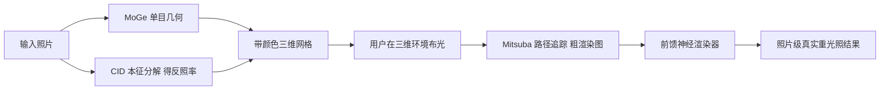

## 一句话总结

本文提出一套面向真实照片的重光照流水线，把计算机图形软件里那种对光源的显式物理控制带到了 in-the-wild 照片编辑上：先用单目几何与本征分解把照片重建成带颜色的三维网格，让用户在三维环境（如 Blender）里自由布置光源并用路径追踪渲出粗略结果，再由一个前馈神经渲染器把这张物理渲染图翻译成照片级真实的重光照图像；训练则通过可微渲染做自监督，任意真实照片都能自己造出训练对。

## 研究背景

- 领域现状：物理渲染引擎（Blender、Unreal 等）能对场景里的环境光、点光、聚光、方向光等各类光源做无约束的显式控制，并用光线追踪精确模拟光与几何的相互作用。但对真实拍摄的照片，计算摄影领域一直没能提供同等自由度的光照控制。
- 核心痛点：真实图像的成像过程中，光照与三维场景的相互作用极其复杂，且缺乏真实世界的成对真值数据。因此已有交互式重光照方法只能退而求其次——用 HDRI 环境图这种简化光照条件、用涂鸦（scribble）间接指定明暗、用第二张图做光照参考，或者用文本描述来控制，都无法像 CG 工具那样直接在三维空间里摆一盏灯。
- 本文 idea：把重光照拆解成"物理渲染 + 神经渲染"的组合。用单目几何估计（MoGe）和彩色本征分解（CID）把照片部分重建为带纹理的三维网格，在渲染引擎里由用户自定义光源并用光追渲出一张近似图；再让前馈神经渲染器负责把这张物理近似图补齐成真实照片外观。关键创新是用可微渲染反解出照片原本的光照，从而把任意真实照片当作输出真值、自动生成对应输入，实现自监督训练，无需昂贵的成对采集。

## 方法

### 整体框架

推理时，给定一张输入照片，先用两个现成的中层视觉估计器提取物理量：MoGe 估计几何（三维点云与相机参数），CID 估计漫反射反照率（albedo）。二者结合三角化成一张带颜色的三维网格——这是与光照无关的场景表示。用户把它加载进 Blender / Mitsuba 之类的三维编辑环境，自由布置环境光与各类光源，用蒙特卡洛路径追踪渲出一张粗略的漫反射近似图。这张 CG 渲染图送入前馈神经渲染器，输出最终照片级真实的重光照结果。

### 关键设计

三维场景重建与本征模型。几何用 MoGe 做单目估计，得到复杂室内外场景都能较准确表示的三维点云；反照率用 CID 做彩色本征分解，其采用本征残差模型 $$I = A \times S + R$$ ，其中 $$A$$ 是漫反射反照率、$$S$$ 是漫反射 RGB 着色、$$R$$ 是包含高光等非漫反射成分的残差层。几何与反照率都是与光照无关的量，因此可以安全地放进渲染引擎重新打光。但这个表示是不完整的：单目视角只能重建相机可见的表面，遮挡区域缺失、遮挡边界附近也难以成面；CID 又只给漫反射反照率，无法赋予镜面或折射材质，所以物理渲染阶段只能渲出漫反射图像。这些缺陷正是留给神经渲染器去补偿的。

自监督训练与可微渲染反解光照。要让神经渲染器学会真实外观，需要真实照片作真值。方法把任意照片 $$I$$ 用同样的 MoGe + CID 流程造出带纹理网格 $$M$$ ，然后通过可微渲染反解出这张照片原本的三维光照。光照环境建模为环境光加一组点光源 $$\Psi = \{E, P\}$$ ，其中 $$E$$ 是一张 $$128 \times 256$$ 的 HDRI 环境图，$$P = \{\vec{p}_i \mid i \in \{1,...,K\}\}$$ 是 $$K$$ 个点光源，每个点光 $$\vec{p}_i \in \mathbb{R}^6$$ 由非负 RGB 强度与三维位置拼成。由于原图含高光会干扰优化，优化目标不用原图而用漫反射图 $$D = A \times S$$ 。优化目标是在有效像素集合 $$\mathcal{V}$$ （排除单目几何造成的空洞）上让物理渲染逼近 $$D$$ ：$$e(D, M, \Psi) = \sum_{i \in \mathcal{V}} \sum_{\{r,g,b\}} (D_i - \mathrm{pbr}(M, \Psi)_i)^2$$ ，再用 Mitsuba 3 可微渲染器加 Adam 求解 $$\Psi^* = \arg\min_\Psi e(D, M, \Psi)$$ ，最终得到近似漫反射渲染图 $$\tilde{D} = \mathrm{pbr}(M, \Psi^*)$$ 作为训练输入。

点光源数目的取舍。整套优化有约 98400 个变量（HDRI 占绝大多数，16 个点光贡献 $$16 \times 6 = 98$$ 个）。得益于光照的线性与叠加性，HDRI 与点光强度几乎不引入非线性；真正让目标函数高度非线性的是点光的三维位置（因为投射阴影等与几何的复杂交互）。因此点光越多越容易陷入局部极小。作者实验发现 $$9 \sim 16$$ 个点光在稳定性与表达力之间最平衡，最终选用 $$4 \times 4$$ 的 16 点光网格。要强调的是，$$\Psi$$ 只是为了尽量重建 $$D$$ 的替身光照，并非对真实光源的精确建模。

神经渲染器。这是最后的前馈网络，负责弥合粗渲染图 $$\tilde{D}$$ 与真实外观之间的域差。输入是把 $$\tilde{D}$$ 、全分辨率反照率 $$A$$ 、以及标记无效像素的二值掩码 $$\mathcal{V}_c$$ 拼成的 7 通道图（提供 $$A$$ 是为了保留原始场景细节，掩码则告诉网络哪些像素是几何空洞需要修补）。网络输出线性 RGB 的重光照结果 $$\tilde{I}$$ ，以原图 $$I$$ 为真值，损失为均方误差加多尺度梯度损失：$$\mathcal{L} = \mathrm{MSE}(I, \tilde{I}) + \sum_m \mathrm{MSE}(\nabla I_m, \nabla \tilde{I}_m)$$ 。架构沿用 MiDaS 的编码器-解码器并换用抗混叠编码器，输出用 ReLU 截断负值。训练数据取自 RAISE、MIT 5k、PPR 10k、LSMI 等公开 raw 照片集（用 raw 是为让网络建模更高动态范围，但这不构成推理时对 raw 输入的要求），并按最小化后的目标函数值剔除重建最差的 15% 训练对（多为阴影来自画面外物体、2.5D 几何无法可靠重建的场景）。

## 实验结果

本文主论文侧重定性与运行时对比，定量结果（用户研究、BigTime 数据集数值实验）放在补充材料，此处无法覆盖。定性上，方法能在各类真实照片中插入车灯、聚光、点光等物理真实的光源，支持全局与局部光照效果，还能做白天转黑夜、夜晚转白天这类极端改光，即便原图本就有复杂夜景光或强烈日光。与代表性方法的概念性对比表明：OutCast 只能建模太阳在天空的特定位置，本文既能复现该设定又能任意布置环境光与局部光；RGB⇔X 因训练缺乏真实数据且着色层被限制在 $$[0,1]$$ 无法表达全动态范围，重光照真实感不足且会改动图像内容；ICLight 常无法去除原图光照；ScribbleLight 的二维涂鸦控制表达力有限且生成式建模会篡改场景内容。本文则忠于原图身份、能自动推断光的副作用（如墙面反光、床脚变暗）。

运行时是本方法相对扩散式方法的核心优势，主论文给出的数值对比如下：

| 阶段 | 本文方法 | 说明 |
| --- | --- | --- |
| 预处理（提取 PBR 量） | 约 2 秒 | 512×512，前馈估计，只需一次 |
| 每次重光照（渲染 + 神经渲染） | 约 0.7 秒 | 512 spp 渲染，预处理后可多次复用 |
| RGB⇔X 再渲染部分 | 约 6 秒 | 512×512，基于 Stable Diffusion 采样，LumiNet 时延相近 |

此外，光照优化本身在单张 NVIDIA A40 上平均约 20 秒每图（仅用于训练阶段造数据）。整体的前馈效率让方法能做交互式编辑并集成进 Blender 等 PBR 框架。

## 亮点与局限

亮点：把 CG 管线才有的显式物理光源控制真正带到了真实照片重光照——用户直接在三维空间摆灯，而非涂鸦或文本这种间接方式；用可微渲染反解光照实现自监督，使任意真实照片都能自造训练对，绕开了成对光照数据难采集的根本瓶颈；把成像过程交给物理渲染后，神经渲染器的任务被简化为"只补物理漫反射渲染与真实外观之间的域差"，配合前馈设计带来数百毫秒级的交互速度；同时兼得计算机视觉方法的 in-the-wild 泛化、图形管线的可控性与神经网络的真实感建模。

局限：单图只能得到 2.5D 单目几何，无法表示遮挡区与画面外几何，把光源放在极端位置（如场景背后）时，光会从缺失几何处漏入，产生不真实的投射阴影；物理渲染只用漫反射反照率、靠神经渲染器补非漫反射效果，对人像这类需要复杂皮肤/头发材质与高精度人脸重建的场景效果不佳，需专门的材质模型与几何估计器才能扩展。

## 延伸思考

这篇工作展示了"物理渲染打底 + 神经渲染补真实感"这种解耦范式的价值：把最难学的光照-几何交互交给可解释、可控的物理引擎，神经网络只负责跨越渲染图到真实照片的域差，既保住了物理可控性，又不牺牲照片真实感。这与那些端到端扩散重光照形成鲜明对比——后者控制力弱、易篡改内容、速度慢，而本文以显式三维布光换来了更强的可控性与身份保持。

自监督"反解光照造训练对"的思路也很通用：只要有可微前向物理过程，就能用真实数据自己造出输入-输出对，避免昂贵的成对采集。这种设计的上限受制于前置的单目几何与本征分解质量，误差会向下游传导；随着 in-the-wild 几何估计与可微渲染器（如 Mitsuba 3）持续进步，把图形学与视觉方法融进计算摄影管线的空间还很大。一个自然的追问是：若引入更完整的三维补全与可估计的非漫反射材质（BRDF/SVBRDF），能否把人像等高难场景也纳入同一自监督框架。
