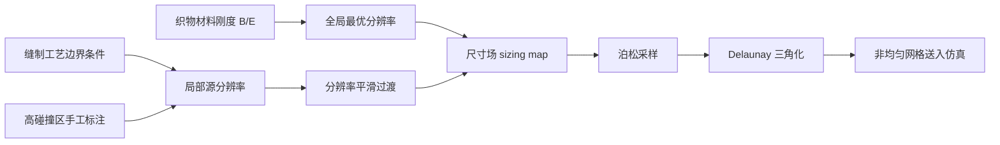

## 一句话总结

本文提出一种无需任何预仿真的、受实验物理启发的方法：根据织物材料刚度与边界条件预测布料可能出现的最小褶皱波长，从而一次性估计出布料仿真所需的最优（非均匀、各向异性）网格分辨率，在保证褶皱细节的同时大幅降低计算与内存开销。

## 研究背景

- 领域现状：物理布料仿真在效率与质量上都取得长足进步，可支持更高分辨率、更多顶点，但"到底该用多高的网格分辨率"这一根本问题长期被忽视。
- 核心痛点：分辨率过低会漏掉细褶皱、产生锁死（locking）伪影；过高则浪费算力与内存。理想做法是在褶皱密集处局部加密，但褶皱分布随空间、时间和方向各向异性地变化。已有的两条路各有短板：先跑满分辨率再简化只省内存不省算力；从低分辨率起步再动态重网格（remeshing）依赖低分辨率下并不准确的褶皱作细化判据，且局部串行的网格操作难以在 GPU 上并行。
- 本文 idea：把"最优分辨率"问题重构为"仿真中可能出现的最小褶皱波长是多少"。借助 Cerda 与 Mahadevan 的褶皱波长标度律和 Vandeparre 等的褶皱过渡理论，从材料刚度和边界条件（缝制工艺、动态碰撞）出发直接算出各处所需分辨率，生成连续的尺寸场（sizing map），再用采样与三角化造网格。

## 方法

整体框架：布料的最优分辨率被定义为"再加密也几乎没有精度收益"的临界分辨率，它正比于特征褶皱波长 $$r_{opt} \approx c\lambda$$ 。方法先由材料刚度算出各织物片的全局最优分辨率，再对缝制工艺引入的静态边界条件和可预期的动态碰撞区算出局部源分辨率，用过渡理论把不同分辨率平滑衔接成尺寸场，最后经泊松采样与 Delaunay 三角化生成非均匀网格送入仿真。

关键设计：

1. 由材料刚度估计全局分辨率。Cerda 与 Mahadevan 的标度律给出薄片褶皱波长 $$\lambda \sim (B/K)^{1/4}$$ 、幅值 $$A \sim \lambda\sqrt{\delta}$$ ，其中 $$B$$ 为弯曲刚度、$$K$$ 为等效弹性基底刚度、$$\delta$$ 为压缩应变。作者用勾股关系得到最优分辨率 $$r_{opt} = \sqrt{\lambda^2/16 + A^2}$$ 。织物本无显式基底，但作者观察到近似不可压织物在垂直拉伸方向的抗压行为等效于一个"虚拟弹性基底"，从而可套用不可压材料的几何函数 $$f(\lambda/l_p) \sim \lambda^2/l_p^2$$ 。把它代入标度律并吸收各几何常数后，得到只含两个待定参数的简洁关系 $$c_1 r^6 + c_2 r^4 = y$$ ，其中 $$y = B/E$$ 是弯曲–拉伸刚度比。用系统设定的分辨率与刚度极值（$$E \in [2e3, 2e6]$$ N/m²，$$B \in [1e{-9}, 1e{-3}]$$ N·m，$$r \in [2.5, 50]$$ mm）标定出 $$c_1 = 32.08\,m^{-3}$$ 、$$c_2 = -1.876e{-4}\,m^{-1}$$ 。结论符合直觉：厚而硬的织物用粗网格，薄而软的织物用细网格。

2. 各向异性支持。正交异性（orthotropic）织物在经向、纬向刚度不同，若统一取小分辨率会造成网格过密。作者对每个各向异性方向分别估计分辨率——例如纬向细、经向粗，效果接近整体细分辨率，却显著优于整体粗分辨率。

3. 边界条件与分辨率过渡。缝制工艺（抽褶 shirring、翻折 folding、缝合 stitching、充绒 down-filling）会在局部制造静态褶皱，需要更细网格。作者基于 Vandeparre 等的"褶皱子"（wrinklon）理论，用波长从 $$\lambda$$ 增长到 $$2\lambda$$ 的过渡距离 $$L_w$$ 推出过渡幂律 $$m = \log r / \log L_w$$ 。某顶点到某源分辨率 $$r_i$$ 的距离为 $$x_i$$ 时其分辨率取 $$r_i + x_i^{m_i}$$ ，多个源共同作用时取最小值 $$r_v = \min(r_f, r_0 + x_0^{m_0}, \dots)$$ 。每种工艺再定制规则：抽褶用附加刚度 $$E_{sh}$$ 与收缩比 $$\rho_{sh}$$ 修正 $$y_{sh} = B/(E+E_{sh})$$ ；翻折在折边两侧加平行细线并按折角 $$\rho_{fd} = \Delta\theta/360$$ 定源分辨率；缝合把长短边差 $$\rho_s = l_s/l_l$$ 当压缩比处理；充绒把内压 $$p$$ 并入过渡幂 $$m' = 2pm$$ ，压力越大褶皱消散越快。

4. 高碰撞区与尺寸场生成。预估分辨率天然无法预测动态碰撞褶皱，但作者发现大多数身体–衣物、多层交互褶皱都能被较好覆盖；对肘部等可预期的极端碰撞区则手工标注、按预估压缩应变赋予专门分辨率（并指出自动检测高碰撞区是未来方向）。所有信息汇成连续尺寸场后，先用快速泊松盘采样布点、再用 Triangle 库做 Delaunay 三角化生成布料网格。

## 实验结果

作者在配备 i9-12900K 与 RTX 3090 的机器上，用牛顿法隐式积分（1/30 s 步长、块对角预处理 CG）测试了五件复杂服装。相较统一 2.5 mm 细分辨率的满仿真，本方法在数值求解上取得约 2–10 倍加速、碰撞处理上约 2–4 倍加速，同时显著降低顶点数并保持可比的视觉精度（Wine Style 一例满仿真采用 5 mm）。

| 服装 | 本方法分辨率(mm) | 本方法顶点 | 满仿真顶点 | 本方法 求解+碰撞(ms) | 满仿真 求解+碰撞(ms) |
|------|------|------|------|------|------|
| Wine Style | 7.83 | 59K | 135K | 3.8 + 0.8 | 8.6 + 1.7 |
| Pinkish Puff | 6.69 | 322K | 1.38M | 17.4 + 3.8 | 97.5 + 12.9 |
| Mint Melody | 8.58 | 60K | 400K | 4.8 + 1.2 | 26.9 + 4.2 |
| Golden Grace | 9.21 | 83K | 586K | 5.1 + 1.3 | 39.4 + 5.4 |
| Blue Ballet | 9.55 | 82K | 876K | 4.9 + 1.6 | 60.8 + 7.4 |

验证与对比方面：拉伸测试中把布料沿长边拉伸 12.78%，本方法算出的 3.8 mm 网格产生 6 条褶皱，接近 2.5 mm 细网格的 7 条，而 5 mm 粗网格只有 4 条；悬帘测试中本方法算出的过渡距离 $$L_{ours} = 26.7$$ mm 与实测 $$L_{mes} = 25$$ mm 高度吻合，且随弯曲刚度变化整条曲线都贴合实测。悬臂测试里精度在约 6.5 mm 处趋稳，本方法估计的 6.45 mm 恰好落在精度与效率的平衡点。与动态重网格相比，本方法给出连续、稳定、无振荡的褶皱，且避免了每次重网格 1–2 秒的重配置开销与不友好的 GPU 行为。

## 亮点与局限

- 亮点：
  - 把"该用多高分辨率"这一被忽视的根本问题，转化为可用实验标度律直接求解的褶皱波长问题，无需任何预仿真或运行时重网格。
  - 一个简洁的六次–四次方程 $$c_1 r^6 + c_2 r^4 = y$$ 把材料刚度直接映射到最优分辨率，且支持各向异性方向分别估计。
  - 系统覆盖抽褶、翻折、缝合、充绒等真实缝制工艺，并用过渡理论保证不同分辨率间平滑衔接，量化验证（褶皱数、过渡距离）与实测吻合良好。
  - 相比满分辨率与动态重网格，兼顾质量与效率，且天然适配 GPU。

- 局限：
  - 预计算分辨率缺乏对突发形变的实时自适应，静态过渡区难以刻画剧烈的布料行为突变。
  - 对流动织物等不可预测交互、以及黏弹性等复杂材料属性支持不足。
  - 高碰撞区目前需手工标注，尚不能自动识别其位置与特征压缩应变。

## 延伸思考

- 作者提出的未来方向是训练神经网络自动检测高碰撞区及其压缩应变，这可与本仓库中基于 GNN 的自适应网格离散化工作相互印证——用学习方法补上"动态、不可预测"这一预计算方法的盲区。
- 该工作把实验软物质物理（褶皱标度律、褶皱子过渡理论）与几何离散化桥接起来，思路可迁移到其他薄壳/薄膜仿真的分辨率决策上，例如纸张、金属箔或生物膜。
- 生成的最优初始网格也可作为动态重网格方法的起点，把"一次性预估"与"运行时精细化"结合成混合方案，可能同时获得两者的稳定性与适应性。
