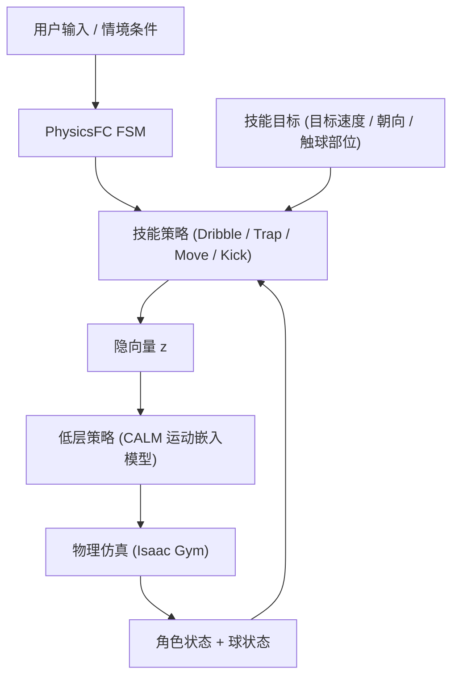

## 一句话总结

本文提出 PhysicsFC，一套用于控制物理仿真足球运动员角色的分层强化学习框架，让用户能实时操控角色完成盘带、停球、移动、踢球等多种足球技能，并在这些技能之间流畅、敏捷地切换。

## 研究背景

在真实足球中，球员用除手臂外的各种身体部位处理球：一边移动一边控球（盘带）、恰当触球以接住来球（停球）、以期望的方向和力度把球踢出（踢球）。这些动作都涉及与球的物理交互，对未经训练的人已属不易，对物理仿真角色更是难上加难。

正因如此，在 EA Sports FC、eFootball 等主流足球游戏里，球虽由物理仿真驱动，球员角色的动作却大多依赖运动学动画（kinematic animation），于是出现脚部滑动、动作突兀等瑕疵。如果由用户操控的物理仿真角色能像真实球员那样灵巧地处理球，游戏真实感将大幅提升。

作者指出这个问题的四重难点：

- 角色不仅要按用户指令移动，还要恰当触球，让球按用户意图运动。
- 角色要掌握多种目的各异的控球技能：盘带时把球贴住脚快速变向；停球时稳住从各方向、各速度滚来或吊来的球，不让其弹开；踢球时把球送往目标方向与力度；此外还要能在无球状态下朝各方向、各朝向快速移动。
- 技能之间要平滑且迅速地切换。若停球后不能立即转入盘带，真实比赛中球会立刻被对手断掉。
- 每个技能与切换既要可由用户控制，又要能根据情境自动触发。

以往工作要么只聚焦单一足球技能（如 DeepLoco、Hong 等的盘带射门、Liu 等的团队配合），要么控球不够贴脚、动作不够自然。PhysicsFC 的目标是把多种可控技能、平滑切换、以及统一的运行时控制系统整合起来，还引入了此前较少研究的"停球"技能。

## 方法

### 整体框架

PhysicsFC 采用分层结构。底层是一个基于物理的运动嵌入模型（motion embedding model），本文直接采用 CALM，它先用足球动作捕捉数据独立训练出一个低层策略（low-level policy）以及一个隐空间。低层策略接收隐向量 $$z$$ 与角色当前状态，输出低层动作驱动物理仿真，使角色再现与 $$z$$ 对应、且符合数据集风格的运动。

上层是四个各自独立的技能策略：Dribble（盘带）、Trap（停球）、Move（移动）、Kick（踢球）。每个技能策略以角色状态、球状态及该技能的目标为输入，输出隐向量 $$z$$ 送入共享的低层策略。注意：球只在上层技能策略训练时参与仿真，低层策略训练时并不涉及球。

运行时由一个有限状态机 PhysicsFC FSM 把四个技能策略作为状态串起来，根据用户输入和情境条件在状态间切换。

### 关键设计一：技能切换式状态初始化（STI）

这是实现"敏捷切换"的核心。足球比赛中球员常需停球后立即盘带、盘带中突然起脚。为此每个技能策略训练时采用 Skill Transition-Based State Initialization（STI）：先用已训练好的"前驱技能"策略跑大量仿真，把 FSM 定义的切换时刻附近的角色与球状态存进各技能专属的 STI 缓冲区；训练某技能时，从其前驱技能的 STI 缓冲区随机采样作为回合初始状态。

与以往只利用前驱策略"终止状态"的做法（skill chaining）不同，STI 捕捉技能执行过程中的中间切换点，更契合交互式足球中切换需随动态、不可预测的用户输入而流畅发生的需求。

各缓冲区的采样时机因技能而异：Dribble 在每个 RL 步都存（因为随时可能收到踢球指令）；Trap 只在球与角色碰撞时存（此刻正是转入 Dribble 的时机）；Move 不参与 STI，因为转入 Move 后不需要持续控球。STI 缓冲区各收集 5 万个状态。由于没有任何技能依赖 Kick 的仿真状态，因此不建 Kick STI 缓冲区。训练顺序据此自然确定：Move → Trap（用 Move 缓冲区）→ Dribble（用 Move 与 Trap 缓冲区）→ Kick（用 Move 与 Dribble 缓冲区）。

### 关键设计二：Dribble 奖励

Dribble 策略以目标盘带速度 $$\hat{v}^{drib}_t \in \mathbb{R}^2$$（速度大小从 $$[0, 7\ \text{m/s}]$$、方向从 $$[0, 360°]$$ 均匀采样）为目标，奖励为：

$$r^{drib}_t = 0.6\, r^{ball\_vel}_t + 0.2\, r^{ball\_root\_pos}_t + 0.2\, r^{root\_vel}_t$$

- $$r^{ball\_vel}_t$$ 鼓励球的水平速度匹配目标盘带速度（方向与速度）。
- $$r^{ball\_root\_pos}_t$$ 鼓励角色贴球。由于盘带时双脚反复前后移动，直接用脚的位置算奖励难以学习，作者改用"最小化角色根节点（骨盆）与球的水平距离"这一简单而有效的替代，间接实现贴脚控球。
- $$r^{root\_vel}_t$$ 引导角色根节点以目标速度朝球的当前水平位置移动。

其中 $$r^{ball\_vel}_t$$ 与 $$r^{root\_vel}_t$$ 均按目标速度归一化（Normalization by Target Speed, NTS），保证不同目标速度下奖励信号一致、训练稳定。此外还有一个重要设计：当球与角色根节点的水平距离超过 3 m 时提前终止回合（early termination），实验证明这对成功训练 Dribble 至关重要。

### 关键设计三：Trap 两阶段奖励与抛体初始化

Trap 策略以一个 one-hot 向量（指定触球身体部位）为目标，奖励分碰撞前后两阶段（$$t_c$$ 为球首次与角色碰撞时刻）：

$$r^{trap}_t = \begin{cases} r^{before}_t = \exp\left(-10\, \lVert x^{ball(3)}_t - x^{body}_t \rVert^2\right), & t \le t_c \\ r^{after}_t = \exp\left(-10\, \lVert v^{ball(3)}_t - v^{root(3)}_t \rVert^2\right), & \text{否则} \end{cases}$$

碰撞前奖励 $$r^{before}_t$$ 鼓励指定身体部位靠近球；碰撞后奖励 $$r^{after}_t$$ 通过让球相对角色根节点的速度趋近于 0 来吸收球的动量，实现稳定接球（仅在碰撞后 1/6 秒的极短窗口内评估）。

配套的抛体动力学初始化（projectile dynamics-based initialization）解决"球必须落在角色可达范围内"的问题：对吊传（lob pass），先随机指定落点 $$p_f$$（在角色前进方向 ±45° 的半径 1 m 半圆内），再由随机初速 $$v_0 \in [10, 30\ \text{m/s}]$$ 与竖直发射角 $$\phi \in [10, 45°]$$ 反解出初始位置 $$p_0$$，保证球恰好落在 $$p_f$$；对地传（ground pass），球可能多次触地，故初速、初位、竖直角 $$\phi \in [0, 10°]$$ 均随机采样。为避免手球犯规，一旦球触及手、前臂或上臂即终止回合。Trap 训练分两阶段：先只用吊传，再以 80% 吊传 + 20% 地传混合。

### 关键设计四：数据嵌入的目标条件隐引导（DEGCL）

Move 策略负责无球时的所有移动（前后、侧向、各种朝向），目标为目标移动速度 $$\hat{v}^{move}_t$$ 与目标朝向 $$\hat{d}^{face}_t$$。问题在于：若只用任务奖励（当前速度/朝向与目标之差）训练，策略可能不动用数据集里的侧走、后退等多样动作也能达标，导致目标达成但动作不自然。

DEGCL 的做法是利用运动数据中"目标—动作"的对应关系来引导策略的隐输出：

- DEGCL 缓冲区：从训练集中挑选的运动片段中，把（参考目标，参考隐向量）成对存入缓冲区 $$D$$。参考目标是该片段角色根节点的平均水平移动速度与朝向；参考隐向量 $$\bar{z}$$ 由 CALM 的编码器把该片段映射得到。
- DEGCL 回合：占比 $$p$$（本文取 0.8）的训练回合从 $$D$$ 取参考目标作为输入，奖励为任务奖励加隐相似奖励；其余为一般回合，只用任务奖励、目标随机采样。

隐相似奖励用余弦相似度（因 CALM 的运动嵌入投影到 $$l_2$$ 单位超球面）：

$$r^{lt\_sim}_t = \bar{z}_t \cdot z_t$$

Move 总奖励为：

$$r^{move}_t = \begin{cases} 0.5\, r^{mv\_task}_t + 0.5\, r^{lt\_sim}_t, & \text{DEGCL 回合} \\ r^{mv\_task}_t, & \text{否则} \end{cases}$$

同时保留一般回合是因为数据集的动作不足以覆盖全部目标输入；一般回合让策略学会达成参考目标之间的"中间"目标。DEGCL 相较 CALM 的 precision training 更进一步：不只是"用某个动作达成多样目标"，而是利用数据里"哪种动作用于达成哪种目标"的信息，让策略学会针对情境选用恰当动作（前进用普通走、侧移用侧走）。DEGCL 缓冲区由 90 个训练片段中选出的 16 个（前/后/侧/斜向的走、慢跑、跑及其镜像版）构建。

### 关键设计五：Kick 与 FSM 切换条件

Kick 策略以三维目标踢球速度 $$\hat{v}^{kick}_t \in \mathbb{R}^3$$ 为目标（水平方向 $$[-45°, 45°]$$、竖直方向 $$[0, 45°]$$、速度 $$[5, 35\ \text{m/s}]$$），奖励仅在碰撞后 1/3 秒评估，让踢出球的初速匹配目标：

$$r^{kick}_t = \exp\left(-\left(\frac{\lVert \hat{v}^{kick}_t - v^{ball(3)}_t \rVert}{\lVert \hat{v}^{kick}_t \rVert + \epsilon}\right)^2\right)$$

Kick 训练时 70% 回合从 Dribble STI 缓冲区初始化、30% 从静止或缓动状态初始化，以兼顾原地起脚。此外作者发现足球鞋形状的脚部碰撞网格（自动转成凸包）比常用的盒状脚显著改善盘带变向与踢球精度。

PhysicsFC FSM 的切换条件融合用户输入与情境：Move→Trap（用户下停球令且球在接近）、Move→Dribble（球在 2 m 内且正靠近）、Dribble→Kick（用户下踢球令）、Dribble→Move（球超出 2 m）、Trap→Dribble（球与角色碰撞）、Trap→Move（用户取消停球或球远离）、Kick→Move（球碰撞或超出 2 m）、Kick→Dribble（用户取消踢球）。

### 训练环境

低层策略与技能策略均用 PPO 在单张 NVIDIA A6000 上训练。低层策略用 2048 个环境训练 30 天、共 50 亿样本；Move 用 4096 环境 44 小时、60 亿样本；Trap 24 小时、32 亿样本；Dribble 40 小时、60 亿样本；Kick 30 小时、55 亿样本。运动数据集约 3 分钟、90 个片段的商业足球动捕数据。仿真引擎为 Isaac Gym，仿真频率 60 Hz、策略执行 30 Hz；球直径 22 cm、质量 450 g、恢复系数 0.8。角色以 10% 概率从随机跌倒状态初始化以学会摔倒恢复。

## 实验结果

### 各技能策略评估

Dribble（1004 次随机目标，间隔 5 秒重置；指标：角色-球距离 CBD、脚-球距离 FBD、盘带目标达成率 DGAR）：

| 模型 | CBD(m)↓ | FBD(m)↓ | DGAR(%)↑ |
| --- | --- | --- | --- |
| w/o $$r^{ball\_vel}_t$$ | 1.05 | 0.86 | 5.9 |
| w/o $$r^{ball\_root\_pos}_t$$ | 0.86 | 0.75 | 75.4 |
| w/o $$r^{root\_vel}_t$$ | 0.91 | 0.81 | 73.5 |
| w/o DistanceET | 9.06 | 8.72 | 2.0 |
| w/ BoxFoot | 1.05 | 0.87 | 21.6 |
| w/o NTS | 0.90 | 0.75 | 71.7 |
| Ours | 0.77 | 0.60 | 90.3 |

去掉任一奖励项都全面变差；去掉 $$r^{ball\_vel}_t$$ 几乎无法达成目标速度；去掉距离提前终止（DistanceET）最惨，根本学不会盘带；盒状脚学会了盘带却难以变向。Ours 距离最短、达成率最高。按目标速度的第二组实验显示，实际速度在 5 m/s 以内能很好匹配目标，6 m/s 起开始落后，FBD 与 CBD 随目标速度增大而增大——与"高速盘带更难"的直觉一致。

Trap（1000 次吊传；指标：停球成功率 TSR、成功中手球比例 HRTS、停球后相对球速 RBSPT）：

| 模型 | TSR(%)↑ | HRTS(%)↓ | RBSPT(m/s)↓ |
| --- | --- | --- | --- |
| w/o $$r^{before}_t$$ | 28.6 | 5.1 | 4.75 |
| w/o $$r^{after}_t$$ | 74.2 | 9.3 | 4.43 |
| w/o ProjectileInit | 21.1 | 5.2 | 5.22 |
| w/o HandArmET | 77.1 | 20.7 | 3.94 |
| Ours | 78.3 | 5.6 | 3.69 |

去掉抛体初始化（ProjectileInit）成功率最低、接触后球速最大，证明抛体初始化对学会停球至关重要；去掉手臂提前终止（HandArmET）手球率显著飙高。Ours 成功率最高、接触后弹球最小、手球率最低。

Move（1004 次随机目标；指标：移动目标达成率 MGAR、目标匹配隐相似度 GMLS）：

| 模型 | MGAR(%)↑ | GMLS↑ |
| --- | --- | --- |
| w/o DEGCL | 88.6 | 0.52 |
| w/o $$r^{dir}_t$$ | 41.5 | 0.63 |
| w/o $$r^{vel}_t$$ | 8.2 | 0.60 |
| w/o NTS | 82.8 | 0.59 |
| Ours | 87.9 | 0.62 |

去掉任务奖励项，达成率大幅下降。去掉 DEGCL 的模型达成率略高（因为不受隐相似奖励拘束、专注任务），但常以偏离数据集的不自然动作达成目标，GMLS 最低（0.52）。作者指出 GMLS 在动作严重偏离时约 0.4、非常接近时约 0.75，故 0.1 的差距已很显著。Ours 以略低的 MGAR 换取最高的 GMLS，即更自然的动作。

Kick（1000 次随机目标踢球；指标：踢球成功率 KSR、方向偏差 KDD、速度偏差 KSD）：

| 模型 | KSR(%)↑ | KDD(°)↓ | KSD(m/s)↓ |
| --- | --- | --- | --- |
| w/o NTS | 0.0 | - | - |
| w/ BoxFoot | 99.7 | 6.62 | 6.35 |
| Ours | 99.9 | 4.79 | 4.51 |

NTS 对 Kick 起决定性作用：去掉 NTS 的模型 1000 次一次都没碰到球（可能因 Kick 的目标速度范围 $$[5, 35]$$ m/s 远宽于 Move/Dribble 的 $$[0, 7]$$，难以调出全程有效的奖励导数）。Ours 相对盒状脚偏差更小。

### 技能切换评估（STI 的作用）

对四类关键切换各做 1000 次随机切换，对比用 STI（Ours）与不用 STI：

| 切换 | 指标 | Ours | w/o STI |
| --- | --- | --- | --- |
| Trap→Dribble | TADG(s)↓ / DGAR30(%)↑ | 2.71 / 94.0 | 3.54 / 92.2 |
| Move→Dribble | TADG(s)↓ / DGAR30(%)↑ | 1.51 / 88.7 | 2.80 / 88.6 |
| Move→Trap | TSR(%)↑ / RBSPT(m/s)↓ | 74.1 / 4.85 | 55.1 / 5.12 |
| Dribble→Kick | KSR(%)↑ / TTK(s)↓ / KDD(°)↓ / KSD(m/s)↓ | 100 / 2.99 / 16.9 / 5.81 | 16.95 / 3.35 / 37.41 / 7.21 |

STI 让 Trap→Dribble 与 Move→Dribble 的达成速度分别快约 77% 与 54%；Move→Trap 成功率高约 19%。最戏剧性的是 Dribble→Kick：Ours 1000 次全部成功踢中，而 w/o STI 仅约 17% 成功（它训练时从未遇到盘带中踢球的情形），且成功者的方向偏差最多达 Ours 的 2.2 倍。

### 交互演示

作者展示了单人控制、give-and-go 传跑配合、竞争性停球盘带，以及 22 个 PhysicsFC 智能体同场的 11v11 全场比赛（4-3-1-2 阵型随球动态调整、可实时切换操控球员），验证了系统的可控性、鲁棒性（摔倒可恢复）与可扩展性。

## 亮点与局限

亮点：

- 首个把盘带、停球、移动、踢球四种可用户控制的足球技能整合进统一物理仿真框架、并支持流畅切换的方法，尤其引入了此前少有人做的"停球"技能。
- 针对每个技能量身设计奖励与初始化：Dribble 用根节点-球距离替代脚-球距离并加距离提前终止；Trap 用两阶段奖励 + 抛体动力学初始化保证可达接球；Kick 靠 NTS 应对宽速度范围。
- 提出 DEGCL，用数据中"目标—动作"对应引导隐输出，让移动动作既达标又自然。
- 提出 STI，用前驱技能的中间状态初始化回合，显著提升实时、用户驱动下的切换速度与成功率。
- 在 11v11 等复杂多智能体场景中验证了可扩展性。

局限：

- Dribble 与 Kick 策略几乎只用单脚触球（如惯用左脚），源于训练早期偏好；用双脚或允许指定用脚可提升真实感与多样性。
- 物理仿真未建模马格努斯效应（Magnus effect），无法准确刻画高速或旋转球的弧线轨迹。
- 摔倒恢复沿用 ASE/CALM 的随机跌倒初始化，常产生关节力矩过大、过渡突兀的起身动作；引入动作数据或肌骨模型可改善。

## 延伸思考

PhysicsFC 最值得借鉴的是把"技能切换"当作一等训练目标来对待：STI 直接把前驱技能执行过程中的真实中间状态灌进后继技能的训练分布，从根上消除了"分开训练的技能在拼接处失灵"的问题。Dribble→Kick 从 17% 到 100% 的跃迁生动说明——分层强化学习里，子策略各自练得好并不等于组合起来能用，切换时的状态分布错配往往才是交互式控制真正的拦路虎。

DEGCL 也提供了一个通用思路：当纯任务奖励存在"作弊捷径"（不动用多样动作也能达标）时，与其手工雕琢更复杂的奖励，不如把数据里蕴含的"目标—动作"先验通过隐空间相似度软性注入。这种"用数据引导策略、而非硬约束动作"的做法，兼顾了目标达成与动作自然，且能泛化到数据未覆盖的中间目标，对其他需要风格化控制的物理角色任务同样有参考价值。剩下的马格努斯效应、双脚控球、更拟人的摔倒恢复等，则指向了物理足球仿真走向真正比赛级真实感的下一步。
