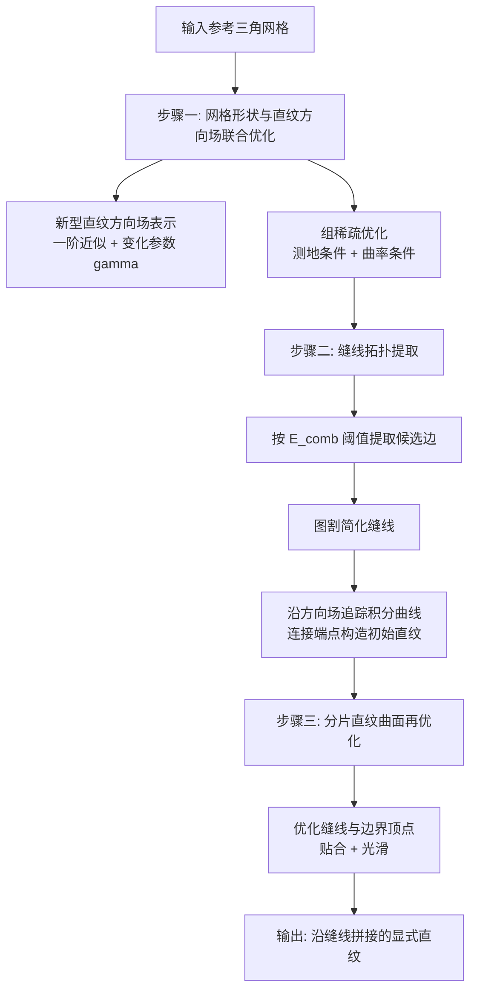

## 一句话总结

给定任意一个自由曲面三角网格，本文提出一套"网格与直纹方向场联合优化 → 缝线拓扑提取 → 直纹再优化"的三段式流程，把它逼近成一张分片直纹曲面（piecewise ruled surface），既能处理正/负高斯曲率区域，又能用尽量少的缝线（seam）保证逼近精度。

## 研究背景

直纹曲面是"一条直线在空间中连续扫掠"得到的曲面，几何形式简单，可以用张紧的绳索、5 轴数控侧铣等方式高效加工，在建筑与工程中应用广泛。它的参数化可以写成两条曲线之间的线性插值：

$$p(u, v) = (1 - v)\,b_1(u) + v\,b_2(u)$$

也可以写成一条基准曲线加上随参数变化的方向：

$$p(u, v) = a(u) + v\,r(u)$$

其中 $r(u)$ 是位于 $a(u)$ 处的直纹方向。

过去大量工作聚焦于**可展曲面**（developable surface）逼近，可展曲面是高斯曲率恒为零的特殊直纹曲面。但用**一般直纹曲面**（允许非正高斯曲率，比可展曲面自由度更多）来做逼近的研究却很有限，且普遍有两个硬限制：

- 只能处理参数曲面表示的目标形状，无法直接作用于三角网格；
- 要求目标曲面处处具有非正高斯曲率（例如依赖渐近方向场初始化的方法在正高斯曲率区域根本没有渐近方向）。

这就把这类方法挡在了大量真实自由曲面之外。此外，复杂形状单一直纹片无法很好逼近，需要引入缝线把相邻的光滑直纹族分开，形成分片结构。缝线对应直纹方向的不连续，从美观和加工角度都希望越少越好；但缝线太少又会因自由度不足而逼近不佳。如何自动确定一个"缝线尽量少、又能贴合目标"的缝线拓扑，是核心难点。

本文方法直接在三角网格上工作，同时支持正、负高斯曲率区域，通用性明显优于以往技术。

## 方法

整体流程分三步。

### 关键设计一：非常值的直纹方向场表示

传统几何处理里方向场是分片常值（每个三角面一个恒定方向）。作者指出这在追踪直纹时误差很大：在一个真实直纹曲面上，用分片常值场追踪出的折线会明显偏离原始直纹。

本文的核心想法是在每个面上构造一个局部 $(u, v)$ 参数化，使得 iso-$u$ 线是逼近直纹的直线段，并引入一个参数 $\gamma$ 描述直纹方向的局部变化。从切平面上投影相邻直纹出发，并对方向做一阶泰勒展开，得到局部近似模型：

$$q(u, v) = p + u\,c + v\,(r_p + u\gamma c)$$

其中 $c$ 是切空间内与直纹方向 $r_p$ 正交的单位向量，$\gamma$ 控制直纹的收敛/发散：$\gamma < 0$ 时直纹在 $v>0$ 一侧收敛，$\gamma>0$ 时在 $v<0$ 一侧收敛，$\gamma=0$ 即平行直纹。

在三角面上，直纹方向 $r_f$ 用两条边向量的线性组合表示（保证与法向正交），面内任意点 $s$ 的（未归一化）直纹方向为：

$$r_f(s) = (1 + \gamma_f x_s)\,r_f + \gamma_f y_s\,c_f$$

其中 $x_s, y_s$ 是 $s$ 在局部坐标系下的坐标。为保证方向处处良定义，要求在三个顶点满足 $1 + \gamma_f x_{v_{f,i}} > 0$，并作为硬约束。这样每个面内的积分曲线仍是直线段，跨面追踪得到的折线能更准确逼近真实直纹。

### 关键设计二：组稀疏联合优化

优化基于两个几何观察：直纹方向在每点是**渐近方向**（法曲率为零），且直纹是曲面上的直线，因而也是**测地线**。据此构造两类能量项：

- **测地条件** $E_{geod}$：要求方向场的积分曲线尽量是离散测地线，即相邻面沿共享边展开后方向段共线；
- **曲率条件** $E_{curv}$：由渐近方向诱导对局部主曲率的约束，用第二基本张量与相邻面法向变化的一致性来度量。渐近方向下主曲率满足 $\kappa_1 = \mu \sin^2\theta$，$\kappa_2 = -\mu \cos^2\theta$。

关键在于：片内的边这两项都应很小，而缝线上的边至少有一项会很大。若简单地对所有边求和最小化，会到处压制大值，反而压不出分片结构。因此作者用**组稀疏**思想，对每条边的组合误差 $E_{comb} = E_{geod} + E_{curv}$ 套一个 Welsch 鲁棒函数：

$$\psi_\nu(x) = 1 - \exp\left(-\frac{x^2}{2\nu^2}\right)$$

Welsch 函数对大误差不敏感（允许缝线上的边保留大误差），对接近零的误差有效惩罚（把片内边压平），从而自然催生出分片直纹形状。参数 $\nu$ 从大值 $\nu_{max}$ 逐步减半到 $\nu_{min}$，$\nu_{min}$ 越小缝线越多、越贴合目标，可用来控制分片复杂度。

总能量还包含：贴合项 $E_{close}$（顶点到目标曲面最近点投影距离）、保证 $\gamma$ 可行性的障碍项 $E_{barr}$、拉普拉斯光滑项 $E_{lap}$、防止三角形退化的边长项 $E_{len}$：

$$E = E_{sparse} + w_1 \sum E_{close} + w_2 \sum E_{barr} + w_3 \sum E_{lap} + w_4 \sum E_{len}$$

用 L-BFGS 求解，自动微分求梯度，线搜索拒绝任何违反障碍约束的步长。

方向场初始化上，作者把 Flöry 等人的"对齐渐近方向"条件推广为"对齐法曲率绝对值最小的切方向"——在非正高斯曲率处等价于渐近方向，在正高斯曲率处退化为最小主曲率方向，从而在全曲面上都有良定义的光滑初始场。

### 关键设计三：缝线提取与直纹再优化

优化后，取 $E_{comb}$ 超过阈值 $\epsilon_{edge}$ 的边作为缝线候选。候选边常有小环、锯齿等复杂拓扑，作者通过识别需简化区域（含两条以上候选边的面、以及围出过小面积的环），构造对偶图并用**图割**在这些区域内生成简单缝线段，连接"分裂顶点"。文中针对单面/多面、不同分裂顶点数目给出了具体构造规则，也允许非闭环的孤立缝线（有利于逼近被负高斯曲率包围的正高斯曲率区域）。

确定缝线后，在片内再优化 $\sum E_{geod}$ 降低积分曲线的测地曲率，然后从采样点沿方向场追踪出稠密积分曲线，端点落在缝线或网格边界上，连接两端得到初始直纹。

最后一步以所有片边界顶点 $\{b_i\}$ 为变量做非线性最小二乘再优化，兼顾贴合与光滑：

$$\min\ E_{disp} + \lambda_3 E_{rul} + \lambda_4 E_{bdr}$$

其中 $E_{disp}$ 惩罚直纹采样点与边界到目标曲面的距离，$E_{rul}$ 惩罚直纹曲面沿垂直直纹方向的离散法曲率，$E_{bdr}$ 惩罚边界折线的离散曲率。用 Powell Dogleg 法求解。输出是沿缝线拼接的显式直纹表示，可按需插值加密。

## 实验结果

方法用 C++ 实现，基于 Eigen、OpenMP、LBFGSpp 与 Ceres，实验在 10 核 Intel Core i9-10900（2.8GHz、32GB）上运行。每个参考曲面归一化到包围盒对角线为单位长度。

由于据作者所知没有直接作用于网格的分片直纹逼近方法，比较对象选了三种近期分片可展逼近方法：Stein 等 2018、Zhao 等 2022、Zhao 等 2023，均用作者开源实现。评价指标为逼近精度（结果到参考的平均距离 $\epsilon_{avg}$、最大距离 $\epsilon_{max}$）与缝线总长度 $L_s$（越短片布局越简单）。

主要结论：

- **逼近精度全面领先**：在对比图中本文方法取得最低的平均误差与最低的最大误差。在含大片负高斯曲率的模型（如 airport 模型顶部）上优势尤其明显——因为可展曲面只能零高斯曲率，而直纹曲面允许非正高斯曲率，逼近负曲率区域更灵活。
- **缝线更简洁**：在几乎所有例子上本文方法缝线总长最短；仅在 Bunny 和 Bob 两例上 Zhao 等 2023 的缝线略短，但其逼近误差明显更高。此外 Zhao 等 2022/2023 虽片布局简单，但片内仍残留高斯曲率较大的区域，说明并非真正可展。
- 从对比数据看，本文结果的 $\epsilon_{avg}$ 多在 0.0013–0.0025 量级、$\epsilon_{max}$ 多在 0.0075–0.014 量级、$L_s$ 多在 9–18 量级；对比方法误差普遍更大且缝线（按高斯曲率集中判定）常常长得多。在更多形状与拓扑的展示中，本文的最大误差不超过参考包围盒对角线的 1.5%，平均误差不超过 0.25%。
- **参数影响**：$\nu_{min}$ 越小 → 片更多、更贴合；$w_1$ 增大 → 误差降但缝线增；$w_2$ 通常取接近零的小值；$w_3$ 增大 → 偏差降但缝线增；$w_4$ 增大 → 误差升但缝线减。这些提供了精度-简洁度的可控权衡。
- **方向场模型消融**：把非常值直纹场替换为分片常值（乃至再加 curl-free 约束）后，逼近误差明显升高，验证了一阶近似方向场表示的价值。
- **初始化消融**：在单叶抛物面、螺旋面及二者拼成的分片直纹曲面上，本文初始化能低误差恢复出真实直纹与缝线；换用 Knöppel 等 2013 的全局光滑场初始化则误差更高且引入多余缝线。
- **效率**：在对比模型上本文方法运行时间快于所有对比方法（计时以分钟计）。

## 亮点与局限

亮点：

- 首个直接在三角网格上做一般分片直纹逼近的方法，不限制目标曲率符号，通用性强。
- 用一阶近似的直纹方向场表示替代分片常值场，显著提升直纹追踪精度并给优化更多自由度。
- 组稀疏 + Welsch 鲁棒范数把"缝线在哪里"这个高度非线性的拓扑问题，转化为可优化催生分片结构的连续能量，并配合图割做缝线简化，兼顾精度与缝线简洁。
- 输出是显式的、沿缝线拼接的直纹表示，直接对接绳索艺术、5 轴侧铣等下游加工。

局限：

- 只考虑几何逼近，未纳入结构稳定性、加工可达性等领域约束。
- 结果可能存在自相交；对只需离散直纹的应用（如绳艺）可接受，否则需借助如 Yu 等 2021 的方法避免自交。
- 分片构造在缝线处总是产生尖锐边。对正高斯曲率区域这是必需的（把正曲率"集中"到片边界），但对非正高斯曲率区域，本可用切平面连续、仅直纹方向不连续的方式得到更光滑外观；如何按局部曲率自适应地施加切连续条件是未来方向。

## 延伸思考

- 组稀疏催生分片结构的思路很有借鉴性：把"离散拓扑决策"编码进一个对大误差不敏感的鲁棒能量，让缝线在优化中自发涌现，而不是显式枚举拓扑。这一范式在网格分割、特征线提取等问题上或可复用。
- 直纹方向场的一阶近似（引入 $\gamma$ 描述方向变化率）本质上是在"分片常值"和"完整曲率信息"之间取了一个恰到好处的中间表示，既保留可追踪的直线段结构，又捕获了局部变化。类似的一阶场表示可能对流线可视化、纤维/编织结构设计有帮助。
- 论文明确把逼近质量与可加工性解耦，后续若能把结构力学、刀具可达、无自交等约束联合进优化，会更接近真正的"可制造分片直纹设计"闭环，这也是建筑几何与数控加工领域值得推进的方向。
