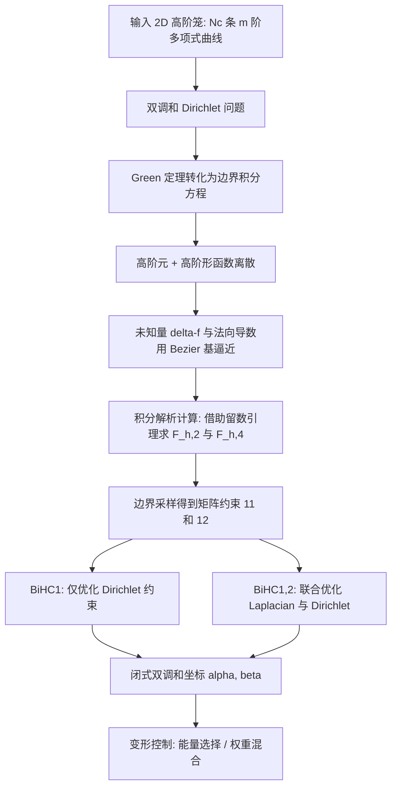

## 一句话总结

本文用高阶边界元方法推导出 2D 高阶笼（由任意阶多项式曲线组成）的闭式双调和坐标，使输入多项式曲线能够被变形为任意阶的多项式曲线，在笼与形状边界的贴合度和形变失真控制之间取得良好平衡。

## 研究背景

2D 笼（cage）是一组包围区域的曲线。用户在笼上指定稀疏的标量或向量值后，笼坐标能够把这些值扩散到区域内部的任意一点，从而驱动形状变形或颜色编辑。已有的笼坐标大致分为两类：

- 插值型坐标：如均值坐标（MVC）及其变体、调和坐标。它们能插值边界，但常出现明显的形变伪影，在非凸形状上表现尤差。
- 非插值型坐标：如格林坐标（Green Coordinates）、Cauchy 坐标、Somigliana 坐标。它们能控制边界值和边界导数（法向），将失真控制在较低水平，但笼与形状边界的贴合较差，增加了编辑难度。

双调和坐标（biharmonic coordinates）作为调和坐标的自然扩展，拥有更丰富的形变空间，既能获得较低的失真，又能保持笼与边界的良好对齐。此前的工作只给出了 2D 多边形笼与 3D 三角形笼的闭式双调和坐标。

另一方面，高阶笼由多项式段组成，天然能够控制沿笼的切向拉伸与曲率，也能更好地逼近输入形状。已有 Cubic MVC、多项式格林坐标（PolyGC）、多项式 Cauchy 坐标以及针对高阶输入笼的 CurvedGC 等工作把坐标推广到曲线笼，但它们要么需要中间直线笼作为过渡，要么牺牲了插值性。**2D 高阶笼的双调和坐标一直是空白**，本文正是要补上这块缺失。

## 方法

核心思路是把双调和坐标的推导从分片线性的边界元推广到高阶边界元：用任意阶 Bézier 曲线离散边界，用高阶形函数逼近未知量，并把涉及的积分解析地算出闭式表达。

### 双调和 Dirichlet 问题

坐标被定义为有界域内双调和 Dirichlet 问题的解：

$$\Delta^2 f(\eta) = 0,\ \eta \in \Omega; \quad f(\xi) = g_1(\xi),\ \frac{\partial f}{\partial n_\xi}(\xi) = g_2(\xi),\ \xi \in \partial\Omega$$

其中 $g_1$、$g_2$ 分别是指定的 Dirichlet 与 Neumann 边界条件。借助 Green 定理与基本解，方程被转化为只含边界积分的形式，未知量仅剩 $\Delta f$ 与其法向导数 $\partial\Delta f/\partial n$。2D 调和与双调和方程的基本解分别为：

$$G_1(\xi,\eta) = -\frac{1}{2\pi}\ln\lVert \xi-\eta \rVert, \quad G_2(\xi,\eta) = -\frac{\lVert \xi-\eta \rVert^2}{8\pi}\big(\ln\lVert \xi-\eta \rVert - 1\big)$$

### 高阶元与高阶形函数

第 $i$ 条边界元是一条 $m$ 阶 Bézier 曲线 $c_i(t)=\sum_{j=0}^{m} c^i_j B^m_j(t)$。边界条件 $g_1$ 取为 $n$ 阶多项式，Neumann 条件 $g_2$ 沿用 Green 坐标的缩放因子 $\sigma$ 乘单位法向的写法，避免出现不希望的 $\lVert g_1'(t)^\perp \rVert$ 项，并引入通常设为 1 的缩放因子 $s_i$。为保证形变连续性要求 $n \ge m$。

未知量用高阶形函数逼近：$\Delta f$ 用 $k$ 阶多项式、$\partial\Delta f/\partial n$ 用 $(k-1)$ 阶多项式，取 $k \ge n$ 以保证仿射变换可复现。

### 积分的解析计算

代入离散后，边界积分方程中出现四类积分 $\phi_{i,j}, \psi_{i,j}, \tilde\phi_{i,j}, \tilde\psi_{i,j}$。其中 $\phi$、$\psi$ 恰好对应已有的多项式格林坐标；本文重点解析计算与双调和基本解相关的 $\tilde\phi$、$\tilde\psi$。这些积分都能写成「多项式 × 对数项」，通过分部积分把问题归约为计算

$$F^{c,\eta}_{h,2} = \int_0^1 \frac{t^h}{\lVert c(t)-\eta \rVert^2}\,dt, \quad F^{c,\eta}_{h,4} = \int_0^1 \frac{t^h}{\lVert c(t)-\eta \rVert^4}\,dt$$

作者借用 CurvedGC 提供的留数（Residue）引理来闭式求解这两个积分，需要解 $\lVert c(t)-\eta \rVert^2 = 0$；当 $c(t)$ 阶数小于 5 时该方程有解析解。导数也遵循相同形式，非平凡项只涉及 $F^{c,\eta}_{h,4}$。

### 求解与两种策略

把边界采样点代入离散方程得到矩阵约束（对应线性系统的 (11) 和 (12)）。求解代数系统有两种做法：

- BiHC1：仅优化 Dirichlet 约束而严格满足 Laplacian 约束。
- BiHC1,2：同时优化 Laplacian 与 Dirichlet 两个约束，自由度更高。

实验发现两者在小形变时结果相当，但在更具挑战性的大形变下 BiHC1,2 明显更优——只变形裤子右侧时，BiHC1 会在左腿区域引入扰动，而 BiHC1,2 保持无扰动。最终坐标写成 $f(\eta) = \alpha(\eta)G_1 + \beta(\eta)G_2$，其中 $\alpha$、$\beta$ 共同构成本文的双调和坐标。

### 变形控制

- 提升精度的三条途径：增加边界元数量、提高阶数 $k$、增加采样点数构成超定系统（最小二乘意义下更平滑）。实践中每条边细分为 4 个元，每元均匀采 $2n$ 个点。
- 变形能量：通过采样点约束离散两种能量——As-Harmonic-As-Possible（AHAP，$\sum_k \lVert \Delta f(q_k) \rVert^2$）与 As-Affine-As-Possible（AAAP，$\sum_k \lVert f'(q_k) \rVert^2$），并强制 $s_i > 0$ 以避免退化与折叠。单位法向、AHAP、AAAP 依次增强内部的共形性。
- 权重混合：把坐标拆成共形分量 $\{\alpha_c,\beta_c\}$（即格林坐标）和把边界拉回笼的双调和分量 $\{\alpha_i,\beta_i\}$，构造新坐标 $\{\alpha_c + w\alpha_i,\ \beta_c + w\beta_i\}$。$w=0$ 时为共形变形，$w=1$ 时完全插值边界，取中间值通常最直观。

## 实验结果

- 任意目标阶数：无论初始笼是线性还是高阶，通过选取不同的 $n$ 可把笼变形到不同阶数。文中把二次输入笼分别变形为二次、三次、四次曲线笼；也能把三次输入笼变形为三次输出。作者指出更高阶会带来更复杂的积分计算与更大的矩阵约束，导致预计算时间增加。
- 与线性笼方法对比：当静止笼为线性时，与 Cubic MVC 和 PolyGC 比较。Cubic MVC 虽同时插值函数值与导数，但继承了 MVC 的伪影，在非凸形状上表现差，且不支持高阶笼；本文坐标继承调和坐标优点，形变失真更小。
- 与高阶笼方法对比：当静止笼为高阶时，与 CurvedGC 及多项式 Cauchy 坐标比较。多项式 Cauchy 坐标需要用户额外指定中间线性笼，且逆映射依赖数值积分、缺少解析表达；CurvedGC 与 PolyGC 用插值性换取共形性。本文坐标提供了共形性与插值性之间灵活折中。在裤子（Pants）等示例中，本文方法相比 CurvedGC 获得了笼与形状边界更好的对齐。
- 高阶笼的直观性：用 10 条三次曲线的曲线笼变形，比用 40 条直线段的多边形笼在相同控制点数下更平滑、更直观。

（原文为期刊论文，主体以定性对比图与推导为主，未给出统一的量化主表。）

## 亮点与局限

亮点：

- 补上了 2D 高阶笼双调和坐标这块空白，给出闭式表达，支持任意阶多项式曲线之间的变形。
- 用高阶 BEM 统一框架，把与双调和基本解相关的积分及其导数都解析地算出，借助留数引理求解关键积分。
- 在笼-边界对齐（插值性）与低失真（共形性）之间提供可调权重 $w$，用户还可用距离函数等更复杂的加权方案分区域控制。
- 直接操作 Bézier 控制点即可完成直观编辑，提供了比多边形笼更丰富的形变自由度。

局限：

- 坐标只在 2D 定义；虽然原理上可推广到 3D，但闭式表达会更难获得。
- 关键积分的解析求解依赖解 $\lVert c(t)-\eta \rVert^2=0$，只有当曲线阶数小于 5 时才有解析解。
- 需要用户手工设定所有变形曲线，缺少让艺术家用极少控制点即可变形的变分框架。
- 更高阶笼带来更重的积分与更大的矩阵，预计算开销随阶数上升。

## 延伸思考

- 3D 推广是最自然也最有价值的方向：3D 模型应用更广，但双调和基本解在 3D 的边界积分闭式化难度更高，可能需要半解析或数值-解析混合方案。
- 「共形 vs 插值」的权重混合思想很通用，若把标量权重换成随空间变化的场（如基于语义分割或距离场），可实现区域感知的编辑，适合交互式创作工具。
- 借助留数引理把带对数核的边界积分闭式化的技巧，可能迁移到其他基于位势理论的坐标（如 Somigliana 坐标）向高阶笼的推广。
- 引入变分框架，让系统从少量控制点自动推断整条高阶变形曲线，将显著降低使用门槛，也能与本文的能量（AHAP/AAAP）自然衔接。
