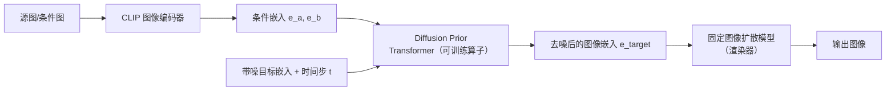

## 一句话总结

pOps 提出在 CLIP 图像嵌入空间中直接训练一族语义"算子"（Diffusion Operator），把并集、纹理、场景、指令、组合等图像操作变成可控、可级联组合的嵌入变换，再用固定的图像扩散模型把结果嵌入"渲染"成图。

## 研究背景

- 领域现状：文本引导的图像生成已很成熟，但纯文本难以精确表达某些视觉概念，业界转而利用 CLIP 图像嵌入空间做更偏视觉的控制（如 IP-Adapter）。人们还观察到 CLIP 图像嵌入空间是语义连续的，在其中做线性运算（如取平均）能得到有语义的结果。
- 核心痛点：这些嵌入空间中的运算含义并不稳定——对两张图的嵌入取平均，得到的语义（组合还是融合）会随输入图片不可预测地变化，用户对"到底执行了什么操作"缺乏控制；而 IP-Adapter 一类方法虽然能以图像嵌入为条件，却是把嵌入原样喂进网络，难以对嵌入本身做定向操作。
- 本文 idea：与其依赖不可控的线性运算，不如显式训练一批"算子"，每个算子对应一种确定的语义操作。所有算子共用同一套架构，只在训练数据与目标上不同；它们作用于嵌入空间，因此可以像 CSG（构造实体几何）那样级联成一棵"生成树"。

## 方法

### 整体框架

pOps 沿用 DALL-E 2 的两阶段范式：先用一个 Diffusion Prior（把某种条件映射为 CLIP 图像嵌入的扩散模型）生成目标图像嵌入，再把该嵌入作为条件送入一个固定的图像扩散模型"渲染"成图。关键洞察是：原本用于"文本嵌入 → 图像嵌入"的 Diffusion Prior，可以被微调去接收新的输入条件（一组图像嵌入或文本嵌入），从而变成一个语义算子。由于只在嵌入空间工作，训练只发生在 Prior 上，作为渲染器的图像扩散模型始终冻结。

### 关键设计

1. **复用 Prior 的 77 个输入槽位承载图像嵌入**。原始 Prior 接收 77 个文本 token，pOps 把要操作的图像嵌入 $$e_a, e_b$$ 放到序列开头、其余位置填零嵌入，后面再接时间步编码与待去噪的带噪图像嵌入。取"带噪嵌入"对应位置的输出作为预测结果。这样同一架构可以灵活容纳不同数量的输入嵌入，也让多图组合（如把多件衣物放进固定槽位）自然可行。二元算子用标准去噪目标训练：$$L_{prior} = \mathbb{E}\left[\,\lVert e_{target} - P_\theta(e^t_{target}, t, e_a, e_b)\rVert_2^2\,\right]$$ ，推理时做 25 步去噪并对丢弃 $$e_a, e_b$$ 做无分类器引导。

2. **用生成式数据合成来定义每个算子的语义**。pOps 不给架构加任务专用模块，而是靠"造数据"让统一模型隐式学会任务。核心直觉是"从场景里拆出物体比把物体拼进场景容易"，于是普遍采用"先合成目标图、再反向分解出输入"的策略：
   - 纹理算子：用 SDXL-Turbo 生成物体图得到 $$e_{object}$$，用深度条件的 Stable Diffusion 依据该物体深度与随机纹理描述生成带新纹理的目标图 $$e_{target}$$，再从目标图里裁一小块作为纹理样例 $$e_{texture}$$。从目标图直接抠纹理保证了"指定这一种纹理"而非文本可能生成的一堆合理纹理。
   - 场景算子：生成物体图作为目标，用背景去除模型抠出物体（放到白底或新背景里得到 $$e_{object}$$），再用 Stable Diffusion inpainting 补出纯背景得到 $$e_{back}$$，训练模型把物体与背景重新组合。
   - 并集算子：先用 SDXL-Turbo 生成含两个物体的图作为目标，再用 OWLv2 grounded 检测把两个物体各自裁出得到 $$e_a, e_b$$，让算子学会把两部分合回一张图。

3. **无成对监督时引入 CLIP 文本损失（Instruct 算子）**。有些任务难以构造成对目标，pOps 利用 CLIP 图文同空间的特性，直接在嵌入空间加文本约束。指令算子输入一个物体图像嵌入 $$e_{object}$$ 和一个形容词的文本嵌入 $$e_{instruct}$$（如 spiky、melting），用生成嵌入与"形容词+类别"文本嵌入（如"a spiky dog"）的 CLIP 相似度作为附加损失：$$L = L_{prior} + \lambda \langle e_{text}, P_\theta(e^t_c, t, e_{object}, e_{instruct})\rangle$$ ，从而无需直接图像监督。

4. **算子级联成生成树**。因为每个算子都作用于同一 CLIP 嵌入空间、且输出仍是嵌入，多个算子可以像 CSG 那样组合：物体先各自生成、单独操作，再逐步合并成一个最终嵌入，最后只把这个嵌入渲染成图。多图组合算子进一步展示了同时考虑全部输入的能力（如把多件衣物合成一套完整穿搭）。

## 实验结果

主实验为指令算子（Instruct Operator）的定量对比，在 52 个物体、65 个形容词上评测，图像相似度用 DreamSim、文本相似度用 CLIP ViT-L/14。pOps 在图像相似度上高于同等条件的 IP-Adapter（scale 0.1），同时保持较高的文本相似度，说明它在"保留原物体"与"体现指令语义"之间取得了更好平衡。

| 方法 | 图像相似度↑ | 文本相似度↑ | BERT 相似度↑ |
|------|------|------|------|
| InstructPix2Pix | 0.455 | 0.237 | 0.424 |
| IP-Adapter (0.5) | 0.826 | 0.211 | 0.544 |
| IP-Adapter (0.1) | 0.584 | 0.219 | 0.531 |
| pOps | 0.6607 | 0.236 | 0.437 |

此外作者做了用户研究：在指令任务上 pOps 被偏好率约 60.31%、平均评分 3.49，均居首；在纹理任务上 pOps 偏好率约 57.14%、平均评分 3.98，同样优于 IP-Adapter、Visual Style Prompting 与 ZeST。定性上，对比"嵌入取平均"的朴素做法，pOps 对不同输入施加的是一致的语义操作，而取平均得到的语义会漂移。作者还验证了渲染器可替换：pOps 的输出嵌入可直接送入 Kandinsky 2 或 IP-Adapter（后者无需任何改动或微调），并能叠加深度 ControlNet 等空间条件；由于 Prior 本身是扩散模型，给定单一输入还能采样出多样且合理的结果。

## 亮点与局限

- 亮点：
  - 把"图像操作"上移到语义嵌入空间，用同一套架构 + 不同数据/目标就能派生多种算子，训练只需微调 Prior、渲染器完全复用。
  - 算子可级联成生成树，契合 CSG 式的组合生成范式，给了用户更细粒度、更可控的生成流程。
  - 用生成模型自动合成成对数据，绕开了任务专用模块；对无成对目标的任务用 CLIP 文本损失补位，思路统一而灵活。
  - 与现有渲染器（Kandinsky、IP-Adapter）解耦，可无缝接入空间控制。

- 局限：
  - 受 CLIP 嵌入空间本身所限，语义嵌入无法保留某些精细视觉外观，直接经 CLIP 空间重建会丢失细节，不及基于优化的个性化方法。
  - CLIP 难以把两组不同视觉属性绑定到两个不同物体上，这在并集算子里最明显——渲染结果可能在两个物体间"串色"，难以各自维持独立外观。

## 延伸思考

- pOps 把"操作"而非"提示"作为生成接口，与 Composable Diffusion、Concept Algebra 等可组合生成工作一脉相承，但把操作发生的场所从文本域/图像域移到了语义嵌入域，这或许是让操作语义更稳定的关键。
- 算子级联成树的范式，天然适合做成节点式创作工具（类似 ComfyUI 的思路，但节点作用在嵌入空间），值得追问的是级联深度增加后误差如何累积、树的中间嵌入是否可复用与缓存。
- CLIP 空间"属性绑定难"的老问题限制了并集/多物体场景，若换用更强或分层的图文表征（或引入更细的空间/实例约束）能否缓解串色，是很自然的后续方向。作者团队后续的 IP-Priors 工作（基于部件的概念组合）可视为这一方向的延伸。
