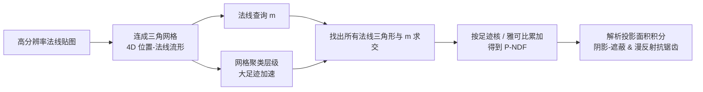

## 一句话总结

把高分辨率法线贴图看作位置-法线空间里的一张二维流形，将闪烁高光所需的法线分布函数（P-NDF）的构造，转化为"网格投影 / 求交"问题，从而得到精确、简单且比现有连续闪烁方法快一个数量级的求值算法，并顺带推出一个解析的阴影-遮蔽（shadow-masking）项。

## 研究背景

- 领域现状：真实世界里划痕、金属漆、金属薄片等细微结构，会在高频光照下产生复杂的"闪烁"（glint）高光。传统带光滑法线分布函数（NDF）的 BRDF 无法重现这种效果。Yan 等人的连续闪烁模型能精确刻画一个像素足迹内的法线分布（称为 P-NDF），但计算昂贵。
- 核心痛点：Yan 2014 把法线贴图当作"位置-法线的狄拉克分布"，再对足迹内的法线分布卷积一个很小的高斯粗糙度。这个卷积没有闭式解，需要用分段多项式做昂贵的数值积分；Yan 2016 改用 4D 高斯混合去逼近法线贴图的图（graph），比数值积分快，但为保留细节混合分量极多、难以化简，尤其在足迹很大时依然很慢。离散闪烁模型虽快却会产生尖刺高光、无法处理连续变化的曲面法线。
- 本文 idea：作者发现只要处理得当，那个"高斯粗糙度卷积"其实可以被绕开——于是可以直接把法线贴图函数的图当成 4D 位置-法线空间里的一张 2D 流形。此时 P-NDF 求值就等价于把这张 4D 流形投影到 2D 法线平面上，用网格表示流形后就变成简单的"点-三角形求交"算法，比数值积分高效得多。

## 方法

整体框架：把相邻法线贴图像素（连同其位置与法线）连成一张三角网格，得到位置-法线空间中的 4D 流形参数化 $$(\mathbf{u}, \mathbf{n}(\mathbf{u}))$$ ；给定微观法线查询 $$\mathbf{m}$$ ，P-NDF 求值就是找出所有把法线投影落到 $$\mathbf{m}$$ 的"法线三角形"，对每个交点累加"足迹核 / 雅可比行列式"的贡献。再用一个网格聚类层级加速大足迹查询，并基于同一套流形公式推导出解析的阴影-遮蔽与投影面积积分。

关键设计：

1. 网格化的流形表示与精确求值。相邻法线像素连成三角网格，法线用重心插值 $$\mathbf{n}(\mathbf{u})$$ 得到连续场，其雅可比行列式恰好是"法线三角形"投影面积的两倍。于是 P-NDF 变成：遍历足迹内每个法线三角形，检查它是否与查询法线 $$\mathbf{m}$$ 相交（用重心坐标判断），相交则把足迹核值除以 $$2\lVert \mathbf{n}(\triangle abc)\rVert$$ 累加。这是对原积分的精确解，只需点-三角形求交，算术上比 Yan 的数值积分简单得多，而且可以换用比高斯更便宜的圆盘 / 方形足迹核进一步提速。

2. 避免雅可比奇异。当三角形的法线面积趋近于零（如镜面反射、三顶点法线相同）时，$$1/\text{det}\,\mathbf{J}$$ 会爆炸，产生尖刺高光——这正是 Yan 当初引入卷积的原因。本文不做卷积，而是把雅可比行列式小于 $$\epsilon = 10^{-6}$$ 的三角形，直接换成雅可比恰为 $$\epsilon$$ 的等边三角形（即把雅可比钳制到一个下限），并相应修改采样，使采样与求值的概率密度保持一致。作者验证这种"钳制"与"卷积"在小固有粗糙度下结果几乎一致。

3. 网格聚类层级加速大足迹。点-三角形求交类似光线求交，可用包围盒层级（min-max 层级）跳过不相交的三角形；但足迹增大时候选三角形太多仍然慢。受 Nanite 与 Lightcuts 启发，作者再建一个聚类层级：把 $$2^l \times 2^l$$ 子网格简化为 $$1\times 1$$ 的两个三角形，用最小二乘（按逆雅可比加权以匹配各三角形对 P-NDF 的贡献）求解代表法线，并用残差 $$e_l$$ 作误差指标。查询时自顶向下遍历，直到残差满足 $$e_l \le r_x r_y \tau$$ 就停在该层用简化法线计算。min-max 与聚类层级都是完美平衡的四叉树，可像 mipmap 一样紧凑存储、像纹理取值一样高效遍历。

4. 解析阴影-遮蔽与漫反射抗锯齿。阴影-遮蔽项依赖投影面积积分 $$P(\boldsymbol{\omega})$$ 。作者把足迹核近似为每三角形分段常数后，将该面积积分化为"法线三角形"与"可见法线半圆 / 半椭圆"的交集区域，其边界由线段与椭圆弧构成；再用斯托克斯定理把面积积分转成边界线积分，得到闭式解。由于镜面反射的投影面积是低频函数，实际可用一个 GGX 投影面积函数拟合近似以提速。同一投影面积公式还能用来聚合法线贴图漫反射 BRDF，得到 $$f_d = P(\boldsymbol{\omega}_i)/(\pi (\boldsymbol{\omega}_i)_z)$$ ，从而在一个像素覆盖大量法线细节时消除锯齿。

## 实验结果

实现基于 Mitsuba 0.6，在 Ryzen 9900X 12 核 CPU 上跑；用三张 1024² 法线贴图（各州 8MB，加速结构各 34MB，一分钟内生成）。主实验为渲染时间对比：分辨率 800×800、256 SPP，比较不同足迹尺度（单位足迹覆盖的纹素数）下的渲染分钟数。下表取 Isotropic 场景，数字为渲染分钟数（越低越好）：

| 方法 | 64² 足迹 | 128² 足迹 | 256² 足迹 |
|------|---------|----------|----------|
| Yan et al. 2014 | 145 | 491 | 1927 |
| Yan et al. 2016 | 2.29 | 8.03 | 30.0 |
| 本文（无聚类） | 0.92 | 2.77 | 7.54 |
| 本文（完整） | 0.37 | 0.72 | 1.20 |

即便不用聚类层级，本文也已比 Yan 2016 快约一倍；完整模型在大足迹（256²）上把渲染时间从半小时以上压到分钟级。相对 Yan 2016 的加速比在小足迹约 6~9 倍、大足迹可达 20~42 倍（Brush 场景 256² 达 41.5 倍）。在等时间渲染下，省下的时间可分配更多样本，从而在相同时间预算内得到噪点更少的图。

其余实验用文字补充：阴影-遮蔽方面，解析解与 GGX 近似在镜面表面上几乎一致（后者更快），而 Yan 等人用固定粗糙度的 Beckmann 遮蔽在掠射角会偏暗；漫反射方面，聚合 BRDF 在大足迹下趋近 Oren-Nayar，但能在 1 SPP 下就几乎无锯齿地保留法线细节。消融实验显示聚类阈值 $$\tau$$ 越大越快但越失真（Scratch 场景 $$\tau=10^{-2}$$ 时 RMSE 升到 0.0818）；换用圆盘 / 方形足迹核可用更小足迹达到相近外观，比高斯快约 2 倍。

## 亮点与局限

- 亮点：
  - 把 P-NDF 求值从"没有闭式解、需数值积分"重构成"精确的网格投影 / 求交"，公式更简单、结果更精确，且比连续闪烁基线快一个数量级。
  - 求值形式类似光线求交，天然可套用包围盒与聚类层级；层级为平衡四叉树，可像 mipmap 一样紧凑存储、高效遍历。
  - 首次为连续闪烁模型给出解析的阴影-遮蔽推导，并把同一投影面积积分迁移到漫反射抗锯齿这一常被忽略的场景。
  - 支持任意足迹核（高斯 / 圆盘 / 方形），可用更便宜的核进一步提速。
- 局限：
  - 均匀聚类网格对"高频但稀疏"的结构（如划痕表面）效率较低，可能需要引入自适应网格简化来优化网格拓扑。
  - 阴影-遮蔽与漫反射模型未考虑微表面多次散射，粗糙表面会有能量损失，本文漫反射也因此比 Oren-Nayar 偏暗。
  - 未考虑波动光学效应。

## 延伸思考

- 把闪烁 NDF 构造转化为网格求交，本质上是把外观预滤波问题"几何化"，与 Nanite 的网格简化、Lightcuts 的聚类思路同源；后续若引入 Garland-Heckbert 式的自适应边折叠简化，或许能同时优化拓扑与误差，缓解划痕这类稀疏高频结构的效率瓶颈。
- 解析投影面积同时服务于镜面阴影-遮蔽与漫反射抗锯齿，说明"精确 P-NDF"一旦拿到，可以派生出多种被以往方法近似掉的物理量，值得思考还能推出哪些解析项（如各向异性遮蔽、能量补偿）。
- 方法目前落在 CPU 路径追踪；由于层级可作为 mipmap 存储、遍历像纹理取值，迁移到 GPU 实时管线是自然的下一步，也便于与神经外观建模（学习 P-NDF 插值）结合。
- 多次散射与波动光学是明确的未来方向，可与流形探索（manifold exploration）类方法结合处理镜面路径上的能量与衍射效应。
