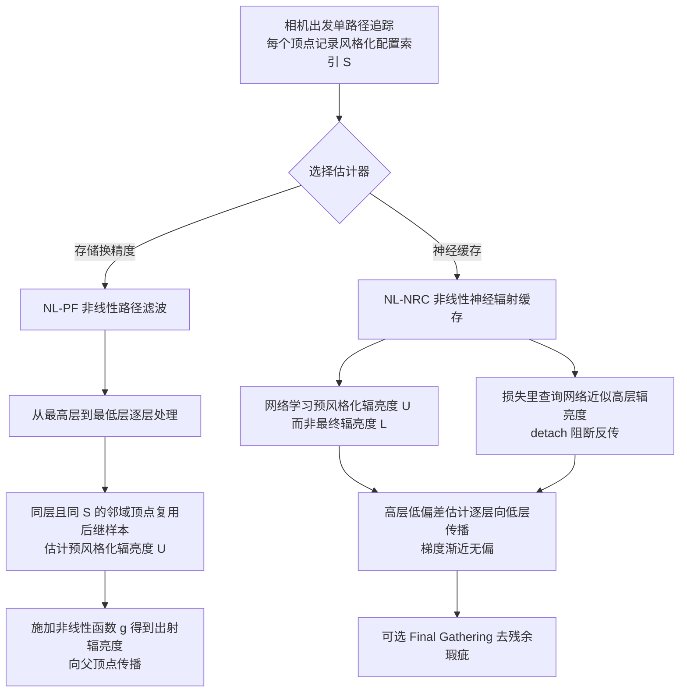

## 一句话总结

针对"每次弹射都施加非线性风格化"的风格化渲染方程，本文提出非线性路径滤波（NL-PF）和非线性神经辐射缓存（NL-NRC）两种可落地的估计器，把原本指数级的采样与存储开销分别降到多项式级和线性级，让多次弹射、递归风格化的场景可以在几分钟内渲染出来。

## 研究背景

- 领域现状：蒙特卡洛渲染之所以高效，是因为渲染方程在每层递归上是线性的，可以把递归积分展开成路径空间上的一系列定积分，每条光路独立采样、边算边累加，得到无偏且存储开销恒定的估计。近年出现的风格化渲染方程（SRE）在每次弹射后对出射辐亮度施加一个任意的非线性函数 $$g_\theta$$ ，从而让非真实感效果和物理光照能够无缝混合。
- 核心痛点：一旦引入非线性，线性展开就不再成立。对含噪的辐亮度估计施加非线性函数会因 Jensen 不等式产生偏差，即 $$g(\mathbb{E}[\langle I_N\rangle]) \neq \mathbb{E}[g(\langle I_N\rangle)]$$ 。要保证收敛，就必须先得到低方差的辐亮度估计再施加非线性。已有做法要么只在首次命中处施加风格化，要么像分支路径追踪（BrPT）那样在每个风格化表面分裂成指数级数量的子路径，导致计算和存储都是指数增长；而 Toon 着色里的阶跃函数这类风格化既不可微也非 Lipschitz 连续，收敛更成问题。
- 本文 idea：把"路径复用"和"辐亮度缓存"这两种在线性问题里成熟的思想扩展到非线性问题。先用 NL-PF 通过跨递归层复用样本，把 BrPT 的指数开销降到多项式；再用 NL-NRC 用一个紧凑神经网络存储辐亮度场，把采样开销进一步降到线性，同时大幅削减存储。其关键洞察是：让网络学习施加非线性函数之前的"预风格化辐亮度"，即便梯度因非线性而有偏，网络仍能收敛到正确解。

## 方法

整体框架上，本文沿着一条"由粗到精"的路线给出两个估计器。NL-PF 从最高递归层往最低层逐层处理，让同层、同风格化配置的相邻顶点互相复用彼此的后继样本来估计预风格化辐亮度，再施加非线性函数向上传播；NL-NRC 则把这套复用思想搬进一个神经网络，用网络缓存预风格化辐亮度，并通过训练时的传播机制得到渐近无偏的梯度。

关键设计如下。

**风格化配置索引 S**：非线性场景里，风格化参数 $$\theta$$ 不仅取决于当前顶点，还取决于整条路径前缀（例如"光线打到蓝镜之后才开始施加风格化"）。因此不能像普通路径滤波那样把所有同层顶点混在一起滤波，否则会把不同风格化状态的路径错误混合，导致本不该被风格化的物体串色。本文给每个顶点附加一个整数索引 S 来标识风格化配置，滤波时只在"同层且同 S"的顶点间进行，从而正确支持依赖递归层级与路径前缀的灵活风格化。

**NL-PF 的复用与实现**：改写后的估计器让每个顶点从邻域 N 内同 S 的邻居借用其后继连接来估计预风格化辐亮度，再施加 $$g_{\theta,S_i}$$ 。朴素实现是 $$O(N^3)$$ 计算、 $$O(N^2)$$ 存储；借鉴路径滤波里的聚类式 CMIS 权重可优化到 $$O(N^2)$$ 计算、 $$O(N)$$ 存储，并复用 BSDF 求值、省略复用顶点间的可见性测试作为近似。为塞进有限显存，实现采用了核外（out-of-core）方式，把非活跃顶点卸载到 CPU 内存。尽管比 BrPT 快，NL-PF 仍然非常吃内存。

**NL-NRC 学习预风格化辐亮度**：模型 $$M_\pi(i, S, x, \omega_o, F)$$ 以查询位置、视线方向、路径深度、风格化索引以及反照率、着色法线、粗糙度等辅助特征为输入。直接让网络学习最终出射辐亮度 $$L_i$$ 会失败——因为只有 $$L_i$$ 的有偏估计，随机梯度下降在有偏梯度下不保证收敛到正确极小值。本文的关键做法是让网络改学预风格化辐亮度 $$U_i$$ ：只要 $$L_{i+1}$$ 无偏， $$U_i$$ 就能被无偏估计。计算损失时查询网络得到 $$L_{i+1}$$ 的近似，并对目标做 detach 不反传，即把非线性风格化从网络编码的数据里解耦出来，仅通过损失函数把二者重新耦合。

**梯度的渐近无偏传播**：训练初期只有最高层 $$D$$ 能凭发射项无偏估计损失；当 $$M_\pi(D,\cdot)$$ 学好 $$U_D$$ 后， $$D-1$$ 层的损失偏差随之下降，从而逐层把低偏差估计向下传播，最终收敛到 $$U_0$$ 。训练低层时把高层输出视作常量，避免低层误差污染更准的高层。实践中发现所有层可同时训练，作者推测这与随机梯度下降在"一致梯度"下也能收敛有关。此外提供了 Final Gathering 步骤：追踪到首个非镜面顶点后补采样并查询缓存，进一步去除直接可视化时的残余瑕疵。

## 实验结果

方法在基于 LuisaCompute 的 Rust 前端渲染框架上实现，测试平台为 Intel i9-13900KF、128GB 内存和 NVIDIA RTX 4070 Ti SUPER（16GB 显存）。NL-NRC 用 tiny-cuda-nn 的全融合 MLP（5 个隐藏层、宽度 128、约 1600 万参数、fp16 下约 32MB），位置用多分辨率哈希网格编码、视线方向用 one-blob 编码。

主实验是两层递归连续风格化场景下 BrPT、NL-PF、NL-NRC 三者随时间的收敛对比（连续风格化才能让 BrPT 在合理时间内跑出低偏差参考），指标为 RelMSE（越低越好）：

| 时间 | BrPT | NL-PF | NL-NRC |
|------|------|-------|--------|
| 1s | 0.00679 | 0.02259 | 0.00483 |
| 4s | 0.00337 | 0.00760 | 0.00173 |
| 16s | 0.00171 | 0.00395 | 0.00068 |
| 78s | 0.00088 | 0.00165 | 0.00021 |
| 收敛 144s | — | — | 0.00016 |

可以看到 NL-NRC 在各时间点都明显优于 BrPT，且凭借恒定的存储开销可以持续改进；NL-PF 前期误差偏高，且在约一分钟后（78s 时显存与内存已达 13328MB+16896MB）迅速耗尽显存而无法继续提升。在 12 次弹射的递归风格化版本里，BrPT 因采样成本剧增收敛更慢，NL-PF 在跑出收敛图像前就耗尽内存，而 NL-NRC 能快速产出近乎无噪的结果，再加一遍 Final Gathering 可进一步提质。

在更具挑战的高弹射次数、离散调色板风格化场景中，BrPT 即使渲染数小时仍有可见偏差与噪点，且根本无法给出可用的参考解，NL-NRC 则以数量级更快的速度产出干净图像。作者也指出 NL-PF 在离散风格化下会因滤波近似引入的偏差被放大而出现可见误差，NL-NRC 则不受此影响。

## 亮点与局限

- 亮点：
  - 把非线性蒙特卡洛渲染的采样/存储开销从指数级系统性地降到多项式级（NL-PF）乃至线性级（NL-NRC），使多次弹射、递归风格化在分钟级可渲染。
  - "学习预风格化辐亮度 + detach 耦合 + 逐层传播"这一设计巧妙绕过了有偏梯度不收敛的难题，且能处理阶跃函数这类既不可微也非 Lipschitz 的任意风格化。
  - 用风格化配置索引优雅地支持依赖路径前缀与递归层级的风格化，避免不同风格化状态的路径被错误混合。
  - NL-NRC 的采样成本与普通非分支路径追踪相同，存储成本恒定（约 32MB），工程可行性强。

- 局限：
  - 依赖两条温和假设：发射面要么不反射、要么其反射辐亮度相对发射可忽略（因常见 NEE 只评估发射项会引入偏差）；且不能有表面的预风格化辐亮度恰好落在 $$g_\theta$$ 的不连续点上。
  - NL-PF 内存开销极大、可扩展性差，在离散风格化下还会放大偏差，实际更依赖 NL-NRC。
  - 在最难的场景里没有可得的准确参考解，因而无法报告误差指标，"参考图"由 NL-NRC 自身高采样 Final Gathering 生成，评估带有一定自证成分。
  - NL-NRC 同时训练所有层能收敛只有经验观察和猜想，缺乏严格的收敛性分析，作者将其留作未来工作。

## 延伸思考

这项工作把神经辐射缓存从线性光传输推广到了任意非线性算子，其"网络学习非线性作用之前的量、再通过损失耦合非线性"的思路，本质上是一种应对有偏梯度的通用训练技巧，具备迁移到其他嵌套非线性蒙特卡洛问题的潜力。作者明确点名了两个方向：非线性平流步骤导致嵌套积分的蒙特卡洛流体求解，以及散射强度依赖光场强度的非线性光学。值得追问的是，当风格化配置数量非常多甚至连续参数化时，单一网络能否在不显著增容的情况下保持精度；以及在真正无参考解的场景里，如何建立更客观的质量评估方法而非以自身高采样结果为参考。对做实时非真实感渲染或神经缓存的研究者而言，这里的预风格化解耦训练范式和风格化索引机制都值得借鉴。
