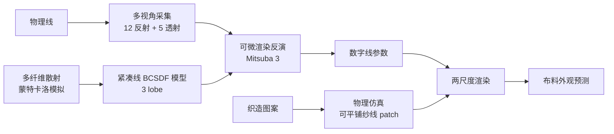

## 一句话总结

从真实物理线（thread/yarn）出发，用"多纤维散射模拟 → 紧凑可微线散射模型 → 低成本多视角拍摄反演 → 织造几何仿真 → 两尺度渲染"的端到端流水线，预测出这些线织成布之后的外观，服务于时尚设计的"所见即可造"。

## 研究背景

时尚设计有一个长期未被满足的需求：设计师想用**打算实际使用的那批线**预览布料成品的外观，确保脑海中的设计能够被物理制造出来。而今天的布料渲染要么依赖手工调参，要么依赖对**已经织好的成品布**做采集，都无法从"线"出发做前向预测。

现有织物外观建模按几何表示大致分三类，各有短板，都不适合"数字化物理线"这个目标：

- **表面模型（surface-based）**：把布当作 2D 薄片用 BRDF/微片（microflake）表示，渲染快但缺乏纱线级细节，无法提供纱线级控制。
- **曲线散射模型（curve-based）**：把纤维/股/纱表示为曲线，细节最真实，最贴合本文目标。但已有模型不合用——纤维级模型需要单根线内部的精细几何，真值难获取且拟合复杂；Zhu et al. 2023b 的聚合纱线模型因含**离散的纤维根数参数**而天然不可微；Montazeri et al. 2020 的模型模式繁多、参数复杂，不利于反演。
- **微观外观模型（体积模型、纤维网格模型）**：versatile 但同样不适合从物理线预测外观。

最接近本文目标的前作是 Sadeghi et al. 2013：它用测角光度计测量单根线的 4D 散射分布。但其采集装置繁琐、对丝这类细线极难对焦，还需手工拟合，且最终渲染是表面模型，丢失纱线级细节。

本文的核心贡献：

- 一个易复现的端到端流水线，能从物理线高效、准确地预测布料外观；
- 一个从多个反射/透射视角采集的多样化线数据集（28 种线、17 个视角）；
- 一个紧凑且可微的线散射模型，基于对线内多纤维散射的蒙特卡洛模拟。

## 方法

整体流水线分四步：采集线 → 线 BCSDF 建模与反演 → 织造几何仿真 → 两尺度渲染。

### 从单纤维散射到线散射模型

单纤维散射用 BCSDF 描述，出射辐亮度是入射辐亮度乘以 BCSDF 在球坐标下的积分：

$$L_r(\omega_r) = \int L_i(\omega_i)\, S(\omega_i,\omega_r)\, \cos\theta_i\, \mathrm{d}\omega_i$$

多数模型把 BCSDF 写成若干反射/透射模式之和，每个模式分解为纵向函数 $M_p$、方位函数 $N_p$ 与衰减 $A_p$：

$$S(\theta_i,\theta_r,\phi_i,\phi_r) = \sum_{p=0}^{\infty} M_p(\theta_i,\theta_r)\, N_p(\theta_i,\phi_i,\phi_r)\, A_p(\theta_i,\phi_i)$$

其中 $p=0$ 是反射模式 R，$p=1$ 是透射-透射 TT，$p=2$ 是透射-反射-透射 TRT。纵向函数沿用 d'Eon et al. 2011：

$$M_p(\theta_i,\theta_r) = \frac{1}{2v\sinh(1/v)}\, e^{-\frac{\sin\theta_i \sin\theta_r}{v}}\, I_0\!\left(\frac{\cos\theta_i \cos\theta_r}{v}\right)$$

关键观察：单根纤维无法代表一根线，因为线内有**大量纤维之间的多次散射**。作者在横截面平面里做模拟——在代表线的圆边界内随机放入代表纤维截面的小圆（参数：线半径 $R$、纤维半径 $r$、纤维最小间隙 $d$、最大尝试次数 $M$），每种配置发射一百万条平行光线模拟镜面反射、镜面透射与吸收（吸收按 Beer 定律），并对 500 个随机配置取平均以消除单一配置的随机性（相当于对真实布中不同线实例做平均）。

结果发现：**多纤维散射相比单纤维，前向散射更弱、后向散射更强**（纤维越多，光越容易遭遇后向散射事件而从反射方向射出）；且多圆散射分布与单圆的 R、TT、TRT 三个 lobe 特征相似——每个 lobe 像是被独立地修改后再叠加。

据此提出线的 BCSDF 模型 $S_t$，同样三个 lobe：由 R 改造的低阶后向散射、由 TT 改造的前向散射、由 TRT 改造的高阶后向散射：

$$S_t(\theta_i,\theta_r,\phi_i,\phi_r) = \sum_{p=0}^{2} M_{tp}(\alpha_p,\theta_i,\theta_r)\, N_{tp}(\beta_p,\theta_i,\phi_i,\phi_r)\, A_{tp}(\theta_i,\phi_i)$$

$$A_{t0} = \lambda_0(\theta_i), \quad A_{t1} = \lambda_1(\theta_i)\,T_r, \quad A_{t2} = \lambda_2(\theta_i)\,T_r$$

其中 $\alpha_p,\beta_p$ 是每个 lobe 独立的纵向/方位粗糙度，$\lambda_0,\lambda_1,\lambda_2$ 是随纵向入射角变化的尺度因子，$T_r = e^{-\sigma_a l}$ 是单纤维透射率（$\sigma_a$ 为吸收系数，$l$ 为纤维内路径长度）。多纤维交互时路径长度会累积，但无法解析求出各方向在随机配置上平均的精确路径长——这个表示的巧妙之处正是**用等效的尺度和宽度变化，来吸收多纤维相对单纤维的路径长差异**。尺度因子按拟合出的趋势参数化：

$$\lambda_0(\theta_i) = r_{0a}\cos^2(\theta_i) + r_{0b}\cos(\theta_i) + r_{0c}$$

$$\lambda_1(\theta_i) = r_{1a}\cos(\theta_i)$$

$$\lambda_2(\theta_i) = \frac{1}{r_{2a}\cos(\theta_i) + r_{2b}} + r_{2c}$$

对比 Zhu et al. 2023b：他们把纤维级方位 R lobe 与聚合股级后向散射方位 lobe 都用**均匀分布**参数化，导致在斜入射时拟合成平坦曲线，无法复现随入射角增大而逐渐主导的后向散射大峰；本文模型在各入射角下都拟合得显著更准。

### 数字化线：采集与可微反演

采集装置极简廉价：Sony Alpha 7 II 相机 + 手机闪光灯 + 旋转平台 + 缠绕线的黑色空心盒，在暗室中以手机闪光灯为唯一光源。线以 50 圈紧密无缝地缠绕在盒上。

- **反射**：线先水平放置转平台采 6 个角度，再竖直放置采同样 6 个角度；
- **透射**：只水平放置采 5 个角度（竖直放置时透射变化可忽略）。

共采集 28 种线、17 个视角。反演用 Mitsuba 3 做可微渲染：复现采集装置，把闪光灯建模为单个球面发射体，线几何用对齐的 B 样条曲线表示；先用校准的 spectralon 估计光强，再用非零区域对参考照片做掩膜使梯度只关注渲染与照片的差异。Adam 优化器，学习率 $1e^{-2}$，100 次迭代。损失函数为：

$$\mathcal{L} = \sum_{i=0}^{16} w_i \lVert I_i - I_i^{\text{ref}} \rVert^2 + \gamma_0 \max(0, r_{0a}+r_{0b}) + \gamma_1 \max(0, -r_{2b}) + \gamma_2 \max(0, r_{0a})$$

第一项是各视角加权 MSE，后三项为正则项：避免尺度因子为负、并偏好 $\lambda_0$ 呈凹向下形状（符合模拟趋势），实践中 $\gamma_0=\gamma_1=\gamma_2=1e^{-4}$。

### 织造几何仿真与两尺度渲染

采用 Leaf et al. 2018 的仿真生成纱线几何：按织造图案提取一个可重复 patch，初始纱线形状由图案参数曲线定义，再用含拉伸、弯曲能量项的物理仿真松弛到形变构型（并调整纱线收缩以模拟织造张力），施加周期边界条件保证 patch 可无缝平铺。相比 Li et al. 2024 的参数曲线中心线、Montazeri et al. 2020 只在高度方向变形的简化模型，本文用完整的物理仿真更准确。

**两尺度渲染**（沿用 Li et al. 2024）解决人体尺度布料无法暴力平铺的问题：宏观尺度把布面表示为三角网格，微观尺度是纱线 patch，内存里只需存一份 patch。渲染时先从相机发射光线与宏观面求交，采样光照方向后把交点和方向变换到局部 patch 空间做微观求交与路径追踪，直到光线离开微观面再变换回世界空间继续全局路径追踪。效果显著：渲染 $1\,m^2$ 大丝绸布，暴力平铺需 6.6 GB 内存，两尺度只需 6.6 KB。

## 实验结果

**内存与速度**：$1\,m^2$ 丝绸布内存从暴力法的 6.6 GB 降到 6.6 KB。teaser 图三张渲染（2000 × 2200 分辨率，256 spp）在 RTX 4090 上每张 7.8 秒；纹理图案示例同分辨率同 spp 为 9.0 秒。

**线反演**：在丝、人造丝（rayon）、棉、涤纶（polyester）、金属纤维等多色多材质线上做反演，与"单纤维散射模型"（把线当单根纤维）和 Zhu et al. 2023b 对比。本文方法由模拟驱动、能拟合线内多次散射，在颜色和亮度变化上重建都显著更准；单纤维模型缺乏后向散射，Zhu et al. 2023b 是对真实多次散射的各种近似。

**合成数据验证**：每根线内随机放 10 根纤维、按真实设置渲染同样 17 个视角作为真值，把纤维束反演成单根线，所有视角均达到高精度。

**布料外观预测**：采集 16 个织物样本及其对应的织造用线，涵盖平纹、斜纹、缎纹、篮纹四种织法，每种 4 种配色（纬纱统一黄色，经纱分别为蓝、黄、紫、橙）。样本缠绕在半径 4.1 cm、高 17.1 cm 的黑色圆柱上，用与反射相同的视角配置拍摄。流水线先反演对应线，再按织法跑纱线仿真生成可平铺 patch，并按物理长度调整经纬纱周期。模型复现出中部带黄色调的高光带（高光宽度取决于底层纱线的斜率，通过调整 patch 高度变化实现），比单纤维模型和 Zhu et al. 2023b 忠实得多，后两者会产生错误的颜色和亮度。

**设计应用**：预测了三种配置、分别配缎/平/斜纹织法的莎丽（sari）外观；展示了用四种不同颜色线以不同经纬排序织成的裙子——整体色相似但高光颜色各异。

**纹理图案与刺绣**：不用 Chiang et al. 2015 的颜色重参数化，而用可微渲染只反演吸收系数 $\sigma_a$ 来生成目标图案（示例为一件中式传统婚服）；刺绣预览则把 motif 转成分层线曲线，同样只反演各线组的 $\sigma_a$ 而保持其他材质参数不变。

## 亮点与局限

亮点：

- **面向真实需求的正向问题**：从"物理线"预测"成品布"，直接对接时尚设计"所见即可造"的痛点，而非从已织成的布反推。
- **模拟驱动 + 紧凑可微**：用横截面多纤维蒙特卡洛模拟揭示"弱前向、强后向"规律，再用等效的尺度/宽度变化把复杂路径长差异压进三 lobe 模型，既物理有据又天然可微，利于反演。
- **低成本采集**：普通相机 + 手机闪光灯 + 空心盒 + 旋转台，暗室即可，易复现。
- **两尺度渲染的巨大内存收益**：GB 到 KB 的量级压缩，让人体尺度布料快速预览成为可能。

局限（作者自述）：

- 纱线仿真未建模织入布料时截面的压缩，更精确的仿真能带来更忠实的预测；
- 目前只用 RGB 表示，升级到光谱渲染可能改善颜色预测（如蓝色布样本）；
- 未来希望表达外观中的不规则性，并为正向/反向过程建模波动光学效应。

## 延伸思考

这项工作把"可微渲染 + 物理模拟先验"这套组合用在了一个非常具体的工业环节上：它没有追求纤维级的完全精确几何，而是接受"对随机纤维配置取统计平均"的抽象，把不可解析的多次散射路径长变化，折叠进几个带角度依赖尺度因子的 lobe。这种"用等效参数吸收难以建模的物理复杂度"的思路，本质上和很多神经外观模型的动机一致，但这里保持了解析可微与物理可解释性，反演更稳、也更易嵌入现有路径追踪管线。

值得关注的延伸方向：一是把 RGB 升级到光谱后，配合可微反演能否解决染料金属线等强色偏材质的预测；二是波动光学效应（作者此前在纤维散射上有波动光学工作）与统计平均散射模型如何统一到同一个可微框架；三是"只反演吸收系数即可迁移图案/刺绣"的做法，暗示了一条低数据成本的外观迁移路径——在材质结构相似、仅颜色不同的假设下，把昂贵的散射参数一次标定、颜色按需反演，这对布料设计工具的产品化很有价值。
