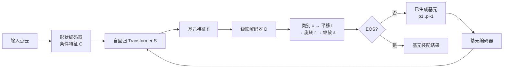

## 一句话总结

PrimitiveAnything 把"用简单几何体抽象复杂 3D 形状"这件事重新定义为一个序列生成问题，用形状条件化的自回归 Transformer 从大规模人工标注的基元装配数据中学习，像人一样把物体拆解成一组基元并逐个"拼装"出来。

## 研究背景

- 领域现状：3D 内容生成近年进展迅猛，网格、点云、神经场等表示都能快速生成高质量 3D 内容，但这些表示偏重可视化与渲染，缺乏与人类认知一致的语义结构与可解释性。与此同时，认知科学早已指出人类视觉系统天然会把复杂场景分解为简单几何基元，这正是"形状基元抽象"这一任务的动机。
- 核心痛点：已有基元抽象方法分两类，都各有短板。优化类方法（如超二次曲面拟合）把问题当作几何拟合，只最小化表面距离，缺乏人类抽象逻辑，常把本该是一个整体的语义部件过度切分成多块；学习类方法直接从数据学习分解，但普遍只在小规模、单一类别的数据集上训练，跨类别泛化能力差，且往往只支持单一基元类型（如只用长方体）。
- 本文 idea：借鉴 MeshAnything 用自回归 Transformer 生成人工风格网格的思路，把基元抽象从"几何拟合 / 直接回归"改造成"生成任务"，直接从人工标注的基元装配序列中学习人类如何逐步拼装形状，从而兼顾语义结构与几何保真，并能跨类别泛化。

## 方法

整体框架：给定一个 3D 物体，先从其表面采样点云并用形状编码器编码成条件特征；然后用一个"无歧义"的参数化方案把每个基元描述为类别、平移、旋转、缩放；一个仅解码器结构的 Transformer 在条件特征和已生成基元的基础上自回归地预测下一个基元的特征，再由一个级联解码器按"类别 → 平移 → 旋转 → 缩放"的顺序把特征还原成基元属性，直到预测出终止符为止。

关键设计：

1. 无歧义参数化方案（是什么 / 为什么 / 怎么做）。每个基元由标准基元类型加上刚性变换（缩放 $$s\in\mathbb{R}^3$$、欧拉角旋转 $$r\in\mathbb{R}^3$$、平移 $$t\in\mathbb{R}^3$$）表示。问题在于长方体、圆柱这类基元本身有对称性，不同的缩放与旋转组合可能产生完全相同的形状，导致同一形状对应多套参数，训练时模型会陷入"模式混淆"。作者据此定义基元的旋转对称集合 $$\mathcal{R}=\bigcup_{j=1}^{n}\{\mathrm{Rot}(v_j,\frac{2\pi k}{m_j})\mid k=0,\dots,m_j-1\}$$，把每个等价旋转与原变换复合后，选择旋转 L1 范数最小的那一套作为唯一规范表示 $$r'_i=\arg\min_{r_k\in\mathcal{R}}\|\hat r_k\|_1$$。这样既消除了对称带来的歧义、又缩小了参数空间，让学习更稳定。

2. 属性离散化与基元 Token。缩放、旋转、平移都被离散化（旋转 180 级、缩放与平移各 128 级/维），连同类别标签一起作为离散 Token，经可学习嵌入与线性基元编码器 $$\mathcal{E}$$ 合成基元 Token $$h_i=\mathcal{E}(e_c(c_i),e_s(s_i),e_r(r_i),e_t(t_i))$$。基元类型被当作可学习 Token，因此新增基元类型无需改动架构，具备可扩展性。

3. 级联属性解码器（cascaded decoder）。Transformer 输出的基元特征 $$f_i$$ 并非一次性解出全部属性，而是按依赖顺序级联解码：先类别 $$\hat c_i=D_c(f_i)$$，再平移 $$\hat t_i=D_t(f_i,e_c(c_i))$$，再旋转 $$\hat r_i=D_r(f_i,e_c(c_i),e_t(t_i))$$，最后缩放 $$\hat s_i=D_s(f_i,e_c(c_i),e_t(t_i),e_r(r_i))$$。每一步都把已解出的属性嵌入拼进来，显式建模属性间的自然相关性，也贴合人类"先选类型、再定位置、再调姿态与大小"的装配逻辑。

4. 自回归生成与训练目标。点云用 Michelangelo 编码器转成定长 Token 序列作为条件，拼接起始符后接基元 Token；基元按质心以 z-y-x 顺序（z 轴朝上）从低到高排序，并用一个 EOS 解码器判断终止。训练目标由三项组成：$$\mathcal{L}=\mathcal{L}_{eos}+\mathcal{L}_{ce}+\mathcal{L}_{cd}$$，其中 $$\mathcal{L}_{ce}$$ 是监督离散属性的交叉熵，$$\mathcal{L}_{eos}$$ 是终止预测的二元交叉熵，$$\mathcal{L}_{cd}$$ 是对生成基元采样点云与真值点云计算的 Chamfer 距离。由于属性是离散的，用 Gumbel-Softmax 实现可微采样，从而让 Chamfer 距离损失能反传，直接约束重建质量。

## 实验结果

作者构建了大规模人工标注数据集 HumanPrim（12 万样本，每个含网格、表面点云与人工基元装配，用长方体、椭圆柱、椭球三种基元，平均序列长 30.9、最长 144），并留出 314 个高质量样本做测试集。下面是与优化类方法（均基于超二次曲面）在 HumanPrim 测试集上的几何指标主对比：

| 方法 | CD ↓ | EMD ↓ | Hausdorff ↓ | Voxel-IoU ↑ |
|------|------|-------|-------------|-------------|
| EMS | 0.1062 | 0.0840 | 0.338 | 0.259 |
| MP（Marching-Primitives） | 0.0546 | 0.0515 | 0.120 | 0.201 |
| 本文 | 0.0404 | 0.0475 | 0.158 | 0.484 |

本文方法在 CD、EMD、Voxel-IoU 上全面领先，Voxel-IoU 相比基线接近翻倍，说明其基元装配对形状体积的覆盖显著更准确；Hausdorff 上略逊于 MP，原因是 MP 通过大量高度重叠的基元做迭代轮廓拟合，能压低最大点对距离，但这种拟合方式偏离人类构建习惯、且会在基元内部产生错误占据。3D 实例分割指标（RI / VOI / SC）进一步验证本文更贴合人类分解模式（RI 0.892、VOI 2.296、SC 0.409，均优于两个基线）。

与学习类方法的对比只能在椅子类子集上进行（对方仅能按单一类别训练）：在 HumanPrim 椅子子集与 ShapeNet 椅子类上，本文即便未在 ShapeNet 上训练，仍在全部几何与分割指标上超过按该类别专门训练的长方体法与超二次曲面法，体现出跨数据集的泛化能力。消融实验表明三项设计各有贡献：去掉无歧义参数化会明显拉低 Voxel-IoU（模式混淆），去掉级联解码会显著抬高 Hausdorff（稳定性变差、更易出离群基元），去掉 Chamfer 距离损失则精度与细节整体下降。

## 亮点与局限

- 亮点：
  - 范式转变干净利落——把基元抽象从几何拟合改写成序列生成，直接向人工装配数据学习"人类式分解"，同时兼顾语义合理性与几何保真。
  - 无歧义参数化直击对称性带来的多解难题，是让离散序列学习稳定收敛的关键工程洞见。
  - 框架把基元类型做成可学习 Token，天然支持变长序列与新增基元类型而无需改架构；下游可与图像/文本条件的 3D 生成模型串联，且基元表示相比网格节省超过 95% 存储，适合游戏 UGC 等对交互性与资源效率都敏感的场景。

- 局限：
  - 强依赖大规模人工标注数据集 HumanPrim，标注成本高，"人类式"分解的质量与偏好实际上被标注规范锁定。
  - 目前只演示了长方体、椭圆柱、椭球三种基元，尚未覆盖超二次曲面、凸多面体等更具表达力的基元；对高度精细或薄壳结构的物体，简单基元的表达力仍是天花板。
  - 评测集中在椅子等常见类别与合成数据，未充分讨论对极端复杂拓扑、真实扫描噪声点云的鲁棒性；生成序列的排序规则（质心 z-y-x）是启发式的，对生成顺序敏感性缺乏深入分析。

## 延伸思考

这项工作与 MeshAnything / MeshGPT 一脉相承，都是把"人工创作产物"当序列、用自回归 Transformer 复现人类创作意图，区别在于生成的是可编辑、可参数化的基元装配而非稠密网格，因此在可解释性与可控编辑上更进一步。一个自然的追问是：能否把可学习 Token 的可扩展性真正用起来，混入超二次曲面、广义圆柱甚至 CSG 布尔基元，做到"按需选择表达力"？另一个方向是把它当作结构先验，接到关节物体建模、机器人抓取规划或物理仿真里——基元级的语义分解恰好是这些下游任务需要的高层结构。此外，Chamfer 距离作为唯一的几何监督偏向表面覆盖，若能引入体积或部件级的语义一致性约束，或许能进一步缓解过度切分与基元错位。
