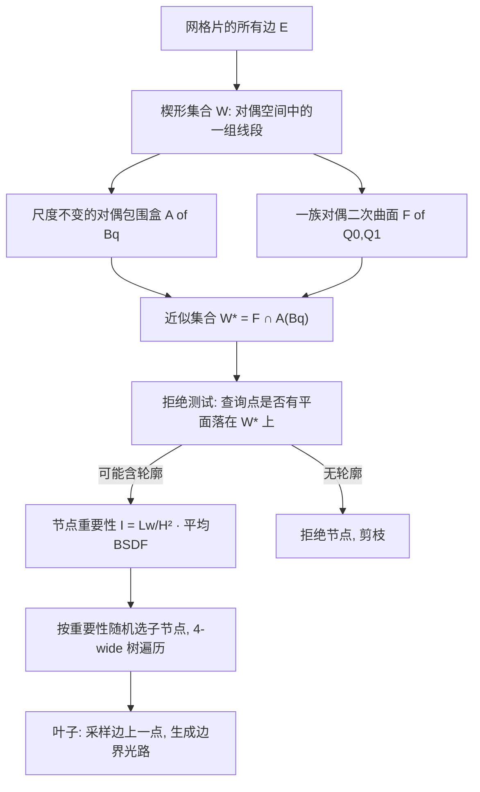

## 一句话总结

用对偶空间的包围盒加一族对偶二次曲面来紧致地描述网格片的"轮廓可能出现的平面集合"，从而设计出更精确的节点拒绝测试，让经典的边采样（edge sampling）在单向路径追踪里重新变得可与面积采样、路径空间方法竞争。

## 研究背景

物理可微渲染是逆渲染的核心工具：把渲染当作一个可求导的前向模型 $F(\theta)$，通过梯度下降从图像反推场景参数（几何、材质等）。困难在于渲染方程的被积函数在物体轮廓处存在不连续，对几何参数求导时必须显式地对这些不连续边界做积分。

出射辐射对参数 $\theta$ 的导数可以拆成两部分——内部项（观察颜色随几何平滑变化）与边界项（可见性在轮廓上的突变）：

$$\frac{\partial}{\partial\theta}L_o(\omega_o,\mathbf{p}) = \int_{H^2}\frac{\partial}{\partial\theta}\left(L_i(\omega_i,\mathbf{p})f_s(\omega_i,\omega_o,\mathbf{p})\right)d\omega_i$$

$$+ \sum_{e\in S(\mathbf{p})}\int_0^1 \Delta L_i(\omega(t,e),\mathbf{p})\,f_s(\omega(t,e),\omega_o,\mathbf{p})\,J(t,e)\,dt$$

其中 $S(\mathbf{p})$ 是相对于着色点 $\mathbf{p}$ 的轮廓边集合。边采样由 Li 等人在 2018 年提出：对轮廓边做重要性采样来无偏地估计边界积分。它的核心挑战是"高效地拒绝掉不含轮廓的网格部分"，原方法用自顶向下遍历树来做，但拒绝测试不够精确，导致大量零贡献样本、方差居高不下。后续工作因此转向面积采样（Warped-Area Sampling，WAS）或路径空间可微渲染（PSDR）。

WAS 用散度定理把边界积分转成面积积分，但需要追踪辅助光线、有超参数、固定光线数时有偏。PSDR 从边上开始构造光路、需要预计算引导分布，且本质上不兼容生产渲染中最常用的单向路径追踪。本文重新审视边采样，提出一个大幅降低方差的新几何数据结构，让单向可微渲染器重新有竞争力。

## 方法

一条边 $e$ 相邻两个三角面 $q_0(e)$、$q_1(e)$。忽略可见性时，只要着色点落在这两个平面构成的"楔形" $W(e)$ 里，这条边就是该点的轮廓边。方法的核心思路是：用射影几何把"点/平面"统一成 4D 齐次坐标，把"平面集合"放进对偶空间处理，进而用紧致结构近似整个网格片的楔形集合。

**射影几何与对偶表示。** 齐次坐标下，点 $\mathbf{x}=[\mathbf{p},1]^T$，平面 $\mathbf{q}=[\mathbf{n},n_o]^T$，$\mathbf{q}^T\mathbf{x}$ 的正负零表示平面对该点朝前/朝后/相交。由于点与平面都是 4D 向量，二者互为对偶。楔形 $W(e)$ 可写成连接两端平面齐次坐标的线段，因此整个网格片的楔形集合 $W$ 就是对偶空间里的一堆线段。判断"是否存在轮廓边"等价于判断"$\mathbf{p}$ 是否与 $W$ 中某个平面相交"。

**尺度不变的对偶包围盒。** 齐次坐标有尺度不变性，直接做 4D 包围盒会因缩放选取不当而过度膨胀。作者选取单位向量 $Z$ 满足 $Z^T\mathbf{q}>0$，把每个平面按 $1/(Z^T\mathbf{q})$ 缩放得到 $W'$，使其落在一个对偶平面上，再在正交基下构造 3D 轴对齐包围盒 $B_q$。

**对偶二次曲面族。** 包围盒仍然偏粗糙。对光滑几何，用二次曲面能更贴合。对偶二次曲面 $Q$ 上的平面正好是其原始二次曲面 $Q^{-1}$ 的切平面。用两个边界二次曲面 $Q_0$、$Q_1$ 定义一族：

$$F(Q_0,Q_1) = \{\mathbf{q}\in\mathbb{R}^4 \mid \exists\mu\in[0,1],\ \mathbf{q}^T(\mu Q_0+(1-\mu)Q_1)\mathbf{q}=0\}$$

最终近似集合为 $W^* = F(Q_0,Q_1)\cap A(B_q)$。

**拒绝测试。** 给定查询点 $\mathbf{x}$，先求对偶包围盒与平面 $A^T\mathbf{x}$ 的交（得到一个可能退化的 2D 多边形 $\mathcal{C}$，空则直接拒绝）；再检查 $\mathcal{C}$ 是否与 $F(Q_0,Q_1)$ 相交，即是否存在平面使得

$$\mu(\mathbf{q})=\frac{\mathbf{q}^T Q_1\mathbf{q}}{\mathbf{q}^T(Q_1-Q_0)\mathbf{q}}\in[0,1]$$

通过依次检查多边形顶点、边、内部三个互斥条件完成（边与内部的检查归结为解二次方程 / 与二次曲面求交）。测试是保守的：允许假阳性（多判有轮廓）以保证无偏，但假阳性越少、零贡献样本越少、方差越低，这正是本文相对 Li 方法的主要改进。

**节点重要性。** 在若干近似（$\Delta L_i$ 沿边近似常数、速度归一、远场近似）下，节点重要性简化为

$$I(\omega_o,\mathbf{p}) = \frac{L_w}{H^2}\,\bar{f}_s(\Omega(B_p))$$

其中 $L_w$ 是按外二面角加权的边总长（预计算），$H$ 是着色点到包围盒中心的距离，$\bar{f}_s$ 是包围盒立体角内的平均 BSDF（用 LTC 估计）。相比 Li 的公式有两点区别：用平均 BSDF 而非最大值（LTC 能正确高效地算平均），且与 $H^2$ 成反比而非 $H$。对多边形面光源，把立体角对光源裁剪得到 $I_{light}$，显著改善软阴影处的采样质量。

**层级构建。** 用 BVH 式自顶向下构建 4-wide 树（遍历成本与二叉树相同但更浅），每个物体建一棵，丢弃根节点得到每物体 4 棵子树。对水密不透明网格先剔除二面角大于 $\pi$ 的凹边（永不成为轮廓）。二次曲面拟合基于 Taubin 方法，通过求解广义特征值问题得到 $Q_f$；偏移方向 $D$ 通过一个线性规划（找到到所有平面最小距离最大的点）或退化时的最小包围球方向求得，同一 $D$ 也用作包围盒构造的 $Z$。

## 实验结果

实验在 Intel Xeon Gold 6348（16 线程）上、基于 redner 实现，本文方法统一用 128 spp，最大路径长度 3，梯度与 $2^{16}$ spp 有限差分对比。

**与原始边采样对比（等时间，MSE）：**

| 场景 | Li [2019] | Ours |
|------|-----------|------|
| Bunny | 32.72 | 0.04 |
| Vase | 45.33 | 0.10 |
| Cube | 47.60 | 0.06 |

改进达两到三个数量级。

**与 WAS 对比（等时间，MSE）：**

| 场景 | WAS 8 (old) | WAS 32 (old) | WAS 8 (new) | WAS 32 (new) | Ours |
|------|-------------|--------------|-------------|--------------|------|
| Spot | 0.47 | 0.78 | 0.44 | 0.67 | 0.03 |
| Hand | 0.31 | 0.57 | 0.29 | 0.48 | 0.01 |
| Birds | 0.60 | 332.26 | 0.64 | 1.47 | 0.07 |

本文方法始终显著更优，且无偏、无需超参数调优、执行时间可预测、易并行。

**与 PSDR 投影采样对比（等样本预算，MSE）：** 投影采样在 Bob/Cube/Fertility/Ibis 上分别为 0.003/0.008/0.027/0.023，本文为 0.016/0.064/0.047/0.117。投影采样更优（因为它用了引导分布），但本文构建时间远短（如 Bob 建树 0.24 s vs 11.10 s），作者认为给本方法加引导可缩小差距。整体运行时间本文慢 6 到 8.5 倍，主要归因于 Mitsuba 3 用了 AVX 而 redner 没有。

**多边形光源：** 用 $I_{light}$ 相比 $I$，等样本数下 Harp 场景 MSE 降低 50 倍（3.38 → 0.07），Elephant 降低约 20 倍（3.53 → 0.19）。

**凹边剔除：** 显著减少层级中的边数（如 Cube 从 71008 降到 45028），并改善梯度质量（Spot MSE 0.34 → 0.20）。

**逆渲染：** 在只能通过两面镜子反射看到关键几何细节的场景里，仅用单张参考图就成功重建了 Bottle、Fertility 等物体的形状，且能很好处理优化中间步骤重网格化产生的网格。

## 亮点与局限

亮点在于把一个看似棘手的几何问题——"哪些着色点会让这个网格片产生轮廓"——巧妙地翻译到射影对偶空间，用"对偶包围盒 + 对偶二次曲面族"这一组紧致、可解析求交的表示来做保守但精确的拒绝。方法始终无偏、不依赖辅助光线、无超参数、执行时间可预测、天然易并行，并且只依赖单向路径追踪，容易嵌入现有渲染器。它证明了长期被认为方差过高的边采样其实很有竞争力。

局限也很清楚：梯度质量强依赖网格复杂度与光照条件，几何极复杂的 Chandelier 场景方差高出数量级（MSE 1.039），强方向光也是挑战（重要性函数假设 $\Delta L_i$ 常数）。实现层面目前不支持含尖锐边、单侧边或自相交的网格，$I_{light}$ 只支持单个光源。相比带引导的 PSDR，在等样本下精度仍有差距。

## 延伸思考

作者反复强调本方法尚未用引导（guiding），而 PSDR 的优势正来自预计算的引导分布——把本文的显式边采样（每条边采样概率已知，这点比投影操作更有优势）与引导框架结合，很可能是接下来最直接的提升方向。另一个值得关注的点是 GPU 化：遍历本身是天然并行的，建树也能复用成熟的 BVH 并行构建策略，若移植到 GPU，其相对 Mitsuba 3 的性能差距（很大程度归因于 AVX）有望被抹平甚至反超。此外，当前用于建树的 SAH 是为光线追踪设计的，为轮廓采样量身定制的代价函数可能进一步提升层级质量。这项工作提醒我们，在被新范式（面积采样、路径空间）盖过风头的经典方法上，一个精心设计的数据结构仍可能带来数量级的收益。
