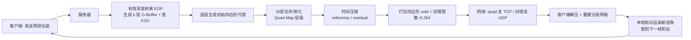

## 一句话总结

本文提出 QUASAR，一套面向 AR/VR 头显的四边形（quad）几何流式渲染系统：服务器用"有效深度剥离 + 像素对齐四边形代理"把场景近似成分层的可见/潜在可见几何，再通过时间压缩只发送发生变化和新露出的四边形，把数据率相比前作 QuadStream 降低最多 15 倍、压到 100 Mbps 量级，从而让商用头显能在普通 WiFi 上实时接收几何并本地渲染带运动视差的新视角。

## 研究背景

- 领域现状：远程渲染把繁重的渲染计算放到服务器，把结果流式传给瘦客户端（如轻量化头显）。最简单的做法是直接把渲染好的图像当视频流传输，客户端再用异步时间扭曲（ATW）等重投影技术补偿延迟。
- 核心痛点：
  - 纯图像重投影（ATW）只能做单应变换，无法表达完整运动视差；异步空间扭曲（ASW）能补运动视差，却处理不了遮挡消失（disocclusion，被遮挡区域因视点移动而露出）。
  - 改为流式传输场景几何可以让客户端本地渲染新视角，但传统方案要传原始三角形，带宽需求高得离谱。已有的四边形/贴片类几何流方案（如 QuadStream、Seurat）虽能量化压缩，单帧仍能消耗约 1–5 Gbps，只适合板级互连，远超实际网络。
- 本文 idea：在四边形代理表示的基础上做三件事——用深度剥离一次性捕获潜在可见几何以获得更紧凑的数据结构、利用时间相干性只传增量（reference/residual 帧）、把布局设计得对硬件视频编解码器和网络速率自适应更友好，从而把几何流式渲染真正带进 40 ms 以上延迟、数百 Mbps 的现实网络。

## 方法

### 整体框架

系统分服务器与客户端两端。客户端周期性把当前位姿发给服务器（实验中 30 FPS），服务器据此预测 $$n$$ 毫秒后的客户端位姿，用有效深度剥离渲染出 $$k$$ 层 G-Buffer（1 层可见 + $$k-1$$ 层隐藏），逐层拟合四边形代理并合并简化，再打包压缩；颜色则拼进一张纹理图集编码成 H.264 视频。客户端收到后用 compute shader 重建带纹理的分层网格，在下一帧到达前用一次前向渲染持续产出高帧率画面（桌面 60、头显 72 FPS），以此掩盖网络延迟。

### 关键设计

- 四边形代理与深度偏移：每个代理是把平面与"像素视锥"相交得到的 3D 基元，带法线和参考点。为了在视点偏移时不留缝隙，每个像素四边形被再分成 4 个子四边形，通过采样目标像素及其 8 邻域构造 9 个平面来计算 16 个深度偏移，能同时表达深度不连续与填补小缝。当偏移都低于展平阈值 $$\delta_{\text{flatten}}$$ 时置"展平"位省去偏移。

- 层级四边形合并（Quad Map）：预分配 $$m=\lfloor \log_2(\min(\text{width},\text{height}))\rfloor+1$$ 个逐级减半分辨率的 Quad Map 作为查找表。合并阶段每次取 4 个相邻代理，若平面方程差异低于相似度阈值 $$\delta_{\text{sim}}$$ 就平均成一个更大四边形写入低分辨率图并清除原位置。此外可放宽约束做"粗合并"（coarse merge），本质是对 G-Buffer 在非边缘区域做保边下采样，大幅减小数据量。

- 有效深度剥离 EDP：与 QuadStream 用盒状视锥的 8 个角点多视点采样不同，本文借用 Kim & Lee 2023 的 EDP，引入"潜在可见隐藏体（PVHV）"和早期可见性测试，只保留在观察球内可能被看到的隐藏片段。这带来球形 viewcell、天然像素对齐（省去 QuadStream 需要的一像素边界扩张）、单层即可覆盖遮挡几何从而支持更激进的合并等优势。

- 紧凑打包：单个"打包四边形代理"仅 96 位（含 16 位对齐填充，压缩后去除），法线用两个 8 位球坐标、尺寸 6 位、图像空间 xy 各 12 位、深度保留 32 位全精度，并有展平位与 alpha 位。由于纹理坐标可从 xy 直接推出，本文每个四边形仅需 80 位，而 QuadStream 需 103 位。各字段按类型分块存储（非交错）后用 zstd 压缩，压缩率更高。

- 纹理图集：把各层颜色缓冲顺序拼接成 4096×4096 视频帧再编码。这种线性拼接看似朴素，却因契合视频编码器对时空局部性的利用，比 QuadStream 的 bin-packing 在视频数据率上好约 1.5–2 倍。代价是最多支持 3 个隐藏层 + 宽 FOV，且块编码可能在物体边界产生轻微渗色。

- 时间压缩（核心贡献）：客户端只缓存一个 reference/关键帧（仅可见首层，约占总载荷 60%），后续发 residual/残差帧。静态场景下服务器用 reference 网格预填深度掩码，只为遮挡消失新露出区域生成四边形；动态场景下再额外比较更新后的 reference 帧，只为几何变化区域生成四边形。于是一个完整残差帧含三部分四边形：参考视点下的更新几何、相机移动新露出的几何、隐藏层与宽 FOV。reference 帧每 5 帧插一次。该机制对场景变化类型无感知，可覆盖骨骼动画、可变形网格等，但对整屏持续变化（如海洋模拟）收益有限。

- 客户端重建：用一张 Quad Index Map（每像素存覆盖它的四边形索引）管理增量。收到 reference 帧覆写本地缓冲；收到 residual 帧则追加四边形、更新索引，被完全覆盖的旧四边形标记为空以复用内存、避免无限增长。透明处理则复用深度剥离的多层特性，额外传一张 alpha 图集。

## 实验结果

- 测试环境：服务器为 Ryzen 9 7950X + RTX 4090，客户端在 Meta Quest 3（Snapdragon XR2 Gen 2）与桌面模拟客户端上评测。四个场景 Robot Lab（0.47M 三角形）、Sun Temple（0.6M）、Viking Village（4.3M）、San Miguel（9.9M），均加入动画。模拟单向延迟 20 ms（±10 ms 抖动）与 50 ms（±20 ms），viewcell 取 25/50/100 cm，每条轨迹 1500 帧。

- 图像质量（1920×1080，与"0 延迟"真值比，PSNR/SSIM/FLIP）：在 20±10 ms 下，本文方法与 QuadStream 相当且在复杂场景更优。以 Viking Village 为例，本文（25 cm）达 PSNR 30.92、SSIM 0.932、FLIP 0.036，优于 QuadStream 的 29.71/0.931/0.039；San Miguel 本文 28.71/0.882/0.050 也优于 QuadStream 27.77/0.874/0.053。ATW 最差（如 Robot Lab 仅 24.11 PSNR、FLIP 0.140），MeshWarp 居中。50±20 ms 高延迟下本文更稳，增大 viewcell 能进一步提升质量。

- 数据率（Mbps，几何+纹理，两延迟平均）：ATW 仅 5 Mbps 但质量最差；QuadStream 普遍 1–5 Gbps 量级（如 Viking Village 25 cm 约 3132、San Miguel 25 cm 约 4125），几乎超出所有实际网络。本文方法四场景 25 cm 约为 152 / 92 / 223 / 607 Mbps，整体落在 92–635 Mbps。且 viewcell 从 25 放大到 100 cm，本文数据率仅增 4–30 Mbps，而 QuadStream 要增 150–1000 Mbps。

- 性能：客户端帧时约 13–20 ms（对应 50–77 FPS），服务器端能达数千 FPS（项目主页称高端 GPU 上四边形表示最高 6000 FPS、移动 GPU 最高 75 FPS）。相比直接在头显本地渲染（Native，Robot Lab 约 124 ms/帧、San Miguel 约 382 ms/帧）大幅提速。residual 帧因需额外重渲参考帧与生成两套四边形，服务器与客户端开销略高，但数据量更小，整体平衡。时间压缩使数据率再降 2–3 倍。

- 消融：粗合并从 0 到 5 次时 FLIP 几乎不变（约 0.0002）却显著降数据率，作者选 3 次为工作点；$$\delta_{\text{sim}}$$ 与 $$\delta_{\text{flatten}}$$ 联动调节，质量随合并强度近似指数衰减，工作点取 $$\delta_{\text{sim}}=0.5$$、$$\delta_{\text{flatten}}=0.2$$。

## 亮点与局限

- 亮点：
  - 用 EDP 单趟深度剥离取代多视点角点采样，既省去边界扩张又天然像素对齐，让四边形能更激进合并、覆盖同一区域所需四边形集更少。
  - 时间压缩（reference + residual）配合客户端 Quad Index Map 的缓存复用，是把带宽从 Gbps 拉到数百 Mbps 的关键。
  - 紧凑打包（80 位/四边形）与"朴素线性拼接反而更利于视频编码器"的洞察，兼顾几何与纹理压缩。
  - 参数（viewcell 大小、合并阈值、粗合并次数）提供清晰的质量-带宽权衡旋钮，为 QoE 自适应留出空间；极端情况下可退化为 MeshWarp 甚至 ATW。
  - 开源了完整实现及多个此前无开源版本的基线，利于社区复现。

- 局限：
  - 方形四边形近似曲边会产生走样，光滑边界表达仍是难题。
  - 客户端明显偏离中心视点时可能出现小缝与残差帧闪烁，宽 FOV 四边形可能窜入主视图。
  - 难以处理反射、折射、动态光照等视点相关效果，以及烟雾等体积效果。
  - EDP 仍可能漏掉部分遮挡消失区域（假阴性造成空洞，假阳性增大数据）。
  - 面向消费级网络的 sub-100 Mbps 目标尚未达成，需更激进的码率压缩。

## 延伸思考

- 论文明确指向"全速率自适应"方向：把 viewcell 大小、合并阈值、时间压缩设置随实时带宽动态调节，是把该系统落地到波动网络的关键一步；主页的轨迹结果也显示快速运动段用更大 viewcell 能明显降 FLIP。
- 时间压缩目前是"整块重传变化四边形"，作者提出可借鉴 2D 视频编码的运动补偿思想，对四边形数据结构本身做量化差分，这或许能把动态/整屏变化场景的收益进一步拉高。
- 与神经表示（NeRF/3DGS）的流式方案相比，本文走的是"传统几何代理 + 硬件视频编解码器"路线，优势是无需长时训练、天然贴合现有编解码硬件；两条路线在瘦客户端上的融合（如几何代理打底、局部神经渲染补视点相关效果）是值得探索的混合架构。
