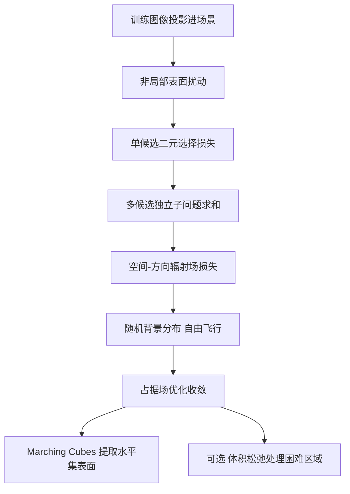

## 一句话总结

本文提出一种简单快速地把图像转换为"辐射曲面"表示的方法：不再像 NeRF 那样先沿光线积分辐射场再监督渲染图像，而是把训练图像投影进场景、直接监督空间-方向辐射场，仅需改动核心算法的寥寥数行代码，就能在保留体积法速度与鲁棒性的同时，直接优化出可提取的显式表面。

## 研究背景

- 领域现状：从多张照片重建表面是长期存在的经典问题。显式表面表示（网格、SDF 等）天然契合物体的物理形态，便于编辑、动画与高效渲染，因而在图形应用中几乎无处不在。
- 核心痛点：可微渲染下的表面优化其损失曲面高度非凸、遍布局部极小值，且需要处理复杂的可见性梯度，遇到拓扑变化或初始表面与目标不重叠时常常失败，导致这类方法在真实复杂场景中过于脆弱。
- 已有绕行方案的代价：NeRF 与 3D Gaussian Splatting 等体积法通过引入连续体积表示巧妙规避了上述困难，损失曲面更平滑、更鲁棒，但代价是表面提取过程更繁琐，往往要依赖促进表面收敛的正则项或多阶段优化，或需数小时计算、或质量明显下降。
- 本文 idea：作者希望既保留体积法的鲁棒性与收敛速度，又能直接优化表面。核心思想是"优化一个表面的分布"——把训练照片投影进场景，最小化投影光场与来自表面分布的空间-方向发射之间经衰减加权的差异。由此得到的辐射场损失把光线上每一点都视作一个表面候选，各自独立地去匹配该光线的像素颜色。

## 方法

### 整体框架

方法从"演化单一表面"出发逐步推导，最终得到与体积重建惊人相似、却本质上是表面法的辐射场损失。核心是把颜色差异度量从图像空间搬进场景内部：对光线上每个候选表面点，不再混合颜色再算损失，而是混合各候选"存在与否"两种情形的损失，从而选出最能解释目标颜色的那个表面。配合一个随机背景分布来支持穿透与拓扑变化，最终从收敛后的占据场中提取水平集得到显式表面。

### 关键设计一：非局部表面扰动与占据场

传统表面导数只在表面本身非零，易造成收敛困难。作者转而考虑在已有可见表面上方一定距离处引入一小块候选表面，把它解释为一种"非局部导数"扰动。因为更新不再被约束在表面上，算法可在更高维的损失曲面里更快、更鲁棒地收敛，也免去了估计边界导数的复杂特例处理。几何上采用占据场 $$\alpha(x)=\Pr\{x\ \text{位于物体内部}\}\in[0,1]$$，收敛后期望表面处占据值趋近 1、外部趋近 0。

### 关键设计二：以二元选择替代 alpha 混合

对光线上单个候选点（颜色 $$L_p$$、占据 $$\alpha_p$$）与其后的背景（颜色 $$L_b$$），标准体积法把 $$\alpha_p$$ 当作不透明度做混合并最小化 $$\ell(\alpha_p L_p+(1-\alpha_p)L_b,\ L_{\text{target}})$$，其根本缺陷是无法促成二元占据值——当最佳匹配是两色的混合时，损失可归零却不形成清晰表面。作者改为把扰动解释为"候选要么存在、要么不存在"的二元选择，最小化 $$L(p)=\alpha_p\,\ell(L_p,L_{\text{target}})+(1-\alpha_p)\,\ell(L_b,L_{\text{target}})$$，即混合两种情形的损失而非颜色，从而挑出最能解释目标色的表面。

### 关键设计三：多候选与空间-方向辐射场损失

推广到光线上多个候选时，把每个扰动当作独立子问题，最小化各自损失之和 $$L_{\text{ray}}(r)=\sum_{i=1}^{m}L(p_i)$$；再在所有参考像素对应的光线上求和得到总损失 $$L_{\text{total}}=\sum_{k=1}^{n}L_{\text{ray}}(r_k)$$。由于 $$\alpha_p$$ 与 $$L_p$$ 覆盖了整个被观测的三维空间，且从不同方向观察时损失还随方向变化，这样便把 $$\ell$$ 的评估从图像空间搬进了场景，形成空间-方向辐射场损失。与 NeRF 不同的是：NeRF 让光线上所有采样共同去匹配目标色（同号梯度、耦合调整），而本方法让每个采样独立匹配目标色、否则在背景更优时变透明——这一点从本质上把它定义为表面重建算法。

### 关键设计四：随机背景分布与体积松弛

背景不取确定性表面，而是从逐光线分布 $$f_b$$ 中抽取，从而允许穿过高占据区域"看见"被遮挡物体，无需显式处理即可支持复杂拓扑变化。作者采用偏好高占据区域采样的"自由飞行"背景分布，并解析地给出其期望，得到与经典体积光传输类似的聚合局部损失 $$L(p_i)=\left(\prod_{j=1}^{i-1}(1-\alpha_{p_j})\right)\alpha_{p_i}\ell(L_{p_i})$$。该实现可排布成与 NeRF 颜色混合几乎一致的结构，仅需改动核心算法数行代码。此外提出可选的"体积松弛"：先用本方法训练 20k 次迭代得到初始表面，再对局部损失仍高的困难区域放开表面假设、允许体积 alpha 混合，兼顾表面区域的紧凑与困难区域的表现力。

## 实验结果

在 MipNeRF360 数据集上把该损失集成进 Instant NGP、使用默认超参训练，与体积重建（NeRF）对比视觉质量（数字忠于原文）：

| 方法 | 室内 PSNR↑ | 室内 SSIM↑ | 室内 LPIPS↓ | 室外 PSNR↑ | 室外 SSIM↑ | 室外 LPIPS↓ |
| --- | --- | --- | --- | --- | --- | --- |
| Ours | 29.02 dB | 0.888 | 0.275 | 22.41 dB | 0.679 | 0.563 |
| Ours（松弛） | 29.41 dB | 0.897 | 0.284 | 22.62 dB | 0.690 | 0.626 |
| NeRF | 29.19 dB | 0.893 | 0.303 | 22.47 dB | 0.683 | 0.638 |

尽管表面表示自由度天生更少，本方法的视觉质量与指数体积重建相当，室内 PSNR 仅比 NeRF 低约 0.1 dB；松弛变体在困难区域切换到体积渲染后，质量甚至略微超过 NeRF 基线。在 ZipNeRF 代码库中复现同样趋势：本方法室内/室外 PSNR 为 29.73 dB 与 24.06 dB，NeRF 为 31.45 dB 与 25.24 dB。渲染性能方面，把光线步进改为返回首个占据值超过 0.5 的采样颜色，在 MipNeRF360 场景上平均提速 2.4 倍（松弛版 2.0 倍）；改用网格化等值面光栅化还能再提速约 2 倍。几何重建上，在 DTU 数据集仅用极小 Laplacian 正则，本方法平均 Chamfer 距离为 0.80，仅比 NeuS2 高 0.12，而运行时间缩短到 1 分钟。

## 亮点与局限

亮点：

- 极致简洁：只需在现有体积重建框架里改动几行代码，就把图像空间损失改造成空间-方向辐射场损失，直接产出显式表面而非需要繁琐后处理的指数体积。
- 兼得速度与鲁棒性：损失曲面与 NeRF 相似，继承了其鲁棒性与收敛速度，可在任意迭代步随时提取有意义的表面，占据场近似 Heaviside 阶跃，各水平集渲染几乎不变。
- 理论上有据：从"演化表面"出发的推导自然导向与体积重建对偶的方程，"损失沿光线积分"而非"颜色沿光线积分"，并借随机背景分布廉价地支持拓扑变化。

局限：

- 把颜色损失从图像空间搬入辐射场，使其无法兼容依赖图像空间邻域的损失函数（如风格损失）。
- 轻量 Laplacian 正则在观测不足时会失效，难以约束几何；对导电（金属）材质的视角相关外观也难以准确重建。
- 不透明表面假设对亚像素结构、高频颜色变化与半透明物体表现受限；欲引入粒子式存储（如高斯泼溅）又与不透明假设相冲突。

## 延伸思考

- 该工作把"优化非交互基元的分布"这一"多世界"范式从物理渲染迁移到辐射曲面重建，提示了一条不同于体积正则化的表面获取路径：与其事后从模糊体积里艰难提取表面，不如从一开始就让每个空间点独立地做二元表面决策。
- "决定某处该用表面还是体积表示"是随任务难度上升而凸显的核心问题。松弛变体给出了有效的启发式，但作者也坦承这需要一个更有原则性的答案，这可能是后续研究的关键切入点。
- 作者期望 NeRF 生态多年积累的优化算法、正则项与工程技巧能大量迁移到辐射场损失上。若成立，这种"改几行损失即可复用整套体积重建基础设施"的特性，可能让显式表面重建以很低的迁移成本追上体积法的最新水平。
- 展望用不透明基元（如 2D 圆盘）替代半透明高斯粒子的思路，暗示了把该损失与基于粒子的高效表示结合的可能，或能兼顾实时渲染与显式表面这两个常被割裂的目标。
