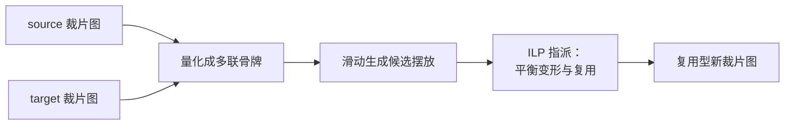

## 一句话总结

给定一件旧衣服（source）和一个想做出来的新衣服（target）以及它们各自的裁片图（sewing pattern），本文提出首个能自动算出"如何裁剪旧衣、复用其接缝与卷边来拼出新衣"的算法，把这个离散加连续的复杂问题通过"把裁片量化成多联骨牌（polyomino）"转化成可用整数线性规划高效求解的离散指派问题。

## 研究背景

- 领域现状：服装数字化设计已相当成熟，交互式 CAD 工具（Clo3D、Optitex）、草图/图像/文本驱动的建模、以及针对特定体型的裁片优化都有大量工作，但它们几乎都在"从零设计新衣"。
- 核心痛点：时尚业浪费惊人（约占全球 8% 碳排放，30% 成衣滞销，仅 1% 旧衣被回收成新衣）。服装复用（upcycling，把旧衣改造成新衣）是比回收更省资源的路径，但难以规模化：改造要综合考虑几何与制造约束，尤其要善用旧衣里"造起来最贵"的结构件（接缝 seam、卷边 hem）。此前几乎无人研究自动生成"复用型裁片图"，唯一相关工作也不考虑接缝/卷边，只做碎布拼接。
- 本文 idea：把复用建模成一个优化问题——在旧衣裁片上寻找新衣裁片的摆放位置，在"最大化复用结构件（省成本、保品质）"与"最小化对目标形状的偏离（保设计意图）"之间取平衡，同时保持面料纹理方向（grain）一致。

## 方法

### 整体框架

输入是 source 与 target 两套裁片图（每片裁片 + 连接它们的接缝信息）。方法先把所有裁片"量化"成由单位方格拼成的多联骨牌，从而把每片 target 在 source 上的连续滑动摆放离散化成有限个候选位置；再用一个整数线性规划从这些候选里为每片 target 选出一个摆放，使得"复用接缝/卷边"与"形状变形"整体代价最低。

### 关键设计

1. 把裁片量化成多联骨牌（是什么/为什么）。裁片是自由曲线边界，直接比较、直接搜索摆放位置都很难。本文借鉴 PolyCube 思路的 2D 版本，把每片裁片近似成边对边拼接单位方格的多联骨牌：给多边形每条边指派 $$\{-X, +Y, +X, -Y\}$$ 四个朝向之一（多标签图割，平衡"边朝向与标签朝向的夹角"和"相邻边标签差异"两项），再解一个带整型坐标约束的优化把顶点吸附到粗网格上，并让接缝两侧边长尽量一致。每条骨牌边同时记录它对应原边的朝向与长度，形成一个"变形场" $$D$$，用来度量量化引入的形变。

2. 候选生成（怎么做）。有了骨牌后，把每片 target 骨牌 $$\hat{t}_i$$ 在每片 source 骨牌 $$\hat{s}_j$$ 上按离散步长平移（只平移、不旋转，以保纹理方向），得到候选集合 $$C_{ij}$$。每个候选记录平移向量 $$\vec{v}_m$$。由于 target 原始形状未必正好贴合要复用的接缝/卷边，就把 target 裁片的边界顶点固定到 source 对应接缝/卷边顶点上，其余边界顶点用 as-rigid-as-possible 变形求解。只保留完全落在单一 source 裁片内的候选，避免跨片引入额外接缝。

3. 代价函数与"接缝复用"耦合项（是什么/为什么）。为每个候选设二元变量 cm（选中为 1）。目标是最小化如下几项之和：变形代价 $$F_{\text{Deform}}$$（只在对应 source 接缝/卷边的边上，比较 target 与 source 变形场之差）；裁剪代价 $$F_{\text{Cut}}$$（剪接缝最贵=2、内部新剪口=1、卷边免费=0）；缝合代价 $$F_{\text{Sew}}$$（缝到 source 的接缝/卷边更贵，因为要拆解原结构）。真正体现"复用智慧"的是成对的接缝复用项 $$F_{\text{Reuse}}$$：引入辅助变量 bmn 表示两片 target 的候选是否同时被选中，当 target 中共享接缝的两片，映射到 source 中同样共享接缝（或映射到 source 内部边、意味着两片可作为一整片裁出、从而省掉这条接缝）时给予负代价奖励（接缝 -4、内部边 -2），并强约束重叠候选不能同时选中（保证 source 任何部分只被复用一次）。覆盖约束要求每片 target 恰好选中一个候选：$$\sum_j \sum_{m \in C_{ij}} \text{cm} = 1$$。

4. 两尺度求解（为什么/怎么做）。因成对变量 bmn 使变量数随候选数平方增长，先在低分辨率骨牌上求解，再在高分辨率（默认 1×1 cm）骨牌上、仅在低分辨率解附近的候选中重解。低分辨率用骨牌快速判重叠，高分辨率用真实摆放形状精确判可制造性。求解用 Google CP-SAT (ILP) 求解器；$$\lambda_{\text{Fabrication}}$$ 默认取 75，$$\lambda_{\text{Deform}}$$ 留给用户调节以平衡复用与形变；最后对选中裁片边界做外扩以留缝份（seam allowance）。

## 实验结果

评测以定性为主：在多组差异较大的 source→target 上验证（套头衫→狗外套、裤子→上衣、大裙→紧身裙、裤子→包、上衣→裙等），素材来自 Korosteleva & Lee 数据集或自建于 Clo3D；并请一位职业服装设计师在 3 个复用任务上与算法对比。下面汇总设计师与本文默认参数在结构件复用数量上的对比（数字忠于原文）：

| 复用任务 | 设计师复用 | 本文（默认参数）复用 | 说明 |
|----------|-----------|----------------------|------|
| Case 4：裤+裙 → 上衣 | 2 接缝 + 6 卷边 | 3 接缝 + 2 卷边 | 设计师此例复用最多 |
| Case 5：裙 → 上衣 | 0 接缝 | 更多接缝复用 | 设计师习惯"拆解摊平"，未复用接缝 |
| 裙、上衣 → 狗外套 | 较少结构件 | — | 设计师另一较少复用的案例 |

补充结论：设计师每个任务约花 20 分钟；算法总耗时从简单案例几分钟到最复杂案例（图 1 的 Case 1）约 30 分钟（Apple M2 Pro / 16GB），最贵的步骤是所有候选对的 $$F_{\text{Reuse}}$$ 计算与求解本身。设计师坦言难以想象裁片如何变形来提升复用，而这正是本文方法的强项；他们也建议引入省道（dart）来补偿形变。此外还请裁缝按算法输出实际缝制了一件成衣，验证可行性——裁缝反馈：共享接缝的对称裁片可沿该缝对折精确裁出，而前后不同裁片则需额外操作。

## 亮点与局限

- 亮点：
  - 首个自动生成"复用型裁片图"的算法，把制造知识（复用接缝/卷边、避免多余缝合、保纹理方向）直接编码进优化目标。
  - 关键建模巧思：用多联骨牌量化裁片，把离散加连续的难题化归为可高效求解的整数线性规划指派问题；成对复用项优雅地表达"共享接缝映射"与"两片合并省缝"两种策略。
  - 有职业设计师对照与真实成衣制造双重验证，且提供用户可调参数在"极致复用"与"忠于目标形状"之间权衡。

- 局限：
  - 假设新衣比旧衣小，且每片 target 能完整放入单片 source 裁片；更大的目标只能靠拆分成可选接缝来变通。
  - 忽略缝份于优化中、事后补加，若两片几乎相接则可能无法补加。
  - 过度复用会带来明显形状偏离（接缝曲率不匹配），需省道补偿但当前未做。
  - 沿接缝/卷边摆放可能使剩余余料形状极不规则，不利于二次复用；也尚未纳入排料效率/最小化浪费的度量。
  - 计算成本对"单件一次性复用"偏高，作者认为更适合工业规模的批量复用摊薄成本。

## 延伸思考

- 方法把架构领域"复用/合理化"（减少不同构件数量、旧构件再匹配）的思路迁移到了柔性、不规则的布料裁片上，其"库存匹配 + 整数规划"范式与建筑结构复用一脉相承，值得横向借鉴。
- 与自动省道设计（PerfectDart / de Malefette 等）结合，或引入排料浪费度量（借鉴零浪费家具设计），是自然的下一步。
- 更大的愿景是重新思考 CAD 的基础，从"take-make-use-dispose"线性模式转向支持循环生产的设计工具——这对整个可持续设计方向有方法论层面的启发。
- 值得追问：只允许平移不允许旋转虽保纹理方向，但会不会错过更优复用解？作者提到加入 180° 旋转会使复杂度乘以 $$2^M$$，这中间的取舍空间还有探索余地。
