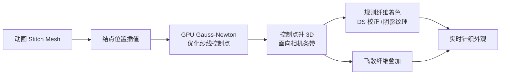

## 一句话总结

给定一段已含衣物级形变的针织网格动画，本文用"结点（knot）"表示把网格实时地补上纱线级几何形变，再用光栅化管线渲染出带纤维级细节的高质量针织外观，首次让针织的形变与渲染同时跑到实时。

## 研究背景

- 领域现状：针织结构由互锁的纱线构成，每根纱线又由数十到数百根纤维捻合而成。要在这种海量几何图元上做高保真的模拟与渲染，学术界已有纱线级模拟、体积均质化、纤维级路径追踪等方案，工业界也有 Shima Seiki、Stoll、PaintKnit 等设计软件。
- 核心痛点：既有高保真方法计算与存储开销极大，无法实时；能实时的方法要么省掉了物理纤维着色与全局光照，要么只支持特定针法与场景、依赖预计算数据、泛化能力受限。工业软件则缺乏基于物理的模拟与高保真渲染，设计师只能等实物打样才能看到最终效果。
- 本文 idea：沿用 Stitch Mesh 把针织抽象成四边形面片，并假设输入网格动画已包含衣物级特征；在此之上提出一套"结点表示 + 物理启发的纱线优化 + 分解式渲染"，仅凭网格形变就在线补出纱线细节，绕开昂贵的全纱线级模拟与纤维级路径追踪。

## 方法

整体框架：输入是一段动画化的 stitch mesh。系统先把纱线互锁关系抽象成一套 2.5D 的结点表示，结点位置直接从形变后的网格插值得到；然后固定结点、用 GPU 上的 Gauss-Newton 优化纱线控制点，恢复出物理上合理的纱线曲线；最后把控制点送入 GPU 光栅化管线，以面向相机的条带（billboard）配合预计算的纤维级纹理渲染，并用分解策略近似多次散射与环境光照。

关键设计分四点：

1. **2.5D 结点表示（是什么 / 为什么）**：把一个 stitch 面上两根纱线的互锁抽象为一个中心结点 $$k$$ 加三个接触点与两个控制点，且都落在面片平面内。它做了三条几何简化假设：控制点 $$p_0,p_1$$ 间距固定为 $$2r$$（$$r$$ 为纱线半径，体现接触压缩）；接触点连线方向与控制点连线方向正交，满足 $$b = d \times n$$；结点相对四个平面点对称居中。给定结点位置，平面点由 $$x_{c_0}=x_k+ld$$、$$x_{p_0}=x_k+rb$$ 等式确定，再沿法线偏移 $$r$$ 就能把 2D 结构抬升成 3D 纱线曲线。这套表示还能覆盖减针、加针等针法。

2. **物理感知的纱线优化（怎么做）**：网格形变后，若直接随网格均匀插值纱线控制点会出现锯齿状曲线。本文观察到真实针织在拉伸时"纱线滑动很小、但结点分布保持均匀"（因为飞散纤维带来高摩擦），于是固定插值出的结点，只优化控制点，最小化两项能量——角度能量 $$E^{i}_{\text{angle}}$$ 保持相邻纱线段夹角接近初始构型，长度能量 $$E^{i}_{\text{length}}$$ 保持段长。这对能量鼓励纱线保持原有卷曲形态，对应真实纱线拆开后仍卷曲的"纤维记忆"现象；优化还受结点表示导出的若干几何约束。

3. **GPU Gauss-Newton 求解（怎么做）**：每个 stitch 面独立、天然可并行。以针织片为例优化参数为倾角与半长 $$\Theta_{\text{knit}}=(\theta_1,\theta_2,l_1,l_2)^T$$，用残差及其 Jacobian 组装线性系统 $$A\Delta\Theta=b$$，其中 $$A=\sum J_i J_i^{T}$$、$$b=-\sum J_i r_i$$，每个 stitch 用单个 CUDA 线程直接求解、迭代三次即可。一个针织 tile 优化 8 个控制点、边界 6 点固定，最后每段上采样成 56 个渲染顶点。

4. **分解式纤维渲染（是什么 / 怎么做）**：纱线渲染为面向相机的条带，贴上预计算的周期性法线/切线纹理，用 Dual Scattering 近似多次散射。为兼顾实时与质量做了两层分解：几何上把纤维分成规则纤维（核心、密集有序）与飞散纤维（松散不规则），各用专属纹理；着色上分成纱线级与纤维级。针对 DS 在大角度下偏离参考的问题，引入校正项 $$\Psi^{*}\approx \xi\,\Psi_{DS}$$，并把 7D 数据分解成方位与纵向两项 $$\xi\approx\xi_M(x,\theta)\,\xi_N(x,\phi)$$；又补充纤维级阴影项以弥补几何被烘焙进纹理后无法自遮挡的问题。飞散纤维用带随机扰动和曲率调节的程序化模型生成，并在纹理烘焙阶段就做好与规则纤维的深度测试。环境光照则用一组球面径向基函数拟合环境图，并用纱线级阴影图配合 PCSS 近似平均衰减。

## 实验结果

主实验为针织手套在方向光下的渲染对比（屏幕 1520×960），参考为纤维级几何 + 离线路径追踪，衡量渲染时间与 FLIP 误差（越低越好），各方法均调到等质量：

| 方法 | 渲染时间 | FLIP 误差↓ |
|------|----------|-----------|
| 参考（路径追踪 + 纤维几何） | 6 min | — |
| Ply + 单纤维着色模型 | 1.3 min | 0.262 |
| Ply + Zhu 等的聚合着色 | 1.2 min | 0.359 |
| 纤维 + Dual Scattering | 4 sec | 0.232 |
| 本文 | 3.0 ms | 0.195 |

本文在取得最低 FLIP 误差的同时，比参考快约 120,000 倍，比任何现有针织渲染技术至少快三个数量级；误差主要来自面向相机条带与真实纱线几何之间的形状差异。

其余实验以文字补充：模拟侧，本文纱线优化约 1 ms/帧，相比全纱线级模拟（7680 ms）快约四个数量级，相比体积均质化方法（96 ms）快约两个数量级，且与数据驱动的 mechanics-aware 方法（约 0.91 ms）性能相当；渲染侧，茶壶（51M～61M 纤维段）参考需 7～9 分钟而本文仅 5.1～8.1 ms，含 118M 纤维段的场景在方向光/环境光下参考需 15/28 分钟而本文仅 9.4/20.6 ms。整套系统在 Flame 等复杂图案上模拟约 1 ms、渲染 16～23.6 ms，全流程低于 25 ms；全服装的纱线级松弛也从原来的数小时降到 2.5 ms。

## 亮点与局限

- 亮点：
  - 首个把纱线级模拟与纤维级渲染同时做到实时的针织框架，全流程 GPU、无需 CPU-GPU 数据往返。
  - 结点表示 + 物理感知优化不依赖预计算数据、不受周期边界条件限制，能处理非周期图案（Flame）与局部变化（Montague），并可泛化到增/减针乃至部分梭织、蕾丝、钩织等单层平面结构。
  - 观察到"结点均匀分布、纱线滑动很小"这一真实现象，据此设计优化，避免了昂贵的全纱线级模拟。
  - 渲染的 DS 校正 + 纤维级阴影分解，在大幅提速下把 FLIP 误差压到最低，效果接近路径追踪参考。
- 局限：
  - 2.5D 结点表示忽略面外力，无法重现拉伸下的卷边（curl-up，如 Stockinette）与压平（flattening，如 Ribbing）行为。
  - 不支持 cables 这类相互交叠的分层针织结构，也不适合 Cartridge Rib 这类无法仅靠接触捕捉的复杂纱线布置。
  - 渲染沿用 billboard 的固有问题，纱线真实径向旋转时无法准确表现；拉伸使纤维更密更紧带来的亮度/光泽变化，因纹理生成耗时也无法实时重现。
  - 与真实照片仍存在可见差距。

## 延伸思考

- 该工作把"衣物级形变交给已有布料模拟、纱线级细节在线补出"的思路做到了极致，和 Sperl 等的数据驱动 mechanics-aware 方向形成对照：一个靠预计算插值、一个靠在线轻量优化，二者性能相当但泛化边界不同，值得思考能否融合两者以兼顾泛化与面外效应。
- 面外力的缺失是当前最大短板，若能在结点表示里引入低维的弯曲/扭转自由度，或许能在不牺牲太多实时性的前提下补上卷边与压平。
- 渲染端把高维散射数据分解成低维纹理的做法，与神经材质/神经 BTF 的压缩表征思路相通，后续可探索用小网络替代部分预计算纹理，以支持拉伸态下动态变化的光传输。
- 面向游戏与服装设计的交互式预览，是这套实时管线最直接的落地场景。
