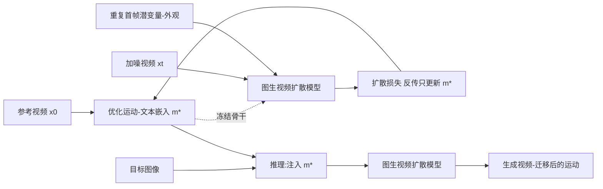

## 一句话总结

本文提出"运动-文本反演"（motion-textual inversion），把一段参考视频的语义运动优化编码进一组文本/图像嵌入 token，再借助冻结的图生视频扩散模型把该运动迁移到任意目标图像上，实现无需空间对齐、跨域通用的语义视频运动迁移。

## 研究背景

- 领域现状：扩散模型让视频生成与编辑质量飞跃，但绝大多数方法聚焦"外观编辑"，对"运动语义"的控制仍然薄弱。即便是 Stable Video Diffusion 这类先进的图生视频模型，也只能靠改随机种子或帧率等微条件来间接影响运动，缺乏可解释的控制手段。
- 核心痛点：现有运动控制信号（文本、框、轨迹、关键点、相机参数）只能表达简单运动；而依赖密集运动轨迹或"反演-再生成"注入参考特征的方法，会把参考视频的空间结构一并带过来，在参考对象与目标对象位置/几何不对齐时失败；基于微调的方法又容易连参考视频的外观一起过拟合，导致目标外观无法保持（作者称之为"外观泄漏"）。
- 本文 idea：用一段参考视频而非稀疏信号来指定运动，并且改用图生视频模型（而非文生视频模型）。作者观察到图生视频模型的外观主要来自图像（潜变量）输入，而经交叉注意力注入的文本/图像嵌入主要控制运动。于是把运动表示为一组没有空间维度的嵌入 token，在冻结模型上针对参考视频优化，天然规避了外观泄漏与空间对齐两大难题。

## 方法

整体框架：以冻结的 Stable Video Diffusion（14 帧图生视频模型）为骨干，它在两处输入首帧——一处是与噪声视频拼接的图像潜变量（负责外观），另一处是经交叉注意力注入的图像嵌入 $$e$$（负责运动）。本文只把后者替换为一个可学习的"运动-文本嵌入" $$m^*$$，用常规扩散损失在单段参考视频上优化 $$m^*$$，模型权重全程冻结。优化完成后，把 $$m^*$$ 施加到不同目标图像即可生成语义相近的运动。

关键设计：

1. 用图生视频模型解决"外观泄漏"。图生视频模型从首帧直接复制像素来决定外观，即使文本要求"粉色的马"，从白马图像出发仍生成白马。作者据此判断外观由图像输入主导；再加上不微调、权重冻结，参考视频的外观就无从被存进模型，从而目标外观得以精确保持。

2. 用无空间维度的嵌入表示运动，解决"对象不对齐"。作者发现交换真马与玩具马的 CLIP 图像嵌入会交换生成视频里的运动（真马嵌入带来行走、玩具马嵌入几乎只有相机运动），说明嵌入才是运动的主要来源。由于嵌入没有空间维度，运动迁移无需先把参考结构对齐到目标位置，允许"参考在中间、生成在左侧"这类错位迁移。作者的直觉是：外观绑定像素的空间排布、易从图像潜变量提取；运动是像素随时间的变化、需要更全局的语义理解，因而更适合用语义丰富、无空间维度、且在模型多处注入的嵌入来控制。

3. 运动-文本嵌入与交叉注意力"膨胀"（inflation）。SVD 的图像嵌入只有 1 个 token，会导致交叉注意力退化——注意力图全为 1，等价于把单个向量广播相加，几乎无法表达运动。本文把它扩成 $$N$$ 个 token 恢复注意力的动态选择能力（前景/背景可用不同 token）；进一步对空间交叉注意力"每帧用不同 token"，即 $$F\times N$$ 个 token，获得更高的时间运动粒度（不同帧可关注手臂或腿等不同区域）。时间交叉注意力则单独学 $$N$$ 个 token，合计每段参考视频 $$(F+1)\times N$$ 个 token，嵌入维度 $$d$$ 保持不变以兼容预训练模型。

默认配置 $$N=5$$、$$F=14$$，即 $$(14+1)\times 5=75$$ 个 token；用 Adam 优化，损失沿用 SVD 的连续时间去噪分数匹配目标 $$m^*=\arg\min_m \mathbb{E}[\lambda_\sigma\lVert D_\theta(x_0+n;\sigma,m,c)-x_0\rVert_2^2]$$ 。

## 实验结果

在 Something-Something V2 上选取 10 类（5 类相机运动、5 类物体运动），每类取 1 段参考视频、10 张目标首帧，每种方法生成 100 段视频。外观保持用目标图像与生成视频的 CLIP 图像嵌入余弦相似度衡量（CLIP-Avg 全帧平均、CLIP-1st 首帧）；运动保真用在该数据集上训练的动作识别网络衡量（Acc-Top-1/Top-5、以及生成与参考视频 logits 的余弦相似度 Cos-Sim）；并做了 27 人的用户研究给出总体排名（越小越好）。

| 方法 | CLIP-Avg↑ | Acc-Top-1↑ | Acc-Top-5↑ | Cos-Sim↑ | 总体用户排名↓ |
|------|-----------|-----------|-----------|----------|--------------|
| 本文 | 0.779 | 54% | 76% | 0.696 | 1.367 |
| Stable Video Diffusion（无运动输入） | 0.843 | 3% | 5% | 0.370 | 2.822 |
| VideoComposer | 0.719 | 44% | 62% | 0.497 | 3.552 |
| MotionClone | 0.637 | 37% | 62% | 0.523 | 4.200 |
| MotionDirector | 0.750 | 31% | 58% | 0.523 | 3.059 |

本文在运动保真的所有指标与总体排名上大幅领先；外观保持仅次于不产生正确运动的 SVD 基线（该指标偏向"几乎不动"的方法，需与运动保真联合来看）。用户研究中本文在运动保真与总体任务完成度上分别被评为最佳 75% 与 78%。消融实验表明：单 token 只能捕捉极有限的运动，增加 $$N$$ 有帮助，但"每帧用不同 token"（$$F'=F+1=15$$）才是质量跃升的关键，$$N$$ 增至约 5 后收益饱和。方法还展示了全身/人脸重演、相机运动、手绘火柴人运动，以及一次性迁移到多个错位对象等通用能力。

## 亮点与局限

- 亮点：
  - 把"运动"表示成无空间维度的嵌入 token，优雅地同时化解外观泄漏与空间对齐两大难题，无需针对领域做大规模训练。
  - 全程冻结骨干、只优化一小组嵌入，保留了预训练模型的通用先验，且天然保持目标外观与布局。
  - 高度通用：全身、人脸、相机、乃至手绘运动都能迁移，还能"免费"把运动同时施加到画面中所有语义合理的对象。
  - 膨胀后的交叉注意力带来更有意义的注意力图与更高时间粒度，对视觉配音等需精确时序对齐的场景尤为有用。

- 局限：
  - 效果受限于预训练图生视频模型的先验与质量，可能出现伪影（如头部转动时身份漂移）。
  - 存在一定"结构泄漏"，参考视频的某些特征会残留（如袋鼠长出类人腿）。
  - 对空间上精细的运动迁移仍有困难（如打字动作难以迁移到恐龙形象）。

## 延伸思考

- 该方法把"运动"与"外观"的解耦落到了图生视频模型交叉注意力这一具体机制上，等于给"文本/图像嵌入到底编码了什么"提供了可操作的证据，这一视角可迁移到其他以交叉注意力注入条件的视频模型上验证是否普适。
- 与并行工作 LEAD 同名但思路不同（后者把文本反演用于文生动作模型），本文强调"用图生视频模型 + 单段参考视频 + 精确时序对齐"这一组合，值得与需要多段参考视频以避免过拟合布局的方法对比其数据效率与泛化边界。
- 由于运动被压缩成一组可优化 token，天然适合做运动的检索、插值、组合与再编辑；把它作为"运动资产"沉淀复用，或与轨迹/关键点等显式控制信号混合，可能是通向更可控视频生成的一条实用路径。
- 方法上限被骨干模型钉死，随着更强图生视频基座出现，同一套反演框架有望直接受益，验证其"骨干无关"的可插拔性会很有意义。
