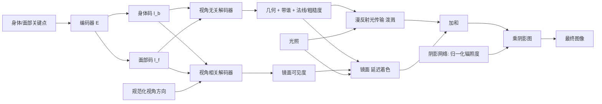

## 一句话总结

本文提出首个可重光照、可驱动的全身高斯化身方法，用可旋转的带谐（zonal harmonics）建模局部漫反射光传输、专门的阴影网络建模身体各部位间的非局部遮挡阴影、延迟着色建模高频镜面反射，从而在全身关节运动下实现高保真的重光照与动画。

## 研究背景

- 领域现状：从早期基于网格的自由视角重建，到后来用 NeRF、体积基元、点云乃至 3D Gaussian Splatting 建模可驱动化身，几何与外观保真度不断提升。近期头部化身工作（Saito 等人的 Relightable Gaussian Codec Avatars）用 3DGS 加可学习辐射传输，已能表达发丝级细节并捕捉全局光照效果。
- 核心痛点：把头部级重光照方法直接扩展到全身面临三大难题。其一，基于球谐（SH）的漫反射传输假设光源能映射到单一局部坐标系（头部坐标系），但关节化身体每个部位都有各自的局部坐标系；其二，身体各部位间的相互遮挡会产生复杂的非局部阴影，头部方法未考虑；其三，全身模型分配给面部的高斯数量有限，朴素泼溅会把镜面反射频率与高斯密度强行绑定，导致眼神光等面部细节表达不足。
- 本文 idea：把光传输显式拆成局部与非局部两部分——局部漫反射用可在局部坐标系学习、又能高效旋转到世界坐标的带谐来表达；非局部遮挡阴影交由一个以物理归一化辐照度为条件的专门阴影网络预测；镜面反射改用延迟着色，把频率与高斯密度解耦，从而在有限高斯预算下恢复高频高光。

## 方法

整体框架：全身化身表示为一组 3D 高斯基元，参数化在跟踪模板网格的 UV 纹理图上。关键点编码器把身体、面部关键点编码为隐码 $$l_b, l_f$$，再由解码器解出每个高斯的几何参数（位移、旋转、尺度、不透明度）与外观参数（漫反射带谐系数、法线、粗糙度、镜面可见度）。漫反射颜色通过高斯泼溅直接合成，镜面颜色用延迟着色计算，最终颜色再乘以阴影网络预测的阴影图。

关键设计：

1. 带谐漫反射光传输：为在全身关节运动下建模朝向相关的漫反射，作者不再把入射光反向映射到各身体部位的局部坐标系（对多部位既昂贵、逆映射又难以精确），而是把光传输函数旋转到世界坐标再着色。直接旋转高阶球谐系数代价高昂（8 阶 SH 的旋转摊销复杂度约 $$O(n^3)$$），于是改用带谐——它是绕某方向圆对称的球谐子集，能在局部坐标系学习、又能高效旋转到世界坐标。单套带谐表达力有限，作者预测三套带色带谐，分别在高斯的切向、副切向、法向方向上求值并求和，得到方向相关的传输系数 $$d^i_k = z^{0l}_k Y_{lm}(\hat{t}_k) + z^{1l}_k Y_{lm}(\hat{b}_k) + z^{2l}_k Y_{lm}(\hat{n}_k)$$ 。带色带谐取到 3 阶、单色带谐取 4 到 8 阶。相比 SH 每纹素需要 113 个参数，带谐只需 51 个，参数更省、质量更好。

2. 局部几何形变的 TBN 参数化：由于身体关节运动幅度远大于头部，作者在每个高斯所属纹素的切-副切-法（TBN）局部坐标系内预测位移增量 $$\delta t_k$$ 和旋转增量 $$\delta R_k$$，再通过 $$t_k = v_k + \text{TBN}_k \cdot \delta t_k$$ 、$$R_k = \text{TBN}_k \cdot \delta R_k$$ 变换到世界坐标。这样把局部辐射传输与身体关节运动解耦。

3. 延迟着色的镜面反射：镜面法线取自高斯旋转矩阵的最后一列并叠加预测偏移后归一化。作者不在每个高斯上直接算镜面色，而是先把镜面法线、粗糙度、镜面可见度用泼溅光栅化到屏幕空间，再在像素级用球面高斯（spherical Gaussian）瓣计算镜面颜色 $$c_s(u,v) = v_{uv} \int_{S^2} L(\omega_i) G_s(\omega_i; q_{uv}, \sigma_{uv}) d\omega_i$$ ，其中瓣的中心 $$q_{uv}$$ 是相机方向绕法线的反射向量。这样把镜面反射的频率与高斯密度解耦，在有限高斯下也能恢复眼神光等高频高光。

4. 非局部阴影网络：可学习辐射传输已能捕捉衣褶等局部阴影，但难以处理身体部位间远距离自遮挡造成的非局部阴影。作者先在粗跟踪网格上预计算归一化辐照度 $$\text{Irradiance}(v_k) = \frac{\int_{S^2} L(v_k,\omega_i)\text{Vis}(v_k,\omega_i) d\omega_i}{\int_{S^2} L(v_k,\omega_i) d\omega_i}$$ （用蒙特卡洛估计，训练用多点光源、测试用环境贴图），再用一个 UV 空间的轻量卷积网络预测阴影图。物理式的辐照度归一化是关键，它让阴影网络能泛化到未见过的光照条件。最终像素颜色为 $$C(u,v) = (c_d(u,v) + c_s(u,v)) \cdot \text{shadow}(u,v)$$ 。

训练用多视角视频加已知光照，采用 L1 与 LPIPS 重建损失外加多项正则项，在单张 A100 上训练 30 万次迭代约两天。

## 实验结果

作者用自建光台采集数据评测：1024 个可独立控制、位置与强度已知的光源，每序列约 5000 到 6000 帧、每帧 512 个相机，训练时留出 20% 视角与部分点亮帧、并用未见运动序列做重光照评测。由于没有现成方法能直接跑在该数据上，主对比基线是"用本文学到的几何 + 主流全身化身常用的 PBR 外观模型"，其余为消融变体。下表为留出姿态、新视角下的重光照定量结果（前景裁剪后计算）：

| 方法 | 训练运动 LPIPS↓ | 训练运动 PSNR↑ | 未见运动 LPIPS↓ | 未见运动 PSNR↑ |
|------|------|------|------|------|
| PBR 基线 | 0.1993 | 28.35 | 0.2166 | 26.83 |
| SH（未旋转） | 0.1846 | 29.15 | 0.2056 | 27.21 |
| 去掉阴影网络 | 0.1800 | 28.89 | 0.2004 | 27.07 |
| 去掉延迟着色 | 0.1796 | 29.55 | 0.2003 | 27.59 |
| 网格法线 | 0.1785 | 29.43 | 0.1993 | 27.53 |
| 本文完整 | 0.1781 | 29.48 | 0.1989 | 27.57 |

本文在所有指标上大幅优于 PBR 基线（PBR 为不透明物体设计，无法建模发丝的半透明与皮肤的次表面散射）。本文在 LPIPS 上优于所有消融变体：把带谐换成球谐会带来明显下降，说明带谐对手臂、手等高度关节化部位的外观捕捉更忠实，且参数量更省（51 对 113）；去掉阴影网络后各指标明显下降，说明单纯姿态相关的辐射传输不足以捕捉非局部阴影。值得注意的是"去掉延迟着色"在 PSNR/SSIM 上略高于完整模型，作者解释这是因为其对单像素多次镜面预测做了 alpha 混合、外观更平滑，而 PSNR/SSIM 偏好这种平滑，LPIPS 才更能反映高频反射（如鼻梁、眼部高光）的感知质量；此外当前延迟着色的几何依赖 3DGS 逐像素深度，深度噪声会引入着色误差。

## 亮点与局限

- 亮点：
  - 首个统一建模身体、面部、双手的可重光照、可驱动全身化身方法。
  - 用可学习带谐在局部坐标系表达朝向相关漫反射光传输，既解决了关节化身体多局部坐标系难题，又比球谐更省参数、质量更好。
  - 显式分离非局部阴影，用物理归一化辐照度为条件的阴影网络泛化到未见光照，避免每步昂贵的光线追踪。
  - 首次把延迟着色用于可学习辐射传输，在有限高斯下恢复眼神光等高频镜面细节。
- 局限：
  - 衣物动态完全依赖学到的隐空间，缺乏物理合理性，手触碰衣物或极端姿态等分布外场景可能失败。
  - 分配给眼、脸、手的模型容量有限，细节仍逊于专门方法。
  - 依赖多相机 + 已知光源的光台采集，可扩展性有限。
  - 延迟着色受 3DGS 几何/深度精度限制，可能引入着色误差。

## 延伸思考

- 带谐作为可在局部学习、可高效旋转的辐射传输基，本质上是把"朝向"从光照计算中解耦的巧思，这一思路或可迁移到其他强关节化对象（如动物、机械）或衣物层的重光照。
- 阴影网络用物理归一化辐照度作条件以换取对新光照的泛化，是"用可学习模块替代昂贵光线追踪"的务实折中；若结合近期改进 3DGS 几何精度的工作（如平面化高斯、深度正则），延迟着色的镜面质量与 PSNR 有望进一步提升。
- 从依赖光台的个体专属模型走向"通用化"（类似通用可重光照头部/手部模型）的方向，是让这类高保真化身走出实验室的关键一步。
