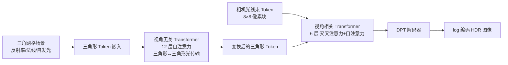

## 一句话总结

RenderFormer 把渲染重新表述为一次「序列到序列」的变换，用两阶段 Transformer 直接从三角网格场景描述生成带全局光照的图像，全程不做逐场景训练、不依赖光栅化或光线追踪。

## 研究背景

- 领域现状：传统图形管线通过模拟光线在场景中的物理传输来渲染（如蒙特卡洛路径追踪、辐射度方法）；而神经渲染希望绕过模拟过程，直接学习光传输的效果，NeRF 是其中的代表。
- 核心痛点：绝大多数神经渲染方法把模型「过拟合」到某一个固定场景，换个场景就要重新训练或微调；同时它们通常使用专门的神经场景表示，难以兼容常规的三角网格建模工具链。经典解析方法（路径追踪、辐射度、PRT/神经辐射度）要么带有蒙特卡洛噪声与递归开销，要么对每个场景都要付出高昂的预计算成本。
- 本文 idea：能否学习一条「渲染管线」而不是一个「渲染模型」？作者提出把渲染看成序列变换：输入序列的每个 token 代表一个带反射属性的三角形，输出则是收敛后的辐射分布。模型直接从数据中学到求解光传输的能力，训练只做一次，之后任意三角网格场景都能免训练直接渲染。

## 方法

### 整体框架

RenderFormer 采用两阶段 Transformer 架构。第一阶段是「视角无关」的：输入一串三角形 token（编码法线、反射率、自发光等），通过自注意力建模三角形到三角形之间的光传输，输出每个三角形上「出射辐射」的神经编码。第二阶段是「视角相关」的：把相机表示成一束束光线（每个 token 对应 8×8 像素块的 64 条光线），通过交叉注意力去「查询」第一阶段得到的三角形 token，最终解码出每条光线的 HDR 辐射值。整条管线单次前向即可求解全局光照，无需递归，且完全由可学习组件构成，天然可微。

### 关键设计

- **相对空间位置编码（核心创新）**：与语言模型中 token 的一维序列位置不同，三角形在序列中的顺序无关紧要（交换两个三角形应得到相同结果），但它在三维世界中的位置至关重要，且整体平移场景不应改变光传输。作者把 RoPE（旋转位置编码）改造到三维：将三角形三个顶点坐标拼成 9 维向量，与 6 个指数分布的频率（$$[1.0, 1.3797, 1.9037, 2.6265, 3.6239, 5.0]$$）相乘得到 54 维，再按正余弦构造块对角旋转矩阵，在每一层注意力上施加。这样得到的是基于三维空间位置的「相对」编码，对场景平移不变（寄存器 token 用所有顶点的平均位置来编码）。不过由于 $$SO(3)$$ 不可交换，做到对旋转不变较困难。

- **三角形嵌入**：每个三角形 token 是 768 维。逐顶点法线用 NeRF 式绝对位置编码（同样 6 个频率）编码后经线性层与 RMS 归一化展开；反射率用 GGX 微表面 BRDF 模型，参数为漫反射反照率、镜面反照率、粗糙度，连同自发光堆叠成 10 维向量，同样经线性层展开后与法线嵌入相加。另加 16 个寄存器 token 存储全局信息、抑制高频噪声。

- **视角相关阶段与光线束**：相机被编码成一系列光线束 token——每束是穿过 8×8 像素中心的 64 条光线。由于这一阶段在相机坐标系下工作，所有光线原点都是 $$(0,0,0)$$，只需编码归一化方向（64×3=192 维）。每个自注意力层前置一个交叉注意力层，负责把光线束与相关三角形 token 关联起来。作者发现光线束之间共享信息（自注意力）能提升精度，最后再接一个稠密视觉 Transformer（DPT）解码出 $$\log(x+1)$$ 编码的 HDR RGB 值。在相机坐标系而非世界坐标系下工作，可以避免模型去学世界到相机的变换，从而提升精度。

- **训练细节**：端到端一次性训练，用 AdamW、批量 128、8 张 A100。先在 256×256 分辨率、最多 1536 三角形下训 50 万步（约 5 天），再在 512×512、最多 4096 三角形下微调 10 万步（约 3 天）。损失为对数变换后的 L1 加 0.05 倍 LPIPS：$$loss_{L1} + 0.05\, loss_{LPIPS}$$。训练数据由 Objaverse 物体（经重网格化到 256~3072 面）随机摆进四个模板场景生成，用 Blender Cycles 以每像素 4096 采样渲染出约 1600 万张 HDR 参考图。由于模型对旋转不变性弱，训练时用 RoMa 对场景做在线随机旋转来增强稳定性。视角相关阶段需要 tf32 精度，视角无关阶段用 bf16 即可。

## 实验结果

主实验为架构消融（256×256 分辨率，指标在测试场景上平均）。下表取视角相关阶段的两组关键对照——是否使用 DPT/自注意力，以及相机坐标系 vs 世界坐标系，说明各设计的贡献：

| 配置 | PSNR↑ | SSIM↑ | LPIPS↓ | FLIP↓ |
|------|-------|-------|--------|-------|
| 完整视角相关阶段（相机坐标系） | 29.77 | 0.9526 | 0.05514 | 0.1751 |
| 去掉 DPT | 29.75 | 0.9476 | 0.05519 | 0.1806 |
| 去掉自注意力 | 29.70 | 0.9503 | 0.05703 | 0.1766 |
| 同时去掉 DPT 与自注意力 | 29.15 | 0.9396 | 0.06407 | 0.1836 |
| 世界坐标系视角相关阶段 | 28.98 | 0.9420 | 0.06309 | 0.1904 |

可以看到 DPT、光线束自注意力、相机坐标系三项设计都带来稳定的精度提升，其中坐标系选择的影响最明显。

其余实验以文字补充：

- **模型规模与层数分配**：token 特征维度从 768 降到 192、参数量从 2.05 亿降到 4500 万，精度单调下降；固定总共 18 层注意力时，把更多层放在视角相关阶段（如 6+12）反而精度更高，但完全去掉视角无关阶段（0+18）会失败，说明两阶段缺一不可。综合精度与速度，作者最终选 12+6 的划分（约快 25%，仅损失约 5% 精度）。
- **速度**：在单张 A100、512×512 分辨率下，未优化的纯 PyTorch 实现渲染四个测试场景仅需约 0.06~0.10 秒，而 Blender Cycles 以 4096 采样需数秒到十余秒，即便开启自适应采样与降噪也要 2.7~4.7 秒。
- **泛化性**：能处理比训练时更多的三角形（会损失细节但「优雅退化」）、更大的视场角；对分辨率有轻微依赖，高分辨率下误差集中在深度不连续处；平均能正确处理约 3 次镜面反射弹射。

## 亮点与局限

- 亮点：
  - 首次证明神经网络可以学到一条完整的、免逐场景训练的渲染管线，输入是标准三角网格，输出带完整全局光照，兼容既有建模工具链。
  - 用序列到序列视角「直接求解」渲染方程，无蒙特卡洛噪声、无递归、单次前向完成，且全流程可微，对正向与逆向渲染都有潜力。
  - 提出面向三维的相对空间位置编码（RoPE 的三维改造），巧妙地把「三角形位置重要但序列顺序无关、且平移不变」的物理先验注入 Transformer。
  - 展现出可利用光传输线性性的组合技巧（分光源渲染再叠加、分通道渲染彩色光、细分大光源），绕过训练分布的限制。

- 局限：
  - 受注意力 $$O(N^2)$$ 复杂度限制，目前最多 4096 个三角形；无纹理（每三角形常量反射率），仅单一 BRDF 模型。
  - 受训练分布约束明显：光源数超过 8、光源置于场景内部、彩色光、超大光源、相机进入场景内部等情形都会失效或需要组合技巧规避。
  - 对场景旋转不具备内在不变性，只能靠随机旋转增强来缓解；高分辨率、超大三角形、复杂遮挡物的阴影、以及三次以上镜面弹射都会掉细节。

## 延伸思考

- 这项工作把「学一个场景」的神经渲染推进到「学一条渲染管线」，思路上更接近 PRT / 神经辐射度的「预计算光传输」精神，但把昂贵的预计算从「每场景」摊薄成「一次性训练」，这对可微渲染与逆向渲染是很有吸引力的范式。
- 最大的瓶颈是三角形级 token 化带来的二次方注意力开销，能否引入线性注意力、稀疏注意力，或结合图形学的 LoD、BVH 层次结构来做「对象级」token 压缩，是关键的可扩展性方向（后续的 RenderFormer++ 正是沿着对象级 token 化这条路走）。
- 由于反射率、法线、自发光都是显式输入 token，理论上可以端到端反传梯度到几何与材质，适合做联合优化式的逆向渲染；纹理支持的初步实验（把 32×32 参数图栅格化进 token）也提示了走向空间变化材质的路径。
- 值得追问的是：模型「学到」的到底是不是某种隐式的光传输算子？视角无关阶段可视化显示它确实解出了漫反射互反射与亚三角形粒度的阴影，这为「神经网络能否内化渲染方程」提供了有趣的经验证据。
