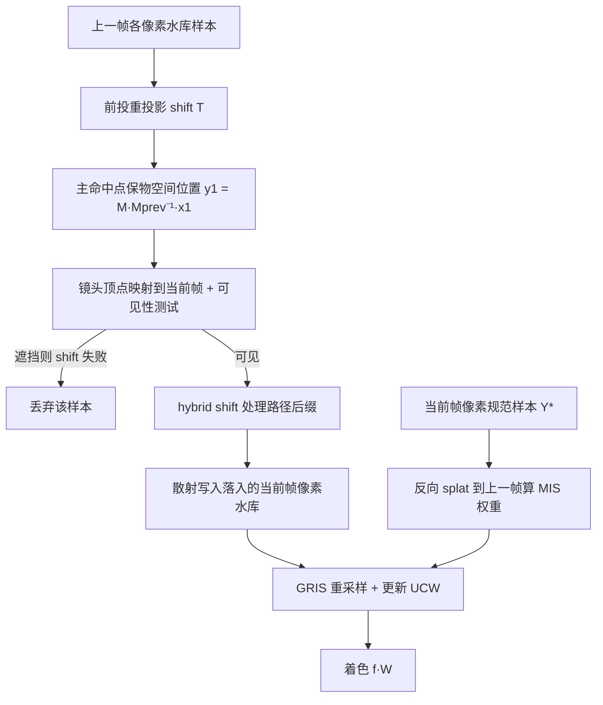

## 一句话总结

把 ReSTIR 时域复用中"回投（backprojection）找历史样本"的思路换成"前投散射（splatting）"：直接把上一帧路径的主命中点前向投影到当前帧对应像素，从而更可靠地复用样本历史，并顺带首次让 ReSTIR 支持运动模糊与景深。

## 研究背景

ReSTIR（基于水库的时空重要性重采样）通过在像素之间、帧之间复用路径样本，让每像素仅一个新样本（1 spp）也能逼近近最优重要性采样，在实时渲染里极大提升了效率。但它的高效依赖一条"易于复用的样本历史链"：一旦历史失效被重置，质量就退回到朴素 1 spp 路径追踪的水平。因此，减少历史被误重置的频率是维持 ReSTIR 效率的关键。

近期 Zhang 等人的 Area ReSTIR 通过把子像素位置与镜头位置也纳入水库维度，改善了高频法线贴图下的时域历史维护。但它和以往 ReSTIR 一样，仍采用时域回投：沿每个像素的反向运动矢量找到上一帧的水库来复用。只要发生相机或物体运动，回投就会改变路径的主命中点，尤其当像素颜色由聚合几何（毛发、树叶等）决定时，这种历史极难复用，运动下质量显著退化。

作者提出反其道而行：不再"聚集式（gather）"回投，而是"散射式（scatter）"地把上一帧样本前向重投影（即 splatting）到当前帧。除非在当前帧被遮挡，这类样本可以在不改变其物空间主命中点的前提下被复用，从而稳定复用、减少历史重置。论文的具体贡献包括：一个精确保留跨帧物空间主命中点的散射式水库复用；一个填补散射空洞的"备用样本"机制；首个 ReSTIR 加速的运动模糊算法；以及无需 Area ReSTIR 专用 shift map 与手调 MIS 权重即可实现的景深。

## 方法

### 整体框架

方法建立在 Lin 等人的广义 RIS（GRIS）理论之上。GRIS 通过 shift map $$T_i$$ 把候选样本 $$X_i$$ 从各自的域搬到目标域得到 $$Y_i=T_i(X_i)$$，再按重采样权重

$$w_i = m_i(Y_i)\,\hat{p}(Y_i)\,W_{X_i}\left\vert \frac{\partial T_i}{\partial X_i}\right\vert $$

选出输出 $$Y$$，并赋予新的无偏贡献权重（UCW）$$W_Y=\frac{1}{\hat{p}(Y)}\sum_{i=1}^{N}w_i$$。只要候选样本的支撑集合起来覆盖目标函数 $$\hat{p}$$ 的支撑，$$W_Y$$ 即无偏；引入一个恒等 shift 的规范样本（canonical sample）可保证这一覆盖。

Reservoir Splatting 的核心是把"当前帧时域复用"重新表述为 GRIS：概念上把所有上一帧样本都视为对当前每个像素都有贡献，但对没有散射进当前像素的样本强制赋零权重。这样既满足 GRIS"定义输入域时不能偷看样本"的要求，又能精确保留主命中点。实现上先给每个当前帧像素放一个规范样本，再把所有上一帧路径前向 shift 到当前帧、识别其落入的像素并流式写入对应水库。

### 关键设计

**散射式 GRIS（O(N) 复杂度）。** 全对全复用理论上需 $$O(N^3)$$ 次 shift，但散射操作对给定像素隐式地把绝大多数上一帧样本置零权重，使复杂度降到每像素两次 shift（前向 splat 上一帧水库、反向 splat 规范样本），总计 $$O(N)$$。使用盒式滤波时，若 $$Y_i$$ 不落在像素 $$j$$ 则 $$w_i=0$$；否则 $$\hat{p}_j(Y_i)=\hat{p}(Y_i)$$。广义平衡启发式的分母从 $$N+1$$ 项塌缩为两项：

$$m_i(Y_i) = \frac{c_i\,\hat{p}_{\text{prev}}(X_i)\,\vert \partial T/\partial X_i\vert ^{-1}}{c_*\hat{p}(Y_i) + c_i\,\hat{p}_{\text{prev}}(X_i)\,\vert \partial T/\partial X_i\vert ^{-1}}$$

**重投影 shift map 与雅可比。** 前投时先保持主命中点的物空间位置：$$y_1 = M(M_{\text{prev}})^{-1}x_1$$（静态场景 $$y_1=x_1$$），再把镜头顶点映射到当前帧并做 $$y_0$$ 与 $$y_1$$ 间的可见性测试，遮挡则 shift 未定义；路径后缀用 hybrid shift 处理。重投影引入额外雅可比，其中世界到屏幕空间投影项为

$$\left\vert \frac{\partial y_1}{\partial u}\right\vert  = \frac{\|y_1-y_0\|^2}{\cos\theta_N}\cdot\cos^3\theta_V$$

雅可比补偿了屏幕空间密度变化，因此散射保持无偏。

**备用样本填洞。** 前投沿上一帧的前向运动矢量投影，会在没有上一帧像素贡献处留下空洞（如推近/缩放时）。作者可选地用回投找一个备用样本 $$X_b$$（直接沿用 Zhang 等人的时域 shift $$T_b$$）作为额外输入来填补，代价类似 Area ReSTIR 的 robust 变体。

**置信权重更新。** 概念上有 $$H\times W$$ 个输入但只有少数贡献，若只按贡献水库累加置信权重会引入偏差。作者改为回投当前像素中心到上一帧，对重叠的 $$2\times2$$ 像素做双线性插值：$$c_j = \min\left(c_i+\sum_{k'=1}^{4}\beta_{k'}c_{k'},\,c_{\text{cap}}\right)$$。

**运动模糊。** 运动模糊要在曝光区间 $$[t_0,t_1)$$ 上积分并给每个样本关联时刻 $$t$$。朴素地给 Area ReSTIR 的路径加时间维并回投，会因"表观运动同时依赖样本时刻与子像素位置且二者独立变化"而导致大量失败 shift。散射则天然简单：运动模糊 shift 把上一帧样本前向投影 $$\Delta t$$ 到其运动上的正确点，即 $$(\bar{y},t)=\hat{T}(\bar{x},t_{\text{prev}})=(T(\bar{x}),t_{\text{prev}}+\Delta t)$$。进一步的多重散射（multi-splatting）把快门时间分成 $$K$$ 段，把每个样本散射到全部 $$K$$ 个时刻，降低样本稀疏度、提升质量（雅可比相应乘 $$1/K$$）。

**景深。** Area ReSTIR 需要两个 shift（保镜头坐标、保主命中点）再用 MIS 合并才能覆盖所有弥散圆，会引入方差。散射显式保留主命中点 $$x_1$$、同时复用固定镜头样本 $$s$$，图像空间位置直接由散射落点确定，因此用单一 shift map 即得到高质量散景，省算力也简化代码。

实现基于 Falcor，沿用 Area ReSTIR 的水库存储格式并显式加入物空间主命中点（启用运动模糊时再加样本时刻）。多个散射可能落入同一像素，需用原子操作避免竞争（类似次序无关透明）。原型仅处理静态场景中的动态相机运动模糊，以便复用常规 BVH。

## 实验结果

结果在 1920×1080、NVIDIA GeForce RTX 4090 上生成，$$c_{\text{cap}}=20$$、空间邻居取 30 像素半径、启用俄罗斯轮盘赌（多数场景平均路径深度小于 3），运动模糊默认快门 1/24 秒；数值误差用 MAPE、感知误差用 FLIP。核心对比（时间 ms / MAPE / FLIP，越低越好）：上三行与 Area ReSTIR 的 fast/robust 变体对比，下两行为运动模糊场景，与朴素回投运动模糊基线对比。

| 场景 | Area/朴素 Fast | Area/朴素 Robust | 本文 Splatting | Splat + Backup |
|------|---------------|------------------|---------------|----------------|
| Sheep In Forest | 63.2 / 1.013 / 0.664 | 103 / 0.885 / 0.627 | 61.9 / 0.860 / 0.539 | 89.2 / 0.840 / 0.534 |
| Hair | 55.3 / 0.190 / 0.905 | 73.4 / 0.173 / 0.901 | 52.1 / 0.166 / 0.801 | 78.3 / 0.166 / 0.827 |
| Residential Lobby | 28.5 / 1.197 / 0.784 | 49.8 / 1.035 / 0.745 | 26.1 / 1.024 / 0.681 | 38.1 / 0.937 / 0.663 |
| Bistro Exterior（运动模糊） | 18.9 / 0.956 / 0.724 | 29.3 / 0.748 / 0.675 | 18.1 / 0.885 / 0.660 | 32.7 / 0.717 / 0.614 |
| Emerald Square（运动模糊） | 26.0 / 1.088 / 0.638 | 40.3 / 0.957 / 0.599 | 23.0 / 0.973 / 0.579 | 39.0 / 0.819 / 0.536 |

总体上，单散射比 fast 复用快约 5～10%、误差低约 10～20%；散射加备用样本可与 robust 复用对标，且在高频场景里散射单独也常胜过 robust 复用。多重散射（含 43 亿三角形的 Landscape 场景）显示随散射次数增加质量持续提升：静态相机下 Zhang 方法 MAPE 0.333、进入运动后升到 0.872（48.2 ms），而本文 1× 为 0.857（47.5 ms）、2× 为 0.709（55.5 ms）、4× 为 0.642（60.1 ms）、8× 为 0.612（77.6 ms）。作者还测得即使快速运动，平均每像素也仅 0.6～0.9 个有效上一帧散射、最多约 5 个，GPU 利用率良好；由于散射只需可见性查询，比其他需重新找主命中点的 shift 更省。景深场景（如 Bistro）中散射因 shift 数更少而常快约 10%。

## 亮点与局限

亮点：把 ReSTIR 的时域复用从回投聚集换成前投散射，精确保留跨帧物空间主命中点，从根上缓解运动下历史被误弃的问题；在 GRIS 理论框架内证明无偏，并把全对全的 $$O(N^3)$$ 巧妙降到每像素两次 shift 的 $$O(N)$$；首次让重采样支持运动模糊（含多重散射），并用单一 shift map 更优地实现景深；散射加备用共六次 shift，仍少于 Zhang 等人 robust 复用的十次。

局限（作者自述）：对新暴露（disocclusion）表面无能为力，仍需更好的 shift 或路径突变来改善；极端前向运动会把一个像素映射到很多像素而留洞，简单线性运动场景下散射加单个备用可能比 robust 复用（从 $$2\times2$$ 邻域取样）略噪；多重散射可能把水库中的火花点（fireflies）沿运动方向扩散到多个像素，给去噪器带来麻烦；散射沿前向运动矢量走，继承此类方法的固有问题（如镜面中的虚像会按镜面几何而非虚像被散射）；原型目前只支持静态场景中的动态相机。

## 延伸思考

这篇工作最有价值的地方在于把渲染里长期争论的"聚集 vs 散射"之争，在 ReSTIR 语境下给出了一个偏向散射的清晰答案：散射能保证每个上一帧水库都被检验其对当前像素的相关性，而回投的运动矢量做不到这种保证——这正是运动、高频场景下质量差异的根源。更重要的是，作者指出散射把 ReSTIR 的算法工具箱从"只能聚集"扩展到"可散射可聚集"，这为把双向路径追踪、更复杂的时空复用，以及采样密度与屏幕分辨率不匹配等问题纳入 ReSTIR 框架打开了空间。运动模糊本质上是给路径加了一个时间维度，与 Area ReSTIR 给路径加子像素/镜头维度是同构的思路，二者叠加提示了一条"逐步把成像积分的各维度都纳入水库统一重采样"的技术路线。
