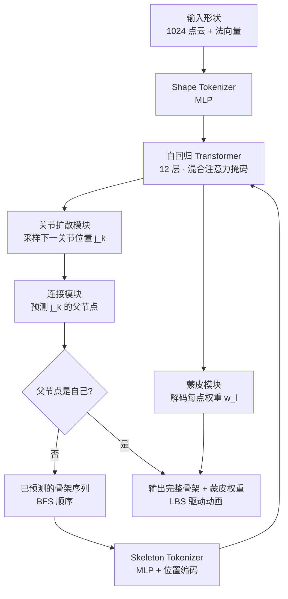

## 一句话总结

RigAnything 用自回归 Transformer 把任意 3D 资产的绑定（rigging）问题变成"逐个预测下一个关节"的序列生成任务，无需任何骨架模板，就能为人形、四足、鱼类、昆虫等多类物体在数秒内生成骨架拓扑与蒙皮权重。

## 研究背景

绑定（rigging）是让静态 3D 模型动起来的基础环节：需要为模型生成一套骨架，并计算每个表面点受各关节影响的蒙皮权重，之后就能用线性混合蒙皮（LBS）驱动出各种姿态。随着大规模 3D 生成技术让静态模型的产量暴涨，把这些资产自动变成"可动画（rig-ready）"的需求越来越迫切。

现有自动绑定方法有两条主要路线，各有硬伤：

- 模板依赖类（Pinocchio、TARig、Neural Blend Shapes、以及并行工作 Make-it-Animatable、HumanRig）：依赖预定义骨架模板，只能处理特定类别（多为人形角色的标准姿态），泛化性差。
- 无模板类（RigNet）：用聚类获取关节位置、用最小生成树构建拓扑，但这些非可微算子导致无法端到端训练，鲁棒性与效率都受限，单个模型绑定约需两分钟，且只支持静止姿态（rest pose）。

作者提出的核心观察是：骨架本质上是一棵树，而树可以被序列化。于是把绑定重新表述成一个自回归生成问题——从根关节出发"生长"骨架，逐个概率性地预测下一个关节的位置和它的父节点，天然支持任意关节数量与任意拓扑，从根上摆脱了模板依赖。相比之前方法，RigAnything 首次把自回归模型引入自动绑定任务，且在质量、鲁棒性、泛化性和效率上全面领先，绑定单个物体仅需约 2 秒。

## 方法

### 骨架的两类歧义

作者先指出绑定中固有的两类歧义，这也是确定性方法容易失效的根源：

- 兄弟歧义（Sibling ambiguity）：树中同一深度的节点之间没有天然的先后顺序。按 BFS 遍历时，已有 1、2、3 号关节后，下一个究竟是 4 还是 5 两者等价。
- 拓扑歧义（Topology ambiguity）：同一个形状可能存在多套合理的骨架拓扑。

这两类歧义要求方法去建模一个"下一个关节"的分布，而不是给出单一确定答案。RigAnything 用概率建模天然地覆盖了这种不确定性。

### 骨架序列化

把树结构骨架按广度优先搜索（BFS）顺序展开成一个序列：

$$J = [(j_1, p_1), (j_2, p_2), ..., (j_K, p_K)]$$

其中 $j_k \in \mathbb{R}^3$ 是第 $k$ 个关节的 3D 位置，$p_k$ 是它的父节点索引。BFS 顺序保证 $p_k < k$，且第一个元素永远是根关节。同深度关节的顺序不确定，训练时随机采样其顺序，用生成式建模覆盖这种不确定性。

给定输入形状 $S$，用链式法则分解整套骨架的联合概率：

$$P(J \mid S) = \prod_{k=1}^{K} P(j_k, p_k \mid J_{1:k-1}, S)$$

每一步进一步拆成"先预测位置、再预测连接"：

$$P(j_k, p_k \mid J_{1:k-1}, S) = P(j_k \mid J_{1:k-1}, S)\, P(p_k \mid j_k, J_{1:k-1}, S)$$

### 整体流程

### 关键设计

一、混合注意力掩码（Hybrid attention mask）。形状 token 与骨架 token 拼接后一起送入 12 层 Transformer。其中形状 token 之间用完整自注意力捕获全局几何；骨架 token 先对所有形状 token 做注意力吸收几何信息，再在骨架 token 内部用因果注意力（每个 token 只看之前的 token），从而保证自回归生成所需的因果性。推理时用 KV 缓存加速。

二、扩散建模关节位置（Joint Prediction with Diffusion）。传统自回归模型面向离散输出，而关节位置是连续值。作者借鉴自回归图像生成的思路，用扩散采样来预测连续关节位置。前向过程逐步加噪：

$$j_m = \sqrt{\bar{\alpha}_m}\, j_0 + \sqrt{1 - \bar{\alpha}_m}\, \epsilon$$

训练一个以 Transformer 输出上下文 $Z$ 和时间步 $m$ 为条件的噪声估计器 $\epsilon_\theta$：

$$L_{joint}(Z, j_0) = \mathbb{E}_{\epsilon, m}\left[\, \|\epsilon - \epsilon_\theta(j_m \mid m, Z)\|^2 \,\right]$$

推理时从高斯噪声出发逐步去噪采样出下一关节位置。扩散建模的关键价值在于：它能捕获多模态分布，避免确定性 L2 损失下关节"塌缩"到样本均值（即中轴线）的问题。

三、连接预测（Connectivity）。采样出新关节 $j_k$ 后，先用融合模块 $F$ 更新上下文，再由连接模块 $C$ 对每个已有关节 token 计算父节点概率，用二元交叉熵监督：

$$L_{connect} = -\sum_{i=1}^{k-1}\left[\hat{y}_{k,i}\log q_{k,i} + (1 - \hat{y}_{k,i})\log(1 - q_{k,i})\right]$$

四、蒙皮预测（Skinning）。蒙皮权重矩阵 $W \in \mathbb{R}^{L \times K}$ 中 $w_{lk}$ 表示第 $k$ 个关节对第 $l$ 个表面点的影响，需满足每点权重和为 1、非负。蒙皮模块 $G$ 对每个表面点 token 和每个关节 token 成对计算影响分数，再经 softmax 得到权重，用加权交叉熵监督：

$$L_{skinning} = \frac{1}{L}\sum_{l=1}^{L}\left(-\sum_{k=1}^{K}\hat{w}_{l,k}\log w_{l,k}\right)$$

五、端到端联合训练。关节扩散、连接、蒙皮三个损失合成单一目标，让骨架结构与蒙皮权重相互强化地一起学习：

$$L = L_{joint} + L_{connect} + L_{skinning}$$

停止条件：BFS 生成过程中，若某关节的父节点指向自己，则序列结束。

六、在线姿态增强。训练时用真值骨架和蒙皮随机形变输入点云（关节最大旋转 45 度），显著提升对未见姿态和任意姿态的泛化能力。

实现要点：输入 1024 点云，每样本最多 64 个关节；Transformer 为 12 层、隐藏维 1024、16 头注意力；扩散采用余弦噪声调度，训练 1000 步、推理 50 步重采样，条件通过 AdaLN 注入。

## 实验结果

训练数据来自 RigNet 数据集（2354 个高质量模型）与经过严格筛选的 Objaverse 子集。作者从 Objaverse 原始 21622 个带绑定标注的模型中，剔除关节数超 64 的 811 个、低质量标注的 10471 个，最终保留可靠子集（论文正文一处给出筛选后 12040、另一处给出用于训练的 9686/统计表合计 9388，覆盖人形/双足 7459、四足 543、昆虫 129、鸟类 176、海洋 251、其他 830）。

骨架预测（RigNet + Objaverse 数据集），指标含骨骼匹配的 IoU/精确率/召回率，以及关节、骨线段的 Chamfer 距离：

| 方法 | IoU ↑ | Prec. ↑ | Rec. ↑ | CD-J2J ↓ | CD-J2B ↓ | CD-B2B ↓ |
|------|-------|---------|--------|----------|----------|----------|
| RigNet | 0.456 | 0.424 | 0.591 | 0.048 | 0.042 | 0.030 |
| RigAnything | 0.768 | 0.789 | 0.766 | 0.034 | 0.035 | 0.020 |

在人形子集上与人形专用方法对比，优势更大：

| 方法 | IoU ↑ | Prec. ↑ | Rec. ↑ | CD-J2J ↓ | CD-J2B ↓ | CD-B2B ↓ |
|------|-------|---------|--------|----------|----------|----------|
| NBS | 0.337 | 0.313 | 0.377 | 0.124 | 0.107 | 0.377 |
| TARig | 0.603 | 0.591 | 0.637 | 0.100 | 0.090 | 0.079 |
| RigAnything | 0.886 | 0.904 | 0.884 | 0.030 | 0.033 | 0.018 |

连接预测（给定真值关节），指标含二分类准确率、CD-B2B 和编辑距离 ED：

| 方法 | Class. Acc. ↑ | CD-B2B ↓ | ED ↓ |
|------|---------------|----------|------|
| RigNet | 0.358 | 0.017 | 12.663 |
| RigAnything | 0.965 | 0.001 | 2.150 |

蒙皮权重预测（不依赖几何先验）：

| 方法 | Prec. ↑ | Rec. ↑ | Avg. L1 ↓ |
|------|---------|--------|-----------|
| RigNet | 0.755 | 0.828 | 0.485 |
| RigAnything | 0.825 | 0.798 | 0.432 |

消融实验（骨架预测）验证了各组件的作用：

| 配置 | IoU ↑ | Prec. ↑ | Rec. ↑ | CD-J2J ↓ | CD-J2B ↓ | CD-B2B ↓ |
|------|-------|---------|--------|----------|----------|----------|
| 无关节扩散 | 0.308 | 0.277 | 0.364 | 0.068 | 0.059 | 0.046 |
| 无法向量注入 | 0.559 | 0.603 | 0.547 | 0.053 | 0.048 | 0.034 |
| 无姿态增强 | 0.741 | 0.768 | 0.732 | 0.037 | 0.037 | 0.022 |
| 完整模型 | 0.765 | 0.786 | 0.765 | 0.033 | 0.034 | 0.019 |

其中关节扩散影响最大：去掉后 IoU 从 0.765 掉到 0.308，几乎三倍差距，印证了确定性 L2 损失会导致关节塌缩到均值位置。法向量注入对蒙皮预测也有帮助（法向相似的表面通常测地距离也近，有助于推断连接信息）。效率方面，RigAnything 在 A100 上约 2 秒完成绑定，而 RigNet 约 120 秒、TARig 与 Pinocchio 约 40 秒。方法还能对由真实图像经 image-to-3D 管线生成的形状预测出合理骨架，展示了较强的真实数据泛化性。

## 亮点与局限

亮点：

- 把树结构骨架序列化为 BFS 序列 + 自回归生成，是一个优雅且通用的表述，从根上摆脱骨架模板，天然支持任意关节数与任意拓扑。
- 用扩散建模连续关节位置，恰当地解决了兄弟/拓扑歧义带来的多模态问题，避免关节塌缩，消融显示这是性能的关键。
- 端到端可训练、单物体约 2 秒，比 RigNet 快约 60 倍，且在多类别（人形、四足、鸟类、海洋、昆虫、可动刚体）上全面领先。
- 混合注意力掩码设计清晰：几何全局感知 + 骨架因果生成，兼顾表达力与自回归性质。

局限（作者列出）：

- 无法控制绑定的细节层级（level of detail），艺术家往往需要对头、手等区域做更精细的绑定，需要更细粒度的数据和可控条件。
- 仅依赖几何信息推断绑定，缺乏纹理线索时会产生歧义，未来可引入纹理信息。
- 蒙皮权重未考虑材质等不同运动风格，需要引入动态数据训练，但高质量动态数据稀缺。

## 延伸思考

RigAnything 把"生成序列"的自回归范式成功迁移到了图形学里一个看似结构化、非序列的问题上，其核心思路——用 BFS 把树拍平成序列、再用扩散处理其中的连续量——具有相当的可迁移性，对网格生成、场景图生成等其他树/图结构任务有启发。值得注意的是，同届 SIGGRAPH 2025 出现了多篇自回归绑定工作（如 UniRig、ARMO/OmniRig 等），说明"自回归 + 大规模绑定数据"正在成为该方向的主流范式；后续 TokenRig、Puppeteer 等进一步把骨架与蒙皮统一进单一 token 序列或扩展到动画生成。RigAnything 作者自己指出的两个方向——细节层级可控和引入纹理/动态线索——恰恰点出了当前纯几何、单一粒度绑定的天花板，也是把自动绑定从"能用"推向"艺术家可用"的关键一步。此外，作者对 Objaverse 做的严格筛选（保留约万级高质量绑定资产）本身也是对社区有价值的数据贡献。
