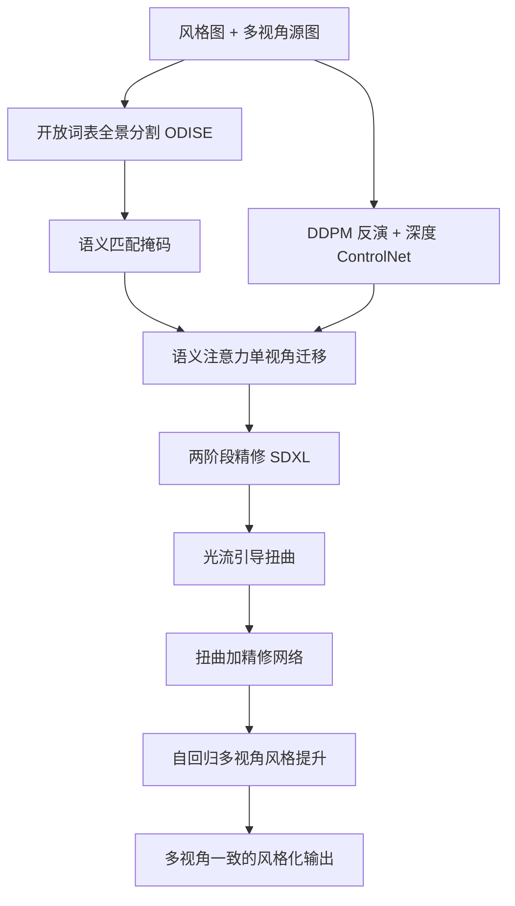

## 一句话总结

ReStyle3D 通过显式的开放词表语义对应，把一张室内设计参考图的外观按对象级精准迁移到多视角真实场景上，并借助两阶段流程保持多视角一致性。

## 研究背景

在虚拟布景、室内装修等实际应用中，用户希望把一张风格图的外观迁移到真实场景，但迁移应当是"对象级"的：沙发的纹理只应迁移到沙发，地毯只应迁移到地毯。现有方法存在两类短板。一类图像风格化方法（如 StyleID、IP-Adapter）把风格图当作全局特征处理，忽略了对象之间的语义对应，导致细粒度纹理无法映射到语义匹配的区域。另一类基于语义对应的方法虽然能对齐单个物体，但通常工作在很低的空间分辨率（常见 $$64 \times 64$$），难以处理有强透视、多实例的复杂场景。

此外，当场景由多张图像表示时，还需保证多视角一致性。已有的多视角编辑方法通常要求已知相机位姿和已建好的三维表示（如神经辐射场或 3D 高斯泼溅），需要稠密视角输入和大量计算，难以适配稀疏或随手拍摄的视频。作者认为，一种保留几何线索、又不依赖重度三维建模的像素空间方案更可取，但此前研究不足。

## 方法

整体框架为两阶段流水线。第一阶段在单视角上做免训练的语义外观迁移：用开放词表全景分割建立风格图与源图之间的实例级稠密对应，并把这种对应注入预训练扩散模型的自注意力，实现对象级迁移。第二阶段把单视角结果通过"扭曲加精修"网络扩散到其余视角，以单目深度和像素级光流为引导，用自回归方式传播风格，保持跨视角一致。

关键设计：

- 开放词表语义匹配：用全景分割模型 ODISE 为风格图和源图各生成分割图，据此构建语义对应，不受预定义类别限制，能在杂乱室内场景中稳健对齐。
- 语义注意力注入：在扩展的自注意力里用注意力掩码 $$M$$ 约束，源图中第 $$i$$ 区域只从风格图中语义同类的第 $$j$$ 区域采样外观，公式为 $$\phi_{out}= \mathrm{softmax}\left(\frac{Q_{out} K_{style}^{T}}{\sqrt{d_h}}\odot M\right) V_{style}$$；无匹配区域则关注整张风格图以保持全局协调。
- 引导与精修：结合无分类器引导、语义路径与深度 ControlNet 三路噪声预测，最终预测 $$\hat{\epsilon}_t= (1-\alpha)\epsilon_t+ \alpha(\lambda_s \epsilon_t^s+ \lambda_d \epsilon_t^d)$$；再从 $$512\times512$$ 上采样到 $$1024\times1024$$，用 SDXL 做 SDEdit 式精修增强细节。
- 多视角风格提升：用立体匹配得到光流，经 softmax splatting 把已风格化视角扭曲到目标视角，再训练两视角扭曲加精修模型补全缺失像素；自回归时融合前一帧与两个随机历史帧，用指数加权平均混合，兼顾时间一致性与清晰度。

## 实验结果

在 SceneTransfer 基准（25 张室内设计图、31 个室内场景、243 个风格-场景组合）上评测二维外观迁移，ReStyle3D 在结构保持和风格感知相似度上综合最优。精修步骤把 AbsRel 从 11.30 降到 8.34，SqRel 从 2.65 降到 1.67。

| 方法 | AbsRel↓ | SqRel↓ | δ1↑ | DINO↑ | CLIP↑ | DreamSim↓ | 平均排名 |
| --- | --- | --- | --- | --- | --- | --- | --- |
| Cross-Image-Attn. | 22.47 | 7.944 | 5.78 | 0.553 | 0.709 | 0.414 | 4.8 |
| IP-Adapter SDXL | 9.38 | 1.847 | 79.29 | 0.570 | 0.752 | 0.371 | 3.0 |
| StyleID | 11.25 | 2.59 | 93.44 | 0.546 | 0.741 | 0.332 | 3.2 |
| ReStyle3D（无精修） | 11.30 | 2.65 | 89.11 | 0.586 | 0.778 | 0.319 | 2.5 |
| ReStyle3D（有精修） | 8.34 | 1.67 | 88.45 | 0.584 | 0.783 | 0.316 | 1.5 |

27 位参与者的用户研究中，ReStyle3D 以 42.4% 的偏好率排名第一（StyleID 36.9%）。在两视角新视角合成上，ReStyle3D 在 PSNR、SSIM、LPIPS、FID 上全面领先，且比次优的 ViewCrafter 快约 10 倍。多视角一致性代理评测（用 DUSt3R 估计位姿并比较）中，其旋转与平移 AUC 也显著高于基线。

## 亮点与局限

亮点：把开放词表语义对应显式注入扩散自注意力，实现对象级而非全局的场景级外观迁移；两阶段设计免训练做单视角迁移、再学习式扩散到多视角，无需已知位姿或三维建模，输出可直接用现成三维重建管线；提出了 SceneTransfer 新任务与基准。

局限：风格图与源图之间剧烈的光照差异会干扰外观迁移；小物体容易被分割模型漏检。

## 延伸思考

方法对分割质量有较强依赖，若能引入更鲁棒或可交互的分割与匹配，或将语义对应扩展到光照分解层面，可能缓解光照差异与小物体漏检问题。其"像素空间保留几何线索 + 自回归传播"的思路，也为无需重度三维表示的多视角一致编辑提供了一条值得借鉴的路径，适合拓展到视频风格化与更大范围场景的虚拟布景。
