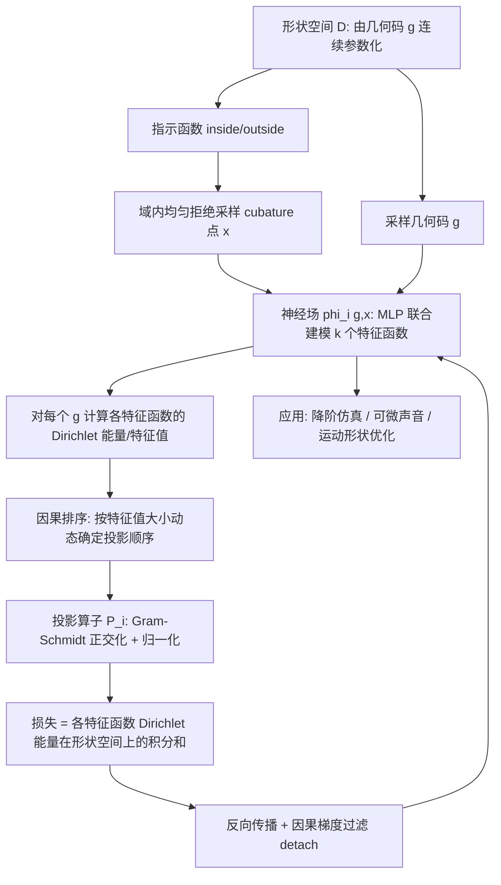

## 一句话总结

把"只能对单个形状做的特征分析（Laplace 特征函数、弹性能 Hessian 模态）"推广到"整个连续参数化的形状族"：用神经场表示随形状参数连续变化的特征函数，并通过因果排序与因果梯度过滤解决特征值交叉时的模态一致性问题，使得特征函数对形状参数可微，从而支持一模型多形状的降阶仿真与基于特征的逆向形状设计。

## 研究背景

偏微分方程（PDE）算子的特征函数是物理约束设计的核心工具：Laplace 算子的特征函数描述低频热分布、几何距离与曲率；弹性能 Hessian 的特征函数（弹性模态）描述振动模式与共振频率，用于声音分析、形变可视化和运动控制。

传统做法的痛点在于：特征分析几乎总是绑定到**单个形状及其离散化**。给定一个网格，构造离散算子（如 cotangent Laplace 矩阵、弹性 Hessian），再做特征分解即可。但一旦形状发生改动，就必须重新划分网格、重建离散算子、重新做特征分解，而这一整套关于几何是**非线性**的。这对需要反复评估特征函数及其导数的场景（PDE 驱动的形状优化、交互式设计）是致命的：

- 优化过程中反复评估特征函数代价高昂；
- 特征函数关于形状参数的导数难以直接获得。

作者的目标是：构造一个跨越整个形状空间的特征函数表示，能对任意形状（包括训练时未见过的形状）高效求值，并且由于与几何共享连续参数，天然对形状参数可微。据作者所述，这是文献中首个针对连续参数化形状族的特征分析方法。

方法只依赖一个**内外指示函数（inside/outside indicator）**，因此与具体形状表示无关，适用于点云、符号距离场（SDF）、四面体网格、以及在真实数据集上训练的神经隐式表示。

## 方法

### 整体流程

### 单形状的变分视角

先在单个非参数形状 $\Omega \subset \mathbb{R}^n$ 上建立基础。Laplace 算子的主特征函数是在单位范数函数空间中最小化 Dirichlet 能量的函数：

$$E_D[\phi] = \frac{1}{2}\int_{\Omega} \vert \nabla \phi\vert ^2 \, d\Omega$$

后续特征函数在"已剥离前序模态"的正交补空间中继续最小化 Dirichlet 能量（Courant-Fischer-Weyl 的"剥洋葱"式极小极大原理）：

$$\phi_i = \arg\min_{\phi \in \mathcal{U} \cap \mathcal{C}_i} E_D[\phi], \quad \mathcal{C}_i = \mathrm{span}\{\phi_1, \dots, \phi_{i-1}\}^{\perp}$$

由于嵌套空间的性质，特征值单调递增 $\lambda_1 \le \lambda_2 \le \dots$。因为没有显式施加边界条件，极小化子自动满足自然边界条件，即 Dirichlet 能量对应的 Neumann 零通量条件 $\partial \phi_i / \partial n = 0$。

### 用神经场实现单形状特征分析

每个特征函数被建模为神经场与投影算子的复合：

$$\phi_i = \mathcal{P}_i \circ \varphi_i$$

其中 $\varphi_i$ 是把域内位置 $\boldsymbol{x}$ 映射到场值的 MLP，投影算子 $\mathcal{P}_i$ 把任意场投影到满足正交与单位范数约束的空间。域积分用**随机 cubature**（在轴对齐包围盒内均匀采样，再用指示函数拒绝域外点）来估计，这正是方法与表示无关的关键。

投影分两步：Gram–Schmidt 正交化 + 归一化。正交化时先求出对前序特征函数的最佳 $\boldsymbol{\lambda}$-加权组合再扣除：

$$\phi_m^p = \varphi_m - \boldsymbol{\lambda}^T \boldsymbol{\phi}, \quad \boldsymbol{\lambda} = \arg\min_{\boldsymbol{\lambda}} \| \boldsymbol{\lambda}^T \boldsymbol{\phi} - \varphi_m \|^2$$

归一化用 $L_2$ 范数（同样用 cubature 估计），并对范数梯度做近似（视范数为与自变量无关）以加速。

**弹性扩展**：只需把标量 Dirichlet 能量替换为向量值弹性能量泛函（线性弹性小应变张量的 Frobenius 范数项 + 迹项），其余理论与实现不变。已知模态（Laplace 的常函数零模、弹性的刚体平移/旋转零模）被解析地硬编码，避免浪费计算。

### 跨形状空间：三个关键设计

把域 $\{\Omega_{\boldsymbol{g}} \mid \boldsymbol{g} \in D\}$ 用几何码 $\boldsymbol{g}$ 参数化，特征函数变为 $\phi_i(\boldsymbol{g}, \boldsymbol{x})$，MLP 同时吃形状码与空间坐标。变分目标是各特征函数 Dirichlet 能量在形状空间上的积分和：

$$\arg\min_{\phi_0 \dots \phi_k} \sum_{i=0}^{k} \int_D E_D[\phi_i^{\boldsymbol{g}}] \, d\boldsymbol{g}, \quad \text{subject to orthogonality}$$

难点在于：特征值作为形状空间上的函数会**交叉并交换主导地位**（在几何对称、特征值多重的点处）。如果沿用固定的主导顺序（"fixed order"），会人为制造出只在设计空间上分段光滑、在交叉点有尖点（kink）的特征函数曲线——这对神经场训练有害，消耗网络容量、拖慢收敛，并破坏依赖光滑性/可微性的下游应用。作者借用 Kato 的扰动理论视角：把特征值看作**无序集合**，下标只是唯一标识而非排序，这样特征值/特征函数在多重点交叉处仍是光滑的。

为此提出三个互相咬合、缺一不可的设计：

1. **联合训练（Joint training）**：不再顺序剥离一个有序序列，而是同时联合优化一个无序的特征函数集合，允许不同函数在形状空间的不同区域主导。附带好处是联合训练比顺序方式快 2× 到 4×。

2. **因果梯度过滤（Gradient causal filtering）**：联合训练时，正交化约束的梯度同时作用于"主导场"和"被主导场"，产生"作用-反作用"伪影——被主导函数会反过来"推挤"主导函数偏离其最优。真正符合因果的只有"被主导函数在正交子空间内自我调整"（action），而"通过修改主导函数来改变可行空间"（reaction）违反因果。解决办法是在反向传播中**不对主导函数求该约束的梯度**，用 PyTorch 的 `detach()` 实现。

3. **形状相关的因果排序（Shape-dependent causal sorting）**：由于因果关系的顺序无法预先确定且随形状空间变化，在每个优化步、每个形状空间采样点上，通过比较各特征函数的特征值（等价于 Dirichlet 能量）动态确定主导顺序，再据此顺序构造投影算子。哪个模态特征值更小就在该处占主导。

三者结合，首次得到能在多重点处正确追踪特征值交叉、且随形状空间光滑演化的形状相关特征函数表示。

## 实验结果

**训练/推理统计**（AMD Ryzen 9 7950X + NVIDIA RTX 4090）：不同例子训练时长从 Airplane 的 69 秒到 Simulation on Wide Range of Shapes 的 35 小时不等；单个 MLP 参数量约 4.6k–15k；在 30k cubature 点上评估所有特征函数的单次推理时间为毫秒级（多数示例 3–11 ms）。

**与离散算子的一致性**：在单形状上与 cotangent Laplace 矩阵对比，前 20 个特征函数平均差异约 6%，增至 50 个特征函数时约 20%，与 Sharp and Crane [2020] 的无网格连接特征分析精度相当。在有解析解的 1D 域上，第 16 个特征函数 MSE 为 $8\times10^{-5}$，第 31 个为 $3\times10^{-4}$，高度吻合解析结果。

**旋转不变性**：对同一形状旋转 30° 和 60° 重新训练，前 30 个模态相对原始域的平均误差分别为 0.22% 与 0.25%，与仅因重新初始化网络权重带来的 0.2%–0.3% 波动同量级，说明无明显旋转偏差。

**降阶仿真**：在 Fig. 图示的桥梁形状空间上，对比全空间仿真，全空间每帧 311.0 ms，降阶仿真每帧 9.6 ms，加速 32.4×，最终位移的均方误差为 2.4%。用一个降阶模型即可仿真来自 13+ 个 ShapeNet 类别、超过 250 个形状（含训练集外形状），切换形状只需换形状码，无需重新划分网格或重训网络。相比需为每个形状重训的 Modi et al. [2024]，在处理 200+ 查询形状时更高效，且内存开销恒定（不随形状数增长）。传统流程中，一次 30k 顶点的标准特征分解（SciPy）算前 15 个模态需 6 秒以上，而本方法在相同 cubature 点数下仅需 0.005 秒。

**可微模态声音合成（复现 DiffSound [Jin et al. 2024] 的体积厚度推断）**：在四个形状上评估厚度推断的平均绝对误差（MAE，对目标厚度 0.3/0.4/0.5/0.6/0.7 取平均）：

| 物体 | MAE（DiffSound / 本方法） |
|------|------|
| Bunny | 0.0073 / 0.0016 |
| Armadillo | 0.0623 / 0.0075 |
| Bulbasaur | 0.0125 / 0.0023 |
| Squirtle | 0.0177 / 0.0054 |

本方法在取得可比甚至更低误差的同时大幅缩短查询时间：DiffSound 每次查询约两小时，本方法在三分钟内完成，约 40× 加速（本方法需约 7 小时/形状空间的预训练，在处理 4 个及以上查询时更划算）。

**音高优化**：构造 4 维酒杯形状空间（控制杯口半径、底座半径、杯柄长度、全局缩放），对选定低频模态优化其特征值以匹配目标音符频率（do 261.63 Hz 到 la 440.00 Hz），每次优化 500 步梯度下降、耗时不到 50 秒，成功让敲击杯沿奏出《小星星》旋律。

**运动形状优化**：把特征函数作为驱动力信号，先设计 3 维行走机器人形状空间，优化后的机器人比初始设计快 18×。消融显示：无因果排序时，模态在交叉处突变导致形状空间梯度范数增大、优化更难，且从不同初值出发会收敛到两个不同的运动模式（一个侧向走、一个竖直走，其中一个是局部极小）；有因果排序时只得到一个稳定一致的解。方法还扩展到由 12 种动物 SDF 插值得到的 12 维形状空间。

## 亮点与局限

**亮点**
- 首个面向连续参数化形状族的特征分析方法，特征函数关于形状参数天然可微，直接打通了"基于特征模态的逆向设计"这条路。
- 与离散化/表示无关，只需内外指示函数，能统一处理点云、SDF、四面体网格与神经隐式表示，甚至可直接在生成模型的隐空间里做仿真而无需划分网格。
- 因果排序 + 因果梯度过滤是解决"特征值交叉时模态一致性"这一核心难题的干净方案，且因果梯度过滤是一种可推广到任意联合训练因果约束的通用技巧。
- 一模型覆盖整族形状，内存开销恒定，处理大量查询形状时相较逐形状重训的方法优势明显。

**局限**
- 对单个三角网格，cotangent 矩阵的特征分解比随机梯度下降优化更快；本方法的优势只体现在形状空间与通用表示的泛化上。
- 特征函数越多，其空间频率越高，而高频是神经场训练的已知难点。
- 目前仅支持 Neumann 边界条件，Dirichlet/Robin 条件需未来用 PINN 类技术处理。
- 随机 cubature 目前对所有样本均匀加权，非均匀域可能需要重要性采样与逐形状的权重归一化。
- 用有限个特征函数截断无限维空间，会漏掉来自更高频特征函数的交叉（如 Fig. 图示中第 7 个特征函数的尖点），这是有限预算下的根本限制。

## 延伸思考

- 作者指出可以用**形状空间梯度范数** $|\partial \phi(\boldsymbol{x}, \boldsymbol{g}) / \partial \boldsymbol{g}|^2$ 作为"漏掉的高频交叉"的可靠指示器——在交叉点处该范数显著增大。这既是诊断工具（决定哪些特征函数该丢弃或谨慎使用），也提示了一个有趣方向：把该梯度范数纳入训练目标，或许能得到在形状族间演化更光滑的特征函数。
- 数学框架本身不依赖神经场，变分公式、因果梯度过滤、因果排序原则上可迁移到更易表达高频的其他表示上，这可能缓解高频训练难题。
- 因果梯度过滤（用 `detach` 强制约束的单向因果性）本质上是"联合优化受约束链条时如何避免下游约束反噬上游变量"的通用范式，值得在其他多网络联合训练、层次化约束优化场景中借鉴。
- 作者展望的应用面很广：几何处理（谱方法）、计算机视觉（形状对应）、计算物理（流固/可变形体耦合），凡是依赖 PDE 算子特征分析的领域都可能受益于"形状相关的特征函数表示"。一个自然的后续是用延拓方法（continuation methods）在不无限扩大特征函数预算的前提下"补全"那些不完整的特征函数曲线。
