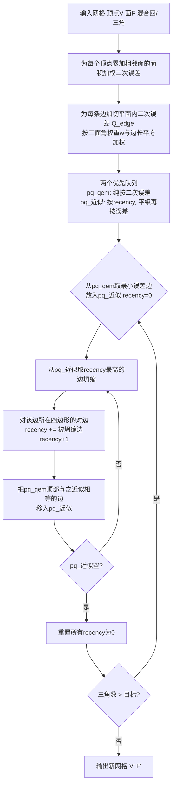

## 一句话总结

用最普通的"单边坍缩"（single edge collapse）加上三个小改动——按二面角加权的逐边二次误差、对"近似相等"边引入近邻优先的偏序、以及从当前状态而非初始状态度量误差——就能在几乎不损失几何精度的前提下保住输入网格的四边形拓扑，从而把三角形简化器直接变成四边形主导（quad-dominant）网格简化器。

## 研究背景

游戏和影视里的 LOD（多层次细节）生成长期依赖二次误差度量（QEM）的网格简化，它能很好地保住几何外观、UV、法线、蒙皮权重等属性，是工业标准（Simplygon、InstaLOD、Blender、Unreal 的 Nanite 等都基于它）。但这些工具几乎只针对三角网格、只关心渲染外观，简化后网格的拓扑往往被彻底破坏，变得杂乱无章。

而美术师产出的通常是"四边形主导"网格，讲究干净的边拓扑和边环（edge loop）。边环影响动画和形变，还能"复现真实物体的肌肉结构"，因此美术手工做的 LOD 会同时保住外观和四边形拓扑。现有能保四边形的工具（如 Simplygon 的 quad reduction）又只吃纯四边形网格，实践中很脆。

作者指出三角简化和四边形简化"建立在根本不同的操作上"：三角简化用单边坍缩，而四边形简化要求整组边被原子性地一起坍缩（如 quad-chord 移除、对角坍缩、singlet/doublet 坍缩）。EA 的 Frostbite 引擎有一套支持混合四/三角输入、保四边形和对称性的私有工具，但它复杂、启发式众多、不公开、难以复现。它带来的一个关键洞见是：美术并不要求所有四边形都保留，只要"大部分"保住即可。

作者由此追问：能不能有更简单的办法在网格简化中保住拓扑和四边形？并定位了三角简化保不住四边形的三个根因：

- 每个二次误差在面切平面内是病态的，坍缩出的顶点可以落在面平面的任意位置，二次误差无法区分。
- 四边形网格和 quad-chord 里存在二次误差近似相等的边。由于浮点误差或微小但真实的几何差异，这些边被当作不同，从而在坍缩排序上被随机化。
- 无记忆（memoryless）简化丢弃了输入网格的约束，使拓扑难以保留。

## 方法

整体流程：给每条边加一个切平面内的加权二次误差 → 用双优先队列把"误差近似相等"的边归为一类并在类内按 recency 排序（隐式地整条 quad-chord 一起坍缩）→ 用新的误差公式从当前状态度量引入误差，取代无记忆简化。

**逐边二次误差（切平面约束）。** 标准 QEM 只有面平面的二次误差，共面区域内坍缩点位置无约束，导致四边形不保。作者对每条边 $e=(e_0,e_1)$ 及其所在面 $f$，额外加一个与相邻面法线正交的二次误差，其法向为边方向与面法线的叉积。这个二次误差按二面角加权：

$$w=\begin{cases}\dfrac{1}{\pi}\arccos\!\big(n(f_0)^\top n(f_1)\big) & (e_0,e_1)\in f_0,f_1\\[2mm] 1 & \text{非流形边}\end{cases}$$

$$Q'_{\text{edge}} = w\,\lVert e_0-e_1\rVert^2\,Q_{\text{edge}}$$

其中对流形边用二面角、非流形边取 1，并约束 $w=\max(w,\,1\times10^{-2})$ 防止退化。这一项让顶点在切平面内均匀分布、并保住尖锐特征。由于是逐边二次误差，天然支持"权重绘制"：可按对称性或关节影响差异抬高特定边的权重。

**软对称保持。** 把对称当作软约束。对每条边计算跨越"该边与其两相邻面夹角平分向量所张平面"的顶点匹配，$s\in[0,1]$ 为在阈值 $\epsilon_{\text{sym}}$ 内有对称匹配的顶点占比，再令 $w=\max(w,\lambda_{\text{sym}}s)$。这样对称轴上、到对称面等距的边被赋予同等重要性从而被保留。代价是 $O(|V||E|)$，只适合较小网格且只能识别外在对称。

**关节保持。** 端点关节影响分布差异大的边应少被坍缩。对每条边计算关节影响分布的 $\ell_1$ 差异 $d=\tfrac12\ell_1(j_0,j_1)\in[0,1]$，再令 $w=\max(w,\lambda_{\text{joint}}d)$。肘部、手指等关键关节差异最大，可控制其保留强度。

**对近似相等边的排序（核心）。** 作者反对"二次误差严格决定坍缩顺序"这一隐含假设。对一个立方体，所有边误差本应相等，浮点误差却让排序"确定性地随机化"，进而摧毁拓扑。于是把误差比较改为偏序：定义近似相等

$$a\approx b \;\Longleftrightarrow\; \lvert a-b\rvert < \epsilon_{\text{abs}}$$

把可坍缩边划成"等价类"，类内再引入一个偏好坍缩 quad-chord 的额外排序。$\epsilon_{\text{abs}}$ 越大保四边形越多、几何相似度略降，反之亦然，成为一个可调旋钮。

类内排序用一个叫 **recency（近因）** 的状态量实现：每坍缩一条边，就把它所在四边形对边的 recency 设为"被坍缩边 recency + 1"。类内优先坍缩 recency 最高的边，于是对边会更早被坍缩，隐式地把整条 quad-chord 逐次坍掉；整个等价类坍完后把所有 recency 重置为 0。实现上用两个优先队列：`pq_qem` 纯按二次误差，`pq_≈` 按 recency（平级再按误差）。

**从当前状态度量误差（取代无记忆简化）。** 精确排序要求不使用无记忆简化（无记忆简化会改变 2-ring，使对边脱离等价类）。作者改写误差公式，让它度量"相对当前网格新引入的误差"而非"相对初始网格的误差"：

$$\mathrm{QEM}(e,v) = \big(Q_{e_0}+Q_{e_1}\big)(v) - \big(Q_{e_0}(e_0)+Q_{e_1}(e_1)\big)$$

第一项是原始 QEM，减去的第二项是两端点当前二次误差之和。这样此前已引入误差、但未来坍缩不再追加误差的坍缩不会被重复惩罚——效果等价于无记忆简化，且作者推测这正是无记忆简化"看起来更好"的真正原因。

**蒙皮网格简化。** 直接沿用 Hoppe 的属性 QEM 处理关节影响：把每个关节影响当作普通属性，存线性泛函 $j_{ib}(p)=g_{ji}^\top p + d_{ji}$；只存非零影响、每顶点上限 16 个（超出丢弃最小权重者），坍缩后恢复所有受影响骨骼、取权重前 4 归一化。作者强调之前工作都断言 Hoppe 不适合关节保持却从未给出证据，本文实测反驳了这一假设。属性 QEM 通过求解一个带法线行约束的最小二乘（QR 求解 $g,d$）自然推广到任意顶点数的多边形面。

## 实验结果

数据集为 Sketchfab 的 67 个静态混合四/三角网格 + 19 个动画三角网格（GLB 格式只支持三角形，故动画只比几何、不比四边形保持）。对比对象：内部工业级 QEM 工具（实现了 Hoppe 与 Landreneau-Schaefer，可通过三角化+标记边再恢复四边形）、以及 MeshLab 的二次简化（只吃纯三角网格，无法保四边形）。默认 $\lambda_{\text{joint}}=1,\ \lambda_{\text{sym}}=0,\ \epsilon_{\text{abs}}=5\times10^{-6}$。均在 AMD Ryzen Threadripper 3970X 上单线程运行。指标为 Chamfer / Hausdorff 距离（越低越好）与四边形保持比（输出四边形/三角比 相对 输入四边形/三角比，越高越好）。

静态网格汇总（本文 / QEM / MeshLab）：

- 50% 三角比：平均 Chamfer $1.775\times10^{-4}$ / $2.881\times10^{-4}$ / $2.661\times10^{-4}$；平均 Hausdorff $7.692\times10^{-3}$ / $6.081\times10^{-3}$ / $4.977\times10^{-3}$；四边形保持中位数 0.949 / 0.674 / 不适用。
- 25% 三角比：平均 Chamfer $5.830\times10^{-4}$ / $7.950\times10^{-4}$ / $9.485\times10^{-4}$；平均 Hausdorff $1.067\times10^{-2}$ / $1.069\times10^{-2}$ / $1.221\times10^{-2}$；四边形保持中位数 0.761 / 0.437 / 不适用。
- 10% 三角比：平均 Chamfer $1.811\times10^{-3}$ / $2.066\times10^{-3}$ / $3.160\times10^{-3}$；平均 Hausdorff $1.970\times10^{-2}$ / $2.135\times10^{-2}$ / $2.366\times10^{-2}$；四边形保持中位数 0.622 / 0.256 / 不适用。

可以看到本文在 Chamfer 上几乎全面领先，Hausdorff 在 50% 时略逊于两个基线、但在 25%/10% 时反超，且四边形保持中位数在各档都约高出 30% 左右。作者总结本文"更一致地保住四边形，且几何质量无折损"。单个角色网格（输入 67632 四边形/64 三角）示例中，本文在 50% 时 96% 的面仍是四边形、25% 时 86%、10% 时约 41%（低比例下主动引入三角以保几何质量），而 QEM 与 MeshLab 在 25% 时已基本认不出输入拓扑。

动画（蒙皮）网格：统计前 50 帧平均距离更低的模型数（QEM 采用 Landreneau-Schaefer，本文用 Hoppe 保关节影响）。50% 档：更低 Chamfer 的模型数 QEM 1 / 本文 18，更低 Hausdorff 5 / 14；25% 档：Chamfer 3 / 16、Hausdorff 5 / 14（另一组 25% 数据为 Chamfer 1 / 18、Hausdorff 5 / 14）。本文在绝大多数模型上稳定占优。

对称保持：在反射对称（mech 网格头部、身体下部）与径向对称（中央环延伸管道）示例上，本文能保住关键对称轴，QEM 不能。例如 mech 网格本文 Hausdorff $1.315\times10^{-2}$ 优于 QEM 的 $1.448\times10^{-2}$。

运行时：理论 $O(n\log n + k\log k)$（$k$ 为第二队列规模，实践中 $k\ll n$），因边坍缩开销主导，实测与 QEM 一样呈线性。

消融要点：

- **recency**：开启后边流强保留、四边形几乎全保（示例 43199 四边形/102 三角），关闭则边流被破坏、引入大量三角（26326/33989），但关闭时几何相似度反而略好——即用极小几何代价换回拓扑。
- **新 QEM 公式（式 5）**：在都不用无记忆简化的前提下，新公式几何相似度和拓扑都优于原始 QEM。
- **二面角加权（式 2）**：$w=0$ 会产生翻转退化面（Chamfer $5.587\times10^{-2}$）；$w=1$ 均匀权重会过度平滑尖边（$7.257\times10^{-4}$）；二面角加权最好（$3.433\times10^{-4}$），且输出二面角分布最贴近输入。
- **$\lambda_{\text{joint}}$**：$\lambda_{\text{joint}}=1$ 时动画全程 Chamfer/Hausdorff 均优于 0 和 10；取 10 会在关节处过度保留反而拉低整体相似度。
- **$\epsilon_{\text{abs}}$**：从 $1\times10^{-6}$ 增到 $1\times10^{-4}$，四边形保持显著上升，几何距离仅增约 $1.5\times10^{-4}$（通常肉眼不可察）。

## 亮点与局限

亮点：

- 思路极简且实用——不发明新的原子操作，只在标准单边坍缩 QEM 上加三处改动，就把任意三角简化器"升级"为四边形主导简化器，工业界易于采纳。
- 核心洞见有普适价值：纯按几何误差排序定义了"过强"的全序，把它松弛为偏序后就能自由塞入保四边形（乃至保拓扑）的排序准则。
- 逐边二次误差自然支持"边权绘制"，一套框架顺带解决软对称保持与关节保持。
- 顺手纠正了领域内一个长期未经检验的假设：Hoppe 的属性 QEM 其实很适合保关节影响，效果优于专门方法。
- 能处理混合四/三角输入（现有保四边形工具多只吃纯四边形），且几何质量不降反常有提升。

局限：

- 不保证 100% 四边形保留，通常会在四边形误差不同的区域之间引入少量三角；可构造对抗性四边形网格（对边误差差异极大）使算法失效。
- 对称保持复杂度 $O(|V||E|)$，只适合较小网格；且只能识别外在对称，无法处理内在（拓扑）对称——留作未来工作。
- 动画实验受限于 GLB 只支持三角形，无法评估动画网格的四边形保持。
- 极端简化（网格已明显偏离原形）时才会触发关节影响的丢弃裁剪，本文数据集未出现此情形，属未充分验证的边界。

## 延伸思考

- "把严格全序松弛为偏序、在等价类内塞入领域偏好排序"是一个可迁移的元思想。凡是"排序由带噪声的连续代价驱动、但真正在意的是离散结构保持"的贪心流程，都可能套用：如网格重划分、路径规划中的等代价平局、调度里的近似相等任务分组等。
- recency 本质上是给贪心过程注入"结构性记忆"，让局部操作产生全局的链式效果（整条 quad-chord 被隐式一起坍掉）。这提示：单边操作 + 恰当的状态传播，可以在不引入昂贵原子操作的前提下逼近原子操作的效果。
- 把"从初始状态度量误差"改为"从当前状态度量误差"（式 5），既解释了无记忆简化为何有效、又能在保留全部约束的同时享受其收益，这个视角对其他基于累积误差的简化/优化流程可能同样适用。
- 对称保持的 $O(|V||E|)$ 是实用瓶颈，若能用近似最近邻或哈希匹配加速、或扩展到内在对称检测，方法的适用面会明显扩大。
