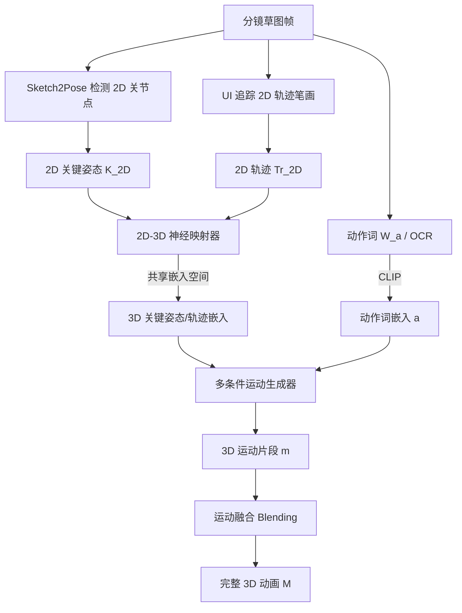

# Sketch2Anim: Towards Transferring Sketch Storyboards into 3D Animation

## 一句话总结

把分镜草图（2D 关键姿态 + 关节轨迹 + 动作词）自动翻译成高质量 3D 动画，核心是用 3D 条件训练、2D 条件推理的"神经映射器"跨越 2D–3D 域差，再用"轨迹 ControlNet + 关键姿态适配器"同时注入多种控制信号。

## 研究背景

分镜（storyboard）是 3D 动画创作的常用起点：动画师在若干 2D 草图帧里画出角色的关键姿态、关节运动轨迹，并标注一个动作词（如 Jump、Kick）。传统流程中，动画师要以这些草图为参照，手动摆放预定义的 3D 骨骼去匹配 2D 姿态，再反复试错让 3D 运动符合轨迹和动作语义。这一过程高度依赖多年经验，既费力又耗时，因此把 2D 分镜直接翻译成 3D 动画的自动化方法需求很高，但此前几乎无人系统研究。

早期最相关的工作是基于草图的运动检索：从草图抽取手工特征（关节角、骨骼向量）在预采集数据库里找最近似的动画。这类方法受限于数据库的覆盖范围，可扩展性和表现力都不足；当同时存在多种草图类型（关键姿态与轨迹）时，也很难设计合理的匹配打分函数。

作者把问题重新表述为条件运动生成，并拆成两个子问题：一是从原始草图中获得准确的 2D 关键姿态与轨迹（已有 Sketch2Pose 等成熟方案，作者直接复用其 2D 关节检测），二是在 2D 关键姿态、轨迹、动作词共同约束下生成高质量运动片段——本文聚焦第二个子问题。

关键难点在于 2D 输入与 3D 运动之间的巨大域差：检测到的 2D 关键姿态在像素空间，2D 轨迹在时空 4D 空间，都是想象中 3D 运动的投影，直接以 2D 为条件很难学好。而 3D 关键姿态与轨迹信息量更大、指导更明确，但已有条件运动生成方法通常只能吃一到两个控制信号（如文本、文本+3D 轨迹），无法同时服从动作词、关键姿态和轨迹三种约束。

## 方法

整体受传统动画流程两个操作的启发：把 2D 关键姿态和轨迹"抬升"到 3D，再据此雕琢生动运动。Sketch2Anim 没有做数学意义上的显式抬升，而是设计了两个核心模块。

核心思想：训练阶段用信息量更大、更精确的 3D 关键姿态和轨迹作为条件；推理阶段则依靠一个把 2D 与 3D 对齐到同一嵌入空间的神经映射器，直接吃分镜里检测出的 2D 关键姿态和轨迹。

### 统一表示

关键姿态、轨迹、运动都用统一矩阵表示。2D 关键姿态（22 个 2D 关节）填入首帧或末帧，记作 $K_{2D}\in\mathbb{R}^{N\times J\times 2}$，其 3D 对应为 $K_{3D}\in\mathbb{R}^{N\times J\times 3}$；轨迹同理为 $Tr_{2D}$ 和 $Tr_{3D}$。运动沿用 HumanML3D 的冗余表示（含局部与全局的位置和旋转），单个片段 $\boldsymbol{m}\in\mathbb{R}^{N\times D}$，默认 $N=40$ 帧（2 秒），$D=263$。

### 多条件运动生成器

建立在潜空间运动扩散模型之上。给定 3D 关键姿态、轨迹和动作词嵌入 a，第 $t$ 步去噪定义为在潜码上预测噪声。两个关键设计：

- **轨迹 ControlNet $F_{tr}$**：扩散模型 Transformer 编码器的可训练副本，每层接一个零初始化线性层。轨迹编码器把轨迹嵌入注入噪声潜码得到条件潜码，再经 ControlNet 预测残差特征 r：

$$\boldsymbol{z}'_t = \boldsymbol{z}_t + E^{3D}_{tr}(Tr_{3D}), \quad r = F_{tr}(\boldsymbol{z}'_t, t, a)$$

- **轨迹感知的关键姿态适配器 $F_k$**：置于 ControlNet 与扩散模型之间。作者认为关键姿态是对"动作如何执行"的细化解释，因此把关键姿态嵌入与动作词嵌入相加得到"接地动作嵌入" a′：

$$\boldsymbol{a}' = \boldsymbol{a} + E^{3D}_k(K_{3D})$$

适配器接收 ControlNet 的残差 r、噪声潜码和 a′，学习残差修正 r′ 再注入扩散模型：

$$r' = F_k(\boldsymbol{z}_t, t, r, \boldsymbol{a}')$$

$$\epsilon_t = \epsilon_\theta(\boldsymbol{z}_t, t, a) + Z(r')$$

这个设计的巧妙之处在于分工：轨迹捕捉全局动态和时间关系，关键姿态只在特定时刻施加局部静态约束。让适配器在 ControlNet 已建立的全局运动基础上"精修局部姿态"，避免了两个条件互相干扰——这也解决了多个 ControlNet 残差融合难、损失权重难平衡的问题（消融显示关键姿态收敛比轨迹快近十倍）。

### 训练损失

冻结扩散模型，只训练 ControlNet 和适配器。除标准噪声重建损失 $L_{recon}$ 外，还在关节全局绝对位置空间加两项约束：轨迹损失 $L_{tr}$（掩码加权的生成与真值轨迹 $L_2$ 距离）和关键姿态损失 $L_{key}$（先转全局位置再减去根关节位置以忽略全局摆放）：

$$L_{gen} = L_{recon} + \lambda_{tr}L_{tr} + \lambda_{key}L_{key}$$

### 2D-3D 关键姿态与轨迹对齐

生成器训练完成后，冻结 3D 编码器，单独训练 2D 轨迹编码器和 2D 关键姿态编码器去对齐 3D 对应物。损失包含：配对匹配损失 $L_{match}$（拉近 2D/3D 配对嵌入）、2D 条件下的噪声重建损失 $L_{recon}$（保证 2D 条件也能生成合理运动）、以及 CLIP 式对比损失 $L_{contrast}$：

$$L_{align} = L_{match} + \lambda_r L_{recon} + \lambda_c L_{contrast}$$

### 推理与融合

推理时直接输入 2D 关键姿态和轨迹，采用无分类器引导（scale $w_c=7.5$）；再借鉴分类器引导做推理引导，每步去噪迭代 4 次，最小化生成运动投影轨迹与 2D 轨迹的差异。多个片段之间用线性混合初始化过渡运动，再经 DDIM 反演加引导去噪精修，最终拼成完整动画。

## 实验结果

在 HumanML3D 数据集（14,646 条运动、44,970 条标注）上训练与评测，单卡 RTX 4090。生成器训练约 1000 epoch（12 小时），2D-3D 对齐约 100 epoch（3 小时）。推理时生成一个 40 帧片段约 0.5 秒，两片段融合约 1 秒。评测三个维度：运动真实感（FID、脚部滑动比）、控制精度（MPJPE-2D/3D、轨迹 Avg. Err.-2D/3D）、文本-运动匹配（MM Dist、R-precision Top-3）。

对比三个自建基线（Motion Retrieval、Lift-and-Control、Direct 2D-to-Motion），主表（Average 模式）关键数字：

| 方法 | FID ↓ | 脚滑 ↓ | MPJPE-2D ↓ | Avg.Err.-2D ↓ | MM Dist ↓ | R-prec(Top3) ↑ |
|---|---|---|---|---|---|---|
| Motion Retrieval | 0.690 | 0.0640 | 0.0570 | 0.290 | 4.060 | 0.640 |
| Lift-and-Control | 0.979 | 0.0885 | 0.0537 | 0.261 | 3.297 | 0.752 |
| Direct 2D-to-Motion | 2.553 | 0.112 | 0.0403 | 0.193 | 3.723 | 0.687 |
| Ours | 0.525 | 0.103 | 0.0360 | 0.0867 | 3.077 | 0.802 |

本方法在控制精度和文本匹配上全面领先：相比 Direct 2D-to-Motion，FID 约低 5 倍，印证了"用 3D 输入作训练替身"的价值；相比 Lift-and-Control，2D 轨迹误差从 0.261 降到 0.0867，说明嵌入对齐比显式抬升更能规避误差。Motion Retrieval 因为直接用真实运动片段，真实感指标近乎最优，但控制精度和文本匹配受限于数据库覆盖。

消融实验（用 3D 条件，Average 模式）验证了生成器设计：

| 变体 | FID ↓ | 脚滑 ↓ | MPJPE-3D ↓ | Avg.Err.-3D ↓ | MM Dist ↓ | R-prec ↑ |
|---|---|---|---|---|---|---|
| Single ControlNet | 0.746 | 0.107 | 0.0566 | 0.257 | 3.077 | 0.787 |
| Double ControlNet | 0.608 | 0.0933 | 0.0428 | 0.246 | 3.046 | 0.790 |
| Global Keypose | 0.462 | 0.0958 | 0.0413 | 0.190 | 2.932 | 0.806 |
| Full Method | 0.446 | 0.0953 | 0.0399 | 0.162 | 2.884 | 0.814 |

单 ControlNet 因关键姿态比轨迹稀疏得多而最差（多项指标掉 50% 以上）；双 ControlNet 因两者竞争、训练曲线震荡而次之；把关键姿态嵌入加到噪声潜码（全局控制）会干扰轨迹，轨迹误差在两种模式下分别退化 17.2% 和 11.0%。完整方法（关键姿态嵌入加到动作词）几乎全面最优。

58 人参与的成对主观评测中，本方法相对 Direct 2D-to-Motion 在真实感/轨迹/关键姿态三项胜率为 88%/87%/90%，相对 Lift-and-Control 均超 82%，相对 Motion Retrieval 在轨迹与关键姿态精度上超 74%，仅在真实感上以 69% 略胜（因检索片段是真实捕捉数据、伪影少）。

应用方面：支持真实世界复杂草图（非只有火柴人）；作为副产品天然支持 3D 编辑——用户可拖拽关键姿态/轨迹采样点重新生成运动（如修正脚穿过桌面）；也验证了 Sketch2Pose 在潦草草图上的 2D 关节检测鲁棒，而其 3D 抬升不可靠，这正是本文只用 2D 关节作条件的原因。

## 亮点与局限

亮点：

- 首个把分镜草图直接翻译成高质量 3D 动画的方法，并配套基于草图的 Blender 动画设计系统。
- "3D 训练、2D 推理"的神经映射器思路优雅地绕过了 2D–3D 显式抬升的误差累积。
- 轨迹 ControlNet + 关键姿态适配器的层级式设计，解决了多条件运动生成中残差融合难、收敛速度悬殊的实际问题。
- 天然支持交互式 3D 运动编辑，无需修改模型。

局限：

- 不考虑角色-物体交互，如打高尔夫时双手不会握住球杆。
- 缺乏物理约束，可能生成物理错误的姿态（如倒立结尾时身体折叠悬浮空中）。
- 高度依赖 Sketch2Pose 的关节检测，草图偏离合理人体太多时会失败，需重画或手动调整关节点。

## 延伸思考

本文最值得借鉴的是"用高信息量模态在训练期作替身、用低信息量模态在推理期对齐"这一范式，本质上把困难的跨域抬升问题转化为可学习的嵌入对齐问题，对任何"输入信号退化但存在更丰富配对信号"的生成任务都有参考价值。层级式条件注入（一个条件建立全局骨架、另一个只精修局部）也提示：与其让多个平行控制器竞争，不如让它们在功能上分工递进。局限中提到的物理约束与角色-物体交互，恰是后续可以引入物理仿真损失或接触/抓握先验来补齐的方向；而对 Sketch2Pose 的强依赖也说明端到端联合训练草图理解与运动生成仍有空间。
