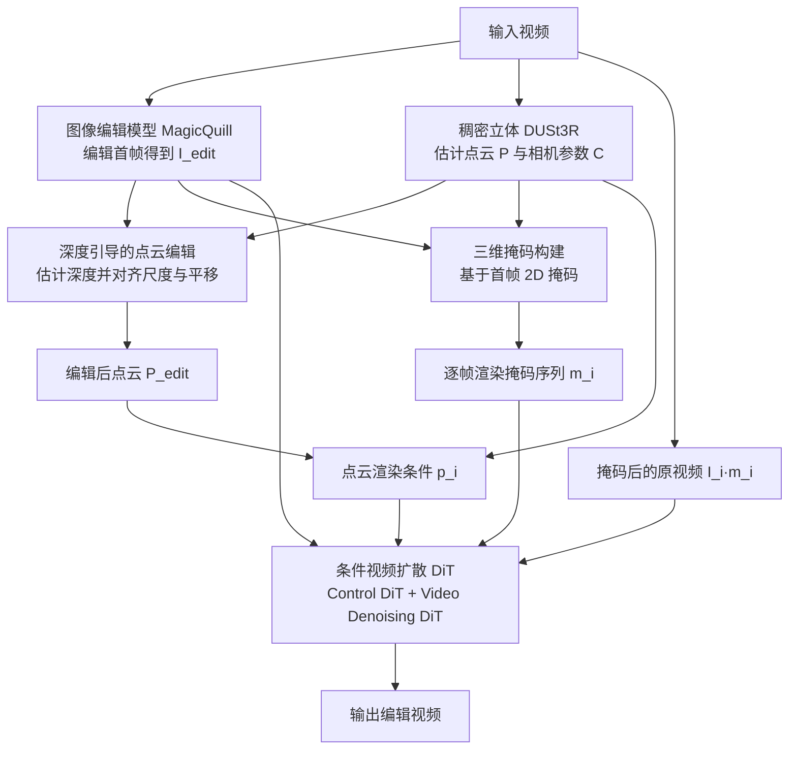

## 一句话总结

Sketch3DVE 通过"首帧图像编辑 + 显式三维点云分析 + 三维感知掩码传播 + 视频扩散模型"的流水线，实现了对存在大幅视角变化的场景视频进行草图驱动的局部结构化编辑，能在保持未编辑区域一致的前提下生成真实的新视角内容。

## 研究背景

现有视频编辑方法大多聚焦于风格迁移或外观修改，对视频中三维场景结构内容的编辑仍然困难，尤其当视频包含大幅视角变化（如大角度相机旋转、缩放）时。作者归纳了三个核心挑战：

- 需要生成与原视频保持一致的新视角内容；
- 需要准确识别并保留未编辑区域；
- 需要把稀疏的二维输入（草图、掩码）翻译成真实的三维视频输出。

已有的扩散式视频编辑方法通常从输入视频隐式迁移运动特征，适合外观修改但难以处理插入、替换等结构化编辑，且缺乏对三维信息的显式分析，难以应对显著视角变化。相机可控的视频生成方法虽然能控制视角，但对被遮挡区域和视口外内容完全靠模型想象，常导致未编辑区域发生非预期改变。基于 NeRF 或 3DGS 的三维场景编辑则偏向从零生成或产生渲染风格输出。Sketch3DVE 针对"大幅视角变化 + 轻微物体运动"的场景视频，提出显式三维几何分析的编辑方案。

## 方法

### 整体框架

方法假设输入与输出都是以静态场景为主、含显著视角变化的视频。先用草图式图像编辑方法 MagicQuill 编辑第一帧得到 $$I_{edit}$$，再把编辑效果沿视频传播。传播依赖从输入视频提取的三维信息（点云与相机参数），核心由三部分组成：深度引导的点云编辑、三维感知的视频掩码传播、以及条件视频扩散生成。

### 关键设计

**深度引导的点云编辑。** 直接把编辑后的首帧图送入图生视频模型无法控制相机运动，会导致视角与原视频完全不同。作者用 DUSt3R 从输入帧估计点云 $$P$$ 和各帧相机参数 $$C=\{C_1,C_2,...,C_N\}$$。为把首帧的编辑映射到三维空间，方法借助深度图：深度图既编码了场景中物体间的相对几何关系，又在未编辑区域天然存在像素对应。首先通过三维投影得到编辑前首帧深度 $$D_{ori}$$，并对编辑图估计得到归一化相对深度 $$\hat{D}_{edit}$$；随后用未编辑区域的对应关系，通过最小二乘求解平移 $$t$$ 与尺度 $$s$$ 两个对齐系数，目标是最小化像素深度距离：

$$E(s,t)=\sum_{i=1}^{m}\left\|(s\hat{d}_i+t)-d_i\right\|^2$$

其中 $$d_i$$ 与 $$\hat{d}_i$$ 分别是未编辑区域在 $$D_{ori}$$ 与 $$\hat{D}_{edit}$$ 中的深度值，$$m$$ 为未编辑区域像素数，用户也可手动微调 $$t,s$$。将编辑区域并入原深度图得到最终深度：

$$D_{edit}=D_{ori}\cdot M+(\hat{D}_{edit}\cdot s+t)\cdot \overline{M}$$

再通过反投影得到编辑后点云 $$P_{edit}=o_1+r_1\cdot D_{edit}$$，其中 $$o_1$$ 为光线原点、$$r_1$$ 为相机 $$C_1$$ 对应的光线方向。

**三维感知的视频掩码传播。** 为方便交互，用户只需在首帧绘制二维掩码 $$M$$，方法需要把它跟踪到各新视角帧。作者用网格模型构建三维掩码：以柱状结构起始，顶面和底面通过沿相机光线反投影二维掩码定义，保证渲染的三维掩码在编辑视角下与二维掩码形状匹配；顶面几何通过最小化编辑前后深度 $$D_{ori}$$ 与 $$D_{edit}$$ 融合并按像素邻接构边，底面取编辑区域最大深度的均匀值近似为平面，侧面连接前后表面。再用相机 $$C$$ 渲染三维掩码，得到逐帧二维掩码序列 $$m_1,m_2,...,m_N$$。

**条件视频扩散生成。** 基础模型为 CogVideoX（采用三维因果 VAE 与 DiT），在其上增加一个改造的 ControlNet 分支注入相机控制与原视频信息。控制分支输入把点云渲染 $$p_i$$、掩码后的原视频 $$I_i\cdot \overline{m}_i$$ 与编辑图 $$I_{edit}$$ 拼接：

$$c_{edit}=\{c_{edit}^i\}_{i=1}^{N}=\{concat(p_i, I_i\cdot \overline{m}_i, I_{edit})\}_{i=1}^{N}$$

该扩散模型负责修补点云渲染的空洞、修正点云估计带来的轻微几何畸变，并分析新生成成分与原视频的关系以实现无缝融合。训练采用自监督策略，构造成对数据（输入帧、首帧点云渲染、模仿用户绘制的随机二维掩码），并用掩码传播得到掩码序列，训练方式与视频修复类似但加入显式三维引导，扩散损失为：

$$L(\theta)=\mathbb{E}_{t\sim U(0,1),\epsilon\sim N(0,1)}\left[\left\|\epsilon_\theta(z_t,t,y,c)-\epsilon\right\|_2^2\right]$$

其中 $$z_t=\alpha_t z_0+\sigma_t\epsilon$$，$$z_0$$ 为帧 $$I$$ 的真值隐编码，文本提示 $$y$$ 由 LLaVA 检测得到。

## 实验结果

实现上，视频扩散模型基于 CogVideoX-2b，附加 10 个控制块组成的条件网络，冻结基础生成模型权重、只更新条件网络；在 DL3DV 与 RealEstate 数据集上训练，先用仅点云渲染输入训练 20000 步，再加入掩码视频输入训练 15000 步。

与两类方法比较：视频编辑方法（AnyV2V、I2VEdit）和相机可控视频生成方法（ViewExtra、ViewCrafter）。自动指标用相邻帧 CLIP 相似度衡量时间一致性，用未编辑区域 PSNR 衡量原视频保留度；人类偏好用排名分数（越低越好）评估视角一致性（VC）、未编辑保留（UP）、时间一致性（TC）与整体编辑质量（EQ）。

| 方法 | CLIP↑ | PSNR↑ | VC | UP | TC | EQ |
|------|-------|-------|----|----|----|----|
| AnyV2V | 92.28 | 20.09 | 4.21 | 4.18 | 4.25 | 4.40 |
| I2VEdit | 94.92 | 22.31 | 3.23 | 3.05 | 3.18 | 3.25 |
| ViewExtra | 94.57 | 17.76 | 3.75 | 3.83 | 3.75 | 3.74 |
| ViewCrafter | 94.95 | 17.94 | 2.68 | 2.80 | 2.66 | 2.48 |
| Ours | 95.47 | 31.20 | 1.14 | 1.15 | 1.15 | 1.12 |

本方法在所有自动指标与人类偏好排名上均领先，尤其 PSNR 大幅优于其他方法，说明其对未编辑区域的保留最好。

消融实验从所有编辑案例随机选取 30 个测试样本，用 SAM 检测物体掩码并在点云和原视频中移除随机物体以模拟编辑过程，把原视频首帧当作编辑图进行重建（LPIPS 数值放大 100 倍）：

| 指标 | w/o depth | w/o mask | w/o point cloud | ours |
|------|-----------|----------|-----------------|------|
| PSNR↑ | 25.87 | 18.29 | 23.62 | 26.88 |
| LPIPS↓ | 9.12 | 20.35 | 9.65 | 8.28 |

去掉深度引导对齐（改用 ICP）会因尺度差异导致点云渲染出现空洞、新内容位置错误；去掉三维掩码与原视频条件无法保留原始特征；去掉点云渲染则缺失显式三维引导，复杂结构在视角变化下难以维持。完整方法在各项上最优。用户研究邀请 24 人对 10 个编辑案例排序，本方法在四个维度上均优于其他方法。

## 亮点与局限

亮点：

- 把稀疏的二维草图编辑通过显式三维点云与深度对齐传播到含大幅视角变化的视频，兼顾新视角一致性与未编辑区域保留；
- 深度引导的点云编辑用尺度与平移两个系数即可将编辑内容对齐到原三维场景，方案轻量且可交互微调；
- 三维感知掩码传播只需首帧一个二维掩码，即可在各帧生成对齐视角变化的掩码序列；
- 支持物体插入、移除、替换及形状纹理修改，并可扩展到笔触上色、文本或参考图修复等多种交互方式，还能用于单图加相机轨迹的可控视频生成。

局限：

- 依赖 DUSt3R 估计相机与点云，对远离其训练分布的困难场景会预测错误三维信息并被编辑过程继承，产生明显伪影；
- 受训练数据限制，目前无法处理 360° 视角变化；
- 限定以静态三维场景为主，难以同时处理大幅动态运动与显著视角变化的视频；
- 可能在背景细节上引入轻微模糊。

## 延伸思考

方法的核心思路是"先在单帧上做高质量二维编辑，再用显式三维几何把编辑约束传播到整段视频"，把难以直接建模的三维视频编辑拆解为成熟的图像编辑与几何对齐两个子问题。这种"二维编辑 + 三维显式引导 + 扩散修补"的分解范式，对处理需要精细几何控制又要求时序一致的生成任务具有一定通用性。局限也指向后续方向：更鲁棒的稠密几何估计、更大规模含 360° 视角的数据集与渐进式生成，以及对动静态信息解耦的建模，都是把该框架推向更自由视角与动态场景的关键。
