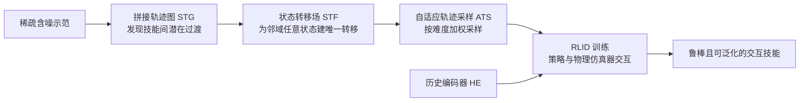

## 一句话总结

面向"从交互示范中做强化学习（RLID）"这一范式，本文用两种数据增强（拼接轨迹图 STG 与状态转移场 STF）加上自适应轨迹采样（ATS）与历史编码器（HE），让物理仿真角色仅凭稀疏、含噪的示范就学到鲁棒且可泛化的人-物交互技能。

## 研究背景

- 领域现状：从交互示范做强化学习（Reinforcement Learning from Interaction Demonstration，RLID）通过学习"机器人-物体状态转移"，用统一的交互模仿奖励，能高效地从人类示范中习得复杂交互技能（如篮球运球、投篮），代表工作是 SkillMimic。
- 核心痛点：现有动捕/示范采集手段拿到的轨迹通常稀疏、断裂且含噪，只覆盖了可能技能变化中的很小一部分，无法覆盖技能之间的过渡与邻域内的各种变体。交互任务对数据扰动极其敏感——手指与物体哪怕 2cm 的偏差都可能导致灾难性失败；一旦参考轨迹在某个时间步附近退化，整条状态转移链会在该处"断裂"，即使其他片段收敛良好，成功率也接近零。
- 本文 idea：尽管示范稀疏含噪，但在示范邻域内存在无穷多条物理可行的轨迹，它们能自然地在已示范技能之间架桥、或从邻近状态涌现，构成一个连续的"技能变体与过渡"空间。只要把这些未被采集到的轨迹补出来并喂给 RLID，就能学到鲁棒、可泛化的技能。

## 方法

### 整体框架

给定稀疏示范（例如两段很短的 Shot 和 Dribble 轨迹），方法分三步挖掘潜在轨迹：先构造拼接轨迹图（STG）识别技能间可能的过渡，再把 STG 扩展为状态转移场（STF）为邻域内任意状态建立唯一的转移方向，最后用自适应轨迹采样（ATS）配合 RLID 学习策略。历史编码器（HE）为策略补上时序记忆。整套增强作用在既有 RLID 基线（如 SkillMimic）之上。

### 关键设计

1. **状态转移场（STF）——是什么/为什么/怎么做**：目标是让邻域内的每个状态都有"唯一"的转移方向。直接在 RLID 初始化时给参考状态加 $$\varepsilon$$ 噪声看似简单，但不同参考状态的邻域会重叠，同一个新状态 $$\boldsymbol{s}_{new}$$ 可能同时属于多个参考状态的邻域，导致状态转移映射非唯一、收敛困难。STF 的做法是：从参考状态 $$\hat{\boldsymbol{s}}_i$$ 的 $$\varepsilon$$-邻域均匀采样得到 $$\boldsymbol{s}_{new}$$（称 $$\varepsilon$$-邻域状态初始化 $$\varepsilon$$-NSI），再用相似度找到与之最相近的参考状态 $$\hat{\boldsymbol{s}}_j = \arg\max_{s \in A} S(\boldsymbol{s}_{new}, \boldsymbol{s})$$，据相似度决定插入若干"掩码状态"$$\boldsymbol{s}_\varnothing$$ 作为桥接缓冲，拼成 $$\{\boldsymbol{s}_{new}, \boldsymbol{s}_\varnothing, ..., \boldsymbol{s}_\varnothing, \hat{\boldsymbol{s}}_j, ..., \hat{\boldsymbol{s}}_T\}$$。掩码状态不参与奖励计算，只作为时间缓冲，本质上是构造"可被 RLID 修复的缺失数据"，解决大邻域下边界到中心单步物理不可达的问题。
2. **拼接轨迹图（STG）——跨技能架桥**：稀疏示范之间往往存在没被采集到的潜在过渡。对技能 A 的轨迹，把其他技能轨迹的所有状态集合 B 都视为"可能能转移到 A"的状态，用与 STF 相同的连接规则为 B 中每个状态构造通往 A 的路径（过滤掉离 A 太远的状态），从而把人为引入的"噪声/缺失"交给 STF 去修复。得到的图 $$A^\dagger$$ 替代原参考轨迹用于后续增强、采样与训练，显著扩大示范空间覆盖。
3. **自适应轨迹采样（ATS）——啃硬骨头**：为解决"链断裂"问题，按片段难度调整采样权重。以状态 $$\hat{\boldsymbol{s}}_i$$ 初始化的片段采样概率 $$p_i = \dfrac{e^{-\lambda_s \bar{r}_i}}{\sum_{j=0}^{T-1} e^{-\lambda_s \bar{r}_j}}$$，其中 $$\bar{r}_i$$ 是从 $$\hat{\boldsymbol{s}}_i$$ 起的平均每帧奖励（衡量重建质量），$$\lambda_s$$ 控制在均匀采样（$$\lambda_s=0$$）与难度导向采样（$$\lambda_s>0$$）之间的权衡。奖励低（更难）的片段获得更高采样权重。ATS 同样可用于多技能间的均衡学习。
4. **历史编码器（HE）——补上记忆**：缺乏时序上下文的策略无法执行依赖记忆的行为（如决定持球多久再传球），因为参考轨迹中相似的状态在不同时刻可能对应不同转移，这种歧义会让基础 RLID 无法收敛。HE 把过去 $$k$$ 个状态编码成紧凑的历史嵌入 $$\boldsymbol{h}_t = \boldsymbol{\theta}(\boldsymbol{s}_{t-k}, ..., \boldsymbol{s}_{t-1})$$，策略据此产生动作 $$\boldsymbol{a}_t \sim \boldsymbol{\pi}(\cdot \vert  \boldsymbol{c}, \boldsymbol{s}_t, \boldsymbol{h}_t)$$。HE 用行为克隆预训练并在 RLID 中冻结，紧凑嵌入（维度仅 3）可防过拟合并缓解 PPO 在高维历史观测下的收敛问题，且无需手工指定相位。

## 实验结果

在人-篮球数据集 BallPlay-M（5 个技能：DF/DL/DR/Layup/Shot）与家居交互数据集 ParaHome 上评测。指标含成功率 SR、技能过渡成功率 TSR、$$\varepsilon$$-邻域成功率 $$\varepsilon$$NSR、归一化奖励 NR。基线为 SkillMimic（SM）与 DeepMimic（DM），并对比仅加 $$\varepsilon$$-NSI 的变体。下表取 BallPlay-M 主实验的平均值对比（SR/$$\varepsilon$$NSR 为百分比）：

| 方法 | 平均 SR↑ | 平均 $$\varepsilon$$NSR↑ | 平均 TSR↑ | 平均 NR↑ |
|------|---------|---------|---------|---------|
| DM | 49.4 | 18.0 | 17.2 | 0.11 |
| DM + $$\varepsilon$$-NSI | 51.1 | 25.0 | 15.8 | 0.12 |
| DM + Ours | 68.6 | 41.2 | 63.0 | 0.09 |
| SM | 53.3 | 18.3 | 15.1 | 0.46 |
| SM + $$\varepsilon$$-NSI | 63.4 | 35.6 | 41.0 | 0.45 |
| SM + Ours（完整） | 96.9 | 49.3 | 93.8 | 0.43 |

相较基线，完整方法在平均 SR 上提升约 45%、平均 $$\varepsilon$$NSR 提升约 33%、平均 TSR 提升约 84%。值得注意的是 SM 的 NR 最高（对参考数据拟合能力强），但成功率不均衡、泛化差；本方法在拟合参考数据的同时展现出更强的泛化与鲁棒性，尤其在此前基线几乎完全失败的得分类技能（Layup、Shot）和技能过渡上实现了接近满分的成功率。

在 ParaHome 上（因不同物体的轨迹无法有意义拼接，故去掉 STG 组件），完整方法平均 SR 达 100%、平均 $$\varepsilon$$NSR 40.1%，远超 SM（平均 SR 5.5%）及 SM+T、SM+$$\varepsilon$$-NSI 等变体。消融实验显示 STG、STF、ATS、HE 各组件均带来增益，且 HE 的加入使完整方法从 SR 76.4%/TSR 70.2% 跃升至 SR 96.9%/TSR 93.8%，验证了记忆机制对多技能过渡的关键作用。

## 亮点与局限

- 亮点：
  - 抓住"稀疏含噪示范邻域内存在无穷可行轨迹"这一核心洞察，把"补数据"问题转化为可被 RLID 自然修复的"缺失/噪声"修复问题，思路统一而优雅。
  - STG/STF/ATS/HE 均为通用增强模块，可即插即用地叠加到已有 RLID 基线（SM、DM）之上并普遍提升性能。
  - 在得分类技能与从未示范过的技能过渡上取得接近满分的成功率，鲁棒恢复能力（从错误状态回到正轨）显著，泛化到未见物体位姿。
  - 仅用单张 RTX 4090、单条或少量短示范即可训练，工程可行性好。
- 局限：
  - 面对严重损坏的示范仍力不从心，作者提出可引入大规模交互先验（如以目标机器人-物体状态为条件的跟踪策略）来缓解。
  - STG 依赖不同轨迹间"可拼接"的假设，在物体差异大的场景（如水壶与椅子）无法构造有意义连接，需去掉 STG。
  - 掩码状态数量、相似度度量等关键细节放在补充材料，正文对物理可行性的保证更多是经验性的。

## 延伸思考

- 该方法本质上把"运动图/motion graph"的拼接思想与 RLID 的抗噪能力结合起来，绕开了运动图在 HOI 场景下需海量数据覆盖所有过渡的难题；也回避了 GAIL 在细粒度交互上奖励过粗的问题，值得与对抗式模仿方法做更系统的比较。
- 邻域唯一转移方向 + 掩码桥接的设计，与扩散式"轨迹修复/inpainting"思路相通，未来或可把生成式补全与物理仿真修复结合，进一步扩大可覆盖的技能空间。
- 冻结的历史编码器仅用 3 维嵌入就解决了记忆依赖与 PPO 收敛的矛盾，这一"低维记忆瓶颈"经验对更长时程、多物体协同的操作任务可能同样有价值。
- 作者将其定位为动画合成与真实机器人技能习得的通用基础模块，后续在 sim-to-real 迁移与真实机械手操作上的表现值得关注。
