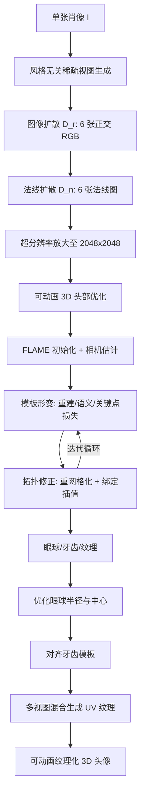

## 一句话总结

SOAP 提出一套「风格无关」的单图到可动画 3D 头像流水线：先用在 24K 多风格 3D 头部数据上微调的多视图扩散模型生成六视图 RGB 与法线，再通过可微渲染驱动的自适应形变与拓扑修正把 FLAME 模板变形为个性化头像，从而在保持拓扑一致与绑定可动画的同时，还原复杂发型、配饰与多样化风格。

## 研究背景

从单张肖像生成可动画的 3D 头像在游戏、影视和虚拟现实中价值很高，但现有方法有两类明显短板：

- 参数化/单视图头部建模方法（如 ROME、PanoHead）通常受限于特定风格（写实或某种卡通），且难以处理眼镜、帽子等配饰与复杂发型，表面往往过度平滑。
- 通用 3D 扩散方法（如 Wonder3D、LGM、Unique3D）虽然具备强大的单视图重建能力，但因训练数据是通用物体，应用到人头时存在明显的领域鸿沟，容易产生伪影，且输出多为无结构网格或神经场，缺少动画控制，需要额外拟合参数化模板。

作者的核心洞察分两点:一是借助扩散模型跨视图学习并泛化外观与几何，以覆盖多样风格;二是设计一套优化流程，把初始的、已绑定的参数化形状自适应地形变到目标几何，同时保持头部各部位的语义对应（例如嘴巴形变到目标嘴巴而非鼻子）。由此得到的是带 FACS 参数控制的纹理网格，可直接接入 Unreal、Unity 等游戏引擎，比 NeRF、高斯场等表示更利于渲染与美术编辑。

## 方法

### 整体框架

给定单张肖像 $$I$$，SOAP 分三个阶段生成可动画 3D 头像：

### 关键设计

**风格无关稀疏视图生成。** 训练风格无关生成器的难点在于缺乏大规模多风格 3D 头部数据。作者发现在公开数据里，anime 是与真人差异最大的非写实风格（尖小的鼻子、方大的眼睛、扁平脸、简化发型），于是仅用「写实」与「anime」两种极端风格训练，让模型去想象并泛化油画、水墨等中间风格。最终收集 24K 3D 头像:写实侧 9.1K 真实头部（THuman2.0、2K2K、NPHM）外加 2.4K 合成多样发型（UniHair、FFHQ-UV），anime 侧 13K Vroid 模型。多视图图像与法线扩散沿用 Unique3D 架构:图像模型 $$D_r$$ 输入单图 $$I \in \mathbb{R}^{256\times256\times3}$$ 输出六张正交 RGB $$I \in \mathbb{R}^{6\times256\times256\times3}$$，法线模型 $$D_n$$ 再据此生成法线图，最后用单视图超分放大四倍到 2048×2048。

**参数化基础 FLAME。** 头部用 FLAME 建模，给定形状 $$\beta$$、姿态 $$\theta$$、表情 $$\psi$$：

$$F(\beta,\theta,\psi) = \mathrm{LBS}(M(\beta,\theta,\psi), J(\beta), \theta, W)$$

$$M(\beta,\theta,\psi) = T + B_s(\beta) + B_e(\psi) + B_p(\theta)$$

其中 $$T$$ 为静止姿态模板，$$B_s,B_e,B_p$$ 分别是形状、表情、姿态混合形状。作者记 $$\kappa=(\beta,\theta,\psi)$$，并把整套可绑定模型记为 $$\Omega=(T,F,W,J,B)$$。与以往仅调 $$\kappa$$ 加顶点偏移不同，SOAP 为每个身份优化个性化的 $$\Omega$$，以获得更具表现力和细节的重建。

**模板形变。** 在多视图法线 $$N$$、初始网格、相机 $$\pi$$、68 点关键点 $$L$$ 与头部解析图 $$P$$ 的监督下，迭代更新模板顶点，总损失为：

$$L = \lambda_{rec}L_{rec} + \lambda_{sema}L_{sema} + \lambda_{lmk}L_{lmk}$$

- 重建损失 $$L_{rec}$$ 用渲染法线与目标法线的 MSE 对齐几何，并加拉普拉斯平滑正则。
- 语义损失 $$L_{sema}$$ 利用解析图约束「同语义部位相互形变」（脸对脸、发对发），含解析损失与眼部掩膜损失，仅用正面与 ±45° 三个可靠视图。
- 关键点损失 $$L_{lmk}$$ 含投影损失与规范空间对称损失，保持眼、鼻、唇、下颌结构并维持左右对称。

**拓扑修正。** 形变会带来大三角形、法线翻转、扭曲面等拓扑问题。作者在每步形变后做重网格化（细分超过阈值 $$\epsilon$$ 的大三角形、翻转不一致三角形、删除错误三角形），并同步更新蒙皮权重与混合形状（沿边邻居插值）。关节回归矩阵不能直接插值，否则会改变关节位置，因此按

$$J = \bar{J}(T + B_s(\beta))^{-1}$$

更新，以保持规范空间中的关节位置不变。形变与重网格化交替迭代循环。

**眼球、牙齿与纹理。** 从 FLAME 归一化眼球出发，优化共享半径 $$r$$ 与两眼中心 $$c$$，用多视图眼部掩膜引导。由于重建网格前 5023 个顶点与 FLAME 同序，牙齿模板可精确缩放定位到口腔，上牙绑到头部、下牙绑到下颌。纹理以 FLAME UV 为初始，随网格插值，按视图法线混合多视图颜色，不可见区域通过 UV 连续性膨胀补全，从而支持纹理编辑。

## 实验结果

主实验在 40 个头部扫描（20 个真实来自 NPHM、20 个 anime/CG 合成）上，与单视图 3D 头像重建方法对比。每个网格渲染 8 视图计算图像指标（FID 用 60 视图），并补充 3D 指标。结果如下：

| Method | PSNR ↑ | SSIM ↑ | LPIPS ↓ | CSIM ↑ | FID ↓ | CD ↓ | IoU ↑ | F1 ↑ |
|---|---|---|---|---|---|---|---|---|
| ROME | 12.60 | 0.7257 | 0.3290 | 0.6202 | 131.4 | - | - | - |
| PanoHead | 3.372 | 0.2998 | 0.6044 | 0.2507 | 116.3 | - | - | - |
| SphereHead | 6.683 | 0.5404 | 0.4703 | 0.4935 | 119.4 | - | - | - |
| Wonder3D | 16.17 | 0.7806 | 0.2298 | 0.6484 | 102.2 | 5.729 | 0.2395 | 0.3367 |
| LGM | 16.01 | 0.7914 | 0.2581 | 0.8511 | 104.0 | - | - | - |
| Unique3D | 17.09 | 0.7947 | 0.2064 | 0.8995 | 70.64 | 4.991 | 0.2409 | 0.3777 |
| Ours | 17.53 | 0.7958 | 0.1968 | 0.8268 | 58.44 | 2.880 | 0.3035 | 0.5108 |

SOAP 在 PSNR、SSIM、LPIPS、FID、CD、IoU、F1 上均领先，其中 FID 从 Unique3D 的 70.64 降到 58.44，CD 从 4.991 降到 2.880，几何指标提升尤为明显。CSIM 上 Unique3D（0.8995）更高，作者未在该项夺冠。对比方法失利原因:GAN 类（PanoHead、SphereHead）只在写实数据上训练;扩散类（Wonder3D、LGM、Unique3D）面向通用物体、未针对头部领域;ROME 只能生成正面头部、无法重建背面。

消融实验验证三个关键组件:关键点损失是保留唇、下颌线、眉毛等面部动画特征的关键;语义损失维持整体头部结构，尤其是长发或下垂发型，缺失时脸部边界顶点会移入头发区域;重网格化对长发、头饰等复杂表面的还原至关重要，缺失时表面因顶点密度不足与拓扑固定而过度平滑。

效率方面，单图生成可动画纹理头像约需 6 分钟（预处理约 1.5 分钟，头部与眼球优化、牙齿对齐、纹理生成约 4.5 分钟）。扩散训练在 7 块 A6000 上约 6 天。

## 亮点与局限

亮点：

- 首个真正「风格无关」的单图全头重建方法，写实、卡通、anime 及夸张风格通吃，并能还原编发、帽子、眼镜、首饰等发型与配饰。
- 输出是拓扑一致、带绑定、含眼球与牙齿的纹理网格，直接支持 FACS 参数动画，可无缝接入游戏引擎并便于美术编辑。
- 「仅用两种极端风格训练、泛化到中间风格」的数据策略巧妙，兼顾了可获取性与覆盖面。
- 形变加拓扑修正交替迭代的优化设计，解决了固定拓扑难以表达复杂几何、又要保持可动画绑定的矛盾。

局限：

- 严重依赖 FLAME 估计、关键点检测、头部解析等前置模块，这些模块在 anime、卡通等高度风格化输入上表现明显下降，会导致关键点错检、解析分割不准、FLAME 拟合错位，最终产生结构扭曲的头像。
- 扩散模型输出分辨率有限（当前 256×256），限制了最终质量;拓扑修正时顶点数需匹配法线预测的有效分辨率，对发丝锐边等细节增加顶点会显著加大计算量。

## 延伸思考

- 「用两种极端风格张成风格空间、靠扩散模型插值中间风格」的思路可迁移到其他类别的风格泛化重建（如全身、手部、动物头部），关键在于找到差异最大的两个极端锚点。
- 把可微渲染优化与「重网格化 + 绑定插值」耦合，本质上是在拓扑变化下保持语义与骨骼一致性的通用技巧，对需要动画绑定的任意模板配准任务都有参考价值。
- 当前瓶颈落在前置感知模块与扩散分辨率上;若能训练风格无关的关键点/解析器，或引入更高分辨率、多视图一致的生成模型，方法上限有望进一步打开。
