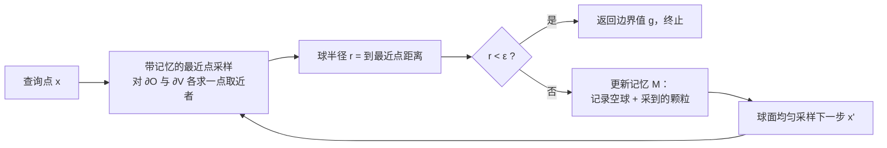

## 一句话总结
把渲染里"参与介质"的思想搬到 PDE 求解上：用泊松布尔模型把海量微观颗粒当作随机介质来统计描述，进而提出体积版的 walk on spheres（VWoS）与 walk on stars（VWoSt），无需显式建模每颗粒子，就能无偏、高效地求解含复杂微颗粒几何的线性椭圆型 PDE。

## 研究背景
- 领域现状：很多自然现象（生物膜附近的离子静电势、云中臭氧的光化学扩散、多孔/胶体介质中的流动、颗粒介质传热）在宏观上几何简单，但微观上包含天文数量级的颗粒（如上百万离子、数十亿水滴），显式建模每颗粒子几乎不可行。近几年图形学把蒙特卡洛 PDE 求解器（walk on spheres / walk on stars）引入进来，具备输出敏感、天然并行、对不完美几何鲁棒等优点。
- 核心痛点：面对复杂微颗粒几何，传统做法主要有两类，都不理想。一是均质化（homogenization），只在"颗粒无穷小且无穷密"的渐近极限下把颗粒抹平成一个带屏蔽项的等效 PDE，但真实问题从不满足该极限，误差大且难以控制、还随位置剧烈变化；二是集合平均（ensemble averaging），反复采样完整粒子配置再逐个求解后取平均，虽无偏但极其昂贵。
- 本文 idea：渲染早就遇到过同样的难题（云、烟、雾、组织的光传输），解决办法是把材质建模为参与介质——不枚举具体粒子，而用密度等统计量描述，再配合体积路径追踪等算法直接算出期望光传输。作者发现蒙特卡洛 PDE 求解与蒙特卡洛渲染高度同构（前者用最近点查询、后者用光线求交），于是把"参与介质 + 体积渲染"的范式整体迁移到 PDE 求解，直接估计 PDE 的平均解而绕开集合平均。

## 方法
整体框架：把 BVP 的求解域定义为确定性体积 $$V$$ 减去随机颗粒集合 $$O$$，即 $$\Omega \coloneqq V \setminus O$$，其中 $$O$$ 服从泊松布尔模型（PBM，密度 $$\lambda$$、颗粒半径 $$R$$）。要求的是对随机颗粒配置取期望后的平均解 $$\overline{u}(x)=\mathbb{E}_O[u(x)]$$。关键观察是：WoS 只通过"最近点查询"与域边界打交道，因此只要把确定性的最近点查询替换成基于介质统计性质的"最近点采样"，就能得到体积版算法。

关键设计：

1. 泊松布尔模型下的最近点采样。核心是把"到最近颗粒中心的距离"转化为可解析采样的分布：其立方距离是一个速率为 $$\Lambda(B(x,r))$$ 的指数随机变量。均匀介质下先采一个指数变量得到立方距离、再在对应半径球面上均匀采一点作为最近颗粒中心，然后用 $$r_{\partial O}(x)=\lVert x-c(x)\rVert - R$$ 定出最近点。非均匀介质则借用渲染里的 delta tracking / thinning：先按上界密度 $$\bar\lambda$$ 采样，再以 $$\lambda(c)/\bar\lambda$$ 的概率接受或拒绝，取第一个被接受的颗粒。这与体渲染中自由飞行距离采样完全对应。

2. 带记忆的递归（VWoS 与 WoS 的关键差异）。由于对期望反复使用全期望公式，平均解满足一个"参与介质中的边界积分方程"，且每递归一步方程都要在"此前采样历史"的条件下改写。作者用"游走记忆 $$\mathcal{M}_k$$"来概括历史，它等价于两点约束：此前所有游走球内部为空（空球记忆 $$E(\mathcal{M}_k)$$），以及此前采到的颗粒必须继续存在（颗粒记忆 $$C(\mathcal{M}_k)$$）。采样时通过对空球区域做密度置零的 thinning、并把已采颗粒视为确定性几何，来实现条件最近点采样。因此 VWoS 与 WoS 结构几乎一致，只多了"记忆"这一件事——WoS 是无记忆的，VWoS 是全记忆的。

3. 从 VWoS 到 VWoSt（支持诺伊曼边界）。把 Dirichlet-only 推广到混合 Dirichlet-Neumann 时，用 walk on stars 的星形区域代替球：令介质边界 $$\partial V$$ 为 Dirichlet 边界、颗粒边界 $$\partial O$$ 为 Neumann 边界，星形区域半径取"到 Dirichlet 最近点"与"到可见轮廓最近点"的较小者。因为颗粒都是等半径球，轮廓点与最近点落在同一颗粒上，可解析求出；星形区域内的额外颗粒按距离递增继续采样直到超出半径，并一并计入记忆。作者在 Zombie 库上实现，仅对 WoS/WoSt 例程做了小改动。

## 实验结果
主实验是在带复杂微颗粒几何的 Laplace BVP 上，把本文方法与集合平均（无偏参考）、均质化（近似方法）三者在"是否无偏"和"相对耗时"两个维度上对比（数字取自蘑菇、人参根、连接件等场景的报告）：

| 方法 | 是否无偏 | 相对耗时 | 说明 |
|------|---------|---------|------|
| 集合平均（Ensemble Averaging） | 无偏（作为参考基准） | 最慢（基准 1×） | 需反复采样完整粒子配置并逐个求解，输出敏感性、采样摊销、几何查询都差 |
| 均质化（Homogenization） | 有偏 | 比 VWoS 快约 2–20× | 仅在颗粒无穷小且无穷密的渐近极限下才准确，颗粒增大或在几何细薄处偏差明显 |
| VWoS / VWoSt（本文） | 无偏 | 比集合平均快 >3×（VWoSt 约 5×） | 直接估计平均解、按需就地采样少量颗粒，兼顾精度与效率 |

补充关键结论：在生物膜静电势的应用里（期望约 190 万颗粒），相比"移除颗粒后的普通 WoS"，VWoS 仅增加约 15% 运行时间；在 256×256 切片上，集合平均需 11 秒而 VWoS 只需 1 秒（一个数量级以上加速），若只需沿一条线求解，VWoS 比集合平均快 10000× 以上。记忆的消融实验表明：无记忆近似会让游走几乎无法在体内终止、步长随密度超指数缩小，导致精度与效率双双崩坏；只保留最近一个空球/颗粒的"有限记忆"变体则引入明显偏差却几乎不提速，说明全记忆对本方法至关重要。作者还把 VWoS 与体积路径追踪耦合，做了云中光化学生成臭氧扩散的概念验证，显示耦合时正确传递记忆能捕捉到显著影响结果的遮挡/阴影效应。

## 亮点与局限
- 亮点：
  - 提出全新问题设定"参与介质中的 PDE 求解"，并用泊松布尔模型给出严谨的随机几何建模，把渲染中成熟的采样工具（delta tracking / thinning）迁移过来。
  - VWoS/VWoSt 与经典 WoS/WoSt 结构几乎相同，易于在已有库中实现，同时继承其输出敏感、无网格、并行、对不完美几何鲁棒等优点。
  - 无偏且在不同颗粒尺度/密度、不同区域都稳定准确，避免了均质化难以控制的偏差；相比集合平均在稀疏求值/高密度介质下可快数个数量级。
  - 清晰揭示了 PDE 求解与体积渲染之间的对偶关系，为两者耦合模拟（如云中光传输 + 扩散）打开了口子。
- 局限：
  - 只处理独立、球形、等大小颗粒的最简 PBM，以及 Laplace/Poisson/屏蔽 Poisson 这类线性椭圆型 PDE；非球形、变尺寸、相关分布的颗粒，以及弹性、热对流、Stokes/Navier-Stokes 等 PDE 尚未覆盖。
  - 高密度介质下，thinning 式的最近点采样成为性能瓶颈；且每步都要对介质边界重复做几何查询，密度越高游走越长、开销越大。
  - 全记忆随游走增长带来存储与查询成本，对显存受限的 GPU 并行不友好，有限记忆又不划算，如何在保精度前提下降本仍是开放问题。

## 延伸思考
- 方法与渲染研究高度同构，渲染里为改进 delta tracking / 透射率估计发展出的大量技巧（多重重要性采样、渐进/自适应上界密度、复用中间采样点）几乎都能平移过来提速，这是很自然的后续方向。
- "把宏观几何也随机化"是近期图形学的一个趋势（用于处理三维采集不确定性、形状优化），基于高斯过程的随机隐式曲面表示与本文框架结合，可能催生更一般的随机几何 PDE 求解器。
- 对做蒙特卡洛几何处理/物理仿真的研究者，这篇提供了一个可复用的"记忆"抽象：凡是把确定性几何查询替换为随机采样的场景，都要考虑历史条件化带来的偏差与实现代价，本文的空球/颗粒双记忆结构是一个可借鉴的范式。
- 与体积路径追踪的耦合仅是概念验证，真正把光传输、扩散、传热等多物理过程在同一参与介质中一致耦合（并正确共享记忆），在大气科学、遥感、生物医学成像里都有实际价值，值得深挖。
