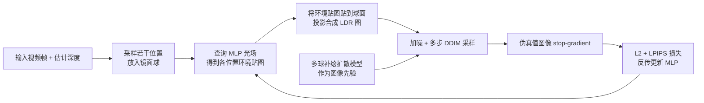

## 一句话总结

本文提出一种从单张图像或视频中估计室内**时空一致光照**的方法：用一个 MLP 表示随位置、时间和方向变化的 6 维光场，并借助一个经过微调、能"联合补绘多个镜面球"的 2D 扩散模型作为先验来蒸馏优化这个光场，首次在真实世界视频上展示了随空间和时间变化的一致光照估计。

## 研究背景

- 领域现状：为增强现实、视频合成中的虚拟物体插入提供光照，通常需要从单图或视频中估计成环境贴图。已有工作大致分三类：只估计场景全局光照、逐像素预测环境贴图、以及预测 3D 光照体（lighting volume）。近期 DiffusionLight 把光照估计变成一个"补绘任务"——用预训练图像扩散模型在图中心补出一个镜面球，再把球面展开成环境贴图。
- 核心痛点：室内光照估计本身高度病态——环境贴图需要高动态范围（HDR），还要覆盖输入低动态范围（LDR）图像视野之外的内容。更难的是，当视频拍摄的室内场景光照**随空间和时间变化**（移动时强度变化、灯光被开关）时，现有方法都无法给出时空一致的结果。DiffusionLight 只在图像中心补绘单个球，无法给出跨多个空间位置一致的光照。
- 本文 idea：直接训练一个能**同时补绘多个镜面球**、并以各球与背景相对深度为条件的扩散模型，让它天然具备跨位置一致的光照先验；再模仿"用 2D 扩散先验做 3D 生成"（如 DreamFusion 的 SDS）的思路，把这个 2D 先验蒸馏进一个表示 6D 光场 $$L(\boldsymbol{x}, t, \boldsymbol{d})$$ 的 MLP。

## 方法

整体框架分两阶段：先微调一个"多球补绘"扩散模型作为光照先验（针对单张图像），再利用该先验通过优化蒸馏出一个用 MLP 表示的时空光场（针对视频）。

关键设计：

1. **把光照估计变成"多球联合补绘"**。给定输入图像，在目标位置集合放置一组镜面球作为光探针，每个球投影到图像上直径约为图像尺寸的 1/4。模型学习在插入镜面球后的图像分布 $$p(I_B \mid I, B)$$。基座是 Stable Diffusion 补绘模型加上深度条件 ControlNet：先用现成估计器预测相机内参与深度，把球投影得到补绘掩码、并将球的深度合成到背景深度图上作为 ControlNet 的条件输入。与 DiffusionLight 只用 LoRA 不同，本文微调去噪 U-Net 与 ControlNet 的全部权重，经验上效果更好。

2. **曝光条件以支持 HDR 输出**。沿用 DiffusionLight 的做法，用一个"曝光等级"ev 条件化模型：输出球的照度按 $$2^{\text{ev}}$$ 缩放后再色调映射为 LDR。曝光通过两个文本 CLIP 嵌入的插值来编码，$$\zeta_{\text{ev}} = \zeta_{\max} + \frac{\text{ev}}{\text{ev}_{\min}} (\zeta_{\min} - \zeta_{\max})$$，其中 $$\zeta_{\max}$$、$$\zeta_{\min}$$ 分别是"完美镜面反射球"与"全黑镜面反射球"两句提示词的嵌入。训练用只作用于掩码像素的标准扩散损失。

3. **合成数据集提供多位置真值**。真实数据难以拿到不同空间位置的 HDR 真值，因此用基于 Blender 的程序化室内场景生成器 Infinigen Indoors 随机生成 500 个场景、每个采 5 个视点，每个视点内放置 $$N \sim U[1, 9]$$ 个与几何不相交的镜面球，渲染插球后的 HDR 图、球掩码与深度图，并隐藏球渲染背景图作为配对输入。

4. **蒸馏时空光场 MLP**。光场 $$L_\psi(\boldsymbol{x}, t, \boldsymbol{d})$$ 用类似 NeRF 的 MLP（6 层隐藏、维度 256、带位置编码与跳连）表示。每次迭代随机取一帧、随机采 $$N=9$$ 个位置插球，查询 MLP 得到各位置环境贴图，warp 到球面并投影合成 LDR 图 $$I_B^t$$；把它编码加噪成 $$z_\tau$$，再用扩散模型跑 $$k$$ 步 DDIM 采样解码出"伪真值"图 $$\hat{I}_B^t$$，以此监督 MLP：$$\psi = \arg\min_\psi \mathbb{E}[\lVert I_B^t - [\hat{I}_B^t]_\nabla \rVert_2^2 + L_p(I_B^t, [\hat{I}_B^t]_\nabla)]$$，其中 $$L_p$$ 为 LPIPS 感知距离，$$[\cdot]_\nabla$$ 是停止梯度算子。作者发现这种"多步采样出伪真值再回归"的方式比 SDS 效果更好。优化时曝光 ev 从 0 线性降到 $$\text{ev}_{\min}$$（而非随机采），有助于更准确地合成过曝区域。单图输入时只需令时间维 $$T=1$$，其余流程不变。

## 实验结果

评测遵循"三球协议"：用估计的 HDR 环境贴图（128×256）渲染漫反射 / 哑光 / 镜面三种材质球，与真值渲染对比，报告尺度不变 RMSE（si-RMSE）、角度误差、归一化 RMSE 三项指标。测试覆盖合成的 Infinigen Indoor（分布内）、3D-FRONT（分布外）以及真实世界的 Laval Indoor Spatially Varying（分布外）。对比基线包括逐像素回归光照的方法、DiffusionLight 直接采样、DiffusionLight 蒸馏、以及本文扩散模型直接独立采样（Ours-Sampling）。

下表节选真实世界 Laval Indoor Spatially Varying 数据集上镜面球的主要指标对比（越低越好），本文在几乎所有指标上领先：

| 方法 | si-RMSE↓ | Angular Error↓ | Norm. RMSE↓ |
|------|----------|----------------|-------------|
| DiffusionLight | 0.43 | 8.03 | 0.65 |
| Ours-Sampling | 0.39 | 7.96 | 0.65 |
| 逐像素回归方法 | 0.42 | 8.76 | 0.56 |
| 本文（Ours） | 0.31 | 6.02 | 0.53 |

其余结论：在 Infinigen Indoor 与 3D-FRONT 上本文同样全面领先；独立采样的 DiffusionLight 与 Ours-Sampling 纹理更锐但跨位置不一致，DiffusionLight 蒸馏版空间平滑却缺细节且向图像边缘畸变加剧，逐像素回归方法一致但分辨率仅 16×32 过于模糊。消融显示：去掉 MLP 改用 3×3×3 离散网格、去掉多球训练、去掉曝光递减策略后各项指标均下降，验证了这些设计的作用。最重要的是，本文在真实世界视频上展示了时空一致的动态光照估计与虚拟物体插入，这是以往工作少有呈现的。

## 亮点与局限

- 亮点：
  - 首次实现从视频估计**时空一致**的室内动态光照，能应对灯光开关、移动导致的强度变化。
  - 用"多球联合补绘 + 深度条件"巧妙地把跨位置一致性注入 2D 扩散先验，再用连续 MLP 光场统一表示空间、时间、方向。
  - 借鉴 3D 生成中的"多步采样伪真值蒸馏"，经验上优于 SDS，且用程序化合成数据解决了多位置 HDR 真值难获取的问题。
- 局限：
  - 在室内表现好，但室外阳光主导的场景会失效（训练数据缺室外场景）。
  - 蒸馏类方法通用的**过平滑**问题：反射球外观与光照的时间演化都偏平滑；提高时间位置编码频率能缓解，但过高会引入闪烁且收益递减。
  - 依赖图形渲染器近似真实光传输，插入物体外观未必能无缝融入图像。

## 延伸思考

- 方法把"用 2D 扩散先验蒸馏 3D 表示"的范式（DreamFusion、ReconFusion 等）迁移到光场估计，思路上与稀疏视角 3D 重建高度相通——凡是"缺真值、但有强 2D 先验可提供部分观测"的逆问题，都可能套用类似框架。
- 作者指出的未来方向是用**体积光照表示**替代当前基于球面观测的优化，因为体渲染能沿整条光线传播梯度，或能保留更多空间细节；这与光照体、3D lighting volume 一脉相承。
- 对最终合成图像加监督（如可微插入物体外观）有望同时改善光照估计与物体融合，是把"估计"与"渲染合成"闭环的一条路径。
