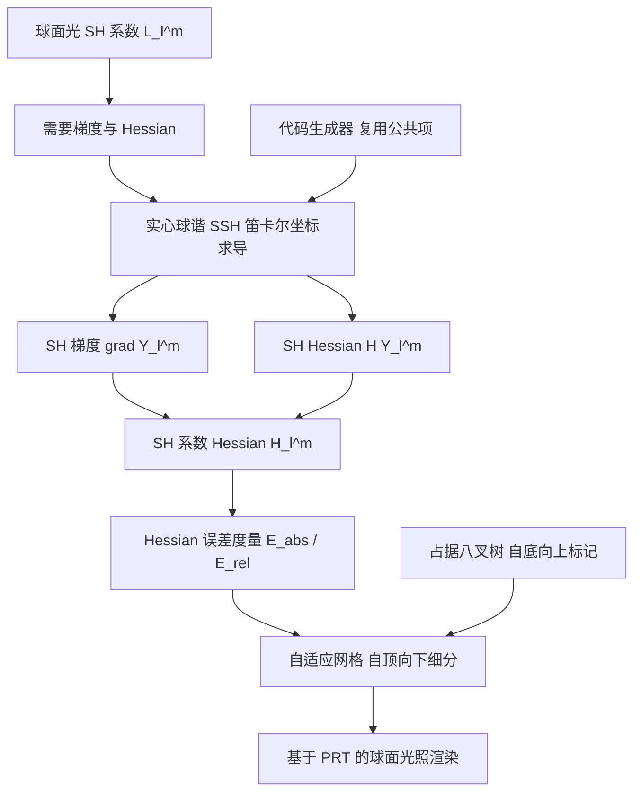

## 一句话总结

本文把球谐函数（SH）的二阶导数——"球谐 Hessian"——引入图形学，借助笛卡尔坐标下的"实心球谐（SSH）"给出球面光源 SH 系数 Hessian 的解析表达，并用它构造一个基于 Hessian 误差度量的自适应网格，在等构建时间下显著提升多球面光源 SH 光照渲染的质量。

## 研究背景

球谐函数是表示单位球面上信号的核心数学工具，在渲染中常用于紧凑地表示低频光照（如环境贴图、漫反射照明）。近年 SH 光照的进展表明，球面光、多边形光在球面/多边形域上的积分存在闭式解，SH 系数的空间梯度也有解析表达。基于这些能力，处理多光源的做法是在场景中布置网格，在稀疏网格点上累加各光源的 SH 系数与空间梯度，着色点处再由邻近网格点插值得到入射光照。

问题在于：已有方法（Mézières 等 2022、Wu 等 2020）使用均匀网格，既不感知插值误差，也不考虑光源分布。均匀网格会在误差小的区域（例如远离面光源处）过度细分，造成不必要的开销；又在误差大的区域细分不足，产生可见瑕疵。因此，需要一种能够解析估计 SH 光照插值误差的数学工具。

作者观察到：用一阶导数（梯度）插值时，其误差正由二阶导数（Hessian）主导——这正是缓存类方法（辐照度缓存、体辐射缓存）早已用 Hessian 度量误差的思路，但那些方法依赖蒙特卡洛估计、会带来方差。若能对 SH 系数的 Hessian 求出解析式，就能无方差地估计插值误差并驱动自适应细分。难点是直接对球坐标下的 SH 求二阶导会遇到 $$\sin\theta$$ 在极点处的除零奇异，且球坐标到笛卡尔坐标的转换矩阵在 Hessian 情形会膨胀到 $$6\times5$$，开销大。

## 方法

### 整体框架

方法分两大块：其一是"如何解析且高效地算出 SH 系数的 Hessian"，关键是借道 SSH 在笛卡尔坐标下求导以规避奇异；其二是"如何用这个 Hessian 构造自适应网格"，通过 Hessian 导出的误差度量决定体素是否细分，并结合占据八叉树只在有着色点的区域计算。

### 关键设计

球面光的 SH 系数。半径为 $$r$$ 的球面光 $$y$$ 对着色点 $$x$$ 的 SH 系数写作 $$L_l^m(x)=\Lambda_l Y_l^m(\omega_{xy})\tilde{L}_l(x)$$，其中 $$\Lambda_l=\sqrt{4\pi/(2l+1)}$$，$$\omega_{xy}$$ 是从 $$x$$ 指向光源中心的单位方向，$$\tilde{L}_l(x)$$ 是带状谐波（ZH）系数。由此，SH 系数的 Hessian 由乘积求导展开为四项：$$H_l^m=\Lambda_l\big(\tilde{L}_l\,\mathrm{H}Y_l^m+\nabla Y_l^m\nabla^{\top}\tilde{L}_l+\nabla\tilde{L}_l\nabla^{\top}Y_l^m+Y_l^m\,\mathrm{H}\tilde{L}_l\big)$$。因此核心任务是求 $$\nabla Y_l^m$$、$$\mathrm{H}Y_l^m$$ 与 ZH 项的 Hessian $$\mathrm{H}\tilde{L}_l$$。

用 SSH 绕开奇异。实心球谐定义为 $$\tilde{Y}_l^m(x,y,z)=r^l Y_l^m(\omega)$$，它是笛卡尔坐标的齐次多项式，一阶、二阶导数都能直接解析求出，且当 $$r=1$$（单位方向，正是渲染的常见用例）时 SSH 与 SH 相等。对 $$\tilde{Y}_l^m=r^l Y_l^m$$ 两边取梯度并令 $$r=1$$，即得 $$\nabla Y_l^m(\omega)=-lY_l^m(\omega)\,\omega+\nabla\tilde{Y}_l^m(\omega)$$。同理对其再取 Hessian，得到 $$\mathrm{H}Y_l^m=\mathrm{H}\tilde{Y}_l^m-l\big(Y_l^m(I+(l-2)\omega\omega^{\top})+\nabla Y_l^m\,\omega^{\top}+\omega\,\nabla^{\top}Y_l^m\big)$$。由于 SSH 在笛卡尔坐标下表达，导数无需从球坐标转换，从根本上消除了 $$\sin\theta$$ 带来的极点奇异，也省去了转换矩阵的开销。SSH 的各分量由多项式 $$Q_l^m(z,r)$$ 以及 $$s_m,c_m$$ 的递推公式计算。

复用公共项的代码生成器。作者进一步提出面向任意阶数的代码生成器：观察到一阶导数里的系数（如 $$K_l^0 Q_{l-1}^1-lY_l^0$$）可被二阶导数的常数项复用，$$Q_l^m$$ 在计算 $$\tilde{Y}_l^m$$、$$\nabla\tilde{Y}_l^m$$ 时已算过、可直接在 Hessian 中重用。相比在化学物理领域用于 SSH 的 sphericart 库（仅硬编码到六阶），本方法能生成更高阶的代码，并因复用公共项取得最高约 3 倍的加速。

Hessian 误差度量与自适应网格。设体素内某点由 $$L_l^m(x)+\nabla L_l^m\Delta x$$ 线性插值，则真值与插值之差可由 Hessian 近似界定：$$\vert L_l^m(x+\Delta x)-L_l^m(x)-\nabla L_l^m(x)\Delta x\vert \approx\tfrac{1}{2}\vert \Delta x^{\top}H_l^m\Delta x\vert $$。对 $$H_l^m$$ 对角化后，该差被最大绝对特征值 $$\lambda_l^m$$ 界定，于是逐系数误差 $$e_l^m=\vert \lambda_l^m\vert \,\|\Delta x\|^2/2$$。汇总所有系数得绝对误差 $$E_{abs}(x)=\|\boldsymbol{\lambda}\|\,\|\Delta x\|^2/2$$ 与相对误差 $$E_{rel}(x)=\|\boldsymbol{\lambda}\|\,\|\Delta x\|^2/(2\|L\|)$$。值得注意的是，每个网格点只需存储特征值向量的 L2 范数 $$\|\boldsymbol{\lambda}\|$$，附加存储为 $$O(1)$$，而非存整套 Hessian 矩阵的 $$O(l_{max}^2)$$。

占据八叉树 + 自顶向下细分。为避免在没有着色点的空区做无谓计算，方法先自底向上构造"占据八叉树"：把含着色点的最细节点标为占据，父节点只要有一个子节点占据即占据。随后自顶向下从根体素细分：在网格点计算各球面光的 SH 系数、梯度与 Hessian，算出体素误差，超过用户阈值 $$\epsilon_{abs}$$（或 $$\epsilon_{rel}$$）则细分为八个子体素；但若对应八叉树节点未被标为占据，则不再细分。着色点处的 SH 系数最终用三次 Hermite 插值获得。

## 实验结果

Hessian 计算精度。以 sphericart 库为真值，对比不同 SH 阶数下 Hessian 矩阵的均方误差（MSE，单位 $$\times 10^{-3}$$）。本方法在 16 阶以内保持零误差，而基于球坐标求导（SCD）的方法在低阶就已积累误差：

| 算法 | 4 阶 | 8 阶 | 12 阶 | 16 阶 | 20 阶 |
| --- | --- | --- | --- | --- | --- |
| 本方法 | 0.000 | 0.000 | 0.000 | 0.000 | 0.505 |
| SCD | 0.067 | 0.281 | 0.637 | 1.135 | 2.279 |

SCD 的误差源于 $$\sin\theta$$ 除法在极点（$$\theta=0,\pi$$）附近使关联勒让德多项式及坐标转换变得不稳定。

Hessian 计算速度。在 Apple M2 Ultra CPU 上、对同一组 $$10^4$$ 个随机方向取 100 次执行平均（单线程）。四阶 SH 下本方法每次约 $$0.05549\,\mu s$$，sphericart 约 $$0.18093\,\mu s$$，SCD 约 $$0.07625\,\mu s$$，即相对 sphericart 提速约 3 倍、相对 SCD 提速约 30%。20 阶时相对 sphericart、SCD 分别约 30% 与 10% 的加速。运算次数上 SCD 约为本方法的 1.46 倍（四阶）与 1.13 倍（20 阶）。

自适应网格渲染质量。在 dragon（93.7 万三角形）与 living room（188 万三角形）两个场景、四阶 SH、$$1024\times768$$ 分辨率、Apple M1 Max CPU 上测试。下表为计算统计（$$N$$ 为最细分辨率 $$2^N$$，$$N_p$$ 为着色体素网格点数，单位千；$$T_g$$、$$T_r$$ 为网格构建与渲染时间，单位 ms；均匀网格列出全部/着色体素两个数值）：

| 场景 | 网格 | N | $$N_p$$ | $$T_g$$ | $$T_r$$ | PSNR ↑ |
| --- | --- | --- | --- | --- | --- | --- |
| dragon | 本方法 | 6 | 2.68 | 1532 | 56.8 | 59.0 |
| dragon | 均匀 | 3 | 0.73/0.40 | 227/128 | 48.4 | 21.0 |
| dragon | 均匀 | 4 | 4.91/1.53 | 1532/481 | 48.6 | 35.2 |
| dragon | 均匀 | 5 | 35.94/4.79 | 11208/1542 | 48.6 | 52.8 |
| living | 本方法 | 6 | 5.76 | 4.36 | 87.5 | 70.2 |
| living | 均匀 | 3 | 0.73/0.47 | 0.23/0.15 | 76.8 | 26.8 |
| living | 均匀 | 4 | 4.91/2.17 | 1.61/0.77 | 76.9 | 31.3 |
| living | 均匀 | 5 | 35.94/8.84 | 13.05/4.70 | 77.5 | 52.5 |
| living | 均匀 | 6 | 274.63/38.39 | 122.93/30.36 | 78.2 | 70.9 |

在含 2516 个球面光的 dragon 场景中，参考图渲染需 6586 ms；本方法自适应网格构建 1532 ms、单帧渲染 56.77 ms（17.6 fps），含构建的总时间比逐着色点计算的传统方法快约 4.14 倍。在等构建时间下，本方法（$$N_p=2683$$）对比 $$16^3$$ 均匀网格，MSE 降到约 1/30、PSNR 提升约 24 dB；即便对 $$32^3$$ 均匀网格施加占据八叉树，其质量仍不及本方法。living room 场景中本方法比等构建时间的 $$32^3$$ 均匀网格 PSNR 高约 18 dB；$$64^3$$ 均匀网格虽能达到相近 PSNR（70.9 dB），但构建时间约为本方法的 7 倍。

其它分析。三次 Hermite 插值相比三线性插值能把 MAPE 降低约两个数量级。误差阈值 $$\epsilon_{abs}$$ 减半时 MAPE 与 MAE 也约减半，说明误差度量能有效估计并控制插值误差。绝对误差度量倾向过度细分亮区、适度细分暗区，相对误差度量则相反——故亮场景推荐相对误差度量，其它场景更适合绝对误差度量。

## 亮点与局限

亮点。把 SSH 这一来自量子化学领域的工具引入图形学，用笛卡尔坐标齐次多项式的形式一举解决了球坐标求导的极点奇异与转换开销，得到 SH 梯度与 Hessian 的解析、稳定、可扩展到高阶的计算；配套代码生成器通过复用公共项实现最高约 3 倍加速。Hessian 误差度量把"何处该细分"从经验判断变成可解析、无方差的量化标准，每点仅需 $$O(1)$$ 附加存储，且能自然融入既有 PRT 框架。

局限。计算 Hessian 相比纯梯度方法每网格点增加约 44%–77% 开销（作者指出可通过对远处球面光跳过 Hessian 评估来缓解，但留作未来工作）；自适应网格渲染需从根体素向叶体素遍历，相比均匀网格的常数时间定位，额外约 13%–17% 开销。当前 PRT 框架仅在 CPU 上实现，GPU 版本尚未完成；方法目前聚焦于均匀发光的球面光源。

## 延伸思考

作者已指出可将误差估计推广到多边形光等一般光源，以及探索 SSH 在三重积分、在多边形域上解析积分等操作上的应用。更进一步，SH Hessian 的解析化对缓存类方法（辐照度/辐射缓存）同样有价值——可用它无方差地放置缓存点，替代目前依赖蒙特卡洛估计的误差度量。此外，"用二阶信息驱动自适应细分"的思路具有普适性：任何以低阶导数插值的空间场（如神经辐射场的特征网格、体积数据的稀疏体素）都可能借助解析或近似 Hessian 得到有原则的细分准则，而非依赖启发式分辨率设定。
