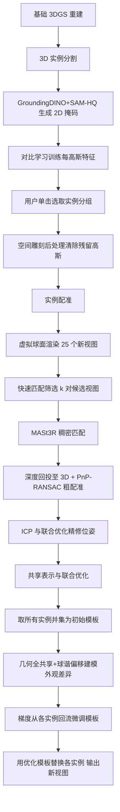

## 一句话总结

本文提出利用真实场景中普遍存在的重复元素（如立柱、窗户、桌椅）来改善新视图合成：先在 3D Gaussian Splatting 重建中分割出每个重复实例，将它们配准到统一坐标系，再构建一个几何共享、外观各自偏移的模板表示，让各实例的多视图信息互相补全，从而显著提升遮挡与覆盖不足区域的重建质量。

## 研究背景

- 领域现状：神经辐射场（NeRF）与 3D Gaussian Splatting（3DGS）已让从照片重建场景并自由漫游变得普及，渲染质量高、速度快。但要获得高质量新视图，需要对场景做细致而充分的多视角采集。
- 核心痛点：对于采集不充分、被遮挡的区域，未见视角的渲染质量通常很差。已有的泛化方案要么引入不确定性度量来剔除漂浮物（Nerfbusters、Bayes' Rays），要么依赖昂贵的扩散模型先验，或需要极大显存的重建模型。
- 本文 idea：作者观察到环境中充满重复元素，同一物体的多个实例在采集中被从不同视角、不同覆盖程度地观测到，这本身就构成一种天然的多视图信息来源。因此把同一物体的所有实例融合成一个共享表示，用覆盖良好的实例去补全覆盖差或被遮挡的实例。这需要解决三大挑战：高质量的 3D 实例分割、噪声 3DGS 数据的 3D 配准、以及不同实例间因光照差异导致的外观变化。

## 方法

### 整体框架

方法以一个基础 3DGS 重建为输入，分三个阶段推进：先做 3D 实例分割（每个高斯附加一个对比学习特征，用户每个实例点一下即可分组）；再做实例配准（借助 3DGS 渲染新视图来跑鲁棒的 2D 匹配，回投到 3D 后用 PnP-RANSAC 求刚体变换）；最后构建共享表示并联合微调，让梯度从各实例回流到模板，几何全实例共享、外观用球谐偏移各自建模。完成后即可用优化后的模板替换每个实例。

### 关键设计一：基于对比学习的 3D 实例分割

3DGS 的高斯基元并不严格贴合物体几何，有的悬浮在表面附近、有的以大尺度低不透明度存在，这给分割带来困难。作者为每个高斯分配一个可训练特征，用 2D 掩码做对比学习：用户对 GroundingDINO 输入文本查询（如"pillar"）得到每个实例的边界框，再送入 SAM-HQ 得到 2D 掩码。渲染出的逐像素特征按是否属于同一掩码做拉近（pull）或推远（push），推损失带 0.3 的间隔，拉损失按负正对比例加权以抵消不平衡。作者识别出三个难点并逐一处理：表面下的低不透明度高斯梯度不足、被多物体共享的大高斯梯度冲突、实例与背景边界的高斯被"遗留"。为此在 3DGS 训练中加入不透明度与尺度的 $$\ell_1$$ 正则 $$\lambda_{\text{opacity}}\frac{1}{N}\sum_{i=1}^{N}o_i+\lambda_{\text{scale}}\frac{1}{N}\sum_{i=1}^{N}s_i$$。分割时用户在任一训练视图点击实例内部，取对应渲染特征作为查询 $$f_q$$，凡满足 $$d(f_i,f_q)\le\tau$$（取 $$\tau=0.1$$）的高斯即归入该实例。

### 关键设计二：空间雕刻后处理

分割后仍会有残留高斯同时贡献实例与背景外观，若不清除会让各实例收到略微不同的梯度、损害信息共享。作者用空间雕刻思路判断某背景高斯是否应删除：若在每一张训练图中都至少满足以下三条之一——中心投影落入某实例的 2D 掩码内、中心投影落在图像边界之外、中心在当前相机下不可见（例如位于相机之后）——则认为它影响实例渲染并从场景中移除。

### 关键设计三：以新视图合成驱动的实例配准

纯几何配准在 3DGS 上不适用，因为高斯是为复现图像外观而非几何而优化的，常悬浮于表面前后，且不同实例的高斯密度差异很大。作者转而利用 3DGS 能渲染高质量图像这一能力来跑 2D 匹配。配准粗估分四步：在每个实例周围虚拟球面上按 5 个方位角 × 5 个仰角采样 25 个朝向中心的相机渲染新视图；用快速匹配器在所有视图对中筛出匹配最多的前 $$k=10$$ 对；对这 $$k$$ 对用更鲁棒但更昂贵的 MASt3R 做稠密匹配；用 3DGS 提供的深度把 2D 匹配点回投到 3D，$$p_i=D_i M_{\text{cam}}K^{-1}(u_i\ v_i\ 1)^T$$，再用 PnP-RANSAC 在 2D-3D 对应上求源实例到模板的刚体变换，保留内点最多者。位姿精修先以粗估初始化跑 ICP，再把位姿参数并入后续 3DGS 优化。选模板时取高斯基元数量最多的实例。对称或无纹理物体只需找到一个有效变换即可用于后续微调。

### 关键设计四：几何共享、外观偏移的共享表示

把所有实例经变换放入统一坐标系并取并集作为初始模板。每个高斯基元的所有参数在同类物体的各实例间共享，从而用全部实例的多视图信息约束几何。为处理主要由光照造成的外观差异，把每个基元的球谐系数分解为共享分量与逐实例偏移 $$c_{\ell m}=\lambda c_{\ell m}^{\text{shared}}+(1-\lambda)c_{\ell m}^{\text{offset}}$$，混合权重 $$\lambda=0.8$$，并对偏移项施加 $$\ell_1$$ 惩罚使其尽量小。优化时把每个实例替换为对共享表示的引用（叠加逐实例几何变换与球谐偏移），从而让所有实例的渲染损失梯度回流到共享表示，同时联合优化位姿。这样若两个实例从相反方向被观测，模板便能同时从两侧被良好重建。作者还试过用坐标 MLP 共享外观，质量相近但慢一倍半，且反射的共享分量与实例特定分量无法解耦。

## 实验结果

在四个合成场景（Office、Temple、Chessboard、Classroom）和四个真实场景（House、MeetingRoom、Pillars、Facade）上评测，测试轨迹与训练轨迹分离且不参与训练；另补充一个 ScanNet++ 与两个 DL3DV 场景。指标包括 PSNR、SSIM、LPIPS 及衡量整体真实感的 KID，并分别在完整图像与重复元素所在掩码区域计算以隔离方法效果。主实验结果（数字忠于原文）：

合成场景（完整 / 掩码区域）：

| 方法 | PSNR↑ | SSIM↑ | LPIPS↓ | KID↓ | PSNR↑（掩码） | SSIM↑（掩码） | LPIPS↓（掩码） | KID↓（掩码） |
| --- | --- | --- | --- | --- | --- | --- | --- | --- |
| Nerfbusters | 19.48 | 0.690 | 0.464 | 0.4185 | 17.97 | 0.605 | 0.219 | 0.2098 |
| Bayes' Rays | 19.50 | 0.655 | 0.418 | 0.3018 | 18.20 | 0.573 | 0.223 | 0.2242 |
| Nerfacto | 20.18 | 0.683 | 0.405 | 0.2288 | 19.37 | 0.607 | 0.215 | 0.1694 |
| 3DGS | 23.37 | 0.800 | 0.266 | 0.1808 | 22.78 | 0.761 | 0.139 | 0.1607 |
| 3DGS* | 24.41 | 0.843 | 0.236 | 0.1389 | 23.02 | 0.778 | 0.119 | 0.1076 |
| Ours | 27.62 | 0.897 | 0.163 | 0.0316 | 27.54 | 0.887 | 0.063 | 0.0097 |

真实场景（完整 / 掩码区域）：

| 方法 | PSNR↑ | SSIM↑ | LPIPS↓ | KID↓ | PSNR↑（掩码） | SSIM↑（掩码） | LPIPS↓（掩码） | KID↓（掩码） |
| --- | --- | --- | --- | --- | --- | --- | --- | --- |
| Nerfbusters | 19.26 | 0.757 | 0.422 | 0.3017 | 17.62 | 0.687 | 0.138 | 0.1827 |
| Bayes' Rays | 22.05 | 0.779 | 0.385 | 0.1215 | 21.97 | 0.743 | 0.123 | 0.0837 |
| Nerfacto | 22.43 | 0.803 | 0.368 | 0.1303 | 21.54 | 0.771 | 0.114 | 0.0765 |
| 3DGS | 22.57 | 0.849 | 0.273 | 0.0974 | 21.87 | 0.798 | 0.089 | 0.0766 |
| 3DGS* | 22.59 | 0.842 | 0.273 | 0.0994 | 21.91 | 0.799 | 0.090 | 0.0749 |
| Ours | 24.18 | 0.868 | 0.248 | 0.0483 | 24.63 | 0.847 | 0.068 | 0.0348 |

本方法在所有指标上大幅领先：真实场景 PSNR 比次优方法高 1.59 dB，只看重复元素掩码区域高 2.72 dB；ScanNet++/DL3DV 场景掩码区域 PSNR 平均提升 1.28 dB。定性上，Office 场景中被严重遮挡的桌椅在基线下重建很差，而共享表示借助可见实例的信息得到改善；放大实验中，背景处远距离拍到的半身像借助前景近拍的同一物体补全了缺失细节。

配准分析（合成集，旋转按测地距度数、平移向量的平均绝对误差 MAE，数字忠于原文）：

| 方法 | MAE(R)↓ | MAE(t)↓ |
| --- | --- | --- |
| Ours | 0.490 | 0.065 |
| 去虚拟视图 | 4.367 | 0.204 |
| 去 ICP | 5.455 | 0.114 |
| 用 SIFT（部分场景失败） | 0.379 | 0.059 |
| 用 SuperPoint（部分场景失败） | 0.458 | 0.075 |
| FPFH | 50.58 | 2.547 |
| FPFH 去 ICP | 66.94 | 2.606 |

本方法平均仅半度误差，基于 3D 特征的 FPFH 则失败于约 50 度；用训练视图代替虚拟球面采样会退化约 4 度，去掉 ICP 精修退化约 5 度。SIFT/SuperPoint 虽在个别场景数值略好但在真实场景多处彻底失败，凸显了鲁棒匹配器 MASt3R 的必要性。共享表示消融（两合成场景平均 PSNR / 每秒迭代）：完整球谐共享方案 27.33、2.6 it/s；去偏移降至 26.63；去共享分量降至 25.19；MLP 方案 27.34 但仅 1.5 it/s。计算耗时分解：3DGS 训练 22 分、对比特征 21 分、3D 分割 19 秒、配准 123 秒、微调 51 分。

## 亮点与局限

亮点：

- 首次系统性地把"场景中的重复元素"作为免费的多视图信息源用于新视图合成，绕开昂贵的扩散模型先验，通过实例间信息共享补全遮挡与低覆盖区域。
- 提出以新视图合成驱动 2D 匹配再回投 3D 的配准流程，巧妙规避了 3DGS 数据不贴合几何、纯 3D 描述子失效的问题，配准精度达亚度级。
- 共享几何加球谐偏移的表示简洁高效，能显式解耦共享外观与实例光照差异，比 MLP 方案更快且可解释；分割上的正则加空间雕刻后处理也明显提升了整体质量。

局限：

- 效果高度依赖场景中重复实例的数量与视角多样性，且无法改善背景区域，测试视图中背景仍可能残留伪影。
- 重复元素的识别需要用户交互（每实例一次点击）。
- 强光照变化（如镜面高光）会造成实例间显著外观差异，难以建模，作者将其留作未来工作；均匀光照场景更易处理。

## 延伸思考

- "用重复性换重建质量"提供了一条不同于生成先验的泛化思路：当场景本身包含冗余观测时，结构化地聚合这些冗余可能比引入外部先验更可靠、更廉价，这对城市、建筑、室内等高度规律化的场景尤具价值。
- 作者展望的两个方向都很有潜力：一是用共享表示压缩 3DGS 内存——若 $$N$$ 个实例能用一份紧凑模板表示，总高斯数可大幅下降，难点在于如何紧凑编码各实例外观；二是把共享推广到 BRDF 材质参数，让多实例的多光照信息帮助材质与光照解耦，改善逆向渲染。
- 把"用户少量点击 + 2D 视觉大模型（GroundingDINO、SAM-HQ、MASt3R）"编排进 3DGS 流水线的做法，展示了如何以最小人工介入把强 2D 先验迁移到噪声 3D 表示上，这一范式对更广泛的 3D 编辑与理解任务有借鉴意义。
