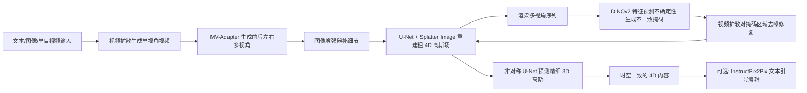

## 一句话总结

Splat4D 从单目视频出发，借助多视角视频扩散、不一致性检测与非对称 U-Net 精修，生成在时间与空间上都保持一致的高保真 4D（动态 3D）内容，并支持图像/文本条件生成、4D 人体生成和文本引导编辑。

## 研究背景

- 领域现状：4D 内容（随时间演化的动态 3D 物体）在数字人、游戏、影视、AR/VR 中需求很大。早期方法多用分数蒸馏采样（SDS）从预训练 2D/3D 扩散模型中蒸馏先验来优化动态场景；随后出现基于视频扩散模型的方法（如 4Diffusion、SV4D、Diffusion4D），用多视角视频先验来提升 4D 生成的效率与一致性。
- 核心痛点：单目视频生成 4D 是高度病态的问题——同一段输入可对应多种合理的 4D 解释，且需要同时推断未见视角的外观与运动。现有方法普遍存在纹理模糊、几何畸变、时间上的闪烁抖动，难以同时兼顾时间一致性与空间一致性，也难以刻画复杂人体（如宽松衣物）并融合图像、文本、动作等多模态输入。
- 本文 idea：先把单目视频扩展成高质量的多视角图像序列并用图像增强器补细节，再重建出一个"粗"的 4D 高斯场；然后通过不一致性掩码定位不可靠区域、用视频扩散模型对这些区域做 inpainting 修复，形成"渲染→检测→修复→回填"的反馈闭环；最后微调一个非对称 U-Net 作为可泛化的 3D 高斯场预测器，弥合图像增强器与重建模型之间的域差，整体提升质量。

## 方法

整体框架：输入（文本 / 图像 / 单目视频）先转成高质量多视角图像序列，用其初始化一个 4D 高斯场表示；再经过不确定性掩码与视频去噪扩散的精修，保证保真度与时空一致性；最终得到可从任意视角渲染的 4D 内容，并可选地做文本引导编辑。

关键设计：

1. **粗 4D 高斯生成（多视角视频 + 增强 + 重建）**。先用视频扩散模型（Stable Video Diffusion）生成单视角视频，但单视角存在深度歧义、缺侧视/背视信息。于是用 MV-Adapter 把每帧扩展为前、后、左、右多视角：$$\text{MV-Adapter}(I_t) \rightarrow \{I_t, I_t^{left}, I_t^{right}, I_t^{back}\}$$ 。由于这些生成结果常缺细节且分辨率不足，再套一个图像增强器逐帧逐视角精修纹理与边缘。随后沿用 LGM 思路，把多视角序列送入 U-Net 编码多尺度空间与深度特征，用 Splatter Image 把逐像素特征投影为 3D 高斯；对每个时间步单独重建一个 3D 高斯场，堆叠成时序表示 $$G(S,t) = [X_t, s_t, r_t, \sigma_t, \zeta_t]$$（位置、尺度、旋转、不透明度、球谐），构成时空上连续稳定的 4D 高斯场基础。

2. **时空一致性精修（不一致性掩码）**。MV-Adapter 逐帧独立处理会带来多视角与帧间不一致。作者从 4D 高斯场渲染出多视角序列，用 DINOv2 特征经不确定性预测网络估计逐像素不确定度 $$\sigma$$，把运动伪影、遮挡、视角差异等问题区域标出来，得到掩码 $$M = \mathbb{1}\left(\frac{1}{2\sigma^2} > 1\right)$$，从而聚焦修复问题区、保留稳定区。

3. **不确定性引导的修复与反馈闭环**。对渲染序列施加视频去噪扩散模型，仅针对掩码区域"填补"出与周围像素无缝衔接的内容，并在去噪时参考相邻帧以保证平滑过渡、减少抖动闪烁。修复后的帧再回填去更新 4D 高斯场，形成反馈循环，让 4D 表示与增强后的图像序列对齐。为缓解幻觉问题，视频扩散以输入序列的首帧和末帧为条件。

4. **可泛化的 3D 高斯场预测器学习**。图像增强器（在 DIV2K 上训练）与 LGM（在 Objaverse 上训练）之间存在明显域差，导致 4D 高斯场质量跟不上增强器的提升。作者用预处理后的 Objaverse 数据微调源自 LGM 的 U-Net：每步随机取一张俯仰角在 -30 到 30 度之间的输入图，用 MV-Adapter 生成四个正交视角，经增强与一致性精修后送入 U-Net 生成 4D 高斯场，再按四个正交视角渲染图像、以原始 Objaverse 渲染图为监督，从而缩小域差、提升质量。

## 实验结果

在 Consistent4D 数据集上做 video-to-4D 定量对比，评测感知相似度（LPIPS）、语义对齐（CLIP-S）以及衡量时空一致性的 Fréchet Video Distance（FVD-F 逐帧、FVD-V 视频级）。Splat4D 在全部指标上都取得最好成绩：

| 方法 | LPIPS↓ | CLIP-S↑ | FVD-F↓ | FVD-V↓ |
|------|--------|---------|--------|--------|
| Consistent4D | 0.134 | 0.87 | 1133.93 | 735.79 |
| STAG4D | 0.126 | 0.91 | 992.21 | 685.23 |
| SV4D | 0.118 | 0.92 | 732.40 | 503.51 |
| 4Diffusion | 0.13 | 0.94 | 489.2 | 405.5 |
| 本文 | 0.090 | 0.97 | 390.85 | 282.79 |

同样的趋势在 ObjaverseDy 测试集与 image-to-4D 评测中保持：在 image-to-4D 上本文相比 Diffusion4D 把 LPIPS 从 0.18 降到 0.12、FVD 从 490.2 降到 395.0，CLIP-S 提升到 0.94。消融实验表明去掉不确定性掩码（w/o mask）或去掉 U-Net 微调（w/o train）都会明显拉低各项指标（例如 FVD-V 从完整模型的 282.79 分别退化到 413.79 与 364.81），验证了两个组件对处理时空不一致、保持高保真都很关键。此外方法还展示了文本/图像条件 4D 生成、4D 人体运动迁移（配合姿态提取与 Champ 2D 运动迁移）、以及基于 InstructPix2Pix 的文本引导 4D 编辑等应用。

## 亮点与局限

- 亮点：
  - 首个把图像增强器引入高质量 4D 生成流程的方法，并针对增强带来的多视角不一致，用不确定性掩码 + 非对称 U-Net 微调 + 视频扩散 inpainting 的组合系统性化解，各组件互补。
  - "渲染→检测不一致→扩散修复→回填"的反馈闭环显式优化时空一致性，在 LPIPS/CLIP-S/FVD 上全面领先多个强基线。
  - 通用性强：一套框架覆盖图像/文本条件生成、4D 人体生成、文本引导编辑等多种任务。

- 局限：
  - 论文未设独立的局限性章节，对失败案例与边界条件的讨论有限（此为笔者阅读判断）。
  - 流水线依赖多个大型预训练模型（视频扩散、MV-Adapter、图像增强器、DINOv2、Champ 等），组件较多、系统复杂，且训练需 4 张 V100，落地成本不低。
  - 生成质量受上游多视角/视频扩散先验与运动迁移模型能力约束；对首末帧条件的依赖是为缓解幻觉，说明大幅度或复杂运动仍可能存在挑战。

## 延伸思考

- 该方法把"不确定性估计 + 扩散修复"的思路引入 4D 高斯场精修，与近年 3D/4D 重建中用不确定性/一致性检测来指导优化的趋势一脉相承；这种"检测问题区再局部修复"的闭环范式或可迁移到其他生成式重建任务。
- 相比纯 SDS 优化，先生成多视角视频再蒸馏成 4D 的路线在速度与运动幅度上更有优势，值得关注其在长序列、大运动场景下的稳定性表现。
- 复杂人体（宽松衣物、精细面部）是作者强调的强项方向，后续若能与参数化人体先验或物理约束结合，或能进一步提升动态细节的物理合理性。
