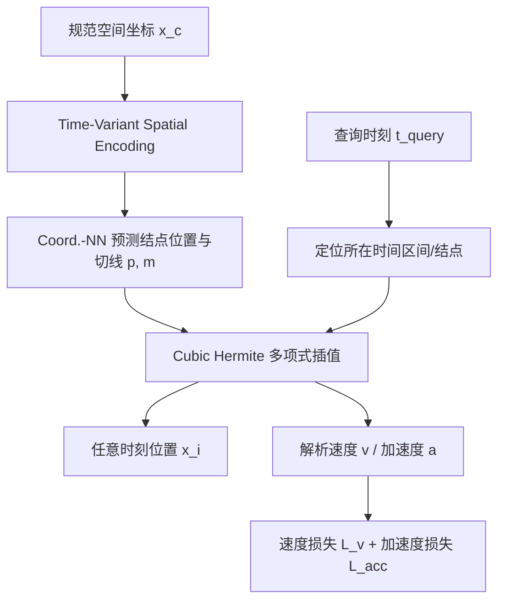

## 一句话总结

用样条（Cubic Hermite Spline）显式表示稠密点的运动轨迹，通过解析可导的速度与加速度进行正则化，在稀疏时间信号插值与动态场景重建中获得更强的空间一致性与时间稳定性。

## 研究背景

稠密点的轨迹建模通常依赖隐式形变场：用神经网络把坐标映射到时间偏移，把规范空间位置关联到各时刻位置。但神经网络固有的归纳偏置（平滑性偏置）在欠约束场景下会损害空间一致性，容易产生波动伪影。

已有工作大致分两类：一类改进形变场的编码策略（如 Hexplane、hash grid），但模型往往不透明、不直观；另一类采用线性混合蒙皮（LBS）、ARAP 等显式技术，却依赖启发式的控制节点初始化和多阶段训练。DOMA 把周期激活扩展到多帧序列，但耦合的四维信号引入波状抖动；ResFields 通过解耦时空信号提升了 MLP 的表达力，却因时间离散化限制了插值能力。此外，隐式表示用于稀疏时间信号插值的潜力仍未被充分挖掘。

作者提出用样条这一经典数学工具来表示轨迹：由结点（knots）数量显式决定自由度，天然建模连续运动，并可解析求导得到速度与加速度，从而在不依赖 LBS 或 ARAP 的情况下增强运动一致性。

## 方法

整体框架采用规范空间到形变（Canonical-Deformation）的设计：一个坐标神经网络以规范空间坐标为输入，预测样条各结点上的位置与切线参数；再由多项式插值函数在任意查询时刻求出该点位置。时间轴被均匀划分为 $$N-1$$ 个区间、共 $$N$$ 个结点，结点数需满足 $$K \cdot N = T$$（$$T$$ 为训练时间戳数，$$K$$ 由多项式阶数决定，文中取 $$K=2$$）。

关键设计：

1. **样条轨迹表示**。采用分段三次 Hermite 样条，插值函数为 $$p(\bar t) = (2\bar t^3 - 3\bar t^2 + 1)p_0 + (\bar t^3 - 2\bar t^2 + \bar t)m_0 + (-2\bar t^3 + 3\bar t^2)p_1 + (\bar t^3 - \bar t^2)m_1$$，其中 $$p_0,p_1$$ 为起止结点属性、$$m_0,m_1$$ 为可训练的起止切线。样条的局部性抑制了静态区域的时间振荡，结点数 $$N$$ 成为显式、可解释的自由度调节旋钮。

2. **时变空间编码（TVSE）**。不再像以往那样把三维坐标与时间平等地做四维编码，而是把时间信号注入到空间编码中，即 $$\Phi_\theta(\gamma_{\varphi(t)}(x), \gamma_{\varphi(t)}(y), \gamma_{\varphi(t)}(z))$$。在 ResFields 思路基础上引入时间维的低秩分解 $$\phi(t) = b_{base} + \sum_{r=1}^{rank} v_t[r] \cdot B_{res}[r]$$，兼顾紧凑性与隐式正则。作者给出 Time-Variant Triplanes 与 Time-Variant Triaxes 两种网格实例。

3. **速度与加速度正则**。对插值函数求时间导数得到解析速度 $$v(\bar t)$$，并以近邻点速度差构造速度损失 $$L_v^i = \sum_{j \in N_k(i)} w_{ij}\lVert v_i - v_j\rVert_2^2$$ 以保持空间一致性；再求二阶导得到解析加速度 $$a(\bar t)$$，以 $$L_{acc}^i = \lvert a_i \rvert$$ 抑制高频抖动与低频振荡。总损失为 $$L = L_{recon} + \alpha L_v + \beta L_{acc}$$。

4. **Moran's I 空间一致性度量**。基于空间自相关统计量 Moran's I 提出新的评价指标，用于量化运动场的空间一致性，与其他指标及视觉结果吻合良好。

## 实验结果

在 DeformingThings4D 长序列（每条超过 500 帧）上做稀疏时间信号插值：仅用每 4/6 帧训练，其余帧评估，比较端点误差 EPE（表中数值 ×10⁴）与 Moran's I。

| Method | Settings | EPE↓ (x4) | M.'s I↑ (x4) | EPE↓ (x6) | M.'s I↑ (x6) |
|---|---|---|---|---|---|
| DOMA | #p=0.1M | 92.59 | 0.876 | 105.28 | 0.877 |
| ResFields | c=50% † | 45.79 | 0.896 | 74.35 | 0.894 |
| ResFields | † w/ AIAP | 45.72 | 0.927 | 73.00 | 0.923 |
| Ours (SF-Siren-ResFields) | c=100%, r=60 ‡ | 40.74 | 0.919 | 68.28 | 0.926 |
| Ours ‡ w/o L_v | | 42.15 | 0.916 | 68.40 | 0.924 |
| Ours ‡ w/o L_acc | | 42.66 | 0.917 | 70.12 | 0.929 |
| Ours ‡ w/ AIAP | | 41.64 | 0.938 | 68.93 | 0.943 |

本方法在 c=100% 设置下取得最低 EPE，且消融显示去掉 $$L_v$$ 或 $$L_{acc}$$ 都会带来性能下降，验证了两项正则的有效性。在动态场景重建方面（NeRF-DS、Hyper-NeRF、Neu3D、D-NeRF），网格类与 MLP 类方法均从该表示中受益：相较 SC-GS 等两阶段 LBS 方法取得有竞争力的重建质量，同时在静态无纹理区域具有更好的时间稳定性；在 Neu3D 多相机场景下 Moran's I 显著领先。

## 亮点与局限

亮点：
- 用经典样条给出显式、可解释的轨迹表示，结点数直接对应自由度，超参调节反馈直观。
- 速度、加速度可解析求导，使空间一致性与时间平滑正则无需两阶段训练或先验，减少启发式成分。
- 时变空间编码具架构无关性，可嵌入余弦编码与多分辨率网格等多种方案。
- 提出基于 Moran's I 的空间一致性度量，为后续研究提供可量化工具。
- 建立的一致性支持点平流、轨迹流形编辑、以及把单帧外观修改传播到整段序列等应用。

局限：
- 在合成数据集 D-NeRF 上保真度略逊于最先进方法，源于表示带来的轻微时间错位（视觉上可忽略），作者将其修正留作未来工作。
- 结点数 $$N$$ 需与输入时间步匹配以避免欠拟合，在大运动数据集上减小 $$N$$ 会造成明显错位并显著惩罚重建精度。
- MLP 类方法在简单运动场景因全局连续性保持更好的空间一致性，但在极端情况下常失败。

## 延伸思考

把"运动"从纯隐式的黑箱平滑偏置转回到有解析结构的样条表示，是一个务实的折衷：既保留了神经场的可微与连续，又通过显式自由度和可导物理量（速度、加速度）拿回了可控性与可解释性。时变权重呈现的对称性与周期性提示，运动的时间结构本身可被显式编码而非隐式拟合，这对物理仿真、动作编辑与可控生成都有启发。值得进一步探索的是自适应结点分布（非均匀结点）以缓解 $$N$$ 与时间步硬绑定的限制，以及把该表示与更高阶样条或物理约束结合来消除合成数据上的时间错位。
