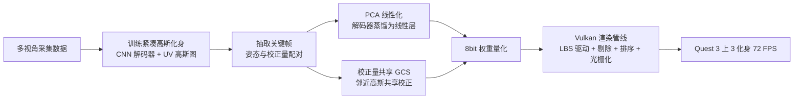

## 一句话总结

SqueezeMe 把原本依赖高容量神经网络解码的高保真 3D 高斯全身化身，蒸馏成"线性层 + 高斯校正量共享"的轻量表示，配合定制 Vulkan 渲染管线，首次在 Meta Quest 3 头显上做到 3 个化身同时驱动与渲染、达到 72 FPS。

## 研究背景

- 领域现状：基于 3D 高斯泼溅（3D Gaussian Splatting）的全身化身已经能达到很高的视觉保真度，桌面级 GPU 上可实时驱动和渲染单个化身；对静态场景或预录序列，移动端实时渲染也已可行。
- 核心痛点：化身不同于静态场景，需要根据实时驱动信号（如身体姿态）在线计算非刚性校正量。现有高保真方法靠高容量神经网络逐帧解码这些姿态相关校正量，内存与算力开销大，独立式 VR 头显这类移动端算力和带宽受限，难以承载。
- 本文 idea：借鉴计算机图形学里常用的 blendshapes 与线性姿态校正思想，把神经网络学到的姿态校正蒸馏成线性层；再利用"相邻高斯的校正量以低频为主"这一观察，让邻近高斯共享校正量，进一步压缩内存，从而把解码器塞进移动芯片。

## 方法

整体框架：先用高容量卷积解码器训练一个紧凑的高保真高斯化身（校正量定义在 UV 图上），再把这个解码器分两步蒸馏——线性化（PCA + 最小二乘）与校正量共享（Gaussian Corrective Sharing, GCS），最后量化并在定制 Vulkan 管线里渲染。

关键设计：

1. **紧凑的 UV 空间高斯化身**：解码器预测一张 $$G \in \mathbb{R}^{K\times256\times256}$$ 的 2D 高斯图，每个像素对应一个高斯，$$K=37$$ 是每个高斯的自由度（旋转、位移、尺度、球谐系数等）。与 Animatable Gaussians 用前后正交投影、大量像素闲置不同，本文把高斯属性投影到蒙皮网格的 UV 图上，表示更紧凑，用更少高斯（约 6 万，是基线的五分之一）达到相当质量。化身由线性混合蒙皮（LBS）加非线性校正驱动，最终高斯为 $$G = LBS(G_t + M(D(e_f,e_b)),\theta)$$ ，其中 $$G_t$$ 是可学习模板，$$M$$ 是掩掉 UV 死区的二值掩码。透明度项 $$\delta$$ 保持常数，方便剔除不可见高斯。

2. **线性蒸馏（Linearization）**：把卷积解码器 $$D$$ 蒸馏成两层线性模型。收集一批姿态输入与解码器输出，用 PCA 把姿态向量压到 64 维，加一列全 1 构成设计矩阵 $$C$$，用正规方程 $$(C^TC)^{-1}C^T$$ 求最小二乘解得到校正量基。第一层线性层把 64 维压缩向量映射到 60381×16，是主要开销；第二层把其中 6 个通道展开成 27 维球谐，其余 10 通道给几何参数。这样解码延迟骤降。

3. **高斯校正量共享（GCS）**：静态高斯参数需要保留高频细节才逼真，但姿态相关校正量以低频为主——皮肤、头发、衣物上相邻粒子基本一起运动。于是把解码器输出从 256×256×37 改成 64×64×37（校正量从 65536 降到 4096），训练时用最近邻上采样回 256×256，等价于让每个 4×4 邻域的高斯共享一份校正量，内存约减少 16 倍。

4. **定制 Vulkan 渲染**：利用硬件光栅化加速高斯泼溅。流程为：compute 步做 LBS 驱动 → 逐图元剔除视锥外高斯（双目共用）→ 投影并按深度排序（双眼复用排序索引）→ 把投影高斯展开成带颜色和不透明度的四边形图元，走传统图形管线光栅化混合。除最后光栅化用顶点/片元着色器外，各阶段都是标准 Vulkan compute shader。

## 实验结果

在内部采集穹顶（512 台 2500 万像素相机、90 FPS）采集 4 个身份的数据，训练/评测使用不同姿态段，且评测均为新视角合成（相机位姿不在训练集）。主实验对比线性化与校正量数目对质量与解码延迟的影响，指标在按分割掩码裁剪后的图像上计算，结果为 4 个身份的平均，延迟仅指解码器部分（Quest 3 上）。

| 模型 | 高斯数 | 校正量数 | L1↓ | LPIPS↓ | PSNR↑ | SSIM↑ | 解码延迟 |
|------|--------|----------|------|--------|-------|-------|----------|
| Animatable Gaussians（基线） | 300k | 300k | 0.037 | 0.143 | 24.637 | 0.620 | — |
| SqueezeMe（初始） | 60k | 60k | 0.036 | 0.146 | 24.992 | 0.638 | — |
| SqueezeMe（GCS） | 60k | 4k | 0.036 | 0.147 | 25.024 | 0.636 | — |
| SqueezeMe（线性化） | 60k | 60k | 0.039 | 0.150 | 24.411 | 0.632 | 5.0 ms |
| SqueezeMe（GCS + 线性化） | 60k | 4k | 0.039 | 0.151 | 24.370 | 0.629 | 0.45 ms |
| SqueezeMe（无解码器） | 60k | 0 | 0.040 | 0.164 | 23.905 | 0.622 | 0 |
| 从零训练线性模型 | 60k | 60k | 0.044 | 0.215 | 23.454 | 0.616 | 5.0 ms |

（"从零训练线性模型"的数字为 3 个身份平均，另一身份训练发散；该数字带星号说明数据不完整。）

其余结论：初始 SqueezeMe 用 5 倍更少的高斯即达到与 Animatable Gaussians 相当的质量；GCS 把校正量从 6 万降到 4 千质量几乎不掉；再加线性化后解码延迟低至 0.45 ms，处于初始模型与"无解码器"之间的折中，非常适合端上部署。相比之下，直接从零训练线性模型质量明显更差且不稳定，说明"两阶段蒸馏"的价值。量化方面，采用 8 bit 权重、16 bit 激活的训练后量化，浮点与量化模型定量结果一致。整体上解码器延迟从基线的 50 ms 降到 0.45 ms，实现 Quest 3 上 3 化身 72 FPS。

## 亮点与局限

- 亮点：
  - 系统性地把"高容量 CNN 解码器"蒸馏为"线性层 + 校正量共享"，兼顾质量与移动端延迟，首次在独立式 VR 头显上同时驱动并渲染 3 个全身高斯化身且达 72 FPS。
  - 抓住"姿态校正量以低频为主"的关键观察做校正量共享，内存约减 16 倍而质量几乎无损。
  - 蒸馏比从零训练线性模型更稳更好，量化后质量无损，工程上很实用；UV 空间紧凑表示让高斯数减少到基线的五分之一。
- 局限：
  - 手部偶尔模糊、局部出现不该有的透明；校正量共享与线性化会在手臂（尤其腋下、T 恤袖口与皮肤交界）间歇引入伪影。
  - 校正量共享假设相邻高斯一起运动，但手臂、腿部关节处高斯运动较独立，叉腿站立时裤子座部质量下降。作者认为需要更自适应地分配高斯与校正量来缓解。

## 延伸思考

- 把神经解码器蒸馏成线性/低秩形式，本质上是"用图形学先验（blendshapes、线性校正）换算力"，这一思路可推广到头部、手部乃至服装动画等其他可驱动神经资产的移动端部署。
- 校正量共享是均匀 4×4 邻域的静态分组，关节等高形变区域正是伪影高发处；未来结合按身体部位或形变强度自适应分配自由度，或分频段（低频共享、高频保留）建模，可能进一步提升质量。
- 与头部化身的 Gaussian Blendshapes、Gaussian Eigen Models 相比，本文强调"仅提取线性基不足以满足移动端要求"，补上了校正量共享与完整端到端系统；这提示后续工作评估效率方法时，需要把内存、量化、渲染管线一并纳入端到端考量，而非只看解码器本身。
