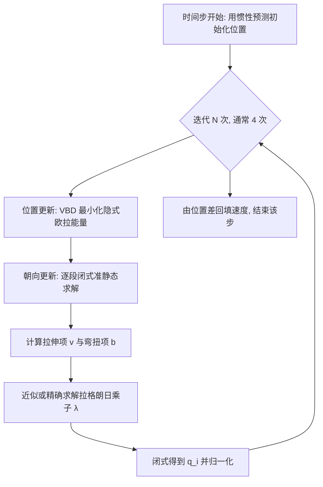

## 一句话总结

提出一种稳定的 Cosserat 杆求解器，通过将位置与旋转拆分为交替优化，并用闭式的 Gauss-Seidel 准静态朝向更新替代昂贵的全局求解，在大时间步、高刚度下依然稳定，且天然易并行，比 XPBD、VBD、离散弹性杆快一个数量级以上。

## 研究背景

一维曲线在数字世界中无处不在：头发、绳索、布料纱线、树枝、草叶等都可以用细长弹性杆来建模。然而细杆同时具有拉伸、剪切、弯曲、扭转四种行为，需要沿曲线追踪材料坐标系（朝向），这引入了移动的材料标架和非线性约束，使得杆模拟在数学与计算上都很昂贵。

Cosserat 杆是目前流行的建模框架，它用位置 $$x(s)$$ 与单位四元数朝向 $$q(s)$$ 共同表示杆，这种冗余表达能自然描述复杂的拉伸剪切与弯扭。但传统方法在求解合法的单位四元数朝向时经常遇到稳定性瓶颈：要么被迫使用极小的时间步、极多的迭代（XPBD 常需上千次迭代），要么依赖投影动力学一类昂贵的全局求解器。离散弹性杆（DER）虽然精度好，但同样依赖全局的线搜索牛顿求解，代价高昂。这篇工作的目标就是在不牺牲精度的前提下，得到一个既稳定、又快速、还易并行的杆求解方案。

## 方法

### 整体框架

作者的核心洞察借鉴自 DER 的准静态材料标架更新思路：对于细 Cosserat 杆，角动量对动力学的贡献可以忽略（即令转动惯量 $$J=0$$，把朝向当作无限细杆的准静态状态处理）。基于这一假设，原本耦合在一起的隐式欧拉变分能量最小化被拆解为两个交替进行的子问题：

- 位置更新（固定朝向）：$$x = \arg\min_x \frac{1}{2h^2}\lVert x-y\rVert_M^2 + E_{total}$$
- 朝向更新（固定位置的准静态平衡）：$$q = \arg\min_q E_{total}\ \text{s.t.}\ \lvert q_i\rvert = 1$$

位置子问题在去掉朝向耦合后退化为二次能量，可以直接用顶点块下降（VBD）配合增量势接触（IPC）求解；朝向子问题则用一个新的闭式局部松弛求解器逐段处理。

### 关键设计

准静态朝向求解。对每个段 $$q_i$$ 做局部松弛，其余自由度视为固定，最优性条件要求作用在 $$q_i$$ 上的净力矩为零。引入单位约束的拉格朗日乘子 $$\lambda$$ 后，平衡条件写成 $$\tau_i^{net}-\lambda q_i=0$$。把拉伸/剪切的贡献归入向量 $$v$$、把弯曲/扭转的贡献归入向量 $$b$$，可以整理出一个仅含单一未知量 $$\lambda$$ 的闭式解 $$q_i(\lambda)=\frac{v b e_3+\lambda b}{\lambda^2-\lvert v\rvert^2}$$。其中 $$b$$ 是所有相连弯扭约束贡献之和，因此该方法天然支持图状（分叉）结构，例如树枝。

近似解 $$\lambda\approx\lvert v\rvert+\lvert b\rvert$$。约束 $$\lvert q_i\rvert=1$$ 展开后是关于 $$\lambda$$ 的四次方程，直接求解代价高。作者论证最大正根对应最稳定的物理构型，并用三角不等式推出该根被夹在 $$\lvert v\rvert<\lambda\le\lvert v\rvert+\lvert b\rvert$$ 之间，进而直接取上界作为近似。这个近似在零应变时与精确解完全重合，实验中在单位四元数约束上的均方误差低至 $$5\times10^{-12}$$，且平均收敛的 $$\gamma$$ 为 0.99999，非常接近近似值 1。

良定义性证明。作者证明该近似解本身即可作为一个完备的材料模型：它对顶点排序不变、对平移与旋转不变（材料标架无关性），且不引入人为应变（零应变时 $$q_i$$ 就是平衡解，保持静止形状）。这让近似闭式解可以放心地作为传统 Cosserat 杆的替代。

精确解与不动点迭代。当必须严格遵守传统 Cosserat 能量时，把近似解当作初值，用不动点迭代 $$\lambda_{fp}=f(\lambda)=\sqrt{\lvert v b e_3+\lambda b\rvert+\lvert v\rvert^2}$$ 精化 $$\lambda$$。作者依据 Banach 不动点定理指出该形式在定义域内梯度最小、收敛最快，并用辅助变量 $$\gamma_i$$ 把 $$\lambda$$ 限制在合法区间内，从而能安全地与位置求解交替进行。

接触与摩擦。接触用 IPC 风格的势垒能量处理，并配合保守顶点边界防止杆段穿透；摩擦用带精心设计刚度的弹簧模型近似库仑摩擦，并按 Macklin 等人的做法不对摩擦刚度与法向求导以保持稳定。

## 实验结果

作者在 AMD 9950x 16 核 CPU 与 NVIDIA RTX 3090 上分别实现了 C++ 与 CUDA 版本，所有计时按每 30 fps 帧平均。

收敛性方面，在悬臂杆例子中，近似解与精确解都能在每步仅 4 次迭代内收敛，而 XPBD 需要上千次迭代才能达到相近水平，VBD 即使 8 次迭代也无法收敛到正确结果（因为无法施加单位四元数约束）。在更硬的树例子中，XPBD 即使把步长缩小 20 倍仍无法收敛，VBD 无法维持目标刚度。

与 DER 的对比中，作者用一个 2880 段的茶壶状 slinky（这是对逐元素传播的 Gauss-Seidel 类方法最不利、却最有利于全局求解 DER 的场景），DER 每帧需 1052 ms，而本方法仅需 22.8 ms，约快 46 倍。与 VBD 类方法对比时，每次迭代 VBD 慢 109%、带线性化约束的 VBD 慢 168%、带全部增强的 VBD 慢超过 18 倍。

材料混合方面，弹弓例子中橡皮筋与手柄之间的拉伸、弯扭、质量比分别高达 7542 倍、790219 倍、46 倍，方法依旧稳定；桥梁例子在 120 m/s 极端阵风下仅需 2 ms/帧，而 VBD 立刻崩塌。

下表为性能汇总（时间为每 30 fps 帧平均，带 * 者在 RTX 3090 GPU 上测量，带 † 者含碰撞）：

| 例子 | 顶点数 / 段数 | 迭代次数 | 步长 h | 每帧步数 | 近似解 | 精确解 |
| --- | --- | --- | --- | --- | --- | --- |
| 弹弓（Fig. 8） | 44 / 46 | 4 | 1.0 ms | 34 | 0.2 ms | 0.2 ms |
| 桥梁（Fig. 10） | 2,208 / 2,298 | 4 | 1.0 ms | 34 | 2.0 ms | 2.1 ms |
| Slinky（Fig. 9） | 2,881 / 2,880 | 8 | 0.3 ms | 112 | 22.8 ms | 23.1 ms |
| 树（Fig. 7） | 9,948 / 9,945 | 4 | 1.0 ms | 34 | 7.3 ms | 7.5 ms |
| Afro 发型 * | 1,464,704 / 1,418,932 | 8 | 1.0 ms | 34 | 7.0 ms | - |
| 纱线扭转 *† | 65,065 / 65,061 | 4 | 0.4 ms | 84 | 32.0 ms | - |
| 纱线字母 *† | 255,607 / 255,593 | 4 | 0.4 ms | 84 | 107.0 ms | - |

大规模 GPU 场景尤其亮眼：140 万顶点的 Afro 发型每帧仅 7 ms（不含碰撞），接近 200 万自由度的针织字母以 4 fps 交互帧率运行。相比之下，先前的针织模拟器把网格纱线布扭转 900 度需 4480 ms/帧，而本方法把纱线布扭转 1800 度仅需 32 ms/帧。作者还给出一般经验：多数例子每步 4 次迭代即足够收敛。

## 亮点与局限

亮点：把位置与旋转解耦为交替优化，用一个只含单一未知量 $$\lambda$$ 的闭式局部解替代全局约束求解，既保证每步单调降低全局能量、稳定性极强，又极易并行；近似解在零应变时与精确解重合、并被证明是良定义的完备材料模型；实现极其简单，作者称仅比质量-弹簧系统多几行代码；天然支持分叉图状结构。

局限：在近似 $$\lambda$$ 下如何规范化刚度参数尚不清楚（作者两种变体都用了相同刚度）；近似模型与 Sag-free 初始化等方法的兼容性有待研究；由于采用了 DER 式的准静态假设，如何引入马达驱动的主动运动尚不明确；当前方法针对标量刚度设计，各向异性刚度的扩展留作未来工作。此外在极端应力下分段线性表达会出现一些位置屈曲伪影。

## 延伸思考

这项工作的价值在于把"稳定性"从依赖极小时间步或昂贵全局求解，转化为一个具有闭式解、可证明良定义的局部松弛问题。它对朝向自由度的处理尤其巧妙：单位四元数约束原本是不稳定之源，作者却借助该约束把沿 $$q_i$$ 方向的力矩自然消去，并把约束反过来变成推导闭式解的工具。这种"约束即结构"的思路值得在其他带流形约束的模拟问题（如旋转、刚体朝向）中借鉴。其易并行、每步固定少量迭代的特性，也让它非常契合实时头发、纱线布等交互式应用；而准静态假设带来的对主动驱动、各向异性材料的限制，则划出了它当前的适用边界。
