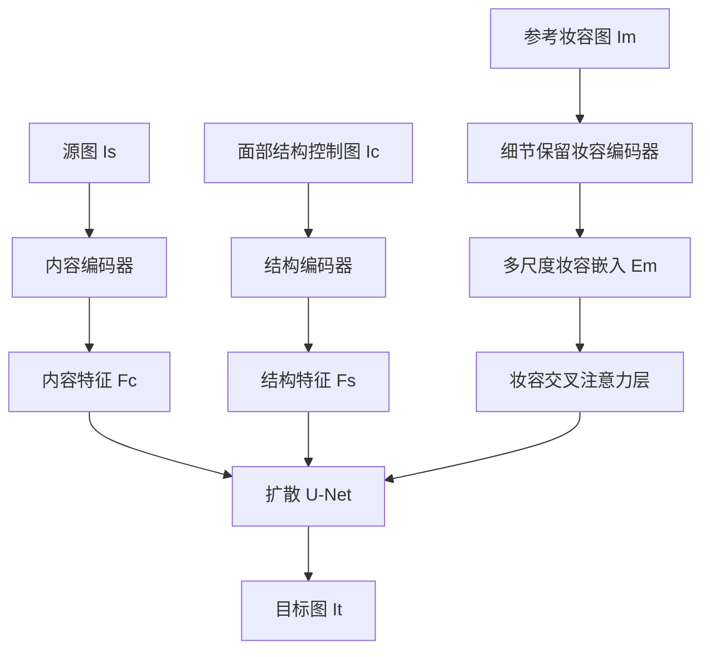

## 一句话总结

Stable-Makeup 是首个基于扩散模型的真实世界妆容迁移方法，通过细节保留妆容编码器、妆容交叉注意力层以及内容与结构控制模块，能够把从淡妆到极浓妆的多样妆容鲁棒地迁移到用户提供的人脸上。

## 研究背景

妆容迁移在美妆行业、虚拟试妆等场景有广泛应用，但要在多种妆容强度与风格之间实现自然、真实的转换非常困难。现有方法主要依赖生成对抗网络（GAN），在面对真实世界的多样妆容时表现不足，尤其是难以迁移 cosplay、影视角色仿妆这类高细节、创意性强的妆容，并且大多需要人脸区域对齐，实用性受限。

从数据角度看，现有妆容数据集缺乏多样性，无法支撑真实世界妆容迁移。为此作者提出自动化数据构建流程，用大语言模型和生成模型编辑真实人脸图像，生成成对的妆前妆后图像，最终得到 2 万对训练数据，覆盖从淡妆到浓妆的广泛风格。

## 方法

### 整体框架

给定参考妆容图像 $$I_m$$、用户源图像 $$I_s$$ 以及从人脸解析方法得到的面部结构控制图 $$I_c$$，Stable-Makeup 的目标是生成带有目标妆容风格的图像 $$I_t$$。方法建立在预训练扩散模型（Stable Diffusion V1-5）之上，包含三个关键组件：细节保留妆容编码器、妆容交叉注意力层、内容与结构控制模块。妆容编码器提取多尺度妆容嵌入 $$E_m$$，内容编码器与结构编码器分别把源图编码为内容特征 $$F_c$$ 与结构特征 $$F_s$$，三者作为条件送入 U-Net 指导生成。

### 关键设计

1. **细节保留（D-P）妆容编码器**：借助预训练 CLIP 视觉主干，从多个层提取特征并在特征维度拼接，再用自注意力层处理多层特征。相比只取 CLIP 最后一层或用线性层映射，这种方式保留了妆容的空间、多尺度与全局信息。实验中固定提取层数 $$K=12$$，妆容嵌入表示为 $$E_m = \mathrm{concat}_{k=0}^{K}(E_k, \dim=1)$$。

2. **妆容交叉注意力层**：在 U-Net 每个 transformer 块中保留原有文本交叉注意力，新增妆容交叉注意力层。妆容嵌入 $$E_m$$ 作为 Key 与 Value，与文本交叉注意力共享 Query，最后把妆容交叉注意力输出直接加到文本交叉注意力输出上。这样既能把妆容对齐到源图相应面部位置，又保留了原有文本引导生成能力，从而支持妆容引导的文本到图像生成这一新方向。

3. **内容与结构控制模块**：由两个改造后的 ControlNet 充当编码器。内容编码器维持像素级内容一致性与非面部区域一致性；结构编码器引入面部结构，用基于人脸关键点绘制的、不同颜色的密集线条作为条件，增强对脸型、嘴部闭合等结构的控制。两个编码器均以空文本嵌入作为交叉注意力输入，输出直接加到 Stable Diffusion 上。

4. **内容-结构解耦训练**：为消除训练数据对中妆前妆后面部结构不一致的影响，训练时把目标图得到的 $$I_s$$ 与 $$I_c$$ 送入内容与结构编码器，而把增强后的 $$I_t$$ 送入妆容编码器，使生成图的结构由结构编码器决定、内容由内容编码器决定。训练目标沿用 Stable Diffusion 的噪声预测损失：$$L(\theta) := \mathbb{E}_{x_0, t, \epsilon}\left[\|\epsilon - \epsilon_\theta(x_t, t, c_i, c_e, c_m)\|_2^2\right]$$，其中 $$c_i, c_e, c_m$$ 分别为内容、结构、妆容条件。

## 实验结果

在 M-Wild 数据集与 CPM-real 数据集上，与代表性妆容迁移方法进行定量对比（CLIP-I、DINO-I 越高越好，衡量妆容迁移效果；SSIM 越高、L2-M 越低越好，衡量内容与结构保持）。

| Method | CLIP-I ↑ (M-wild) | DINO-I ↑ (M-wild) | SSIM ↑ (M-wild) | L2-M ↓ (M-wild) | CLIP-I ↑ (CPM-real) | DINO-I ↑ (CPM-real) | SSIM ↑ (CPM-real) | L2-M ↓ (CPM-real) |
| --- | --- | --- | --- | --- | --- | --- | --- | --- |
| BeautyGAN | 0.742 | 0.926 | 0.884 | 48.408 | 0.718 | 0.915 | 0.866 | 49.168 |
| CPM | 0.754 | 0.920 | 0.873 | 94.092 | 0.757 | 0.920 | 0.846 | 95.172 |
| PSGAN | 0.748 | 0.928 | 0.862 | 45.742 | 0.724 | 0.916 | 0.829 | 46.091 |
| EleGANt | 0.759 | 0.928 | 0.878 | 44.463 | 0.731 | 0.917 | 0.838 | 45.797 |
| SCGAN | 0.751 | 0.928 | 0.882 | 44.296 | 0.726 | 0.916 | 0.858 | 46.284 |
| SPMT | 0.761 | 0.931 | 0.915 | 29.126 | 0.735 | 0.920 | 0.900 | 28.299 |
| SSAT | 0.758 | 0.930 | 0.914 | 32.578 | 0.719 | 0.915 | 0.896 | 33.604 |
| Ours | 0.768 | 0.933 | 0.910 | 29.087 | 0.760 | 0.923 | 0.868 | 27.976 |

Stable-Makeup 在两套数据集上的 CLIP-I 与 DINO-I 均排名第一，说明妆容迁移能力优于其他方法；SSIM 与 L2-M 也取得良好成绩，表明内容与结构保持良好。作者指出 SSIM 可能无法准确反映妆容迁移效果（当结果与源图几乎相同、即迁移几乎未生效时也会得到高分），因此仅作为参考列出。定性对比中，其他方法大多只能迁移简单的唇色和眼影且仅对淡妆有效，而本方法从淡妆到个性化浓妆都能准确对齐并迁移到相应面部位置。

## 亮点与局限

亮点：
- 首个基于扩散模型的妆容迁移方法，在多样真实世界妆容（含极浓妆、创意妆）上表现出强鲁棒性与泛化性。
- 细节保留妆容编码器 + 妆容交叉注意力层的组合，实现了细粒度妆容与源图面部特征的语义对齐。
- 提出自动化的成对妆容数据构建流程，产出 2 万对覆盖广泛风格的训练数据，可推动该领域研究。
- 设计上兼容原有文本引导，衍生出妆容引导文本到图像生成、跨域妆容迁移等应用。

局限：
- 训练数据依赖 LLM 生成 prompt 与文本驱动图像编辑算法合成，妆前妆后可能存在面部结构不一致（作者用解耦训练缓解），合成数据质量对结果有影响。
- 基于 Stable Diffusion 与多控制模块，训练成本较高（8 张 H800、10 万次迭代），推理需多步采样。
- SSIM 等指标难以完全刻画妆容迁移质量，评价体系仍有改进空间。

## 延伸思考

该工作把 ControlNet 式的结构/内容控制与 CLIP 多层特征的妆容编码结合，本质是"细粒度参考条件 + 结构解耦"的扩散迁移范式，这一思路可迁移到发型、纹身、服饰等其他需要保持身份与结构的局部风格迁移任务。其自动化成对数据构建流程也提示：在缺乏成对数据的编辑类任务中，用 LLM 生成多样 prompt 加生成模型编辑、再用分割合成回填非目标区域，是低成本扩充训练数据的可行路线。后续如能引入更强的身份与肤色保持约束（如 MakeupMirror 等后续工作所关注的方向），并降低采样与训练开销，将更接近产品级虚拟试妆的落地需求。
