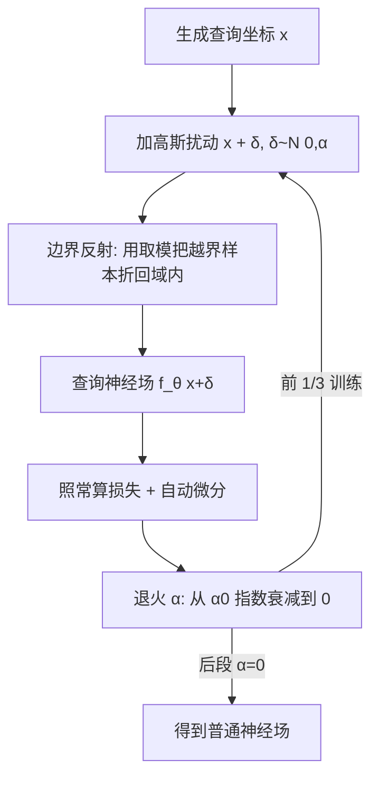

## 一句话总结

在训练神经场时，对查询坐标注入随空间退火的高斯噪声，等价于在期望意义上优化一个"被模糊的场"，从而以近乎零成本、几行代码就能改善优化景观、抑制局部极小值，效果媲美甚至超过为特定任务精心设计的层次结构与频域方案。

## 研究背景

神经场（neural field）用一个从坐标映射到信号值的函数来表示信号，广泛用于有向距离场、密度场、辐射场乃至二维图像的颜色场。它能自适应地分配表达能力、天然兼容自动微分与 GPU 并行，是视觉计算里的通用表示。

但拟合神经场本质上是一个昂贵的非线性优化问题。优化景观里充满劣质局部极小值，导致低质量结果、细节缺失，在三维场景里典型的表现就是"浮渣（floater）"伪影。这一困难在间接监督的反问题（如从图像重建表面、NeRF）中尤为严重。

为缓解这一问题，社区衍生出大量方案：频域编码（Fourier features、SIREN、BACON）、混合特征网格（Instant NGP 哈希网格、triplane）、以及任务专用的由粗到细（coarse-to-fine）训练策略和正则项。这些方法虽有效，却往往与具体任务和表示强耦合，彼此不兼容，且增加了显著的复杂度。更棘手的是，表达能力更强的表示反而可能加剧局部极小值的负面影响。

作者提出的目标是：一个简单、通用、可插入几乎任意神经场表示与任务的优化技巧，用来替代或增强这些专用设计。

## 方法

核心想法极其简单：训练期间每次查询神经场 $f_\theta$ 于位置 $\boldsymbol{x}$ 时，把查询点扰动到 $\boldsymbol{x}+\boldsymbol{\delta}$，其中 $\boldsymbol{\delta}\sim\mathcal{N}(0,\alpha)$。作者称之为随机预条件（stochastic preconditioning, SP），呼应线性代数中预条件子改善优化景观的作用。

其理论基础是把高斯模糊写成卷积，再改写为对噪声的期望：

$$\mathrm{Blur}_\alpha[f] = f * g = \int_\Omega f(\boldsymbol{x}+\boldsymbol{\delta})\,G_\alpha(\boldsymbol{\delta})\,d\boldsymbol{\delta} = \mathbb{E}\big[f(\boldsymbol{x}+\boldsymbol{\delta})\big],\quad \boldsymbol{\delta}\sim\mathcal{N}(0,\alpha)$$

也就是说，只要按正态分布扰动查询坐标，单次采样就是被模糊场的一个无偏估计。优化因此隐式地作用在 $\mathrm{Blur}_\alpha[f_\theta]$ 上，而无需显式构造带限网络架构。

关键设计：

一是"单样本、期望意义"。每次只用一个扰动样本近似被模糊场，计算成本几乎不变（只是给采样点加个偏移）。

二是"退火调度"。尺度 $\alpha$ 从初值 $\alpha_0$ 逐渐衰减到 0，训练最后阶段在未模糊的场上进行，最终产物就是一个普通神经场，下游任务无需关心训练时用过 SP。推荐策略：$\alpha_0$ 取包围盒对角线长度的 1–2%，在训练前 1/3（或更早）指数衰减到 0。

三是"模糊场而非模糊监督"。作者强调不去模糊真值数据（那只在直接监督下可行），而是模糊被优化的场本身，因此完全通用，即使在仅由正则项支配的区域也能改善优化。有趣的是，这种更一般的做法仍会让场先在低频被优化——作者推测是因为 SP 抑制了高频分量及其梯度。

四是"边界处理"。扰动可能把样本推出有界域。直接钳制（clamp）会让大量样本堆在边界产生伪影；作者改用绕边界反射，可用逐坐标取模在常数时间内实现，保持均匀分布：

$$x \leftarrow \begin{cases} \mathrm{mod}(x,2) & \text{if } \mathrm{mod}(x,2)\le 1,\\ 2-\mathrm{mod}(x,2) & \text{if } \mathrm{mod}(x,2) > 1.\end{cases}$$

五是"空间自适应 $\alpha$"（可选扩展）。把 $\alpha(\boldsymbol{x})$ 存在规则网格上，初始化为 $\alpha_0$ 并作为额外自由度一起优化，查询变为 $f_\theta(\boldsymbol{x}+\delta),\ \delta\sim\mathcal{N}(0,\alpha(\boldsymbol{x}))$，用重参数化技巧 $\delta\leftarrow\alpha(\boldsymbol{x})\mathcal{N}(0,1)$ 反传。即使没有额外监督，$\alpha(\boldsymbol{x})$ 也会自然收敛为目标场在各处的细节层级（一种频率尺度图）。

## 实验结果

作者区分了间接监督任务（反问题，局部极小值多，SP 收益最大）与直接监督任务（编码已知信号）。

从有向点云做表面重建（Chamfer 距离，越低越好，多个模型）：以 INGP 为基础表示，基线 Chamfer 在 Nefertiti/Cow/Bunny/Buddha/Armadillo 上约为 3.57e-3 / 3.34e-3 / 3.70e-3 / 3.14e-3 / 2.49e-3；加上几何初始化（Atzmon & Lipman）后为 2.82e-3 / 3.69e-3 / 4.24e-3 / 1.44e-3 / 7.25e-4；而仅加随机预条件（无特殊初始化）就降到 7.29e-4 / 9.20e-4 / 9.01e-4 / 8.38e-4 / 7.10e-4，往往优于精心初始化的版本。SP 因此可以免去对球面几何初始化的依赖，后者在远离球形的复杂室内场景上鲁棒性差。

从图像做表面重建（DTU 数据集 15 个场景，均值 PSNR 与 Chamfer）：NeuS 基线 27.29 / 1.82，加 SP 后 27.51 / 1.45；NeuS 换成哈希网格编码时基线崩到 18.60 / 4.58，加 SP 后恢复到 28.26 / 1.45（哈希网格表示受益最显著）；Neuralangelo 基线 35.87 / 0.87，加 SP 后 36.26 / 0.76。

NeRF 场景。稀疏视角下（DTU 场景 63，仅 6 张输入图），MipNeRF 基线表现挣扎，加 SP 后质量与专门为此设计的 FreeNeRF 相当，但 SP 适用于任意底层表示。ReLU 场（非神经的三线性插值网格 + 单个 ReLU）原本依赖四阶段由粗到细流程，去掉该层次后训练灾难性失败（如某场景 PSNR 从 36.30/35.71 跌到 12.86/17.12），而用 SP 替换层次方案后恢复到与原方法相当甚至更好（31.25→31.77 等）；代价是训练时间从 3.1 小时增加到 5.2 小时（失去了粗层快速迭代的优势）。大规模重建上，用 Neuralangelo 在 Tanks and Temples 上关闭其由粗到细方案并改用 SP，平均 PSNR 小幅提升 0.16 到 32.52，主要来自 Barn 场景的 +1.16。

分析。初始 $\alpha_0$ 的最优值约为包围盒对角线的 2%。噪声核选择影响不大：高斯核 Chamfer 9.1e-4、均匀核 9.3e-4、平方高斯核 8.8e-4。单样本与多样本对比：ReLU 场设置下单样本平均 PSNR 33.72、双样本 33.74、四样本 33.79——多采样线性增加成本却几乎无收益，作者推测是因为神经场优化本身已有足够随机性。

鲁棒性。在 NeuS+哈希网格配置上扫描网络学习率、哈希网格学习率、最大分辨率、哈希表大小等超参，SP 让成功收敛的超参范围明显变宽，PSNR 分布整体右移，说明其改善并非某组特定超参的假象。

空间自适应模糊。优化得到的 $\alpha(\boldsymbol{x})$ 能自然逼近图像内容的频率分布；在 DTU 上用 Neuralangelo 做重建，空间自适应 $\alpha(\boldsymbol{x})$ 相比全局调度略有提升（DTU 37/40/55：29.80→30.02、34.78→34.80、31.79→32.20）。

## 亮点与局限

亮点在于极致的简单与通用：核心改动就是给查询坐标加一行高斯噪声（配合退火与边界反射），无需新架构、无额外计算成本，却能跨坐标 MLP、哈希网格、triplane、正弦 INR、ReLU 场等多种表示，覆盖表面重建、NeRF、图像拟合等任务。它把"由粗到细"和"频域调控"这两类专用技巧统一进一个隐式的采样视角，还能免去几何初始化、替代层次训练，并顺带产出可解释的频率尺度图。

局限也被作者诚实指出：随机采样对被模糊场是无偏估计，但用单样本估计一个非线性损失在真被模糊场上的取值则是有偏的（实践中未观察到问题，但值得更深入分析）。SP 虽不增加单步成本，却享受不到层次方案在低分辨率层上的廉价快速迭代——用大模糊做 SP 的成本和优化完整场一样，因此在替换层次训练时训练时间可能变长。空间自适应噪声只做了初步探索，各向异性分布与 $\alpha$ 图的其他用途留待未来。

## 延伸思考

这项工作最迷人的地方在于把一个机器学习里的老技巧（输入加噪 ≈ Tikhonov 正则、≈ 热核扩散）重新诠释为空间神经场的优化预条件子，动机从"提升泛化"转向"引导优化轨迹、逃离局部极小值"。它提示我们：很多为特定表示量身定制的复杂机制，其收益也许可以由一个表示无关的、作用在优化过程而非架构上的通用手段获得。

值得思考的延伸方向包括：把 SP 与 3D Gaussian Splatting 等显式表示结合会如何；退火调度能否自适应而非预设；单样本有偏性在更难的反问题里是否会显现；以及优化出的 $\alpha$ 图作为一种免费的、无监督的细节/频率先验，是否能反哺 level-of-detail、抗锯齿或自适应采样等下游任务。它体现的"用随机性做隐式滤波"的思路，可能在更广的可微渲染与隐式表示优化中复用。
