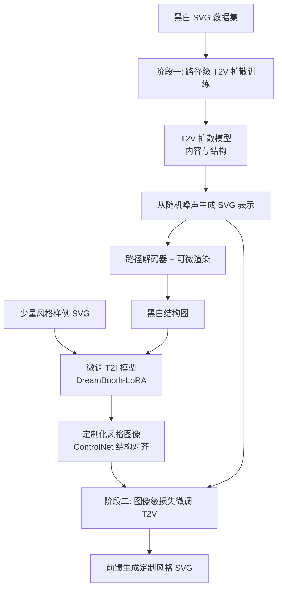

## 一句话总结

提出一个两阶段的矢量图生成流水线：先训练一个基于路径级表示的文本到矢量图（T2V）扩散模型保证结构规整，再通过蒸馏定制化的文本到图像（T2I）模型的先验来实现风格定制，从而以前馈方式生成风格一致、内容多样的高质量 SVG。

## 研究背景

Scalable Vector Graphics（SVG）因分辨率无关、文件紧凑、可分层编辑而深受设计师青睐。已有的文本到矢量图生成方法虽能从文本提示生成 SVG，却忽略了实际应用中的一个关键需求：风格定制。设计师常常需要生成一组视觉外观一致、审美连贯的矢量图，这对品牌设计、用户界面、主题插画等场景至关重要。

将现有 T2V 方法直接扩展到风格定制存在困难。作者把现有方法分为两类，各有短板：

- 基于优化的方法可以借助 T2I 模型的先验（如通过在少量风格样例上微调 T2I 模型）实现风格定制，但每次生成需要数十分钟，且产出的路径往往碎片化、杂乱，缺乏层次组织，难以再编辑，违背了矢量设计"简洁清晰"的原则。
- 前馈方法在 SVG 数据集上训练，能保证结构规整，但由于缺乏大规模通用的文本-SVG 数据集，难以解耦内容与风格语义；若仅用少量样例 SVG 微调，极易过拟合到样例上。

作者的核心思路是结合两类方法的优点：用前馈 T2V 模型保证 SVG 结构规整，用 T2I 模型获取强大的定制能力，并通过两阶段设计显式解耦内容与风格。

## 方法

整体框架分为两个阶段。第一阶段训练一个只关注内容与结构的路径级 T2V 扩散模型（在黑白 SVG 数据集上训练，剥离风格变化）；第二阶段通过蒸馏定制化 T2I 模型的先验，为 T2V 模型注入多样风格。推理时只需在文本提示后追加对应的风格 token 即可前馈生成定制风格的 SVG。

关键设计：

- **路径级 SVG 表示**：将 SVG 表示为一组路径 $$SVG=\{Path_1, Path_2, \dots, Path_m\}$$，每条路径由首尾相连、填充统一颜色的三次贝塞尔曲线定义。沿用 T2V-NPR 的路径级 VAE，将每条路径的控制点编码为潜向量 $$z_i$$，再与颜色 $$C_i$$、变换参数 $$Tr_i$$ 组合为 $$P_i=(z_i, C_i, Tr_i)$$。相比全局 SVG 级表示（表达力受数据集限制）和点级表示（复杂 SVG 下效率低），路径级表示兼顾紧凑性与表达力。

- **向量去噪器（Vector Denoiser）**：采用基于 DiT 的 Transformer 架构，以带噪 SVG 张量为输入，条件化于文本提示与时间步；文本经 CLIP 文本编码器编码后通过交叉注意力与向量特征交互。训练遵循 DDPM 框架，目标是最小化预测噪声与真实噪声的 $$L_2$$ 距离：$$L_{DM} = \mathbb{E}_{s_0, y, \epsilon, t}\left[\|\epsilon - \epsilon_\theta(s_t, t, y)\|_2^2\right]$$。

- **图像扩散先验的风格蒸馏**：用少量风格参考图微调 SD-v1-5，通过 DreamBooth-LoRA 为每种风格生成独立 LoRA，用唯一 token $$[V^*]$$ 触发。T2V 模型先从噪声生成黑白结构图，再用其 Canny 边缘图作为 ControlNet 控制条件，让定制 T2I 模型生成与结构对齐的风格图像，构成（SVG 表示，定制图像）训练对。

- **风格微调**：用重参数化技巧从带噪表示预测去噪 SVG 张量 $$\hat{s}^g_0 = (s^g_t - \sqrt{1-\bar{\alpha}_t}\cdot\epsilon_\theta(s^g_t, t))/\sqrt{\bar{\alpha}_t}$$，渲染成图像后与定制图像计算 MSE 图像损失 $$L_{img} = \omega_t\|\hat{I}^g_0 - I^c_0\|_2$$，并结合扩散损失，总损失为 $$L = L_{img} + L_{DM}$$。作者在 200 种风格上同时训练，也支持单一风格微调或增量添加新风格（全模型或 LoRA 两种方式）。

## 实验结果

作者从矢量级（Path FID）、图像级（Style Alignment、Visual Aesthetic）、文本级（Text Alignment）三个维度评测，与基于优化的方法和前馈方法对比。定量结果如下表（数字忠实原文，箭头方向表示指标优劣方向）：

| 类别 | 方法 | Path FID ↓ | Style Alignment ↑ | Visual Aesthetic ↑ | Text Alignment ↑ |
|------|------|-----------|-------------------|--------------------|-----------------| 
| Optimization | Potrace | 44.29 | 0.665 | 5.522 | 0.294 |
| Optimization | LIVE | 52.43 | 0.578 | 4.686 | 0.258 |
| Optimization | VectorFusion | 53.76 | 0.557 | 4.892 | 0.276 |
| Optimization | SVGDreamer | 48.51 | 0.564 | 5.013 | 0.281 |
| Optimization | T2V-NPR | 40.25 | 0.608 | 5.237 | 0.290 |
| Feed-forward | GPT-4o | 38.14 | 0.549 | 5.041 | 0.251 |
| Feed-forward | VecF + SVG-FT | 45.05 | 0.726 | 4.980 | 0.223 |
| Feed-forward | VecF + NST | 58.12 | 0.573 | 4.574 | 0.245 |
| Ours | Ours | 37.51 | 0.661 | 5.527 | 0.297 |

作者的方法在 Path FID、Visual Aesthetic、Text Alignment 上均取得最优，Style Alignment 也具竞争力。值得注意的是，VecF + SVG-FT 虽然 Style Alignment 最高（0.726），但 Text Alignment 最低（0.223），说明它过拟合到样例 SVG、只是重建样例而非对齐文本语义。用户研究中，30 名参与者的偏好显示作者方法在整体 SVG 质量（53.2%）、风格对齐（51.8%）、语义对齐（51.7%）三项均获最高票。单张 SVG 生成约 25 秒，远快于优化方法的数十分钟。

## 亮点与局限

亮点：

- 首个能够以前馈方式生成定制风格 SVG 的 T2V 模型，兼顾结构规整与风格多样。
- 两阶段设计巧妙解耦内容与风格：黑白数据集学内容结构，图像扩散先验注入风格，规避了文本-SVG 数据稀缺导致的过拟合问题。
- 用可微渲染 + 图像级损失把 T2I 的强视觉先验蒸馏到矢量域，生成速度快（秒级），结果层次清晰、可编辑。

局限：

- T2V 模型在 FIGR-8-SVG 数据集上训练，该数据集只有简单类别标签，限制了模型对 SVG 内容的语义理解；当文本描述超出训练域（如"大提琴""纸杯蛋糕"）时，生成会不准确。
- 对过于复杂的风格参考，可能丢失细粒度的风格细节。

## 延伸思考

这项工作展示了"用光栅域强先验反哺矢量域"的一条有效路径：矢量数据稀缺是 SVG 生成长期的瓶颈，而借可微渲染搭桥、把成熟 T2I 生态（DreamBooth、LoRA、ControlNet）的能力迁移过来，是一种务实且可复用的思路。作者自述的两个局限本质都指向数据——更大规模、带详细标注的 SVG 数据集应能同时缓解语义理解不足与复杂风格捕捉不佳的问题。此外，作者提到模型可用于合成 SVG 数据，这暗示了一个自举式的数据飞轮：用生成模型扩充训练数据，再反过来提升模型，值得关注其在可编辑性与精细控制上的后续探索。
