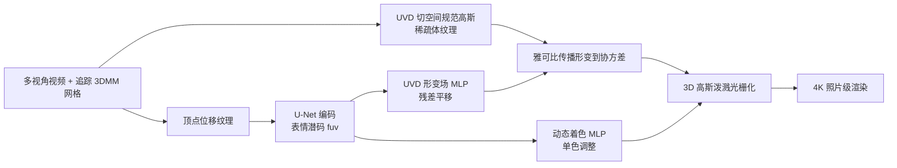

## 一句话总结

在 3DMM 网格的连续 UVD 切空间里放置并自适应加密多达 400 万个 3D 高斯，再用一个与高斯数量无关的形变场与动态着色网络补偿网格形变误差，从而在 4K 分辨率下重建可驱动、保细节的照片级真实头部化身。

## 研究背景

- 领域现状：3D 高斯泼溅让可驱动头部化身实现了任意视角下的高保真实时渲染，主流做法有两条路线——一是把高斯"绑"到 3DMM 三角面上（如 GaussianAvatars），二是用卷积网络在固定分辨率 UV 图上生成一组高斯（如 RGCA）。
- 核心痛点：可驱动模型要估计面部各部位复杂的非刚性运动，运动估计不准会导致细节和保真度损失；同时受显存限制，很多方法的高斯数量被压得很低，细节和质量随之下降。绑面片的方法受线性模型约束、或需昂贵的深层 MLP 才能形变高斯；UV 图方法的高斯数量被纹理分辨率写死（至多 $$N^2$$ 个），无法按需在头发等区域自适应加密。
- 本文 idea：提出一种混合方案，把 3DMM 网格、3D 高斯自适应加密、以及一个"与高斯数量解耦"的表情相关形变模型结合起来，无需在图像平面上做超分辨率网络，直接渲染出 4K 高清细节。

## 方法

整体框架：给定多视角训练视频和一套已追踪的 3DMM 网格，方法在网格定义的连续 UVD 切空间（UV 纹理坐标加沿法向的位移 D）里定义一批"规范高斯"，编码成一层稀疏的体纹理；再叠加一个 UVD 形变场和一个表情相关的动态着色项来刻画表情引起的局部运动与瞬态外观（如皱纹变暗），最后经 3D 高斯泼溅光栅化成像。

关键设计：

1. **UVD 切空间的高斯"绑定"**：不把高斯锚定到某个具体三角面，而是用一个映射 $$\boldsymbol{\mu}_{xyz} = F(\boldsymbol{\mu}_{uvd})$$ 把 UVD 坐标映到世界坐标。世界空间的协方差由该映射的雅可比传播得到 $$\Sigma_{xyz} = J_F \Sigma_{uvd} J_F^{T}$$。这样高斯能在优化中跨三角面自由移动，摆脱了 GaussianAvatars 那种"一次绑定不可撤销"的贪心分配，能从次优的加密结果中恢复。雅可比可直接用 PyTorch 自动微分算出，且不绑定具体 3DMM。

2. **UVD 形变场**：只学一个简单的 3D 平移残差场 $$\Delta\boldsymbol{\mu}_{xyz} = D(\boldsymbol{\mu}_{uvd}; f_{uv})$$，旋转和拉伸交给雅可比自动导出（$$J_{(F+D)} = J_F + J_D$$），从而降低学习难度。形变场由一个在 UV 纹理网格上工作的 U-Net（输入是相对中性脸的顶点位移纹理，输出 $$N\times N\times 64$$ 的潜码纹理，$$N=256$$）加一个浅层 MLP 组成。这套设计把纹理维度 $$N$$ 与高斯总数解耦，因此不像直接解码高斯属性的方法那样被 $$N^2$$ 上限卡住。

3. **表情相关动态着色**：规范颜色 $$c(v)$$ 用球谐编码，是表情无关的；再乘上一个由表情潜码驱动的单色着色项 $$c_e(v, f_{uv}) = c(v)\,S(\boldsymbol{\mu}_{uvd}; f_{uv})$$ 来表现皱纹凹陷处的变暗等瞬态效果。着色分支用 U-Net 复制出的独立潜码，以便对形变场施加平滑约束、而对着色不施加。

4. **自适应加密与训练策略**：保留原始 3DGS 的克隆/分裂加密逻辑，只是加密发生在连续的 UVD 空间里，上限设为 400 万高斯以防显存溢出。训练用 L1、D-SSIM、VGG 感知损失加形变场雅可比平滑正则；采用由粗到细策略，前 50% 迭代关掉 VGG 损失、之后指数升到 0.1，形变场也从强平滑逐步放开。先只优化规范高斯做 1 万次"预热"，再开启形变场。整体 6 万次迭代，单卡 H100 训练 10~16 小时。

## 实验结果

在自建 8 人多视角数据集（13 台 26MP 相机）和公开 Multiface 数据集上，与 GaussianAvatars (GA)、RGCA、GHA、MVP 四个面向影棚级高质量建模的基线对比。下表为自建数据集上"测试重演"（test reenactment）指标，Landmark 为关键点对齐误差，数值忠实取自原文主表。

| 方法 | Landmark↓ | LPIPS↓ | SSIM↑ | PSNR↑ |
|------|-----------|--------|-------|-------|
| 本文 TeGA | 31.7 | 0.150 | 0.779 | 24.4 |
| 本文（限 20 万高斯） | 49.0 | 0.207 | 0.770 | 24.3 |
| GaussianAvatars | 71.7 | 0.249 | 0.773 | 24.1 |
| RGCA | 116.9 | 0.212 | 0.730 | 23.0 |
| GHA | 1421 | 0.229 | 0.669 | 15.5 |
| MVP | 208.0 | 0.268 | 0.748 | 23.1 |

本文在关键点对齐和 LPIPS 上明显领先，即便把高斯预算压到与 GA 相当的 20 万也仍胜出。消融实验（另有一表）显示：去掉动态着色则皱纹重建变差；去掉形变场则精细细节丢失；去掉自适应加密质量断崖式下跌（Landmark 误差飙到 122.7）；把混合 CNN/MLP 换成深层 MLP 因显存只能训 150 万高斯、细节不足；禁止跨三角面移动会在眨眼等姿态出现伪影。定性上，TeGA 在头发、胡茬、眉毛和小皱纹等区域的还原明显优于所有基线。

## 亮点与局限

- 亮点：
  - 用连续 UVD 切空间 + 雅可比传播统一了"绑网格"与"自由形变"，只学最简单的平移场就能导出完整的旋转、拉伸形变，降低了形变学习难度。
  - 形变纹理维度与高斯数量解耦，突破了 UV 图方法 $$N^2$$ 的高斯预算上限，可自适应加密到 400 万高斯，在头发等高频区域按需分配细节。
  - 不依赖图像平面超分网络就能做到 4K 高清渲染，且方法不绑定特定 3DMM，可直接吃 Multiface 提供的网格。

- 局限：
  - 依赖已追踪的 3D 网格，牙齿、舌头、口腔内部等追踪不准的区域会出现细节损失和伪影，这些区域训练数据约束也更弱。
  - 动态着色项只能调亮度、不能改色度，无法表现血流引起的皮肤颜色变化等动态外观效果。

## 延伸思考

- 该工作把"高斯绑定"重新表述为连续空间映射 + 雅可比传播，这个视角有普适性，理论上可迁移到身体、手部等其他可形变 3DMM 结构，也能兼容非刚性三角形拉伸。
- 形变与着色两个网络存在互相补偿的歧义（论文自己指出），如何更好地解耦几何运动与外观变化，是继续提升可解释性和泛化的方向。
- 训练需单卡 H100 十余小时、并追踪高精度多视角网格，离手机端或轻量采集还有距离；后续可关注向可泛化、少视角乃至野采数据的迁移，以及口腔与牙齿区域的专门建模。
